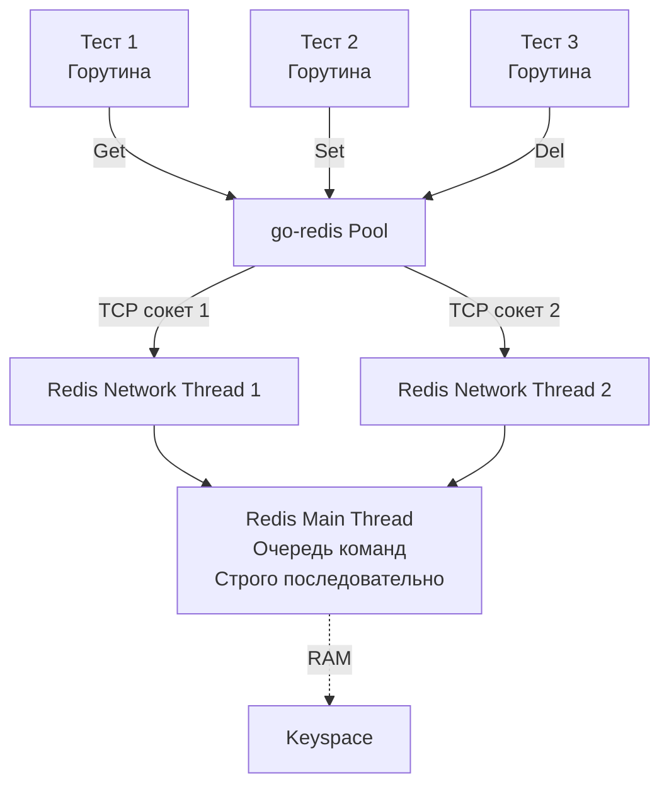

## Специфика in-memory хранилищ

В прошлых статьях мы победили тяжеловесный PostgreSQL, научившись запускать его через [[4. testcontainers go]] и изолировать состояние параллельных тестов с помощью `ROLLBACK` транзакций. 

Но современные бэкенды редко ограничиваются только реляционной БД. Кэширование, rate-limiting, управление сессиями, распределенные блокировки — для этих задач стандартом де-факто является **Redis**. И когда дело доходит до тестирования, Redis бросает нам совершенно новые вызовы.

Главная проблема: **В Redis нет транзакций с поддержкой MVCC (Multi-Version Concurrency Control) и откатов (Rollback).**
Команды `MULTI` и `EXEC` в Redis — это не ACID-транзакции. Это просто способ поставить пачку команд в очередь и выполнить их последовательно без прерывания другими клиентами. Вы не можете сделать `BEGIN`, записать данные, проверить их в тесте, а затем сделать `ROLLBACK`. Если данные попали в Redis, они там остались.

Как же тогда тестировать код с Redis, не жертвуя скоростью и `t.Parallel()`?

## Под капотом: Redis и go-redis

Прежде чем писать тесты, нужно понимать, как Go-приложение взаимодействует с Redis на уровне сети и рантайма. Самый популярный драйвер в Go — `github.com/redis/go-redis/v9`.

> [!info] Под капотом
> Клиент `go-redis` под капотом использует собственный пул соединений (`Connection Pool`), защищенный мьютексами и атомиками. 
> Когда десятки параллельных тестов (горутин) одновременно делают `client.Get(ctx, key)`, `go-redis` берет свободные TCP-сокеты из пула и отправляет запросы. 
> 
> Сам же Redis (до версии 6.0) был строго однопоточным. В версиях 6.0+ сетевой I/O стал многопоточным (I/O threads читают байты из сокетов), но **исполнение команд** (доступ к памяти) всё равно происходит строго в одном главном потоке (Main Thread). Это значит, что Redis сериализует все запросы от ваших параллельных тестов.



## Стратегия 1: miniredis (Ультимативная скорость)

Для 90% интеграционных тестов с Redis вам вообще **не нужен Docker**. 
В экосистеме Go существует шедевральная библиотека: `github.com/alicebob/miniredis`. 

Это чистая реализация Redis-сервера, написанная на Go. Она поднимается за микросекунды прямо внутри памяти вашего тестового процесса. 

**Плюсы:**
1. Не требует Docker daemon.
2. Скорость запуска — доли миллисекунд (в 1000 раз быстрее Testcontainers).
3. Идеальная изоляция: каждый `t.Run` может поднимать свой собственный, абсолютно чистый инстанс `miniredis` на случайном порту. Это дает 100% поддержку `t.Parallel()`.

**Пример идиоматичного теста:**

```go
package cache_test

import (
	"context"
	"testing"
	"time"

	"[github.com/alicebob/miniredis/v2](https://github.com/alicebob/miniredis/v2)"
	"[github.com/redis/go-redis/v9](https://github.com/redis/go-redis/v9)"
	"[github.com/stretchr/testify/require](https://github.com/stretchr/testify/require)"
	"yourproject/internal/cache"
)

func setupMiniredis(t *testing.T) *redis.Client {
	t.Helper()
	
	// Поднимаем in-memory Redis сервер
	mr, err := miniredis.Run()
	require.NoError(t, err)
	
	// Гарантируем остановку сервера после теста
	t.Cleanup(func() { mr.Close() })

	// Создаем реальный go-redis клиент, подключая его к miniredis
	client := redis.NewClient(&redis.Options{
		Addr: mr.Addr(),
	})
	
	// Закрываем соединения в пуле
	t.Cleanup(func() { client.Close() })

	return client
}

func TestSessionCache_SetGet(t *testing.T) {
	t.Parallel()

	// У каждого параллельного теста — свой личный сервер Redis!
	rdb := setupMiniredis(t)
	sessionCache := cache.NewSessionCache(rdb)

	ctx := context.Background()

	// Act
	err := sessionCache.Set(ctx, "user:123", "token_abc", time.Minute)
	require.NoError(t, err)

	val, err := sessionCache.Get(ctx, "user:123")
	
	// Assert
	require.NoError(t, err)
	require.Equal(t, "token_abc", val)
}
```

> [!warning] Ловушка / Gotcha: Ограничения miniredis
> `miniredis` идеален, но это не 100% копия настоящего Redis. Если ваш код использует сложные Lua-скрипты, модули (RedisJSON, RediSearch) или специфичные фичи кластеризации, `miniredis` может повести себя не так, как реальный сервер, или вовсе вернуть ошибку `ERR unknown command`. В таких случаях (оставшиеся 10%) придется использовать Testcontainers.

## Стратегия 2: Testcontainers + Изоляция ключей

Если вам нужен настоящий Redis (например, для тестирования сложного Lua-скрипта для Rate Limiter), мы используем `testcontainers-go`. 
Поднимать тяжелый контейнер на каждый тест — непозволительно долго. Мы поднимаем **один контейнер на пакет** (через `TestMain`), как делали это с PostgreSQL.

Но как изолировать тесты? Очищать базу через `FLUSHALL` в `t.Cleanup` нельзя — это убьет данные соседних параллельных тестов, и вы получите [[6. Flaky тесты и их причины]].

**Решение: Пространство имен (Key Prefixes).**
Каждый тест генерирует уникальный префикс (например, UUID) и передает его в тестируемый компонент.

```go
func TestRateLimiter_RealRedis(t *testing.T) {
	t.Parallel()

	// testDB_Redis — глобальный пул, инициализированный в TestMain
	ctx := context.Background()
	
	// Генерируем уникальный префикс для изоляции ключей этого теста
	testPrefix := "test_limit:" + uuid.NewString() + ":"
	
	// Передаем префикс в конструктор (потребует DI в вашем коде)
	limiter := limiter.NewRateLimiter(testDB_Redis, testPrefix)

	// Тест работает только со своими ключами (например, test_limit:uuid123:user_1)
	allowed, err := limiter.Allow(ctx, "user_1")
	require.NoError(t, err)
	require.True(t, allowed)
}
```
*Примечание: Чтобы не засорять память реального Redis-сервера в CI, можно обойти все ключи по шаблону префикса и удалить их в `t.Cleanup`, либо просто положиться на удаление самого контейнера после завершения `TestMain`.*

## Ловушки при работе с Redis в Go

На собеседованиях и в production-коде часто всплывают специфичные паттерны работы с Redis, которые обязательно нужно покрывать тестами.

> [!tip] Собеседование
> **Вопрос:** Как в `go-redis` отличить ошибку сети от ситуации, когда ключ просто не найден?
> **Ответ:** Когда ключ отсутствует, Redis возвращает `(nil)`. Библиотека `go-redis` конвертирует это в специальную ошибку `redis.Nil`. Это классическая ловушка для джунов: если вы напишете `if err != nil { return err }`, ваш код упадет при отсутствии ключа. Правильная обработка:
> ```go
> val, err := rdb.Get(ctx, key).Result()
> switch {
> case err == redis.Nil:
>     fmt.Println("Кэш пуст, идем в БД")
> case err != nil:
>     fmt.Println("Реальная ошибка сети/БД:", err)
> default:
>     fmt.Println("Значение из кэша:", val)
> }
> ```
> В тестах (особенно с моками) нужно обязательно проверять поведение при возврате `redis.Nil`.

### Тестирование атомарности (Pipelines и Lua)

Если ваш код обновляет несколько ключей в Redis, это должно быть атомарно. Иначе при конкурентной нагрузке возникнет состояние гонки (Race Condition). 

В Go это решается через Pipelining или Lua-скрипты. Ваши интеграционные тесты должны симулировать конкурентность, чтобы проверить правильность работы с Redis.

```go
func TestCounter_ConcurrentIncrement(t *testing.T) {
	// Инициализация miniredis...
	counter := stats.NewCounter(rdb)
	
	// Запускаем 100 горутин одновременно
	var wg sync.WaitGroup
	for i := 0; i < 100; i++ {
		wg.Add(1)
		go func() {
			defer wg.Done()
			// Внутри инкремент должен использовать INCR, а не GET+SET
			_ = counter.Increment(context.Background(), "page_views")
		}()
	}
	wg.Wait()

	val, _ := rdb.Get(context.Background(), "page_views").Int()
	require.Equal(t, 100, val, "Должно быть ровно 100, без потерянных обновлений")
}
```
Если `counter.Increment` внутри себя делает неатомарный `GET`, затем `+1` в Go, и затем `SET`, этот тест гарантированно упадет, выявив серьезный архитектурный баг, который не поймал бы обычный Unit-тест.

## Итог

Тестирование Redis в Go — это выбор между удобством и достоверностью:
1. **Для 90% задач** (CRUD кэша, простые счетчики) используйте `miniredis`. Это сверхбыстро, идиоматично и позволяет запускать тесты строго в `t.Parallel()`.
2. **Для 10% хардкора** (сложные Lua-скрипты, Redis Streams, Redlock) используйте `testcontainers-go` с глобальным запуском в `TestMain` и изоляцией через уникальные префиксы ключей.

Закончив с базами данных и кэшами, мы переходим к самому сложному аспекту асинхронных микросервисов — потокам данных. В следующей статье мы разберем, как укротить брокеры сообщений и писать надежные тесты для Event-Driven архитектуры: [[7. Тестирование Kafka и очередей]].