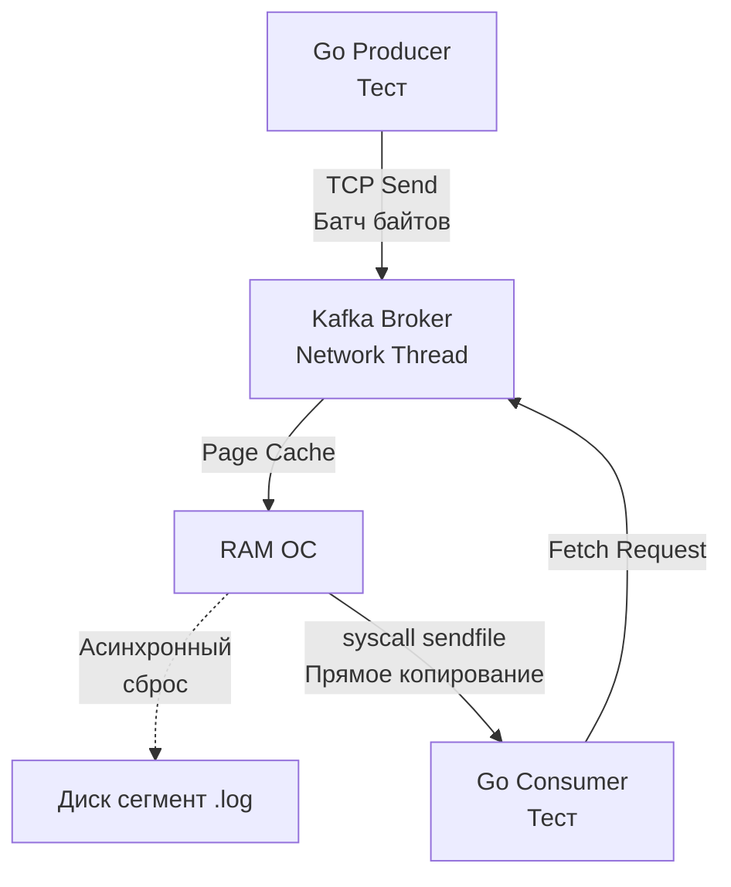

## Смена парадигмы: от Синхронности к Событиям

В предыдущих статьях мы рассматривали классический синхронный мир: мы делаем запрос в БД или кэш, и поток выполнения (горутина) блокируется до получения ответа. Успех или ошибка известны немедленно. 

Тестирование Event-Driven архитектуры (EDA) с брокерами сообщений вроде Apache Kafka, RabbitMQ или NATS ломает этот подход. Когда ваш сервис публикует событие `UserCreated`, функция отправки возвращает `nil` (ошибок нет) буквально через пару миллисекунд. Но бизнес-транзакция на этом не завершена. Другой микросервис (или горутина) должен вычитать это событие, обработать его и, например, обновить статус в базе данных.

Главный враг интеграционного тестирования очередей — **Eventual Consistency (Согласованность в конечном счете)** и время, необходимое на пересылку байтов через сеть, запись на диск и поллинг (polling) со стороны консьюмера.

## Mechanical Sympathy: Kafka — это не очередь

Чтобы писать надежные тесты, нужно понимать, как брокер работает с ОС и железом. 

Многие ошибочно переносят ментальную модель RabbitMQ (где сообщение удаляется из памяти после прочтения) на Kafka. Kafka — это **распределенный Append-Only лог**.

> [!info] Под капотом: Zero-Copy и Page Cache
> Когда ваш Go-продюсер отправляет батч сообщений в Kafka, брокер не хранит их в JVM heap. Он сбрасывает их прямо в системный кэш страниц Linux (Page Cache) и асинхронно пишет на диск. 
> Когда консьюмер запрашивает данные, Kafka использует системный вызов `sendfile`, который передает байты напрямую из Page Cache в сетевой сокет, минуя user-space приложения. 
> Для тестов это означает следующее: I/O операции в Kafka невероятно быстрые, но **метаданные** (создание топиков, выборы лидера партиции, ребалансировка консьюмер-групп) требуют синхронизации (через KRaft или Zookeeper) и занимают сотни миллисекунд, а иногда и секунды.



## Инфраструктура: Kafka vs Redpanda в Testcontainers

Официальный образ Apache Kafka написан на Java/Scala. Поднятие JVM и оркестрация метаданных занимает от 5 до 15 секунд. Если вы запускаете тесты локально, это убивает весь Developer Experience.

В мире Go стандартом де-факто для тестов стала **Redpanda** — брокер, написанный на C++ (Seastar framework), который на 100% совместим с API Kafka, но стартует за 1-2 секунды, так как не имеет JVM-оверхеда и Zookeeper. В пакете `testcontainers-go` есть готовые модули для обоих решений.

```go
package integration_test

import (
	"context"
	"testing"
	"time"

	"[github.com/stretchr/testify/require](https://github.com/stretchr/testify/require)"
	"[github.com/testcontainers/testcontainers-go](https://github.com/testcontainers/testcontainers-go)"
	"[github.com/testcontainers/testcontainers-go/modules/redpanda](https://github.com/testcontainers/testcontainers-go/modules/redpanda)"
)

func setupKafka(t *testing.T) string {
	t.Helper()
	ctx := context.Background()

	// Используем Redpanda для молниеносного старта вместо тяжелой JVM Kafka
	container, err := redpanda.RunContainer(ctx,
		testcontainers.WithImage("[docker.redpanda.com/redpandadata/redpanda:v23.2.2](https://docker.redpanda.com/redpandadata/redpanda:v23.2.2)"),
	)
	require.NoError(t, err, "не удалось поднять Redpanda/Kafka")

	t.Cleanup(func() {
		if err := container.Terminate(ctx); err != nil {
			t.Logf("Ошибка остановки брокера: %s", err)
		}
	})

	seedBrokers, err := container.KafkaSeedBroker(ctx)
	require.NoError(t, err)

	return seedBrokers
}
```

## Три ловушки асинхронного тестирования

### 1. time.Sleep() — Антипаттерн номер один

Самый частый грех, который можно встретить в тестах Middle-разработчиков:

```go
// НЕВЕРНО!
producer.SendMessage(msg)
time.Sleep(2 * time.Second) // "Подождем, пока консьюмер обработает"
require.Equal(t, expected, db.GetResult())
```

Это прямая дорога к [[6. Flaky тесты и их причины]]. В CI-пайплайне (например, на перегруженных GitHub Actions) CPU может быть занят, I/O затормозит, и ваш консьюмер обработает сообщение за 2.1 секунды. Тест упадет. Если вы увеличите таймаут до 5 секунд — ваши тесты станут невыносимо медленными.

**Правильный подход: Polling (Polling) или Синхронизация.**

В Go идиоматично использовать паттерн `Eventually` (из библиотек вроде `testify/require` с плагинами или писать свой цикл):

```go
func Eventually(t *testing.T, timeout time.Duration, tick time.Duration, condition func() bool) {
	t.Helper()
	deadline := time.Now().Add(timeout)
	for time.Now().Before(deadline) {
		if condition() {
			return // Успех!
		}
		time.Sleep(tick)
	}
	t.Fatalf("Условие не выполнилось за %v", timeout)
}

// Использование:
producer.SendMessage(msg)
Eventually(t, 5*time.Second, 100*time.Millisecond, func() bool {
	return db.GetResult() == expected // Проверяем базу каждые 100мс
})
```
Этот код выполнится за 100мс при хорошем сценарии, но не упадет из-за скачков задержек сети, давая запас в 5 секунд.

### 2. Гонка ребалансировки (Consumer Group Rebalance)

Это самый сложный и неочевидный баг в интеграционных тестах Kafka.

> [!warning] Ловушка / Gotcha: Проклятие auto.offset.reset
> По умолчанию консьюмеры стартуют с настройкой `auto.offset.reset = latest`.
> 1. Вы запускаете тест. Консьюмер стартует в фоне (горутина).
> 2. Тест мгновенно публикует сообщение в Kafka.
> 3. Консьюмер подключается к брокеру, но ему нужно пройти процесс **JoinGroup** и **SyncGroup** (получить партицию от Group Coordinator). Это занимает время (от 100мс до нескольких секунд).
> 4. Сообщение уже в логе. Консьюмер наконец-то получает партицию, смотрит на политику `latest` и начинает читать лог *с конца*.
> 5. **Сообщение проигнорировано.** Тест висит по таймауту.

**Решение (Idiomatic Go):**
При использовании популярных драйверов (например, `IBM/sarama`) мы должны передать сигнал в тест, что консьюмер физически получил партиции и готов к чтению, и **только после этого** отправлять тестовое сообщение.

В `sarama.ConsumerGroupHandler` есть метод `Setup`:

```go
type TestConsumerHandler struct {
	Ready chan struct{} // Канал для синхронизации
}

// Setup вызывается, когда партиции назначены
func (h *TestConsumerHandler) Setup(sarama.ConsumerGroupSession) error {
	close(h.Ready) // Сигнализируем тесту, что мы готовы!
	return nil
}

// ... ConsumeClaim и Cleanup
```

А в самом тесте:
```go
handler := &TestConsumerHandler{Ready: make(chan struct{})}
go consumerGroup.Consume(ctx, []string{"events"}, handler)

// Блокируемся, пока консьюмер не скажет, что он готов читать
<-handler.Ready 

// ТЕПЕРЬ безопасно отправлять сообщение!
producer.SendMessage(msg)
```

### 3. Изоляция данных в параллельных тестах

Как и с базами данных (разобранными в [[3. Транзакции и rollback подход]]), мы хотим запускать тесты очередей параллельно через `t.Parallel()`. 

Но в Kafka нет транзакций с `ROLLBACK` для изоляции тестов. Если 10 тестов шлют сообщения в один топик `orders`, консьюмер первого теста может вычитать сообщение второго теста.

**Стратегии изоляции:**
1. **Уникальные топики:** Каждый `t.Run` генерирует уникальное имя топика (например, `orders_test_uuid`). Консьюмер настраивается только на него. Это идеальная изоляция, но требует поддержки со стороны бизнес-логики (возможности динамически прокидывать имена топиков).
2. **Уникальные ключи (Partition Keys) и фильтрация:** Все тесты пишут в один топик, но каждый тест генерирует уникальный ID сущности (например, `OrderID`). В коде теста мы вычитываем сообщения и игнорируем те, у которых `OrderID` не совпадает с ожидаемым.

> [!tip] Собеседование
> **Вопрос:** Стоит ли писать моки для Kafka (интерфейсы `Producer` / `Consumer`) вместо использования Testcontainers?
> **Ответ:** Для Unit-тестов бизнес-логики (которая просто формирует структуру и отдает в интерфейс) — да. Для интеграционных тестов — категорически **нет**. Моки никогда не воспроизведут реальное поведение брокера: обрывы сети, Poison Pills (невалидные байты, ломающие десериализацию и останавливающие партицию), ребалансировку групп и коммиты оффсетов. Интеграционный тест должен проверять именно то, как ваш код интегрируется с драйвером и сетью.

## Итог

Тестирование Event-Driven систем требует смещения фокуса с "вызвал-получил" на "отправил-дождался состояния". 
1. Используйте `Redpanda` в `testcontainers-go` для быстрого старта.
2. Никогда не используйте жесткие `time.Sleep`, применяйте асинхронный поллинг (`Eventually`).
3. Явно синхронизируйте старт консьюмеров (через `Setup` хуки и каналы), чтобы избежать гонки ребалансировки.

Разобравшись с базами данных, кэшами и асинхронными очередями, мы покрыли весь спектр внутренних коммуникаций бэкенда. Пришло время выйти наружу — туда, где с нашим сервисом взаимодействуют реальные клиенты и другие микросервисы. В следующем разделе мы погрузимся в то, как правильно тестировать контракты и ручки API: [[8. HTTP integration тесты]].