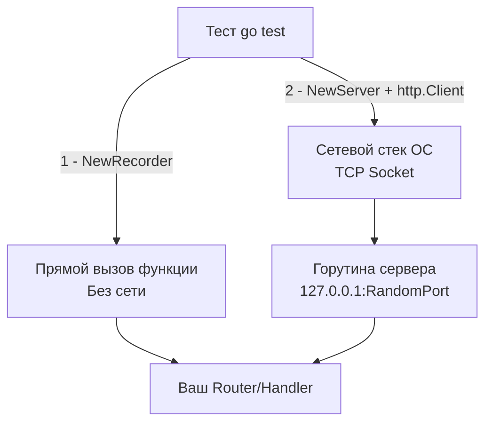

## Вертикальный срез: Тестирование системы целиком

До сих пор мы тестировали нашу инфраструктуру изолированно: репозитории — с помощью [[3. Транзакции и rollback подход]], а очереди — поднимая контейнеры. Но реальный клиент взаимодействует с вашим бэкендом не через вызовы методов интерфейса, а через HTTP API.

HTTP интеграционные тесты (часто их называют API-тестами или компонентными тестами) проверяют **вертикальный срез (Vertical Slice)** приложения. Мы дергаем за HTTP-ручку, запрос проходит через все слои: роутер $\rightarrow$ мидлвари $\rightarrow$ контроллер $\rightarrow$ юзкейс $\rightarrow$ репозиторий $\rightarrow$ реальная БД, а затем мы проверяем, правильный ли JSON вернулся и правильные ли данные осели на диске.

Это самые ценные тесты в вашем проекте. Они дают максимальную уверенность (Confidence), что система работает так, как ожидает бизнес, при рефакторинге любых внутренних слоев.

## In-Memory (Recorder) vs TCP (Server)

В Go для тестирования HTTP есть встроенный мощный пакет `net/http/httptest` (детальный разбор его API ждет нас в следующем разделе, в статье [[1. net_http_httptest пакет]]). В контексте интеграционных тестов перед нами всегда стоит архитектурный выбор из двух инструментов: `httptest.NewRecorder` и `httptest.NewServer`.

> [!info] Под капотом: Mechanical Sympathy
> **`httptest.NewRecorder()`** создает структуру `ResponseRecorder`, которая реализует интерфейс `http.ResponseWriter`. Когда вы передаете его в ваш роутер, запрос никуда не летит по сети. Вызов `ServeHTTP` — это просто прямой вызов функции в памяти. Никаких системных вызовов (syscalls), никаких TCP-сокетов. Это невероятно быстро.
> 
> **`httptest.NewServer()`** запускает реальный HTTP-сервер в отдельной горутине. Под капотом он делает системный вызов `bind` к адресу `127.0.0.1:0`. Порт `0` — это инструкция ядру ОС (Linux Kernel): "выдели любой свободный эфемерный порт" (ephemeral port). Ядро выделяет порт (например, `43912`), после чего сервер начинает слушать реальный TCP-сокет. 



Для 95% интеграционных тестов вашего API лучше использовать **`NewServer`**.
Да, он чуть медленнее (на доли миллисекунд), но он пропускает запрос через настоящий сетевой стек. Это позволяет выявить баги с заголовками `Connection`, таймаутами чтения/записи, лимитами тела запроса (body size limits) и некорректным поведением мидлварей компрессии (gzip), которые `NewRecorder` просто не заметит. Благодаря рандомизации портов, `NewServer` идеально работает с `t.Parallel()`.

## Архитектура теста: Паттерн "Test Application"

Для удобного написания таких тестов в enterprise-проектах создают структуру-хелпер (часто её называют `TestApp` или `TestEnv`), которая инкапсулирует в себе сборку всего приложения и скрывает бойлерплейт.

```go
package integration_test

import (
	"context"
	"net/http/httptest"
	"testing"

	"[github.com/jackc/pgx/v5/pgxpool](https://github.com/jackc/pgx/v5/pgxpool)"
	"[github.com/stretchr/testify/require](https://github.com/stretchr/testify/require)"
	"yourproject/internal/api"
	"yourproject/internal/repository"
	"yourproject/internal/service"
)

// TestApp хранит все зависимости для интеграционного теста
type TestApp struct {
	Server *httptest.Server
	DB     *pgxpool.Pool
	Client *http.Client
}

// setupTestApp собирает реальное приложение, но с тестовой БД
func setupTestApp(t *testing.T) *TestApp {
	t.Helper()

	// 1. Поднимаем БД через testcontainers (или берем из TestMain)
	dbPool := getTestDB(t)

	// 2. Инициализируем реальные слои
	repo := repository.NewUserRepo(dbPool)
	svc := service.NewUserService(repo)
	
	// 3. Собираем реальный роутер (chi, echo, gin или stdlib)
	router := api.NewRouter(svc)

	// 4. Запускаем тестовый сервер на случайном порту
	server := httptest.NewServer(router)
	
	// 5. Гарантируем остановку сервера и закрытие сокетов
	t.Cleanup(func() {
		server.Close()
	})

	return &TestApp{
		Server: server,
		DB:     dbPool,
		Client: server.Client(), // Клиент уже настроен на работу с этим сервером
	}
}
```

## Полный цикл: От JSON до базы и обратно

Теперь напишем идиоматичный интеграционный тест. Мы отправим POST-запрос на создание пользователя, проверим HTTP-ответ, а затем **сходим в реальную базу данных**, чтобы убедиться, что транзакция действительно закоммитилась и данные лежат на диске.

```go
func TestAPI_CreateUser_Success(t *testing.T) {
	t.Parallel()
	app := setupTestApp(t)

	// 1. Подготовка (Arrange)
	reqBody := `{"name": "Gopher", "email": "gopher@golang.org"}`
	
	// Формируем URL. app.Server.URL содержит динамический порт, например [http://127.0.0.1:54321](http://127.0.0.1:54321)
	req, err := http.NewRequest(http.MethodPost, app.Server.URL+"/api/v1/users", strings.NewReader(reqBody))
	require.NoError(t, err)
	req.Header.Set("Content-Type", "application/json")

	// 2. Выполнение (Act)
	resp, err := app.Client.Do(req)
	require.NoError(t, err)
	defer resp.Body.Close()

	// 3. Проверка HTTP слоя (Assert HTTP)
	require.Equal(t, http.StatusCreated, resp.StatusCode)

	var respJSON map[string]any
	err = json.NewDecoder(resp.Body).Decode(&respJSON)
	require.NoError(t, err)
	
	// Ожидаем, что API вернуло ID нового пользователя
	userID, ok := respJSON["id"].(float64) // JSON числа декодируются в float64
	require.True(t, ok)
	require.Greater(t, userID, 0.0)

	// 4. Проверка слоя данных (Assert Database)
	// Идем в PostgreSQL в обход API, чтобы убедиться в консистентности!
	var dbName, dbEmail string
	err = app.DB.QueryRow(context.Background(), 
		"SELECT name, email FROM users WHERE id = $1", int(userID)).
		Scan(&dbName, &dbEmail)
		
	require.NoError(t, err, "Пользователь не найден в БД")
	require.Equal(t, "Gopher", dbName)
	require.Equal(t, "gopher@golang.org", dbEmail)
}
```

> [!warning] Ловушка / Gotcha: Внешние системы в E2E
> Если ваш хэндлер при создании пользователя не только пишет в БД, но и дергает внешний сервис (например, Stripe API для создания биллинг-аккаунта), этот тест попытается сделать реальный HTTP-запрос в Stripe. В 99% случаев это приведет к падению теста (нет ключей, таймаут, rate limits). В интеграционных тестах вашего API **внешние HTTP-вызовы должны быть изолированы**.

> [!tip] Собеседование
> **Вопрос:** Почему при тестировании HTTP-хэндлеров важно закрывать `resp.Body` (`defer resp.Body.Close()`), даже если мы ничего из него не читаем?
> **Ответ:** Это вопрос на знание пула соединений HTTP клиента. Если вы не прочитаете тело до конца и не закроете его, базовое TCP-соединение (Underlying TCP Connection) не сможет быть возвращено в пул (Connection Pool) клиента для повторного использования (Keep-Alive). В масштабах прогона сотен тестов это приведет к утечке файловых дескрипторов (Socket Leaks) и ошибке `too many open files` на уровне операционной системы.

## Резюме

1. **HTTP Интеграционные тесты** — это проверка всей цепочки "Сетевой запрос $\rightarrow$ Маршрутизатор $\rightarrow$ Бизнес-логика $\rightarrow$ БД".
2. Используйте **`httptest.NewServer`** для имитации реального сетевого взаимодействия и выявления проблем с TCP/HTTP-протоколом.
3. Обязательно проверяйте не только статус-код и JSON-ответ, но и **Side effects** (побочные эффекты) в базе данных, кэше или брокере сообщений.

В этом тесте мы столкнулись с проблемой: что делать, если наше API зависит от чужого API? Как тестировать код, который стучится в Stripe, GitHub или сторонний микросервис, не делая реальных сетевых запросов в интернет? Об этом мы подробно поговорим в следующей статье: [[9. Тестирование внешних API]].