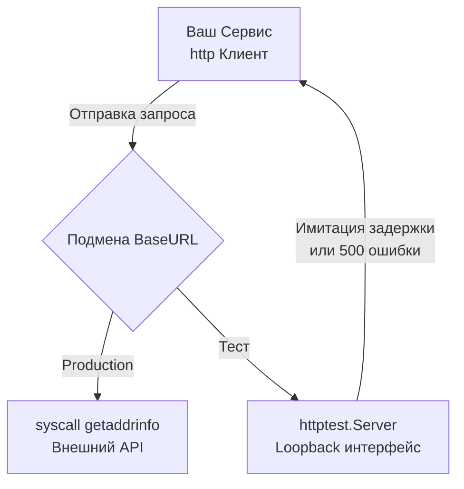

## Цена зависимости: почему нельзя стучаться в Production

В предыдущей статье [[8. HTTP integration тесты]] мы научились тестировать наш бэкенд как единое целое, отправляя реальные запросы к нашему роутеру и проверяя изменения в нашей собственной базе данных. Но реальный мир микросервисов редко бывает изолированным. Ваш код почти наверняка взаимодействует с внешними системами: платежными шлюзами (Stripe, PayPal), CRM-системами, провайдерами авторизации (OAuth) или другими микросервисами вашей компании.

Главное правило тестирования внешних интеграций: **Никогда не делайте реальные сетевые вызовы во внешние API в рамках CI/CD пайплайна.**

Этому есть множество причин:
1. **Недетерминированность:** Внешний API может упасть, уйти на техработы или ответить с задержкой в 5 секунд. Ваши тесты станут нестабильными (Flaky).
2. **Rate Limits и деньги:** Многие API берут деньги за каждый вызов или жестко ограничивают количество запросов.
3. **Отсутствие контроля (Chaos Engineering):** Как вы заставите реальный API Stripe вернуть вам HTTP 503 Service Unavailable или таймаут, чтобы проверить, как ваш код справляется с отказами? Никак.

## Иллюзия безопасности: Мокирование интерфейсов

Приходя из мира ООП, многие разработчики сразу же тянутся к генераторам моков. Если у нас есть клиент, давайте скроем его за интерфейсом!

```go
type PaymentClient interface {
    Charge(ctx context.Context, amount float64) error
}
```

В тесте мы генерируем `MockPaymentClient` через `gomock` и прописываем: `mock.EXPECT().Charge(ctx, 100.0).Return(nil)`.

> [!warning] Ловушка / Gotcha
> Это классический [[7. Overmocking как анти паттерн]] в контексте интеграционных тестов. 
> Мокируя интерфейс клиента, вы **не тестируете**:
> * Правильно ли формируется HTTP-запрос (URL, заголовки, авторизация).
> * Корректно ли работает `json.Marshal` для вашего тела запроса (может быть вы забыли теги `json:"amount"`).
> * Как ваш `http.Client` обрабатывает сетевые ошибки (обрывы TCP, таймауты).
> * Правильно ли парсится ответ с ошибкой (например, 400 Bad Request с кастомным JSON).

Интерфейсы отлично подходят для Unit-тестов бизнес-логики (когда нам не важен транспорт). Но в интеграционных тестах мы должны проверять транспортный уровень.

## Идиоматичный путь: httptest.Server

Вместо того чтобы мокировать интерфейс Go, мы будем мокировать **сам HTTP-сервер**. Пакет `net/http/httptest` предоставляет для этого идеальный инструмент — `httptest.NewServer`.

Суть подхода: мы поднимаем локальный веб-сервер прямо в процессе прогона теста и подменяем `BaseURL` нашего клиента так, чтобы он стучался не на `https://api.stripe.com`, а на `http://127.0.0.1:41234` (случайный порт, выданный ОС).

### Mechanical Sympathy: Почему это быстро?

Когда вы делаете запрос к реальному API, ваш код выполняет системный вызов `getaddrinfo` (DNS-резолвинг), затем устанавливает TCP-соединение через сетевую карту, проходя маршрутизаторы провайдера. 
Когда вы подменяете URL на `127.0.0.1`, запрос идет через **Loopback-интерфейс**. Сетевой стек ядра Linux (TCP/IP) все равно отрабатывает полностью (формируются TCP-сегменты, окна перегрузки), но пакеты никогда не покидают оперативную память и не доходят до физической сетевой карты (NIC). Вы получаете 100% реалистичность поведения сети при скорости выполнения в доли миллисекунд.



### Пример реализации

Сначала нам нужно убедиться, что наш HTTP-клиент (или обертка над ним) позволяет переопределить базовый URL. Это базовое требование к дизайну (Testability).

```go
// client.go
package stripe

import (
	"context"
	"net/http"
)

type Client struct {
	BaseURL    string
	HTTPClient *http.Client
	APIKey     string
}

func NewClient(apiKey string) *Client {
	return &Client{
		BaseURL:    "[https://api.stripe.com](https://api.stripe.com)", // Значение по умолчанию
		HTTPClient: &http.Client{},
		APIKey:     apiKey,
	}
}

// Метод, который мы будем тестировать
func (c *Client) Charge(ctx context.Context, amount float64) error {
    // ... формирование http.NewRequest с использованием c.BaseURL ...
    // ... вызов c.HTTPClient.Do(req) ...
    return nil
}
```

Теперь пишем интеграционный тест:

```go
package stripe_test

import (
	"context"
	"net/http"
	"net/http/httptest"
	"testing"
	"time"

	"[github.com/stretchr/testify/require](https://github.com/stretchr/testify/require)"
	"yourproject/internal/stripe"
)

func TestStripeClient_Charge_Success(t *testing.T) {
	t.Parallel()

	// 1. Создаем мок-сервер, который будет имитировать Stripe
	mockServer := httptest.NewServer(http.HandlerFunc(func(w http.ResponseWriter, r *http.Request) {
		// Проверяем, что клиент отправил правильный метод и путь
		require.Equal(t, http.MethodPost, r.Method)
		require.Equal(t, "/v1/charges", r.URL.Path)

		// Проверяем заголовки авторизации
		require.Equal(t, "Bearer test_key", r.Header.Get("Authorization"))

		// Отдаем успешный ответ, имитируя поведение реального API
		w.WriteHeader(http.StatusOK)
		w.Write([]byte(`{"id": "ch_123", "status": "succeeded"}`))
	}))
	
	// Обязательно закрываем сервер после теста, чтобы освободить сокет
	t.Cleanup(func() { mockServer.Close() })

	// 2. Настраиваем наш клиент, подменяя BaseURL
	client := stripe.NewClient("test_key")
	client.BaseURL = mockServer.URL // Теперь запросы пойдут на 127.0.0.1:XXXXX

	// 3. Выполняем реальный сетевой запрос к мок-серверу
	err := client.Charge(context.Background(), 100.0)

	// 4. Проверяем результат
	require.NoError(t, err)
}
```

## Тестирование отказоустойчивости (Chaos Testing)

Настоящая мощь `httptest.Server` раскрывается тогда, когда нам нужно проверить, как наша система ведет себя в экстремальных условиях. Ваш бэкенд должен уметь выживать, если сторонний API "лежит" или тормозит.

> [!tip] Собеседование
> **Вопрос:** Что не так с `http.Client{}` по умолчанию в Go, и как это уронит ваш сервер в Production?
> **Ответ:** Дефолтный `http.Client` не имеет таймаутов (`Timeout: 0`). Если внешний API (например, Stripe) зависнет и перестанет отвечать, но не закроет TCP-соединение, ваша горутина будет заблокирована навсегда. При высокой нагрузке у вас закончатся свободные горутины и файловые дескрипторы (Socket Exhaustion), и ваше приложение полностью зависнет. Всегда явно задавайте `Timeout` или используйте `context.WithTimeout`.

Давайте напишем тест, который проверяет, что наш клиент корректно отваливается по таймауту, а не висит вечно:

```go
func TestStripeClient_Charge_Timeout(t *testing.T) {
	t.Parallel()

	// Мок-сервер, который имитирует зависший API
	mockServer := httptest.NewServer(http.HandlerFunc(func(w http.ResponseWriter, r *http.Request) {
		time.Sleep(2 * time.Second) // Имитируем долгий ответ
		w.WriteHeader(http.StatusOK)
	}))
	t.Cleanup(func() { mockServer.Close() })

	client := stripe.NewClient("test_key")
	client.BaseURL = mockServer.URL
	
	// Конфигурируем жесткий таймаут для клиента
	client.HTTPClient = &http.Client{
		Timeout: 50 * time.Millisecond,
	}

	// Act
	start := time.Now()
	err := client.Charge(context.Background(), 100.0)

	// Assert
	require.Error(t, err)
	// Убеждаемся, что ошибка именно связана с таймаутом, а не с 500 статусом
	require.Contains(t, err.Error(), "context deadline exceeded", "Ожидался обрыв по таймауту")
	require.Less(t, time.Since(start), 100*time.Millisecond, "Клиент не должен был ждать 2 секунды")
}
```

## Альтернатива: Инъекция RoundTripper

В некоторых очень специфичных случаях поднимать локальный сервер избыточно (например, если логика тестирования требует перехвата сотен запросов к разным хостам без возможности подменить BaseURL). 

В Go интерфейс `http.RoundTripper` отвечает за выполнение одиночного HTTP-запроса и получение ответа. По умолчанию используется `http.Transport`, который реализует работу с TCP-пулом, TLS и прочим. Но мы можем подменить его на свой мок:

```go
// RoundTripFunc позволяет использовать обычную функцию как RoundTripper
type RoundTripFunc func(req *http.Request) *http.Response

func (f RoundTripFunc) RoundTrip(req *http.Request) (*http.Response, error) {
	return f(req), nil
}

// В тесте:
client.HTTPClient.Transport = RoundTripFunc(func(req *http.Request) *http.Response {
	// Мы перехватили запрос до того, как он ушел в сеть!
	return &http.Response{
		StatusCode: http.StatusInternalServerError,
		// Важно: нужно вернуть закрываемый Body
		Body:       io.NopCloser(strings.NewReader(`{"error": "internal_error"}`)),
		Header:     make(http.Header),
	}
})
```
Этот подход быстрее (нет парсинга HTTP-пакетов через TCP-сокет), но он менее реалистичен. Вы не поймаете ошибки `httputil.ReverseProxy` или специфичные баги компрессии. Использовать `httptest.Server` почти всегда предпочтительнее.

## Итог

Мы выяснили, что мокирование интерфейсов (как в Unit-тестах) прячет от нас сетевые баги, а запросы к реальным API делают тесты нестабильными. Золотая середина — поднятие легковесных in-memory серверов через `httptest.NewServer`.

Однако, если ваше приложение интегрируется не с одним эндпоинтом Stripe, а с десятком сложных микросервисов, писать `httptest.NewServer` с длинными `switch-case` по URL-ам внутри `HandlerFunc` становится тяжело и больно. Для сложных интеграций в экосистеме существуют более декларативные инструменты для стаббинга внешних систем. О том, как управлять хаосом мокирования на масштабных проектах, мы поговорим в следующей статье: [[10. Wiremock и HTTP mocking]].