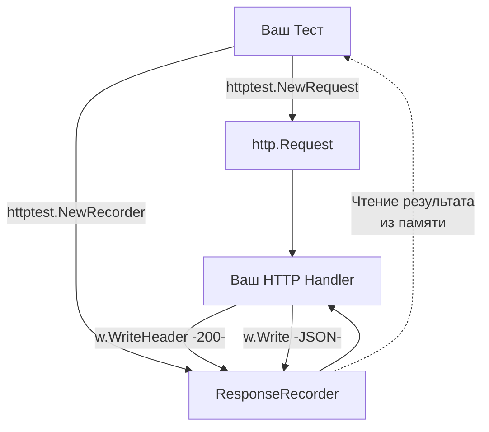

## Стандарт, опередивший индустрию

В экосистемах вроде Java (Spring), C# (ASP.NET) или PHP (Symfony/Laravel) тестирование HTTP-слоя почти всегда требует поднятия тяжеловесного тестового ядра фреймворка или использования сторонних библиотек, которые "мокируют" глобальное состояние приложения. 

В Go философия иная. Язык разрабатывался для создания сетевых сервисов, поэтому инструменты для тестирования HTTP встроены прямо в стандартную библиотеку — в пакет `net/http/httptest`. 

Главная сила `httptest` заключается в том, что он опирается на фундаментальный интерфейс `http.ResponseWriter`. Ваш бизнес-код не знает (и не должен знать), пишет ли он данные в реальный TCP-сокет или в тестовый буфер в оперативной памяти.

Пакет `httptest` предоставляет два основных инструмента:
1. `httptest.ResponseRecorder` — для "in-memory" тестирования хэндлеров (максимальная скорость, без участия сети).
2. `httptest.Server` — для тестирования через реальный сетевой стек (мы детально разбирали его в статье [[8. HTTP integration тесты]]).

В этом разделе мы сфокусируемся на тестировании самого API с помощью `ResponseRecorder` и `NewRequest`.

---

## httptest.ResponseRecorder: Иллюзия сети

Когда настоящий HTTP-сервер Go (`http.Server`) принимает запрос, он создает структуру `*http.response` (неэкспортируемую). Эта структура реализует интерфейс `http.ResponseWriter` и жестко привязана к нижележащему сетевому соединению (`net.Conn`). Любой вызов `w.Write()` в конечном итоге приводит к системному вызову `write` или `send`, переключая процессор в Kernel Space для отправки байтов через сетевую карту.

`httptest.ResponseRecorder` подменяет эту сложную механику на примитивную работу с оперативной памятью (User Space).

> [!info] Под капотом: Устройство ResponseRecorder
> Если заглянуть в исходники Go, `ResponseRecorder` — это просто структура-контейнер:
> ```go
> type ResponseRecorder struct {
>     Code      int           // HTTP статус код
>     HeaderMap http.Header   // Заголовки
>     Body      *bytes.Buffer // Тело ответа в памяти
>     Flushed   bool
>     // ...
> }
> ```
> Когда ваш хэндлер вызывает `w.Write([]byte("ok"))`, данные просто копируются в `bytes.Buffer`. Никаких системных вызовов, IO-операций и TCP-сегментов. Это значит, что вы можете запускать десятки тысяч таких тестов в секунду на одном ядре CPU.



## httptest.NewRequest vs http.NewRequest

Для вызова хэндлера нам нужен не только `ResponseWriter`, но и входящий `*http.Request`. 
Новички часто пытаются использовать стандартный `http.NewRequest`, но это приводит к проблемам.

> [!warning] Ловушка / Gotcha: Входящий vs Исходящий запрос
> `http.NewRequest` (из пакета `net/http`) создает **исходящий** запрос — тот, который ваш клиент отправляет *кому-то*.
> `httptest.NewRequest` создает **входящий** запрос — тот, который якобы *пришел на ваш сервер*.
> 
> Разница критична: `httptest.NewRequest` автоматически заполняет поля, которые сервер ожидает увидеть от клиента, например `RemoteAddr` (IP-адрес клиента) и `RequestURI`. Если ваш хэндлер или мидлварь использует логирование IP-адреса через `r.RemoteAddr`, стандартный `http.NewRequest` оставит это поле пустым, и тест может упасть с `panic` при попытке парсинга IP. Кроме того, `httptest.NewRequest` не возвращает ошибку (он паникует при невалидном URL, что идеально для тестов, избавляя нас от лишнего `if err != nil`).

---

## Идиоматичный тест In-Memory

Давайте напишем эталонный тест для простого HTTP-хэндлера, используя `httptest`.

```go
package api_test

import (
	"encoding/json"
	"net/http"
	"net/http/httptest"
	"testing"

	"[github.com/stretchr/testify/require](https://github.com/stretchr/testify/require)"
)

// Тестируемый хэндлер (в реальном коде он лежит в другом пакете)
func HealthCheckHandler(w http.ResponseWriter, r *http.Request) {
	if r.Method != http.MethodGet {
		http.Error(w, "Method Not Allowed", http.StatusMethodNotAllowed)
		return
	}

	w.Header().Set("Content-Type", "application/json")
	w.WriteHeader(http.StatusOK)
	_ = json.NewEncoder(w).Encode(map[string]string{"status": "pass"})
}

func TestHealthCheckHandler(t *testing.T) {
	t.Parallel()

	// 1. Arrange
	req := httptest.NewRequest(http.MethodGet, "/health", nil)
	rec := httptest.NewRecorder()

	// 2. Act
	HealthCheckHandler(rec, req)

	// 3. Assert
	// Получаем финальный http.Response из рекордера
	res := rec.Result()
	defer res.Body.Close()

	// Проверяем статус
	require.Equal(t, http.StatusOK, res.StatusCode)

	// Проверяем заголовки
	require.Equal(t, "application/json", res.Header.Get("Content-Type"))

	// Проверяем тело
	var body map[string]string
	err := json.NewDecoder(res.Body).Decode(&body)
	require.NoError(t, err)
	require.Equal(t, "pass", body["status"])
}
```

> [!tip] Собеседование
> **Вопрос:** Почему в коде выше мы используем `rec.Result()`, а не читаем напрямую `rec.Code` и `rec.Body.String()`?
> **Ответ:** Прямое чтение полей из `ResponseRecorder` — это устаревший подход (хотя и рабочий). Метод `Result()` был добавлен в Go 1.11, и он делает важную вещь: он корректно рассчитывает итоговый `http.Response`, применяя дефолты сервера. Например, если хэндлер вызвал `w.Write()`, но забыл вызвать `w.WriteHeader()`, реальный сервер неявно подставит статус `200 OK` и определит `Content-Type` с помощью `http.DetectContentType`. Метод `rec.Result()` симулирует эту магию рантайма, выдавая вам точно такой же результат, какой получил бы реальный клиент по сети. Если читать `rec.Code` напрямую в таком случае, там будет `0`.

## Тестирование контекста (Context Cancellation)

В современном Go-бэкенде хэндлеры обязаны реагировать на обрыв соединения клиентом. Это реализуется через `r.Context().Done()`. Как протестировать этот механизм, если мы не используем реальную сеть?

`httptest.NewRequest` возвращает запрос с базовым `context.Background()`. Чтобы сымитировать отмену запроса пользователем, мы должны явно переопределить контекст в тесте:

```go
func TestHandler_ClientDisconnect(t *testing.T) {
	t.Parallel()

	// Создаем отменяемый контекст
	ctx, cancel := context.WithCancel(context.Background())
	
	req := httptest.NewRequest(http.MethodGet, "/heavy-job", nil)
	// Подменяем контекст в запросе
	req = req.WithContext(ctx)
	
	rec := httptest.NewRecorder()

	// Симулируем, что клиент отвалился (закрыл вкладку) СРАЗУ ЖЕ
	cancel()

	// Вызываем хэндлер. Он должен увидеть, что ctx.Done() закрыт, 
	// и прервать тяжелую работу, вернув 499 (Client Closed Request) или 500
	HeavyJobHandler(rec, req)

	res := rec.Result()
	require.Equal(t, 499, res.StatusCode) // Зависит от вашей бизнес-логики
}
```

## Итог

Пакет `net/http/httptest` — это мощный инструмент, который:
1. Позволяет вызывать хэндлеры напрямую в памяти через `ResponseRecorder`, минуя сетевой стек ОС (снижение I/O операций).
2. Предоставляет `httptest.NewRequest` для корректной имитации серверного окружения входящего запроса.
3. Гарантирует, что ваши тесты будут выполняться с максимальной производительностью без конфликтов TCP-портов.

Поняв механику работы `httptest`, мы готовы перенести фокус с транспорта на архитектуру. В следующей статье мы разберем, как правильно тестировать сложную логику, инжекцию зависимостей в контроллеры и валидацию данных внутри самих ручек API: [[2. Тестирование handler функций]].