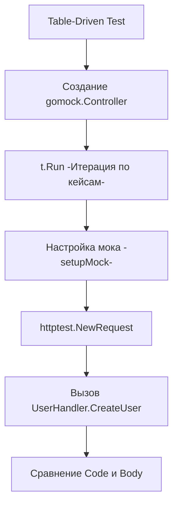

## Граница между HTTP и Бизнес-логикой

В прошлой статье [[1. net http httptest пакет]] мы разобрали низкоуровневые механизмы создания искусственных HTTP-запросов и ответов в памяти. Теперь мы поднимемся на уровень выше и применим эти инструменты для тестирования самих **HTTP-хэндлеров** (или контроллеров, если использовать терминологию MVC).

Основная задача unit-теста хэндлера — проверить **только транспортный слой**. Мы не тестируем здесь работу с базой данных или сложную бизнес-логику (это прерогатива сервисного слоя). 

Мы должны убедиться, что хэндлер:
1. Корректно парсит входящие данные (JSON body, Query-параметры, URL path).
2. Правильно передает эти данные на слой бизнес-логики (Service Layer).
3. Адекватно обрабатывает ошибки от сервиса и транслирует их в правильные HTTP статус-коды (например, `ErrNotFound` $\rightarrow$ `404 Not Found`).
4. Формирует валидный JSON-ответ.

## Архитектура: Инъекция зависимостей (DI)

Для того чтобы хэндлер можно было протестировать изолированно, он должен быть спроектирован с учетом [[8. Dependency injection для тестируемости]]. Если ваш хэндлер внутри себя вызывает глобальные функции или сам создает подключение к БД, вы не сможете его протестировать без поднятия всей инфраструктуры.

Идиоматичный подход в Go — это внедрение сервиса через интерфейс в структуру хэндлера.

```go
package api

import (
	"context"
	"encoding/json"
	"errors"
	"net/http"
)

// UserService — интерфейс бизнес-логики, который мы будем мокировать
type UserService interface {
	Create(ctx context.Context, email string) (int, error)
}

// UserHandler хранит зависимости
type UserHandler struct {
	service UserService
}

func NewUserHandler(s UserService) *UserHandler {
	return &UserHandler{service: s}
}

// CreateUser — сам хэндлер
func (h *UserHandler) CreateUser(w http.ResponseWriter, r *http.Request) {
	var req struct {
		Email string `json:"email"`
	}

	if err := json.NewDecoder(r.Body).Decode(&req); err != nil {
		http.Error(w, `{"error": "bad request"}`, http.StatusBadRequest)
		return
	}

	id, err := h.service.Create(r.Context(), req.Email)
	if err != nil {
		if errors.Is(err, ErrAlreadyExists) { // Допустим, мы определили такую ошибку
			http.Error(w, `{"error": "conflict"}`, http.StatusConflict)
			return
		}
		http.Error(w, `{"error": "internal"}`, http.StatusInternalServerError)
		return
	}

	w.WriteHeader(http.StatusCreated)
	json.NewEncoder(w).Encode(map[string]int{"id": id})
}
```

## Анатомия Table-Driven Теста

Хэндлеры — идеальные кандидаты для [[4. Table driven tests]]. Одному эндпоинту обычно соответствует множество сценариев: успешный сценарий (Happy Path), невалидный JSON, ошибка валидации почты, конфликт (пользователь уже существует) и падение базы данных (500).



Для генерации мока интерфейса `UserService` мы будем использовать `gomock` (сегодня это `go.uber.org/mock/gomock`).

```go
package api_test

import (
	"bytes"
	"errors"
	"net/http"
	"net/http/httptest"
	"testing"

	"[github.com/stretchr/testify/require](https://github.com/stretchr/testify/require)"
	"go.uber.org/mock/gomock"
	
	"yourproject/internal/api"
	"yourproject/internal/mocks" // Сгенерированные моки
)

func TestUserHandler_CreateUser(t *testing.T) {
	t.Parallel()

	// 1. Описываем структуру тест-кейса
	type testCase struct {
		name           string
		requestBody    string
		setupMock      func(mockService *mocks.MockUserService)
		expectedStatus int
		expectedJSON   string
	}

	// 2. Заполняем таблицу сценариев
	testCases := []testCase{
		{
			name:        "Happy Path: Успешное создание",
			requestBody: `{"email": "test@example.com"}`,
			setupMock: func(m *mocks.MockUserService) {
				// Проверяем, что хэндлер передал правильный email и вызвал метод 1 раз
				m.EXPECT().Create(gomock.Any(), "test@example.com").Return(42, nil).Times(1)
			},
			expectedStatus: http.StatusCreated,
			expectedJSON:   `{"id": 42}`,
		},
		{
			name:           "Bad Request: Невалидный JSON",
			requestBody:    `{"email": "test...`, // Сломанный JSON
			setupMock:      func(m *mocks.MockUserService) {}, // Мок не должен быть вызван
			expectedStatus: http.StatusBadRequest,
			expectedJSON:   `{"error": "bad request"}`,
		},
		{
			name:        "Conflict: Пользователь существует",
			requestBody: `{"email": "exist@example.com"}`,
			setupMock: func(m *mocks.MockUserService) {
				m.EXPECT().Create(gomock.Any(), "exist@example.com").Return(0, api.ErrAlreadyExists)
			},
			expectedStatus: http.StatusConflict,
			expectedJSON:   `{"error": "conflict"}`,
		},
	}

	// 3. Выполняем тесты
	for _, tc := range testCases {
		tc := tc // Захват переменной для параллельного запуска (важно для Go < 1.22)
		t.Run(tc.name, func(t *testing.T) {
			t.Parallel()

			// Инициализация мок-контроллера
			ctrl := gomock.NewController(t)
			// t.Cleanup гарантирует вызов ctrl.Finish() в конце теста
			
			mockSvc := mocks.NewMockUserService(ctrl)
			tc.setupMock(mockSvc)

			handler := api.NewUserHandler(mockSvc)

			// Создаем искусственный запрос
			req := httptest.NewRequest(http.MethodPost, "/users", bytes.NewBufferString(tc.requestBody))
			rec := httptest.NewRecorder()

			// Act: Вызываем хэндлер напрямую
			handler.CreateUser(rec, req)

			// Assert: Проверяем результат
			res := rec.Result()
			defer res.Body.Close()

			require.Equal(t, tc.expectedStatus, res.StatusCode)
			
			// Специфичная проверка для JSON
			require.JSONEq(t, tc.expectedJSON, rec.Body.String())
		})
	}
}
```

## Ловушки и лучшие практики

### 1. `require.JSONEq` вместо `require.Equal`

> [!tip] Собеседование
> **Вопрос:** Почему при сравнении HTTP-ответов нельзя просто использовать `require.Equal(t, expectedStr, actualStr)`?
> **Ответ:** Функция `json.NewEncoder(w).Encode(...)` по умолчанию добавляет символ переноса строки `\n` в конец вывода. Кроме того, порядок ключей в JSON-объекте не гарантирован (хотя в структурах он детерминирован, в `map` — нет), и могут отличаться пробелы. Сравнение строк через `Equal` упадет на банальном переносе строки. `require.JSONEq` парсит обе строки как JSON и сравнивает их семантически, игнорируя форматирование.

### 2. Передача Контекста (Mechanical Sympathy)

Обратите внимание на вызов `m.EXPECT().Create(gomock.Any(), "test@example.com")` в моке. Мы используем `gomock.Any()` для первого аргумента (контекста). 
В жестких enterprise-требованиях этого может быть недостаточно. Вы должны проверять, что хэндлер передал **именно контекст запроса** (`r.Context()`), а не `context.Background()`. Если хэндлер потеряет `r.Context()`, то при отмене HTTP-запроса клиентом, тяжелый запрос в базу данных на слое репозитория не будет прерван, что приведет к утечкам горутин.

Строгая проверка выглядит так:
```go
m.EXPECT().
	Create(gomock.AssignableToTypeOf(context.Background()), "test@example.com").
	DoAndReturn(func(ctx context.Context, email string) (int, error) {
		// Проверяем, что контекст содержит данные из HTTP-запроса
		return 42, nil
	})
```

### 3. Производительность: Decoder vs Unmarshal

В хэндлере выше мы использовали `json.NewDecoder(r.Body).Decode(&req)`. 

> [!info] Под капотом
> `r.Body` реализует интерфейс `io.ReadCloser`. 
> Использование `json.NewDecoder` читает данные прямо из TCP-сокета (или из буфера памяти в случае `httptest`) потоково (streaming), по мере парсинга JSON, что минимизирует аллокации в куче (Heap).
> 
> Альтернативный подход: `bodyBytes, _ := io.ReadAll(r.Body)` с последующим `json.Unmarshal(bodyBytes, &req)`. Это загружает всё тело запроса в слайс байт (одна большая аллокация).
> 
> Для мелких запросов разницы нет, но если клиент пришлет JSON размером 50 МБ, `io.ReadAll` вызовет серьезный всплеск использования RAM и нагрузит Garbage Collector. В тестах мы имитируем `r.Body` с помощью `bytes.NewBufferString`, который тоже ведет себя как поток, позволяя тестировать потоковый парсинг.

## Итог

Тестирование хэндлеров — это самый быстрый и эффективный способ покрыть контракты вашего API. Мы убедились, что Table-Driven тесты вкупе с мокированием слоя сервиса позволяют описать десятки корнер-кейсов в одном файле, сохраняя при этом выполнение на уровне микросекунд.

Однако наш хэндлер выполняет только "чистую" бизнес-работу. В реальном приложении до того, как запрос попадет в хэндлер, он проходит через цепочку перехватчиков: авторизацию, логирование, лимитирование запросов (Rate Limiting). О том, как тестировать этот критически важный защитный слой, мы поговорим в следующей статье: [[3. Middleware тестирование]].