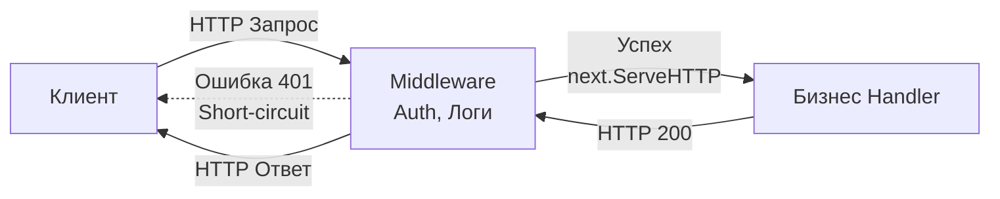

## Первая линия обороны

В предыдущей статье мы разбирали [[2. Тестирование handler функций]], предполагая, что запрос уже успешно дошел до бизнес-логики. Но в реальных production-системах хэндлер — это лишь ядро луковицы. До того как запрос достигнет вашего кода, он проходит через слои **Middleware** (промежуточного ПО).

Мидлвари реализуют паттерн *Chain of Responsibility* (Цепочка обязанностей). Они отвечают за критически важную инфраструктурную логику: аутентификацию (JWT), авторизацию (RBAC), логирование, распределенную трассировку (OpenTelemetry), защиту от DDoS (Rate Limiting) и инъекцию зависимостей в контекст.

Ошибка в бизнес-хэндлере приведет к багу у одного пользователя. Ошибка в Auth-мидлвари приведет к утечке данных или полному отказу (Downtime) всего сервиса. Поэтому их тестирование требует особой тщательности.

## Архитектура Middleware в Go

Идиоматичный мидлварь в Go — это функция высшего порядка, которая принимает `http.Handler` и возвращает `http.Handler` (чаще всего оборачивая его в `http.HandlerFunc`).



У мидлвари есть два основных пути выполнения:
1. **Пропуск (Pass-through):** Запрос валиден. Мидлварь может модифицировать контекст (`r.WithContext`) и передать управление дальше: `next.ServeHTTP(w, r)`.
2. **Короткое замыкание (Short-circuit):** Запрос невалиден (нет токена, превышен лимит). Мидлварь пишет HTTP-ошибку в `w` и **прерывает** цепочку, возвращаясь (`return`).

## Стратегия тестирования: Dummy Handler

Чтобы протестировать мидлварь изолированно от базы данных и реальных хэндлеров, мы применяем паттерн **Dummy Handler** (Фиктивный обработчик). 

Суть проста: мы создаем заглушку `next`, которая просто меняет булевый флаг `wasCalled = true`. Обернув эту заглушку нашим мидлварем, мы сможем с помощью `httptest` имитировать запросы и строго проверять, дошел ли запрос до конца цепочки.

### Реализация: Auth Middleware

Давайте напишем production-ready мидлварь для проверки Bearer токена и сразу покроем его тестами.

```go
package api

import (
	"context"
	"net/http"
	"strings"
)

// Идиоматичный подход: кастомный тип для ключа контекста во избежание коллизий
type contextKey string
const UserIDKey contextKey = "userID"

// AuthMiddleware проверяет наличие статического токена (для упрощения примера)
func AuthMiddleware(next http.Handler) http.Handler {
	return http.HandlerFunc(func(w http.ResponseWriter, r *http.Request) {
		authHeader := r.Header.Get("Authorization")
		if authHeader == "" {
			http.Error(w, "missing token", http.StatusUnauthorized)
			return
		}

		parts := strings.Split(authHeader, " ")
		if len(parts) != 2 || parts[0] != "Bearer" || parts[1] != "secret-token" {
			http.Error(w, "invalid token", http.StatusUnauthorized)
			return
		}

		// Добавляем ID пользователя в контекст
		ctx := context.WithValue(r.Context(), UserIDKey, 42)
		
		// Передаем управление следующему обработчику с НОВЫМ контекстом
		next.ServeHTTP(w, r.WithContext(ctx))
	})
}
```

> [!info] Под капотом: r.WithContext и Escape Analysis
> Что происходит на уровне памяти, когда мы вызываем `r.WithContext(ctx)`?
> Метод не мутирует оригинальный объект `http.Request`, так как разделение памяти между горутинами может привести к Data Race. Вместо этого он делает **Shallow Copy** (поверхностную копию) структуры `Request`, заменяя в ней только поле `ctx`. 
> Так как возвращается указатель на новый объект, аллокатор Go отправляет эту новую структуру в кучу (Heap), что создает небольшую нагрузку на Garbage Collector. Знание этого механизма заставляет нас быть осторожными: цепочка из 20 мидлварей, каждый из которых делает `WithContext`, породит 20 аллокаций на каждый HTTP-запрос. В высоконагруженных системах данные (например, логгеры) стараются объединять в одну структуру перед инъекцией.

### Пишем Table-Driven Test

Мы используем пакет `httptest` (разобранный в [[1. net http httptest пакет]]) и структуру табличных тестов ([[4. Table driven tests]]).

Ключевой момент теста: мы должны проверять не только HTTP статус-код, но и **состояние вызова следующего хэндлера**, а также **значение в контексте**.

```go
package api_test

import (
	"net/http"
	"net/http/httptest"
	"testing"

	"[github.com/stretchr/testify/require](https://github.com/stretchr/testify/require)"
	"yourproject/internal/api"
)

func TestAuthMiddleware(t *testing.T) {
	t.Parallel()

	type testCase struct {
		name           string
		authHeader     string
		expectedStatus int
		expectedNext   bool // Должен ли быть вызван следующий хэндлер?
	}

	testCases := []testCase{
		{
			name:           "Успешная авторизация",
			authHeader:     "Bearer secret-token",
			expectedStatus: http.StatusOK,
			expectedNext:   true,
		},
		{
			name:           "Отсутствует заголовок",
			authHeader:     "",
			expectedStatus: http.StatusUnauthorized,
			expectedNext:   false,
		},
		{
			name:           "Невалидный токен",
			authHeader:     "Bearer hacker-token",
			expectedStatus: http.StatusUnauthorized,
			expectedNext:   false,
		},
		{
			name:           "Сломанный формат заголовка",
			authHeader:     "Basic secret",
			expectedStatus: http.StatusUnauthorized,
			expectedNext:   false,
		},
	}

	for _, tc := range testCases {
		tc := tc // Захват для параллельного выполнения
		t.Run(tc.name, func(t *testing.T) {
			t.Parallel()

			// 1. Создаем Dummy Handler
			var nextCalled bool
			var contextUserID any

			nextHandler := http.HandlerFunc(func(w http.ResponseWriter, r *http.Request) {
				nextCalled = true
				// Сохраняем значение из контекста для проверки
				contextUserID = r.Context().Value(api.UserIDKey)
				w.WriteHeader(http.StatusOK)
			})

			// 2. Оборачиваем Dummy в тестируемый Middleware
			handlerToTest := api.AuthMiddleware(nextHandler)

			// 3. Подготавливаем запрос и рекордер
			req := httptest.NewRequest(http.MethodGet, "/secure-data", nil)
			if tc.authHeader != "" {
				req.Header.Set("Authorization", tc.authHeader)
			}
			rec := httptest.NewRecorder()

			// 4. Act
			handlerToTest.ServeHTTP(rec, req)

			// 5. Assert
			res := rec.Result()
			defer res.Body.Close()

			// Проверяем статус-код
			require.Equal(t, tc.expectedStatus, res.StatusCode)

			// КРИТИЧЕСКАЯ ПРОВЕРКА: сработал ли short-circuit?
			require.Equal(t, tc.expectedNext, nextCalled, "Вызов next.ServeHTTP не соответствует ожиданиям")

			// Проверяем инъекцию в контекст при успешном сценарии
			if tc.expectedNext {
				require.NotNil(t, contextUserID)
				require.Equal(t, 42, contextUserID)
			}
		})
	}
}
```

> [!warning] Ловушка / Gotcha: Утечка управления (Leak of control)
> Самая страшная ошибка при написании мидлварей, которую часто допускают джуниоры — забыть написать `return` после возврата HTTP-ошибки:
> ```go
> if !isValid {
>     http.Error(w, "forbidden", 403)
>     // Забыли return!
> }
> next.ServeHTTP(w, r)
> ```
> В этом случае клиент получит статус 403, но **код следующего хэндлера все равно выполнится**. Если следующий хэндлер удаляет базу данных или пишет `w.WriteHeader(200)` (что вызовет панику `multiple response.WriteHeader calls`), ваша система рухнет или скомпрометирует данные.
> Именно проверка переменной `nextCalled == false` в тестах защищает вас от этой катастрофы.

## Порядок мидлварей (Chain Ordering)

В production-системах мидлвари собираются в цепочки с помощью роутеров (например, `chi.Use` или просто вложенными вызовами `Log(Recover(Auth(handler)))`). 

> [!tip] Собеседование
> **Вопрос:** Если мы используем мидлвари `Logger`, `Recoverer` (отлов паник) и `Auth`, в каком порядке их нужно регистрировать и почему?
> **Ответ:** Порядок критичен. 
> 1. `Recoverer` должен быть **самым первым** (самым внешним). Он использует `defer`, чтобы отловить `panic` в любой точке ниже по стеку вызовов.
> 2. `Logger` идет вторым. Ему нужно замерить время выполнения (через `time.Now()` до `next.ServeHTTP` и `time.Since` после), поэтому он должен оборачивать весь остальной пайплайн, чтобы зафиксировать даже время, потраченное на проверку токена.
> 3. `Auth` идет последним. База данных или внешние сервисы авторизации не должны нагружаться невалидными запросами, которые уже отпали бы на ранних этапах.

Хотя unit-тестирование отдельных мидлварей гарантирует их правильное внутреннее поведение, оно не гарантирует, что мы правильно собрали их цепочку. Для проверки всей связки роутера, мидлварей и хэндлеров нам необходимо подниматься на уровень выше и писать комплексные интеграционные тесты для нашего API-контракта.

Как объединить все это в единую проверяемую систему, мы детально разберем в следующей статье: [[4. Тестирование REST API]].