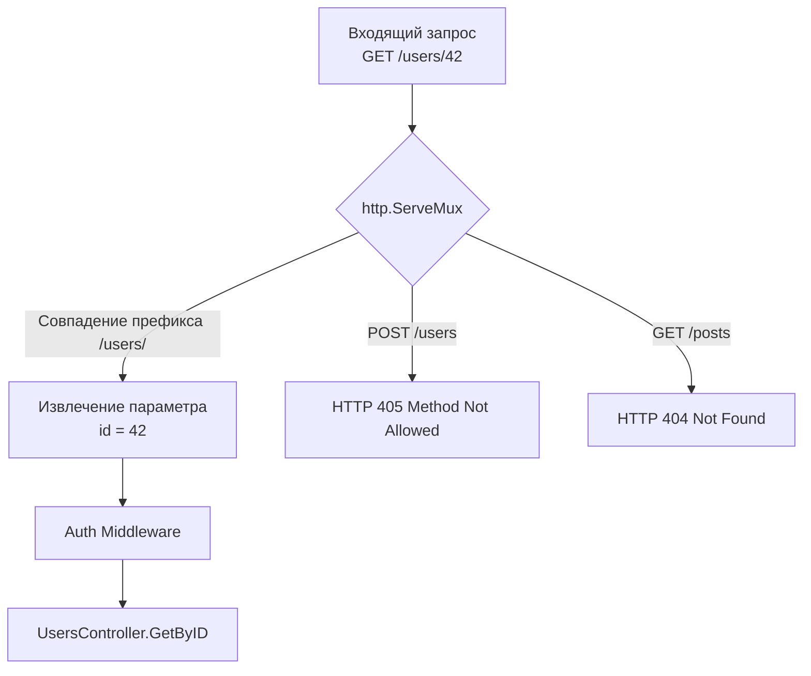

## Сборка пазла: Тестирование REST-ресурсов

В статьях [[2. Тестирование handler функций]] и [[3. Middleware тестирование]] мы рассматривали HTTP-слой через микроскоп, изолированно тестируя отдельные функции-обработчики и промежуточное ПО. Но архитектура REST (Representational State Transfer) строится не на изолированных функциях, а на **Ресурсах**, доступ к которым осуществляется через комбинацию URL-путей и HTTP-глаголов (GET, POST, PUT, DELETE).

Главная проблема модульного тестирования хэндлеров заключается в том, что оно **игнорирует маршрутизатор (Router/Multiplexer)**. 

Представьте: ваш юнит-тест напрямую вызывает `GetUserHandler`. Тест горит зеленым. Но в файле маршрутизации вы случайно написали `mux.HandleFunc("GET /user/{id}", ...)` вместо `/users/{id}` (опечатка в букве 's'). В итоге production вернет клиенту `404 Not Found`. Чтобы избежать этого, мы должны тестировать **весь REST-ресурс целиком**, пропуская искусственные запросы через настроенный роутер.

## Mechanical Sympathy: Как работает роутер

До версии Go 1.22 стандартный `http.ServeMux` умел матчить только префиксы. Для REST API разработчики повсеместно использовали сторонние библиотеки вроде `chi` или `gorilla/mux`. В Go 1.22 стандартная библиотека получила мощный апгрейд: теперь `ServeMux` нативно поддерживает HTTP-методы и Path-параметры (Wildcards).

> [!info] Под капотом: Radix Tree
> Современные роутеры (и `chi`, и новый `http.ServeMux` из Go 1.22+) используют структуру данных **Radix Tree (Компактное префиксное дерево)**. 
> Когда приходит HTTP-запрос, роутер не перебирает все зарегистрированные пути регулярными выражениями (это было бы фатально медленно, $O(N)$). Он спускается по узлам дерева побайтово, что дает алгоритмическую сложность $O(K)$, где $K$ — длина URL. 
> 
> В процессе спуска роутер собирает значения wildcards (например, `123` из `/users/123`). В Go 1.22 эти значения бережно сохраняются в приватных массивах внутри `http.Request`, откуда их потом можно извлечь быстрым вызовом `r.PathValue("id")`. Тестирование через роутер гарантирует, что этот механизм отработал корректно и аллокации памяти под URL-параметры произошли ожидаемым образом.



## Паттерн "Resource Controller"

Для удобного тестирования идиоматично группировать хэндлеры и их маршруты в единую структуру, часто называемую Controller или API.

```go
package api

import (
	"encoding/json"
	"net/http"
)

// UserService скрывает бизнес-логику (мы будем мокировать его в тестах)
type UserService interface {
	GetByID(id string) (string, error)
	Delete(id string) error
}

type UsersAPI struct {
	svc UserService
}

func NewUsersAPI(svc UserService) *UsersAPI {
	return &UsersAPI{svc: svc}
}

// RegisterRoutes привязывает хэндлеры к роутеру (Go 1.22+ синтаксис)
func (api *UsersAPI) RegisterRoutes(mux *http.ServeMux) {
	mux.HandleFunc("GET /users/{id}", api.getUser)
	mux.HandleFunc("DELETE /users/{id}", api.deleteUser)
}

func (api *UsersAPI) getUser(w http.ResponseWriter, r *http.Request) {
	// Извлекаем параметр через новый API Go 1.22
	id := r.PathValue("id") 
	if id == "" {
		http.Error(w, "missing id", http.StatusBadRequest)
		return
	}

	name, err := api.svc.GetByID(id)
	if err != nil {
		http.Error(w, "not found", http.StatusNotFound)
		return
	}

	w.Header().Set("Content-Type", "application/json")
	json.NewEncoder(w).Encode(map[string]string{"id": id, "name": name})
}

func (api *UsersAPI) deleteUser(w http.ResponseWriter, r *http.Request) {
	id := r.PathValue("id")
	if err := api.svc.Delete(id); err != nil {
		http.Error(w, "internal", http.StatusInternalServerError)
		return
	}
	w.WriteHeader(http.StatusNoContent)
}
```

## Тестирование маршрутизатора через ResponseRecorder

Теперь напишем интеграционный тест для REST-ресурса. Мы инициализируем реальный `http.ServeMux`, регистрируем в нем наш контроллер и отправляем искусственные запросы *напрямую в Mux*, используя `httptest.NewRequest`.

```go
package api_test

import (
	"net/http"
	"net/http/httptest"
	"testing"

	"[github.com/stretchr/testify/require](https://github.com/stretchr/testify/require)"
	"go.uber.org/mock/gomock"
	
	"yourproject/internal/api"
	"yourproject/internal/mocks"
)

// setupRouter инициализирует роутер с моками для конкретного теста
func setupRouter(t *testing.T) (*http.ServeMux, *mocks.MockUserService) {
	t.Helper()
	ctrl := gomock.NewController(t)
	mockSvc := mocks.NewMockUserService(ctrl)
	
	mux := http.NewServeMux()
	usersAPI := api.NewUsersAPI(mockSvc)
	usersAPI.RegisterRoutes(mux) // Регистрируем маршруты!
	
	return mux, mockSvc
}

func TestUsersAPI_REST(t *testing.T) {
	t.Parallel()

	type testCase struct {
		name           string
		method         string
		targetURL      string
		setupMock      func(m *mocks.MockUserService)
		expectedStatus int
		expectedJSON   string
	}

	testCases := []testCase{
		{
			name:      "GET /users/{id} - Успешно",
			method:    http.MethodGet,
			targetURL: "/users/42", // Тестируем реальный URL с параметром
			setupMock: func(m *mocks.MockUserService) {
				// Убеждаемся, что PathValue("id") корректно извлек "42"
				m.EXPECT().GetByID("42").Return("Gopher", nil)
			},
			expectedStatus: http.StatusOK,
			expectedJSON:   `{"id": "42", "name": "Gopher"}`,
		},
		{
			name:           "DELETE /users/{id} - Успешно",
			method:         http.MethodDelete,
			targetURL:      "/users/99",
			setupMock: func(m *mocks.MockUserService) {
				m.EXPECT().Delete("99").Return(nil)
			},
			expectedStatus: http.StatusNoContent,
			expectedJSON:   "", // 204 No Content не имеет тела
		},
		{
			name:           "GET /users - Отсутствует параметр ID",
			method:         http.MethodGet,
			targetURL:      "/users/",
			setupMock:      func(m *mocks.MockUserService) {}, // Мок не вызывается
			expectedStatus: http.StatusNotFound, // Роутер не найдет маршрут "GET /users/"
			expectedJSON:   "", 
		},
		{
			name:           "POST /users/42 - Неверный метод",
			method:         http.MethodPost,
			targetURL:      "/users/42",
			setupMock:      func(m *mocks.MockUserService) {},
			expectedStatus: http.StatusMethodNotAllowed, // 405 генерируется роутером
			expectedJSON:   "",
		},
	}

	for _, tc := range testCases {
		tc := tc
		t.Run(tc.name, func(t *testing.T) {
			t.Parallel()

			mux, mockSvc := setupRouter(t)
			tc.setupMock(mockSvc)

			// Создаем запрос к РОУТЕРУ, а не к конкретному хэндлеру
			req := httptest.NewRequest(tc.method, tc.targetURL, nil)
			rec := httptest.NewRecorder()

			// Отправляем запрос в мультиплексор (ServeMux)
			mux.ServeHTTP(rec, req)

			res := rec.Result()
			defer res.Body.Close()

			require.Equal(t, tc.expectedStatus, res.StatusCode)

			if tc.expectedJSON != "" {
				require.JSONEq(t, tc.expectedJSON, rec.Body.String())
			}
		})
	}
}
```

> [!warning] Ловушка / Gotcha: 404 vs 405
> В тесте выше мы проверяем ответ `405 Method Not Allowed`. Новички часто забывают про этот статус. Если клиент отправит `POST` на URL, который поддерживает только `GET`, качественное REST API должно вернуть `405`, а не `404 Not Found`. Стандартный `http.ServeMux` в Go 1.22 (как и `chi`) обрабатывает эту ситуацию автоматически "из коробки", возвращая `405` и заголовок `Allow: GET, HEAD`. Тестирование через мультиплексор гарантирует, что это поведение работает.

> [!tip] Собеседование
> **Вопрос:** Зачем мы тестируем пути вроде `/users/` (Trailing slash)?
> **Ответ:** Это классический корнер-кейс (Corner case). Разные роутеры ведут себя по-разному. По умолчанию новый `ServeMux` и большинство современных фреймворков различают `/users` и `/users/`. Если клиент пришлет запрос со слешем на конце, он может получить 404, если вы не настроили редиректы (Strict Slash Behavior). Интеграционный тест роутера — единственное место, где можно выявить эту проблему поведения API до релиза на Production.

## Сравнение с E2E HTTP тестированием

Может возникнуть вопрос: чем этот подход отличается от того, что мы делали в [[8. HTTP integration тесты]]?

Разница в **глубине покрытия**:
1. **Здесь (REST API Тестирование):** Мы используем `httptest.NewRecorder` и **мокируем** слой сервиса (`UserService`). Тест выполняется за наносекунды. Мы можем покрыть десятки REST сценариев (невалидные query-параметры, неверные методы, пустые тела) без нагрузки на базу данных. Это изолированная проверка сетевого контракта приложения.
2. **Там (Integration Тестирование):** Мы поднимаем `httptest.NewServer`, подключаем реальную базу данных (PostgreSQL через Testcontainers) и проверяем счастливый путь (Happy Path) насквозь через все слои.

Для Production-ready бэкенда необходимы оба подхода: компонентные тесты роутера покрывают вариативность HTTP-протокола, а E2E-тесты гарантируют, что SQL-запросы реально работают.

## Итог

Тестирование REST API должно происходить на уровне **маршрутизатора**, а не изолированных хэндлеров. Это гарантирует правильный парсинг URL-параметров (`PathValue`), проверку HTTP-методов и правильную обработку ошибок роутинга (404, 405).

Но мир Go-бэкенда давно вышел за рамки классического JSON over HTTP. В высоконагруженных микросервисных архитектурах стандартом межсервисного взаимодействия стал бинарный протокол от Google. В следующей статье мы разберем специфику тестирования таких контрактов: [[5. Тестирование gRPC]].