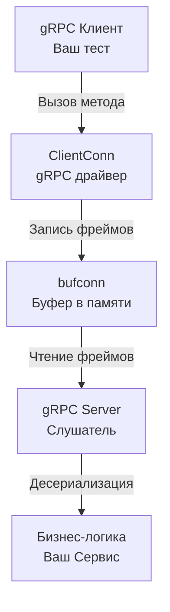

## Бинарный мир: Другие правила игры

В предыдущей статье [[4. Тестирование REST API]] мы собирали HTTP-роутер и проверяли обработку текстового JSON. Но в enterprise-системах, когда микросервисы общаются между собой, текстовые протоколы уступают место бинарным. Де-факто стандартом для внутреннего взаимодействия (Server-to-Server) в экосистеме Go является **gRPC** с сериализацией через Protocol Buffers (Protobuf).

Тестирование gRPC в корне отличается от тестирования REST. Вы не можете просто использовать `httptest.NewRecorder` и передать туда строку. 

> [!info] Под капотом: Жесткая связка с HTTP/2
> gRPC работает **строго** поверх HTTP/2. Протокол опирается на бинарные фреймы (DATA, HEADERS, RST_STREAM), мультиплексирование потоков поверх одного TCP-соединения и сложную систему управления потоком (Flow Control). 
> В Go сервер `grpc.Server` не реализует стандартный интерфейс `http.Handler` напрямую (хотя его можно завернуть через `grpcweb`, но это хак). Поэтому мы не можем просто вызвать функцию хэндлера в памяти. Нам **необходимо** поднять реальный gRPC-сервер и подключить к нему реальный gRPC-клиент.

Но значит ли это, что мы обречены на медленные сетевые тесты с открытием TCP-портов? Нет. В экосистеме gRPC есть элегантное решение для тестирования "в памяти".

## Иллюзия сети: пакет bufconn

Для тестирования gRPC без накладных расходов сетевого стека ОС (syscalls, маршрутизация, брандмауэры) используется пакет `google.golang.org/grpc/test/bufconn`.

`bufconn` предоставляет реализацию `net.Listener` и `net.Conn`, которые живут исключительно в оперативной памяти (User Space). Сервер думает, что он слушает сеть, а клиент думает, что он пишет в сокет, но на самом деле байты просто копируются между голами памяти.



### Идиоматичный сетап gRPC теста

Давайте напишем тестовую инфраструктуру для вымышленного сервиса `BillingService`. Мы вынесем создание `bufconn` слушателя и сервера в отдельный хелпер, чтобы переиспользовать его в табличных тестах.

```go
package grpcapi_test

import (
	"context"
	"net"
	"testing"

	"[github.com/stretchr/testify/require](https://github.com/stretchr/testify/require)"
	"go.uber.org/mock/gomock"
	"google.golang.org/grpc"
	"google.golang.org/grpc/credentials/insecure"
	"google.golang.org/grpc/test/bufconn"

	// Сгенерированные protobuf-файлы (pb)
	pb "yourproject/internal/generated/billing/v1"
	"yourproject/internal/grpcapi"
	"yourproject/internal/mocks"
)

// Константа размера буфера в памяти (1 Мегабайт обычно достаточно)
const bufSize = 1024 * 1024

// setupGRPCServer поднимает in-memory gRPC сервер и возвращает готовый клиент
func setupGRPCServer(t *testing.T) (pb.BillingServiceClient, *mocks.MockBillingService) {
	t.Helper()

	// 1. Инициализируем мок бизнес-логики
	ctrl := gomock.NewController(t)
	mockSvc := mocks.NewMockBillingService(ctrl)

	// 2. Создаем слушатель в памяти
	listener := bufconn.Listen(bufSize)

	// 3. Создаем и настраиваем gRPC сервер
	server := grpc.NewServer()
	
	// Инициализируем наш контроллер/обработчик и регистрируем его в сервере
	billingAPI := grpcapi.NewBillingAPI(mockSvc)
	pb.RegisterBillingServiceServer(server, billingAPI)

	// 4. Запускаем сервер в отдельной горутине
	go func() {
		// Serve заблокирует горутину, пока сервер не будет остановлен
		if err := server.Serve(listener); err != nil {
			// Игнорируем ошибку остановки сервера
			if err.Error() != "grpc: the server has been stopped" {
				panic("Ошибка запуска gRPC сервера: " + err.Error())
			}
		}
	}()

	// 5. Гарантируем корректную остановку сервера после теста
	t.Cleanup(func() {
		server.Stop()
	})

	// 6. Настраиваем клиента на подключение к нашему in-memory слушателю
	ctx := context.Background()
	dialer := func(context.Context, string) (net.Conn, error) {
		return listener.Dial() // Выдаем соединение из буфера!
	}

	conn, err := grpc.DialContext(ctx, "bufnet",
		grpc.WithContextDialer(dialer),
		grpc.WithTransportCredentials(insecure.NewCredentials()),
	)
	require.NoError(t, err)

	t.Cleanup(func() {
		conn.Close()
	})

	// Возвращаем сгенерированного клиента
	client := pb.NewBillingServiceClient(conn)
	
	return client, mockSvc
}
```

## Тестирование RPC вызовов

Теперь, когда у нас есть идеально изолированная среда, мы можем писать тесты, обращаясь к серверу так, как это делал бы реальный клиент из другого микросервиса.

```go
func TestBillingAPI_ProcessPayment(t *testing.T) {
	t.Parallel()

	// Arrange
	client, mockSvc := setupGRPCServer(t)
	ctx := context.Background()

	req := &pb.ProcessPaymentRequest{
		UserId: "user_123",
		Amount: 500.0,
	}

	// Настраиваем ожидания мока: наш API должен вызвать бизнес-логику
	mockSvc.EXPECT().
		Process(gomock.Any(), "user_123", 500.0).
		Return("tx_999", nil)

	// Act: Вызываем метод через gRPC КЛИЕНТА
	resp, err := client.ProcessPayment(ctx, req)

	// Assert
	require.NoError(t, err)
	require.NotNil(t, resp)
	require.Equal(t, "tx_999", resp.TransactionId)
}
```

## Трансляция ошибок (Error Translation)

Одна из главных задач gRPC-слоя (как и HTTP-контроллеров) — правильная конвертация ошибок бизнес-логики в понятные клиенту коды. В gRPC нет статусов `404` или `500`. Там используется пакет `google.golang.org/grpc/codes` и `google.golang.org/grpc/status`.

> [!warning] Ловушка / Gotcha: Сравнение ошибок в тестах
> Если ваш хэндлер возвращает ошибку `status.Error(codes.NotFound, "user not found")`, вы не можете просто сравнить её в клиенте через `errors.Is`. gRPC сериализует ошибку и десериализует её на клиенте, поэтому указатели на ошибки будут разными.
> Для проверки ошибок в тестах **обязательно** нужно использовать пакет `status`.

Пример теста негативного сценария:

```go
func TestBillingAPI_ProcessPayment_InsufficientFunds(t *testing.T) {
	t.Parallel()

	client, mockSvc := setupGRPCServer(t)
	ctx := context.Background()

	// Имитируем доменную ошибку от сервиса
	mockSvc.EXPECT().
		Process(gomock.Any(), "user_123", 50000.0).
		Return("", grpcapi.ErrInsufficientFunds)

	req := &pb.ProcessPaymentRequest{UserId: "user_123", Amount: 50000.0}

	// Act
	_, err := client.ProcessPayment(ctx, req)

	// Assert
	require.Error(t, err)

	// Идиоматичная проверка gRPC статуса
	st, ok := status.FromError(err)
	require.True(t, ok, "Ожидалась gRPC ошибка")
	
	// Проверяем, что слой API правильно отмаппил доменную ошибку на gRPC код FailedPrecondition
	require.Equal(t, codes.FailedPrecondition, st.Code())
	require.Equal(t, "insufficient funds", st.Message())
}
```

## Тестирование Interceptors (Перехватчиков)

В gRPC нет мидлварей, но есть **Interceptors** (Перехватчики). Они бывают двух видов: `Unary` (для одиночных запросов) и `Stream` (для потоковых).

Так же, как и в статье про [[3. Middleware тестирование]], interceptors отвечают за авторизацию, логирование и трейсинг. Тестировать их можно двумя путями:
1. **Легковесный путь:** Вызывать функцию перехватчика напрямую, передав ей мок-функцию `grpc.UnaryHandler`, которая имитирует вызов следующего шага.
2. **Интеграционный путь:** Добавить ваш interceptor при создании сервера в `setupGRPCServer` через `grpc.UnaryInterceptor(myInterceptor)`, и проверять поведение через клиента (например, передавая токен в метаданных).

> [!tip] Собеседование
> **Вопрос:** Как клиент может передать токен авторизации в gRPC тесте, ведь заголовка `Authorization` там нет?
> **Ответ:** В gRPC HTTP-заголовки абстрагированы концепцией **Metadata**. Чтобы передать данные, клиент в тесте должен прикрепить метаданные к контексту:
> ```go
> md := metadata.Pairs("authorization", "Bearer my-secret-token")
> ctx = metadata.NewOutgoingContext(ctx, md)
> resp, err := client.ProcessPayment(ctx, req)
> ```
> Серверный interceptor извлечет этот токен через `metadata.FromIncomingContext(ctx)`.

## Тестирование Streaming RPC

Если ваш метод использует потоки (Streams), например `rpc DownloadLogs(Request) returns (stream Chunk)`, тестирование через `bufconn` работает безупречно. 
Ваш тест просто вызывает метод клиента, получает интерфейс `StreamClient` и в цикле `for` вызывает `stream.Recv()`, пока не получит ошибку `io.EOF` (конец потока). Никаких дополнительных моков для TCP не нужно — HTTP/2 мультиплексирование прозрачно отработает в оперативной памяти.

## Итог

1. **Забудьте про `httptest` для gRPC.** Протоколы принципиально отличаются на уровне транспорта и сериализации.
2. Используйте **`bufconn`** для поднятия молниеносно быстрых in-memory gRPC серверов, которые пропускают сетевой I/O, но полностью тестируют протокол.
3. Проверяйте ошибки исключительно через пакет **`status`**, так как gRPC маскирует оригинальные ошибки при передаче по сети.

Мы научились тестировать строгие контракты (Protobuf). Но в мире публичных API балом до сих пор правит гибкий и коварный JSON. Как гарантировать, что ваш сервис не сломается от отсутствующего поля или неправильного типа в динамическом JSON-объекте? Об этом мы поговорим в следующей статье: [[6. Проверка JSON структур]].