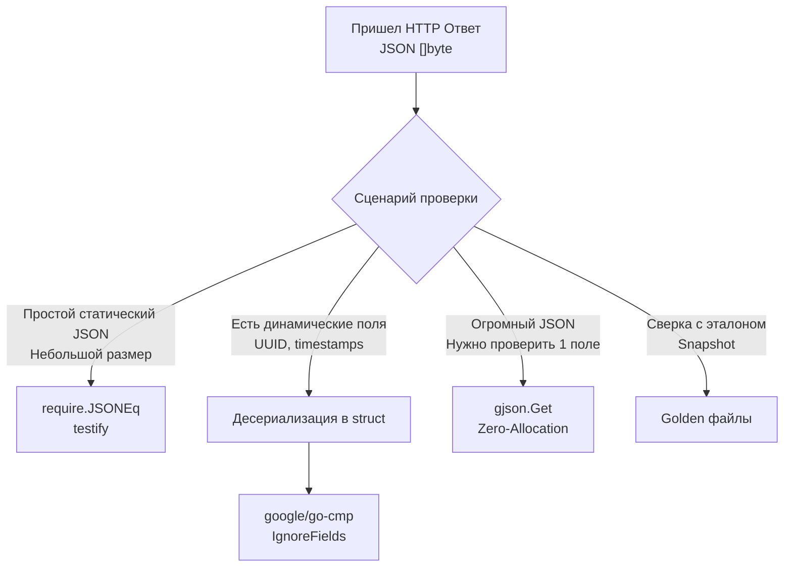

## Иллюзия детерминизма: Почему JSON сложно тестировать

В статье [[2. Тестирование handler функций]] мы вскользь упомянули функцию `require.JSONEq`, которая решает проблему сравнения HTTP-ответов. Пришло время разобрать работу с JSON-контрактами "под микроскопом".

В языках с динамической типизацией (Python, JS) JSON — это просто нативный словарь или объект. В Go, строгом и статически типизированном языке, JSON — это массив байт (`[]byte`), который пересекает границу вашей программы через рефлексию (`reflect`).

Главная проблема тестирования JSON кроется в его спецификации:
1. **Пробельные символы (Whitespaces):** `{"id": 1}` и `{\n  "id": 1\n}` — это эквивалентные JSON, но абсолютно разные строки.
2. **Порядок ключей:** Спецификация JSON не гарантирует порядок следования ключей в объекте. Более того, при сериализации `map[string]any` в Go, рантайм **намеренно рандомизирует** порядок обхода ключей (чтобы разработчики не закладывались на него). 

Попытка использовать классическое `require.Equal(t, expectedString, actualBody)` — это классическая ловушка, которая приведет к [[6. Flaky тесты и их причины]]. Ваш тест будет падать в CI раз из десяти просто из-за того, что Go по-другому отсортировал ключи мапы при сериализации.

## Базовый уровень: require.JSONEq и его цена

Самый быстрый способ сравнить два JSON — использовать `require.JSONEq` из пакета `testify`.

```go
expected := `{"name": "Gopher", "role": "admin"}`
actual := rec.Body.String()

// Игнорирует пробелы, переносы строк и порядок ключей
require.JSONEq(t, expected, actual)
```

> [!info] Под капотом: Mechanical Sympathy
> Как именно `JSONEq` понимает, что структуры равны? 
> Под капотом пакет `testify` выполняет `json.Unmarshal` обеих строк в пустой интерфейс: `var expectedObj, actualObj any`. 
> 
> Когда `encoding/json` видит `any` (или `interface{}`), он не знает структуру заранее. Поэтому для каждого JSON-объекта он аллоцирует в куче (Heap) структуру `map[string]any`, а для каждого массива — `[]any`. Затем `testify` использует `reflect.DeepEqual` для рекурсивного обхода и сравнения этих мап.
> 
> **Цена:** Это колоссальный оверхед по памяти и процессору. Если ваш API возвращает тяжелый JSON на 5 Мегабайт (например, выгрузка аналитики), вызов `JSONEq` заставит Garbage Collector "вспотеть", аллоцируя десятки тысяч строк и мап в куче. Для больших ответов этот подход неприемлем.

## Проблема динамических полей (Timestamps & UUIDs)

`JSONEq` отлично работает для статических ответов. Но в реальности API почти всегда возвращает динамические данные: сгенерированные базой данных ID, даты создания (`created_at`), или токены.

```json
{
  "id": "123e4567-e89b-12d3-a456-426614174000",
  "name": "Gopher",
  "created_at": "2026-04-27T14:11:05Z"
}
```

Вы не можете захардкодить `id` и `created_at` в вашем `expected` JSON, потому что они меняются при каждом запуске теста.

### Антипаттерн: Мутация актуального объекта
Часто разработчики пытаются десериализовать ответ, "занулить" динамические поля, сериализовать обратно и сравнить:

```go
// НЕ ИДИОМАТИЧНО И ОПАСНО
var actual map[string]any
_ = json.Unmarshal(body, &actual)
actual["id"] = "IGNORE"
actual["created_at"] = "IGNORE"
// ... дальше конвертация обратно в JSON и сравнение
```
Это ломает типизацию и превращает тест в нечитаемое месиво из работы с мапами.

### Идиоматичный подход: google/go-cmp

Стандартом де-факто для сложного сравнения структур в Go является библиотека `github.com/google/go-cmp/cmp`. Она позволяет элегантно сравнивать десериализованные структуры, игнорируя конкретные поля.

```go
package api_test

import (
	"encoding/json"
	"testing"
	"time"

	"[github.com/google/go-cmp/cmp](https://github.com/google/go-cmp/cmp)"
	"[github.com/google/go-cmp/cmp/cmpopts](https://github.com/google/go-cmp/cmp/cmpopts)"
	"[github.com/stretchr/testify/require](https://github.com/stretchr/testify/require)"
)

// Описываем контракт ответа
type UserResponse struct {
	ID        string    `json:"id"`
	Name      string    `json:"name"`
	CreatedAt time.Time `json:"created_at"`
}

func TestAPI_CreateUser_DeepCompare(t *testing.T) {
	// ... выполнение запроса ...
	actualBody := []byte(`{"id": "uuid-123", "name": "Gopher", "created_at": "2026-04-27T10:00:00Z"}`)

	var actual UserResponse
	err := json.Unmarshal(actualBody, &actual)
	require.NoError(t, err)

	// Ожидаемый результат (оставляем динамические поля пустыми)
	expected := UserResponse{
		Name: "Gopher",
	}

	// Сравниваем структуры, игнорируя поля ID и CreatedAt
	diff := cmp.Diff(expected, actual, cmpopts.IgnoreFields(UserResponse{}, "ID", "CreatedAt"))
	if diff != "" {
		// Diff вернет красивую разницу (-want +got)
		t.Fatalf("Ответ API не совпадает (-want +got):\n%s", diff)
	}

	// Отдельно валидируем динамические поля (что они не пустые)
	require.NotEmpty(t, actual.ID, "ID должен быть сгенерирован")
	require.False(t, actual.CreatedAt.IsZero(), "CreatedAt должен быть установлен")
}
```

Этот подход не только решает проблему изменяемых данных, но и **документирует контракт**. Любой разработчик, читающий тест, сразу видит структуру `UserResponse` и понимает, из чего состоит ответ. Кроме того, десериализация в конкретную структуру (а не в `any`) в разы быстрее и требует меньше аллокаций.

## Частичная проверка JSON: gjson

Бывают ситуации, когда вам нужно протестировать огромный агрегированный JSON, но вас интересует только одно конкретное поле глубоко внутри иерархии. Описывать полную структуру Go-типами на 5 уровней вложенности только ради одного теста — это оверхед.

Для таких задач (особенно в E2E тестах) используют библиотеку `github.com/tidwall/gjson`. Она позволяет доставать значения из JSON с помощью синтаксиса, похожего на JSONPath.

> [!info] Под капотом: Zero-Allocation Parsing
> `gjson` невероятно быстр, потому что он **не десериализует** JSON в структуры Go. Он сканирует срез байт (`[]byte`) как текст, находит нужный ключ и возвращает указатель на этот фрагмент в оригинальном срезе (или примитивный тип). Это классический подход Zero-Allocation.

```go
func TestAPI_ComplexResponse(t *testing.T) {
	// ... выполнение запроса ...
	body := rec.Body.Bytes()

	// Проверяем, что в массиве items у первого элемента статус "active"
	status := gjson.GetBytes(body, "data.items.0.status")
	require.True(t, status.Exists(), "Поле status должно существовать")
	require.Equal(t, "active", status.String())

	// Можно извлекать массивы: сколько элементов вернулось?
	itemsCount := gjson.GetBytes(body, "data.items.#")
	require.Equal(t, int64(10), itemsCount.Int())
}
```

## Стратегия выбора инструмента



*Примечание: Если ваш API отдает сложный, ветвящийся ответ, который трудно описать кодом, стоит обратить внимание на механизм эталонного тестирования, который мы разбирали ранее: [[4. Golden tests]].*

> [!tip] Собеседование
> **Вопрос:** Мы используем кастомный тип для времени (например, `sql.NullTime` или свой тип с методом `UnmarshalJSON`). В тестах мы сравниваем структуры через `require.Equal`. Будет ли это работать?
> **Ответ:** Сравнение структур с временем в Go — известная ловушка. Структура `time.Time` внутри содержит указатель на локацию (timezone) и монотонные часы (monotonic clock). Если одно время создано через `time.Now()`, а другое распарсено из JSON (которое содержит только wall clock), `require.Equal` (и `reflect.DeepEqual`) вернет `false`, даже если визуально время совпадает до миллисекунды. 
> Используйте `go-cmp` с опцией `cmpopts.EquateApproxTime(time.Second)` или вызывайте метод `expectedTime.Equal(actualTime)` вручную.

## Итог

1. Никогда не сравнивайте JSON как сырые строки.
2. `require.JSONEq` хорош для базовых проверок, но страдает из-за оверхеда на рефлексию и несовместим с динамическими полями.
3. В production-коде (на уровне Senior) используйте **десериализацию в структуры** и сравнение через **`google/go-cmp`**. Это обеспечивает типобезопасность, высокую производительность и гибкость через игнорирование полей.
4. Для точечных проверок гигантских payload'ов применяйте **`gjson`**.

Мы научились проверять структурную и синтаксическую правильность JSON. Но API-контракт — это не только правильное расположение скобочек и типы данных. Это еще и бизнес-правила (например, возраст `> 18` или валидный формат email). В следующей статье мы углубимся в то, как элегантно тестировать эти бизнес-ограничения: [[7. Валидация ответов]].