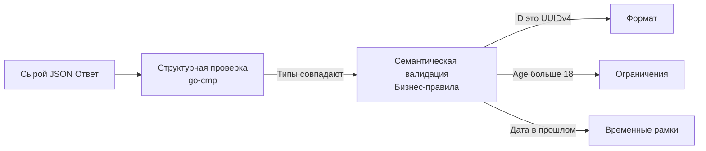

## За пределами синтаксиса: Семантика данных

В прошлой статье [[6. Проверка JSON структур]] мы разобрались, как избежать ложных падений тестов из-за изменения порядка ключей в JSON и как игнорировать динамические поля (такие как сгенерированные ID) с помощью `go-cmp`. 

Но структурного равенства недостаточно. Представьте, что ваш API регистрации пользователя возвращает: `{"id": "123", "age": 12, "status": "active"}`. С точки зрения структуры и типов — это идеальный JSON. С точки зрения бизнеса — это катастрофа, если по правилам сервиса пользователь должен быть старше 18 лет, а его ID должен быть валидным UUID v4, а не строкой `"123"`.

Интеграционные тесты API — это последняя линия обороны, где мы проверяем не только то, *как* данные сериализованы, но и *какой смысл* они несут. Это называется **Семантической валидацией (Semantic Validation)**.



## Уровни валидации ответов

В enterprise-разработке валидацию ответов в тестах принято делить на три уровня сложности.

### 1. Форматы и Регулярные выражения (Regex)

Динамические поля нельзя сравнить через `require.Equal()`, но их **формат** предсказуем. Если мы возвращаем ID сессии, мы должны гарантировать, что он соответствует криптографическим стандартам системы, а не является пустой строкой или предсказуемым числом.

> [!info] Под капотом: Mechanical Sympathy и Регулярки
> В Go компиляция регулярного выражения (`regexp.Compile`) — это очень тяжелая операция. Она строит сложный конечный автомат (State Machine) в памяти кучи. 
> Если вы будете вызывать `regexp.MustCompile` прямо внутри `for _, tc := range testCases` или внутри `t.Run`, ваш тест будет бесполезно сжигать процессорное время и генерировать мусор (Garbage) на каждый чих.
> Регулярки для тестов всегда объявляются на уровне пакета как глобальные переменные.

```go
package api_test

import (
	"regexp"
	"testing"
	"[github.com/stretchr/testify/require](https://github.com/stretchr/testify/require)"
)

// Компилируем 1 раз при старте тестов пакета
var (
	uuidRegex  = regexp.MustCompile(`^[0-9a-f]{8}-[0-9a-f]{4}-4[0-9a-f]{3}-[89ab][0-9a-f]{3}-[0-9a-f]{12}$`)
	emailRegex = regexp.MustCompile(`^[a-z0-9._%+\-]+@[a-z0-9.\-]+\.[a-z]{2,4}$`)
)

func assertValidResponseFormat(t *testing.T, resp UserResponse) {
	t.Helper()
	
	// Проверяем не конкретное значение, а строгий формат
	require.Regexp(t, uuidRegex, resp.ID, "ID должен быть валидным UUID v4")
	require.Regexp(t, emailRegex, resp.Email, "Неверный формат email в ответе")
}
```

### 2. Бизнес-ограничения (Domain Constraints)

Ваш API должен отражать доменную модель. Если API возвращает список транзакций с пагинацией, вы должны проверить, что они отсортированы по убыванию даты (DESC). Если возвращается банковский баланс, он не должен иметь больше двух знаков после запятой (Floating-point precision).

Вместо того чтобы писать сотни `if` в каждом тесте, идиоматично создавать кастомные функции-ассерты:

```go
func assertSortedByDateDesc(t *testing.T, items []Transaction) {
	t.Helper()
	for i := 1; i < len(items); i++ {
		prev := items[i-1].CreatedAt
		curr := items[i].CreatedAt
		
		// prev должно быть больше или равно curr (сортировка по убыванию)
		require.Truef(t, prev.After(curr) || prev.Equal(curr), 
			"Нарушена сортировка. Элемент %d старше элемента %d", i-1, i)
	}
}

func assertValidAgeRule(t *testing.T, resp UserResponse) {
	t.Helper()
	require.GreaterOrEqual(t, resp.Age, 18, "API вернуло несовершеннолетнего пользователя")
	require.Less(t, resp.Age, 120, "Аномальный возраст в ответе")
}
```

> [!tip] Собеседование
> **Вопрос:** Мы используем библиотеку `go-playground/validator` (с тегами `validate:"required,email"`) в DTO-структурах запросов на стороне сервера. Можем ли мы использовать эту же библиотеку в тестах для валидации *ответов*?
> **Ответ:** Можем, но концептуально это плохая идея. Серверные DTO и тестовые структуры (представляющие ответ для клиента) должны быть развязаны. Если кто-то случайно удалит тег валидации в серверном коде, тест, переиспользующий эту же структуру, тоже перестанет валидировать это поле, и баг уйдет в Production. В тестах надежнее использовать явные `require` проверки или отдельные структуры.

### 3. Валидация Времени (Time Validation)

Это самая коварная часть тестирования ответов API. Время в распределенных системах никогда не бывает точным.

> [!warning] Ловушка / Gotcha: Проблема Now()
> Если вы создаете пользователя и проверяете его `created_at` так:
> `require.Equal(t, time.Now(), resp.CreatedAt)` — тест всегда будет падать. Между моментом генерации времени в базе данных (или в вашем коде) и моментом, когда `json.Unmarshal` распарсит ответ в тесте, пройдут микросекунды или миллисекунды.

Правильный подход — валидация через "Окно допустимости" (Time Delta / Tolerance).

```go
func assertRecentTime(t *testing.T, actual time.Time) {
	t.Helper()
	
	now := time.Now().UTC() // Всегда работаем в UTC!
	
	// Проверяем, что время не из будущего (с запасом в 1 секунду на рассинхрон часов)
	require.True(t, actual.Before(now.Add(time.Second)), "Время создания в будущем!")
	
	// Проверяем, что время свежее (не старше 5 секунд с момента запуска теста)
	require.WithinDuration(t, now, actual, 5*time.Second, "Время слишком старое")
}
```

## Динамическая валидация JSON Schema

Если ваш API возвращает гигантские и сильно ветвящиеся структуры (например, конфигурацию дашборда), писать ассерты на каждое поле становится нерентабельно. В этом случае мы переходим к декларативной валидации через **JSON Schema**.

JSON Schema — это стандарт (IETF), который описывает формат JSON-данных: какие поля обязательны, какие типы у свойств, минимальные/максимальные значения и паттерны строк.

В экосистеме Go популярна библиотека `github.com/xeipuuv/gojsonschema` (или более современная `github.com/santhosh-tekuri/jsonschema/v5`).

```go
package api_test

import (
	"testing"
	"[github.com/santhosh-tekuri/jsonschema/v5](https://github.com/santhosh-tekuri/jsonschema/v5)"
	"[github.com/stretchr/testify/require](https://github.com/stretchr/testify/require)"
)

// Компилируем схему один раз
var userResponseSchema = jsonschema.MustCompileString("schema.json", `{
  "type": "object",
  "required": ["id", "email", "status"],
  "properties": {
    "id": { "type": "string", "pattern": "^[0-9a-fA-F-]{36}$" },
    "email": { "type": "string", "format": "email" },
    "status": { "enum": ["active", "pending", "banned"] },
    "age": { "type": "integer", "minimum": 18 }
  }
}`)

func TestAPI_CreateUser_SchemaValidation(t *testing.T) {
	// ... делаем HTTP запрос, получаем bodyBytes ([]byte) ...
	bodyBytes := []byte(`{"id": "invalid-id", "email": "bad", "status": "unknown"}`)

	// Парсим ответ в пустой интерфейс для валидатора
	var v any
	err := json.Unmarshal(bodyBytes, &v)
	require.NoError(t, err)

	// Валидируем!
	err = userResponseSchema.Validate(v)
	
	// Тест упадет с подробным описанием:
	// - id does not match pattern
	// - email is not a valid email
	// - status must be one of [active, pending, banned]
	require.NoError(t, err, "Ответ API нарушает JSON Schema")
}
```

## Итог

1. **Не доверяйте только структуре.** `go-cmp` проверит типы, но пропустит логические дыры в контракте.
2. **Пишите доменные ассерты.** Создавайте вспомогательные функции (helpers) для валидации диапазонов, сортировок и бизнес-логики.
3. **Осторожно со временем.** Всегда используйте `require.WithinDuration` вместо строгого равенства и работайте исключительно в UTC.
4. **Используйте JSON Schema** для гигантских и ветвящихся ответов, где ручная валидация каждого поля превращается в спагетти-код.

Мы научились досконально проверять ответы нашего сервера. Но есть архитектурная проблема: как фронтенд-команда (или другой микросервис) узнает об этих правилах? Если мы поменяем JSON Schema в наших тестах, мобильное приложение этого не заметит и упадет в Production. 

Нам нужен механизм, который жестко связывает код, документацию и потребителей API. О том, как разорвать порочный круг "устаревшего Swagger-а" и гарантировать надежность интеграций, мы поговорим в финальной статье этого раздела: [[8. API contract testing]].