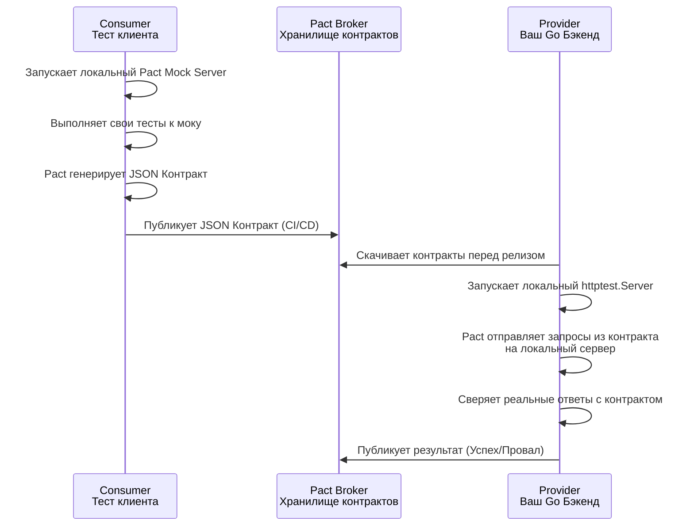

## Рассинхронизация реальностей: Проблема интеграционных тестов

В предыдущих статьях мы написали идеальные тесты для нашего API. Мы проверили роутер ([[4. Тестирование REST API]]), замокали внешние зависимости ([[10. Wiremock и HTTP mocking]]) и даже внедрили строгую проверку бизнес-логики в JSON ([[7. Валидация ответов]]).

Наши пайплайны зеленые. Мы деплоим код в Production... и мобильное приложение падает с ошибкой парсинга, а соседний микросервис начинает сыпать HTTP 500.

Добро пожаловать в **Парадокс интеграционного тестирования**. Ваши интеграционные тесты проверяют, что ваш код работает так, *как вы его написали*. Но они не гарантируют, что он работает так, *как от него ожидают потребители* (Consumers). Если вы переименуете поле `userId` в `account_id`, ваши тесты пройдут (вы ведь обновили и хэндлер, и тест), но интеграция сломается.

Чтобы решить эту проблему без поднятия гигантских, медленных и нестабильных E2E-окружений (где поднимаются сразу 50 микросервисов), индустрия выработала два подхода: **Schema Validation** (Provider-Driven) и **Contract Testing** (Consumer-Driven).

---

## 1. OpenAPI / Swagger Validation (Provider-Driven)

В большинстве современных проектов на Go (и других языках) контракт API описывается спецификацией OpenAPI (Swagger). Это файл `openapi.yaml`, который является единым источником истины.

Но спецификация имеет свойство "протухать" (Docs Rot). Разработчик добавил новое поле в структуру ответа, но забыл обновить YAML. 

Чтобы этого избежать, мы можем интегрировать валидацию OpenAPI прямо в наши интеграционные тесты с помощью пакета `github.com/getkin/kin-openapi`.

> [!info] Под капотом
> `kin-openapi` парсит ваш YAML-файл в дерево структур в памяти. При валидации он берет `http.Request` и `http.Response` (например, из `httptest.ResponseRecorder`) и сверяет их с деревом спецификации: проверяет типы данных, обязательные поля (`required`), паттерны и `enum`. Это работает невероятно быстро, так как вся сверка происходит в RAM без сетевых вызовов, защищая вас от ситуации "код не соответствует доке".

```go
package api_test

import (
	"context"
	"net/http"
	"net/http/httptest"
	"testing"

	"[github.com/getkin/kin-openapi/openapi3](https://github.com/getkin/kin-openapi/openapi3)"
	"[github.com/getkin/kin-openapi/openapi3filter](https://github.com/getkin/kin-openapi/openapi3filter)"
	"[github.com/getkin/kin-openapi/routers/gorillamux](https://github.com/getkin/kin-openapi/routers/gorillamux)"
	"[github.com/stretchr/testify/require](https://github.com/stretchr/testify/require)"
	"yourproject/internal/api"
)

func TestAPI_MatchesOpenAPI(t *testing.T) {
	// 1. Загружаем нашу спецификацию
	loader := openapi3.NewLoader()
	doc, err := loader.LoadFromFile("../../api/openapi.yaml")
	require.NoError(t, err)
	err = doc.Validate(context.Background())
	require.NoError(t, err)

	// Инициализируем роутер для kin-openapi
	router, err := gorillamux.NewRouter(doc)
	require.NoError(t, err)

	// 2. Инициализируем наш реальный хэндлер
	mux := http.NewServeMux()
	usersAPI := api.NewUsersAPI(nil) // Моки для бизнес-логики
	usersAPI.RegisterRoutes(mux)

	// 3. Выполняем тестовый запрос
	req := httptest.NewRequest(http.MethodGet, "/v1/users/42", nil)
	rec := httptest.NewRecorder()
	mux.ServeHTTP(rec, req)

	require.Equal(t, http.StatusOK, rec.Code)

	// 4. ВАЛИДАЦИЯ КОНТРАКТА!
	// Находим маршрут в спецификации
	route, pathParams, err := router.FindRoute(req)
	require.NoError(t, err)

	// Валидируем запрос (Query, Path, Body)
	requestValidationInput := &openapi3filter.RequestValidationInput{
		Request:    req,
		PathParams: pathParams,
		Route:      route,
	}
	err = openapi3filter.ValidateRequest(context.Background(), requestValidationInput)
	require.NoError(t, err, "Запрос не соответствует OpenAPI")

	// Валидируем ответ
	responseValidationInput := &openapi3filter.ResponseValidationInput{
		RequestValidationInput: requestValidationInput,
		Status:                 rec.Code,
		Header:                 rec.Header(),
		Body:                   rec.Body,
	}
	err = openapi3filter.ValidateResponse(context.Background(), responseValidationInput)
	require.NoError(t, err, "Ответ API нарушает спецификацию OpenAPI")
}
```

Этот подход гарантирует, что Провайдер (ваш сервер) не нарушает собственную документацию. Но он не гарантирует, что Консьюмер (клиент) использует актуальную версию этой документации.

---

## 2. Consumer-Driven Contract Testing (Pact)

Чтобы полностью исключить проблему рассинхронизации, мышление нужно перевернуть. В архитектуре **Consumer-Driven Contract Testing (CDCT)** потребитель (мобильное приложение или другой микросервис) диктует правила.

Потребитель пишет тест, в котором говорит: *"Мне от сервиса Users нужен эндпоинт `GET /users/42`, который вернет JSON с полем `name` типа `string`"*.
Этот запрос и ожидаемый ответ записываются в JSON-файл (Контракт / Pact). Затем этот файл передается Провайдеру (вашему Go-бэкенду), и Провайдер обязан прогнать этот контракт против своего кода.

Стандарт индустрии для этого — фреймворк **Pact** (в Go используется пакет `github.com/pact-foundation/pact-go/v3`).



### Mechanical Sympathy: Почему Pact лучше E2E

В классическом E2E-тесте вы поднимаете Консьюмер и Провайдер в Docker-контейнерах и гоняете реальный TCP-трафик между ними. Это медленно, подвержено сетевым задержкам и обрывам (flaky).

Pact работает иначе:
1. **На стороне клиента** он поднимает легковесный мок-сервер. Клиент общается с ним через `localhost`. Сеть почти не задействована. Оверхед минимален.
2. **На стороне сервера** (в Go) Pact поднимается как фоновый процесс (Rust core). Он читает JSON-файл и делает локальные HTTP-вызовы к вашему `httptest.Server`. 
Таким образом, интеграция двух микросервисов тестируется абсолютно детерминированно, в отрыве друг от друга, асинхронно по времени (в разных CI пайплайнах), но с 100% математической гарантией совместимости.

### Реализация Провайдера в Go

Предположим, клиент уже опубликовал контракт. Мы пишем тест Провайдера, который обязан подтвердить, что наш Go-код соответствует ожиданиям клиента.

```go
package contract_test

import (
	"fmt"
	"net/http"
	"net/http/httptest"
	"testing"

	"[github.com/pact-foundation/pact-go/v3](https://github.com/pact-foundation/pact-go/v3)"
	"[github.com/stretchr/testify/require](https://github.com/stretchr/testify/require)"
	"yourproject/internal/api"
)

func TestProvider_PactVerification(t *testing.T) {
	// 1. Запускаем наш API в памяти
	mux := http.NewServeMux()
	usersAPI := api.NewUsersAPI(nil) // Используем моки бизнес-логики!
	usersAPI.RegisterRoutes(mux)

	server := httptest.NewServer(mux)
	defer server.Close()

	// 2. Инициализируем Pact Verifier
	verifier := pact.NewVerifier()

	// 3. Настраиваем верификацию
	// Pact скачает контракты и отправит запросы на наш server.URL
	err := verifier.VerifyProvider(t, pact.VerifyRequest{
		ProviderBaseURL: server.URL,
		Provider:        "UserService",
		// URL к Pact Broker (обычно берется из env в CI)
		BrokerURL:       "[https://your-company.pactflow.io](https://your-company.pactflow.io)",
		// StateHandlers - это магия Pact. 
		// Клиент в контракте пишет: "Given user 42 exists".
		// Мы перехватываем это состояние и настраиваем наши моки БД.
		StateHandlers: pact.StateHandlers{
			"user 42 exists": func(setup bool, state pact.ProviderStateV3) (pact.Map, error) {
				if setup {
					fmt.Println("Настраиваем мок БД: создаем пользователя 42")
					// Здесь мы бы инициализировали mockSvc.EXPECT().GetByID("42")
				}
				return nil, nil
			},
		},
	})

	require.NoError(t, err, "Контракт с клиентом нарушен!")
}
```

> [!warning] Ловушка / Gotcha: Бизнес-логика в контрактах
> Главная ошибка внедрения Contract Testing — пытаться тестировать через него бизнес-логику (например, проверять, что баланс уменьшился на 100 рублей). 
> Pact не заменяет функциональные тесты. Pact проверяет **только форму контракта**: существуют ли нужные эндпоинты, правильные ли типы полей передаются, и соблюдаются ли заголовки авторизации. Для верификации контракта на стороне Провайдера нужно мокировать слой БД (или сервиса), отдавая статические данные.

> [!tip] Собеседование
> **Вопрос:** Если мы используем gRPC (Protobuf), нужен ли нам Pact / Contract Testing?
> **Ответ:** Зависит от зрелости процессов. Технически, `.proto` файл — это строгий контракт. Если используется единый монорепозиторий (Monorepo) или BSR (Buf Schema Registry), сломать контракт сложно, так как компилятор не пропустит изменения. Однако, Protobuf не спасает от логического дрифта (например, если сервер начнет возвращать пустое поле, хотя клиент ожидает там данные, или изменит семантику `gRPC code`). В экосистеме Pact существует плагин `pact-protobuf` именно для таких семантических проверок, хотя в gRPC это требуется реже, чем в REST/JSON.

## Итог раздела

Мы завершили огромный блок, посвященный HTTP и API тестированию. Вы прошли путь от создания искусственных `httptest.ResponseRecorder` до тестирования сложных Middleware, валидации REST-роутеров, проверки In-Memory gRPC вызовов и, наконец, защиты архитектуры с помощью Contract Testing. 

Вы научились тестировать микросервис так, чтобы он был абсолютно устойчив и предсказуем в Production-среде. 

Но до сих пор мы жили в уютном, однопоточном мире, где запросы выполняются последовательно и предсказуемо. Go создавался не для этого. Go создавался для хардкорной, тысячепоточной конкурентности. И именно там кроются самые страшные баги: Data Races, Deadlocks и утечки горутин.

В следующем разделе мы спустимся в ад конкурентного программирования и научимся его тестировать. 
Переходим к: [[1. Тестирование конкурентного кода]].