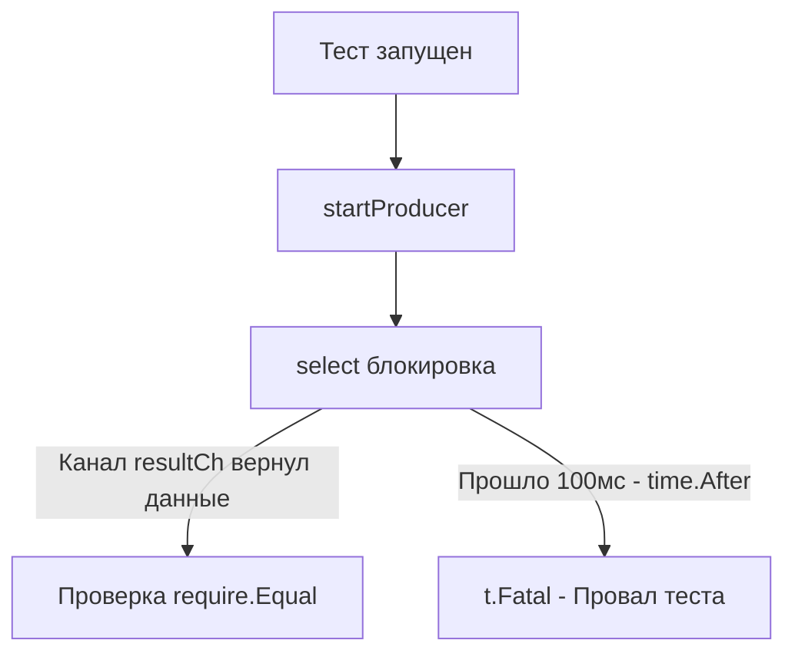

## Переход в нелинейный мир

Мы закончили тестирование синхронных HTTP-эндпоинтов и внешних API. Там всё было предсказуемо: мы отправили запрос, заблокировались в ожидании ответа, получили результат, написали `require.Equal`. Парадигма **Arrange-Act-Assert** (Подготовка-Действие-Проверка) работала безупречно.

Но как только в вашем бизнес-коде появляется ключевое слово `go` (запуск горутины), линейное время ломается. Ваш тест больше не контролирует поток выполнения. Если вы не умеете правильно тестировать конкурентный код, вы получите ложноположительные тесты (тест "зеленый", хотя логика сломана) и плавающие ошибки (flaky tests), которые будут сводить с ума вашу команду в CI/CD.

Тестирование конкурентности требует глубокого понимания того, как рантайм Go управляет горутинами, и строгой дисциплины при написании ассертов.

## Главная иллюзия: "Тест прошел успешно"

Самая частая ошибка Junior/Middle разработчиков при тестировании асинхронного кода — забыть о синхронизации на уровне самого теста.

Рассмотрим классический баг. У нас есть функция, которая асинхронно пишет в базу данных:

```go
func SaveAsync(data string) {
	go func() {
		// Имитация долгой работы
		time.Sleep(100 * time.Millisecond)
		panic("Упс! База данных упала") // Имитация критической ошибки
	}()
}
```

А вот как её "тестируют":

```go
func TestSaveAsync_Bad(t *testing.T) {
	SaveAsync("test data")
	// Тест мгновенно завершается со статусом PASS!
}
```

> [!info] Под капотом: Рантайм и тестирование
> Когда вы запускаете `go test`, бинарник тестов создает главную горутину для выполнения вашей тестовой функции (назовем её `G_test`). 
> Функция `SaveAsync` спавнит новую горутину (`G_worker`). Планировщик Go помещает `G_worker` в локальную очередь выполнения (Local Run Queue) текущего процессора (`P`). 
> Но `G_test` не ждет завершения `G_worker`. Она доходит до конца функции `TestSaveAsync_Bad` и рапортует об успехе. К моменту, когда планировщик решит выделить квант времени для `G_worker` (и тот запаникует), сам тест уже давно завершен. 

Вы задеплоите этот код, и ваш Production будет падать, хотя Coverage показывает 100%, а тесты зеленые.

## Идиоматичная синхронизация в тестах

Тест обязан дождаться завершения всех порожденных им процессов (или дождаться конкретного результата), прежде чем делать Assert и завершаться.

Если бизнес-код не предоставляет механизма синхронизации (например, не возвращает канал или не принимает `*sync.WaitGroup`), **это проблема дизайна бизнес-кода**, а не теста. Код с неуправляемыми горутинами ("fire and forget") считается нетестируемым антипаттерном.

Правильный дизайн функции:
```go
// Функция возвращает канал, который закроется после завершения работы
func SaveAsyncWaitable(data string) <-chan error {
	errCh := make(chan error, 1)
	go func() {
		defer close(errCh)
		time.Sleep(10 * time.Millisecond)
		errCh <- errors.New("ошибка БД") // Имитация ошибки
	}()
	return errCh
}
```

Правильный тест:
```go
func TestSaveAsync_Good(t *testing.T) {
	errCh := SaveAsyncWaitable("test data")

	// Тест блокируется в ожидании результата из канала
	err := <-errCh
	
	require.Error(t, err)
	require.EqualError(t, err, "ошибка БД")
}
```

## Ловушка t.Fatal() внутри горутины

Это один из самых популярных вопросов на Senior-собеседованиях, на котором "сыпятся" многие кандидаты.

Представьте, что вы тестируете Worker Pool и пишете ассерты прямо внутри горутины, используя `t.Fatal` (или `require` из `testify`, который под капотом использует `t.FailNow`).

```go
func TestWorker_BadFatal(t *testing.T) {
	var wg sync.WaitGroup
	wg.Add(1)

	go func() {
		defer wg.Done()
		result := doWork()
		if result != "ok" {
			// КАТАСТРОФА: t.Fatal внутри дочерней горутины!
			t.Fatalf("Ожидали ok, получили %s", result) 
		}
	}()

	wg.Wait()
}
```

> [!warning] Ловушка / Gotcha: Смерть горутины, а не теста
> Использование `t.Fatal()` или `t.FailNow()` внутри отдельной горутины **строго запрещено**.
> Под капотом `t.FailNow()` вызывает `runtime.Goexit()`. Эта функция немедленно завершает **текущую** горутину (выполняя все её `defer`), но она **не завершает сам тест**.
> 
> В примере выше, если `result != "ok"`, сработает `t.Fatalf`. Дочерняя горутина умрет, но перед смертью выполнит `defer wg.Done()`. Главная горутина теста пройдет барьер `wg.Wait()`, увидит, что всё ок, и тест завершится... УСПЕШНО! (Хотя в логах вы увидите сообщение об ошибке, сам статус `go test` может быть `PASS` в некоторых версиях, или поведение будет непредсказуемым).

**Как правильно?**
Методы `t.Error()`, `t.Errorf()` и `t.Fail()` являются потокобезопасными (thread-safe). Внутри пакета `testing` их состояние защищено мьютексом. Вы можете использовать `t.Error` внутри горутин, чтобы зафиксировать провал теста, а затем через канал или `WaitGroup` дать сигнал главной горутине корректно завершиться. (Методы `assert.*` из testify используют `t.Errorf`, поэтому их использовать безопасно).

```go
func TestWorker_GoodAssert(t *testing.T) {
	var wg sync.WaitGroup
	wg.Add(1)

	go func() {
		defer wg.Done()
		result := doWork()
		// assert не прерывает выполнение (как t.Error), но помечает тест как Failed
		assert.Equal(t, "ok", result) 
	}()

	wg.Wait()
	// Если assert внутри горутины провалился, тест упадет здесь.
}
```

## Тестирование с таймаутами (Deadlock Prevention)

При тестировании конкурентного кода вы обязательно столкнетесь с ситуацией, когда дочерняя горутина зависла (Deadlock) или канал никогда не получит сообщение. 

Если вы напишете `<-ch`, а в канал никто ничего не запишет, ваш тест зависнет навсегда (точнее, до дефолтного таймаута `go test` в 10 минут). Для быстрого CI это неприемлемо. Любое ожидание в конкурентных тестах должно быть ограничено таймаутом.

### Паттерн: select + time.After

Идиоматичный способ ограничить ожидание в тесте — использование конструкции `select`.

```go
func TestProducer(t *testing.T) {
	resultCh := startProducer()

	select {
	case res := <-resultCh:
		require.Equal(t, "success", res)
	case <-time.After(100 * time.Millisecond): // Жесткий таймаут для теста
		t.Fatal("Таймаут: продюсер не вернул результат за 100мс")
	}
}
```



> [!tip] Собеседование
> **Вопрос:** Мы используем `time.After(1 * time.Second)` в цикле `select` внутри долгоживущего worker'а, который обрабатывает тысячи сообщений. Чем это грозит?
> **Ответ:** Утечкой памяти (Memory Leak). Функция `time.After` создает новый таймер под капотом. Этот таймер не будет собран Garbage Collector'ом, пока не истечет время, даже если вы вышли из `select` по другой ветке. В высоконагруженном коде нужно использовать `timer := time.NewTimer(...)` и явно вызывать `timer.Stop()`. 
> Однако, **в рамках тестирования** (когда тест длится доли секунды), использование `time.After` абсолютно безопасно и идиоматично.

## Контролируемый детерминизм (Controlled Determinism)

Природа конкурентности — недетерминированность. Горутины могут выполняться в любом порядке. Если ваш тест зависит от того, что горутина А выполнится строго раньше горутины Б, это плохой код (или плохой тест).

Но иногда нам нужно протестировать логику, где порядок важен. В таких случаях мы используем искусственные точки синхронизации — **каналы-сигналы**.

Представьте, что мы тестируем кэш, где первый запрос должен пойти в БД, а второй, конкурентный, должен заблокироваться и дождаться результата первого (Паттерн Singleflight).

```go
func TestSingleflight_Cache(t *testing.T) {
	cache := NewCache()
	
	// Каналы для синхронизации шагов теста
	dbCallStarted := make(chan struct{})
	releaseDBCall := make(chan struct{})
	
	// Мокаем БД так, чтобы контролировать её из теста
	cache.SetDBFunc(func(key string) string {
		close(dbCallStarted) // Сигнализируем тесту, что пошли в БД
		<-releaseDBCall      // Блокируем горутину, пока тест не разрешит продолжить
		return "data from DB"
	})

	// Запускаем первого клиента
	go cache.Get("key1")

	// Тест ждет, пока первый клиент не дойдет до "базы"
	<-dbCallStarted

	// Запускаем второго клиента (он должен упереться в мьютекс кэша / singleflight)
	var wg sync.WaitGroup
	wg.Add(1)
	var secondResult string
	
	go func() {
		defer wg.Done()
		secondResult = cache.Get("key1") // Этот вызов не должен дойти до БД
	}()

	// Даем зеленый свет первому клиенту завершить поход в БД
	close(releaseDBCall)

	wg.Wait()
	require.Equal(t, "data from DB", secondResult)
}
```

Этот подход убирает "магические" `time.Sleep(10 * time.Millisecond)` из тестов. Слипы (sleeps) в тестах — это зло. На медленном CI слипа может не хватить, и тест упадет. Сигнальные каналы гарантируют 100% детерминизм на любом железе.

## Итог

1.  **Никаких Fire-and-Forget**: Тест всегда должен дожидаться завершения фоновых процессов, которые он породил.
2.  **Потокобезопасность `t.T`**: Использовать `t.Error` и `assert` в дочерних горутинах можно, но `t.Fatal` или `require` вызовут `runtime.Goexit()`, тихо убив горутину и исказив результаты теста.
3.  **Таймауты**: Все ожидания конкурентных событий (чтение из канала, ожидание WG) оборачивайте в `select` с `time.After`, чтобы не повесить CI.
4.  **Детерминизм**: Избегайте `time.Sleep` для синхронизации горутин в тестах. Используйте каналы-сигналы (`chan struct{}`).

Мы научились вручную синхронизировать горутины в тестах и избегать базовых логических ошибок. Но язык Go имеет встроенный, крайне мощный инструмент на уровне компилятора, который позволяет находить скрытые ошибки доступа к памяти при конкурентной работе — ошибки, которые невозможно поймать обычным assert-ом. Об этом инструменте и о том, как он работает на уровне памяти, мы поговорим в следующей статье: [[2. Data race и race detector]].