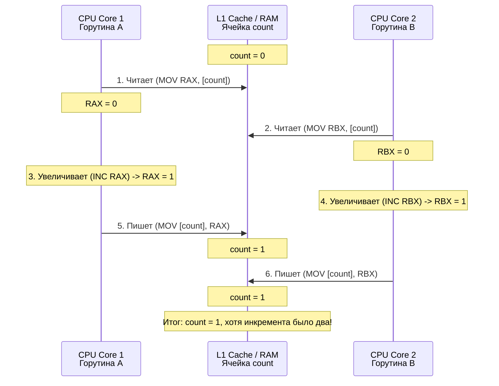

## Иллюзия атомарности

В предыдущей статье [[1. Тестирование конкурентного кода]] мы научились управлять жизненным циклом горутин в тестах с помощью каналов и таймеров. Но правильная оркестрация горутин не спасает от главной проблемы многопоточности — совместного доступа к разделяемому состоянию (Shared State).

Самый страшный, трудноуловимый и разрушительный баг в конкурентном программировании — это **Data Race (Состояние гонки по данным)**. Он может годами прятаться в Production, проявляясь раз в месяц под специфической нагрузкой, приводя к повреждению данных или внезапным паникам (`panic`), которые невозможно воспроизвести локально.

В этой статье мы разберем природу Data Race на уровне железа и памяти, а также познакомимся с главным инструментом Go-инженера для борьбы с этой аномалией.

## Что такое Data Race?

Формальное определение **Data Race** по спецификации Go Memory Model звучит так:
Состояние гонки возникает, когда выполняются три условия одновременно:
1. Две (или более) горутины обращаются к **одной и той же ячейке памяти**.
2. Хотя бы одно из этих обращений — это **запись** (write).
3. Между этими обращениями нет **явной синхронизации** (мьютексов, каналов или атомарных операций).

Если эти условия выполнены, порядок доступа становится недетерминированным. 

## Mechanical Sympathy: Взгляд со стороны железа

На собеседованиях часто дают простейший код и спрашивают: "Есть ли здесь гонка?"

```go
var count int

func main() {
    go func() { count++ }()
    go func() { count++ }()
    // Игнорируем ожидание горутин для упрощения примера
}
```

Чтобы понять, почему здесь возникает Data Race, мы должны перестать думать кодом Go и начать думать инструкциями процессора.

Операция `count++` кажется нам монолитной (атомарной). Но для CPU это три отдельные ассемблерные инструкции (Read-Modify-Write):
1. `MOV RAX, [count]` — Прочитать текущее значение из оперативной памяти (или кэша L1) в регистр процессора `RAX`.
2. `INC RAX` — Увеличить значение в регистре на 1.
3. `MOV [count], RAX` — Записать новое значение обратно в память.

Процессор (или планировщик ОС/Go) может прервать выполнение потока **между любыми из этих шагов**. 



> [!info] Под капотом: Кэши и Out-of-Order Execution
> В современных многоядерных архитектурах всё еще сложнее. Даже если инструкции не прервутся, каждое ядро (Core) имеет свой собственный кэш L1/L2. Когда Ядро 1 пишет значение переменной, оно пишет его в свой **Store Buffer**, а не напрямую в RAM. Ядро 2 может физически не видеть эти изменения десятки наносекунд, пока не отработает протокол когерентности кэшей (например, MESI). 
> Плюс ко всему, компилятор Go и сам процессор имеют право менять порядок инструкций (Instruction Reordering) для оптимизации пайплайна, если не видят явных барьеров памяти (Memory Barriers). Без мьютексов или атомиков рантайм Go не дает никаких гарантий того, что запишет одна горутина и что прочитает другая.

## Ловушка: "Безопасные" гонки и повреждение памяти

Среди разработчиков, приходящих из C++ или Java, бытует опасный миф: *"Если у меня есть метрика счетчика просмотров, и там возникнет Data Race — ну потеряю я пару инкрементов, ничего страшного. Зато без мьютекса работает быстрее"*. Это называется "Benign Data Race" (Безопасная гонка).

В Go **не существует безопасных Data Race**. Любая гонка ведет к Undefined Behavior (неопределенному поведению).

Особенно это критично из-за **Fat Pointers (Толстых указателей)**. В Go интерфейсы, слайсы и строки состоят из нескольких машинных слов. 
Например, интерфейс `any` (или `interface{}`) под капотом — это структура `eface`:
```go
type eface struct {
    _type *_type         // Указатель на метаданные типа (8 байт)
    data  unsafe.Pointer // Указатель на сами данные (8 байт)
}
```

Присвоение значения интерфейсу (запись 16 байт) на 64-битной архитектуре **не является атомарным**. Оно выполняется в две инструкции по 8 байт.
Если одна горутина пишет в интерфейс строку, а другая — число, третья горутина-читатель может прочитать интерфейс ровно посередине процесса записи. Она получит `_type` от строки, но `data` от числа! Когда рантайм попытается вызвать метод или сделать type assertion, произойдет чтение по мусорному адресу памяти, что приведет к фатальной ошибке `panic: runtime error: invalid memory address` и полному падению сервера, которое нельзя перехватить через `recover()`.

> [!tip] Собеседование
> **Вопрос:** Почему встроенная мапа `map` в Go паникует при конкурентной записи (`fatal error: concurrent map writes`), а слайсы (`slice`) — нет?
> **Ответ:** Авторы языка встроили в `hmap` (структуру мапы под капотом) простейший механизм обнаружения конкурентного доступа. В начале операций записи выставляется флаг `hashWriting`. Если при новой операции рантайм видит, что этот флаг уже стоит — он принудительно крашит программу. Это было сделано умышленно, так как повреждение внутреннего дерева мапы (bucket links) приводит к зависаниям в бесконечных циклах и утечкам памяти. Слайсы же просто тихо повреждают данные (теряют элементы при `append` или читают мусор).

## Инструмент спасения: go test -race

Так как Data Race практически невозможно поймать глазами на Code Review или выявить обычными Unit-тестами (они могут годами проходить успешно, потому что планировщик ОС случайно распределил тайминги удачно), авторы языка добавили мощнейший инструмент — **Race Detector**.

Он встроен прямо в тулчейн Go и активируется флагом `-race`.

```bash
go test -race ./...
```

Когда вы запускаете тесты с этим флагом, происходит магия на уровне компиляции. Инструмент переписывает ваш код (AST), вставляя вызовы специальных хуков перед каждым обращением к разделяемой памяти.

### Как читать отчет Race Detector'а

Если тест спровоцирует гонку, вы получите детальный отчет в консоли:

```
==================
WARNING: DATA RACE
Write at 0x00c0000a6010 by goroutine 7:
  yourproject/pkg.SaveAsync.func1()
      /path/to/project/pkg/logic.go:14 +0x3e

Previous read at 0x00c0000a6010 by goroutine 6:
  yourproject/pkg.SaveAsync.func2()
      /path/to/project/pkg/logic.go:20 +0x4b

Goroutine 7 (running) created at:
  yourproject/pkg.SaveAsync()
      /path/to/project/pkg/logic.go:13 +0x7a
==================
```

Этот лог — на вес золота. Он показывает вам три критические вещи:
1. Адрес памяти, где произошел конфликт (`0x00c0000a6010`).
2. Стек-трейс горутины, которая **писала** в эту память.
3. Стек-трейс горутины, которая **читала** или **писала** туда же ранее.
4. Где были созданы обе эти горутины (с точностью до строки кода).

## Почему мы не используем -race в Production?

Внедрение флага `-race` — это обязательный стандарт для интеграционных и модульных тестов в CI/CD (например, на ветке `main` или в Pull Requests). Однако компилировать с этим флагом Production бинарник (`go build -race`) **категорически запрещено** для высоконагруженных систем.

**Mechanical Sympathy (Оверхед):**
Race Detector — это не статический анализатор. Он работает в рантайме. Для отслеживания истории доступов к памяти он аллоцирует **теневую память (Shadow Memory)**. На каждые 8 байт реальной памяти вашего приложения детектор резервирует дополнительные 32 байта, куда записывает ID горутины и Timestamp последнего обращения.
В результате:
* Потребление оперативной памяти возрастает в **5-10 раз**.
* Нагрузка на CPU увеличивается в **2-20 раз** из-за постоянных проверок и обновления теневой памяти на каждый `MOV` регистр.

> [!warning] Ловушка / Gotcha: Ложное чувство безопасности
> Race Detector может поймать Data Race **только если он фактически произошел во время выполнения**.
> Если ваш тест покрывает только "счастливый путь", а ветка `if err != nil { /* конкурентная запись */ }` не выполнилась в тесте, Race Detector не увидит там гонки.
> Это значит, что для качественного отлова гонок ваши тесты должны агрессивно симулировать конкурентную нагрузку на все ветви логики (что мы обсуждали в предыдущей статье).

## Итог

1. **Data Race** — это конкурентный доступ к памяти без синхронизации, где хотя бы одна операция является записью.
2. В Go не бывает "безопасных" гонок. Из-за сложной структуры интерфейсов и слайсов, любая гонка может привести к повреждению указателей и фатальной панике.
3. Флаг `go test -race` — ваш лучший друг в CI-пайплайне. Он переписывает бинарник для отслеживания доступов к памяти.
4. Race detector ловит только те гонки, которые физически произошли в рантайме. Поэтому тесты должны вызывать код конкурентно.

Мы в общих чертах обсудили, как детектор перехватывает доступ к памяти и зачем нужна теневая память. Но чтобы по-настоящему понять гениальность этого инструмента и его ограничения, нам нужно спуститься на уровень исходников LLVM и компилятора Go. В следующей статье мы разберем всю низкоуровневую магию: [[3. go test -race под капотом]].