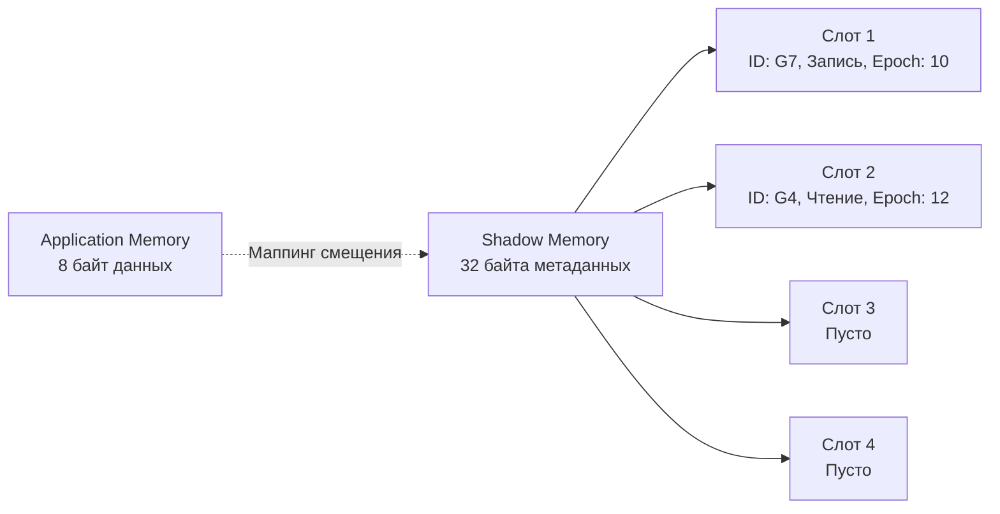

## Иллюзия магии: Как Go видит невидимое

В предыдущей статье [[2. Data race и race detector]] мы выяснили, что гонки данных — это хаотичное переплетение ассемблерных инструкций на уровне кэшей L1/L2 многоядерного процессора, ведущее к Undefined Behavior. Мы узнали, что флаг `-race` перехватывает эти гонки. Но как именно он это делает, если операционная система не предоставляет встроенных механизмов для отслеживания доступов к памяти на таком микроуровне?

Детектор гонок в Go — это не магия рантайма. Это сложнейший симбиоз компилятора и модифицированной библиотеки из мира C/C++. Под капотом `go test -race` использует **ThreadSanitizer (TSan)** v2 — инструмент, разработанный Google для инфраструктуры LLVM/GCC. Авторы Go интегрировали C++ код TSan прямо в тулчейн языка.

Работа детектора делится на две фундаментальные фазы: **Инструментирование** (Compile time) и **Анализ теневой памяти** (Runtime).

## Фаза 1: Инструментирование (Instrumentation)

Компилятор Go не может просто "наблюдать" за памятью. Ему нужно физически изменить ваш код.
Когда вы передаете флаг `-race`, компилятор проходит по абстрактному синтаксическому дереву (AST) вашей программы и **переписывает** каждую инструкцию обращения к разделяемой памяти, вставляя перед ней вызовы специальных C-функций рантайма TSan.

Представьте простой инкремент глобального счетчика:
```go
// Исходный код
counter++
```

Вот во что компилятор превратит этот код "под капотом" (псевдокод):
```go
// Инструментированный код с флагом -race
runtime.raceread(&counter)  // Хук: горутина собирается читать
tmp := counter              // Физическое чтение
tmp = tmp + 1
runtime.racewrite(&counter) // Хук: горутина собирается писать
counter = tmp               // Физическая запись
```

> [!info] Под капотом: Ассемблер
> На уровне ассемблера вызовы `raceread` и `racewrite` не делают полноценный системный вызов (это было бы фатально медленно). Они переходят к быстрому пути (fast-path) на чистом ассемблере, который проверяет кэш теневой памяти. Если обнаружен потенциальный конфликт, вызывается медленный путь (slow-path), написанный на C++, для детального анализа векторных часов.

## Фаза 2: Теневая память (Shadow Memory)

Как TSan помнит, какая горутина и когда обращалась к переменной `counter`? Для этого используется концепция **Теневой памяти**.

При старте программы с флагом `-race` рантайм резервирует гигантский кусок виртуального адресного пространства ОС. Для каждых 8 байт реальной памяти вашего приложения (Application Memory) детектор выделяет **32 байта** теневой памяти (Shadow Cells).

Эти 32 байта состоят из 4 слотов по 8 байт. Каждый слот (Shadow Word) хранит историю одного из последних обращений к этой ячейке памяти.
Структура одного слота (64 бита) выглядит примерно так:
* **Thread ID (16 бит):** Внутренний ID горутины, совершившей доступ.
* **Epoch (42 бита):** Временная метка (векторные часы) горутины на момент доступа.
* **IsWrite (1 бит):** Флаг, была ли это запись (`1`) или чтение (`0`).
* **Position/Size (5 бит):** Какой именно байт из 8-байтового слова был изменен.



**Mechanical Sympathy (Оверхед):** Теперь понятно, почему `-race` замедляет программу в десятки раз. Вместо того чтобы сделать одну ассемблерную инструкцию записи `MOV` в L1 кэш, процессор должен вычислить адрес теневой памяти, загрузить 32 байта метаданных, сдвинуть старые слоты, записать новый слот и только потом обновить реальные данные. Это уничтожает эффективность кэш-линий (Cache Lines) процессора и вызывает массовые Cache Misses.

## Фаза 3: Векторные часы и Happens-Before

Наличие двух обращений от разных горутин к одной памяти (где одно из них — запись) — это еще не Data Race. Гонка возникает только если между ними нет отношения **Happens-Before** (произошло-до).

Как детектор понимает порядок? В TSan используется алгоритм **Векторных часов (Vector Clocks)**.
Каждая горутина имеет свои локальные "часы" (счетчик эпох). Когда горутины синхронизируются через каналы или мьютексы, они "обмениваются" своими часами.

1.  Горутина `G1` пишет в переменную `A` (Epoch: 10).
2.  `G1` отправляет сообщение в канал.
3.  Горутина `G2` читает из канала. Рантайм TSan перехватывает это чтение и обновляет часы `G2`, делая их больше, чем часы `G1`.
4.  `G2` читает переменную `A` (Epoch: 15).

Когда `G2` читает `A`, детектор смотрит в Теневую память:
* Последняя запись была от `G1` на Epoch 10.
* Текущие часы `G2` знают, что события `G1` (до Epoch 10) произошли *в прошлом* (Happens-Before).
* **Вердикт:** Всё законно, гонки нет.

Если бы обмена через канал не было, часы `G2` ничего бы не знали о `G1`. Детектор увидел бы параллельные (concurrent) часы и немедленно выбросил `WARNING: DATA RACE`.

> [!warning] Ловушка / Gotcha: Ложноотрицательные результаты (False Negatives)
> Так как теневая память хранит только **4 последних обращения** (4 слота), существует микроскопический шанс ложноотрицательного результата. Если между записью горутины `G1` и чтением `G2` успеют произойти 4 чтения от других горутин `G3-G6`, история о `G1` будет вытеснена из теневой памяти. `G2` прочитает данные, гонка фактически будет, но детектор ее "забудет" и не сообщит об ошибке. 
> На практике вероятность этого исчезающе мала, но архитектурно она существует.

## Эволюция детектора: Снятие лимита 8192

Долгое время детектор гонок в Go имел жесткое ограничение, которое часто было источником боли на Senior-собеседованиях.

> [!tip] Собеседование
> **Вопрос:** Какой критический лимит имел Race Detector в Go версий до 1.22, и как он мог сломать тесты нагруженного Worker Pool?
> **Ответ:** До версии Go 1.22 ThreadSanitizer имел жестко захардкоженный лимит на **8128 (около 8192) одновременно живущих горутин**. ID горутин в теневой памяти занимали всего 13 бит. Если ваш интеграционный тест создавал 10 000 горутин, программа просто падала с ошибкой `race: limit on 8128 simultaneously alive goroutines is exceeded`, даже если в коде не было ошибок.
> **Решение:** В Go 1.22 Google обновил встроенный движок TSan до третьей версии (v3). Разработчики увеличили разрядность Thread ID и переписали аллокатор векторных часов. Начиная с Go 1.22, этого жесткого лимита **больше не существует**. Теперь можно тестировать с `-race` системы с миллионами горутин, если у вас хватит оперативной памяти.

## Итог

1.  **Детектор гонок (TSan)** — это не статический анализатор, а инструмент **времени выполнения**. Он ловит гонки только на тех путях выполнения, которые были физически активированы тестом.
2.  **Инструментирование** переписывает AST, вставляя хуки `raceread` / `racewrite` на каждое обращение к памяти.
3.  **Теневая память** создает 32-байтовый лог истории для каждых 8 байт реальной памяти, что вызывает гигантский оверхед по RAM и CPU.
4.  **Векторные часы** отслеживают отношение *Happens-Before* через мьютексы и каналы. Если синхронизации нет — стреляет Data Race.

Детектор гонок спасает нас от неявного повреждения памяти. Но конкурентность таит в себе еще одну угрозу. Что если горутины не испортили данные, а просто заблокировали друг друга навсегда, ожидая чужого мьютекса? Race Detector это не поймает. О том, как выявлять зависания, мы поговорим в следующей статье: [[4. Deadlock detection]].