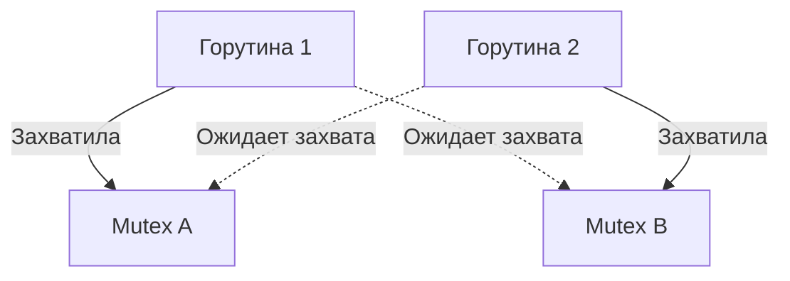

## Тишина в рантайме: Что такое Deadlock

В предыдущей статье [[2. Data race и race detector]] мы боролись с хаосом — ситуацией, когда горутины бесконтрольно перезаписывают данные друг друга. Но в конкурентном программировании есть и другая крайность. Это идеальная тишина, когда все горутины вежливо ждут друг друга, и программа застывает навсегда. Это состояние называется **Взаимная блокировка (Deadlock)**.

С точки зрения железа и операционной системы, Deadlock — это ситуация, когда два или более потоков выполнения уходят в состояние `SLEEP` (паркуются ядром ОС), ожидая ресурсы, которые захвачены ими же крест-накрест. 

В Go классический Deadlock возникает при неправильном порядке захвата `sync.Mutex`, взаимном ожидании чтения/записи в небуферизованные каналы или циклической зависимости в `sync.WaitGroup`.



## Глобальный Deadlock и магия рантайма

Если вы когда-либо писали код с каналами без запуска отдельной горутины, вы видели эту знаменитую ошибку:
`fatal error: all goroutines are asleep - deadlock!`

В отличие от C++ или C#, где зависшая программа будет просто висеть вечно, рантайм Go умеет обнаруживать такие ситуации нативно.

> [!info] Под капотом: Как Go определяет глобальный Deadlock
> В рантайме Go существует специальный фоновый системный поток — **sysmon** (System Monitor), который работает в обход планировщика без привязки к процессору `P`. 
> Параллельно с ним, когда планировщик ищет работу для простаивающих потоков ОС (`M`), он вызывает внутреннюю функцию `runtime.checkdead()`. 
> 
> Рантайм ведет точный учет:
> 1. Количество активных горутин `G`.
> 2. Количество горутин в состоянии `_Gwaiting` (заблокированы на мьютексах, каналах или системных вызовах).
> 3. Активен ли сетевой поллер (Netpoller) — есть ли незавершенные сетевые запросы?
> 4. Есть ли ожидающие таймеры (Timers)?
> 
> Если рантайм видит, что **все** пользовательские горутины запаркованы (`_Gwaiting`), в сети нет активности, а таймеров не предвидится — планировщик понимает, что пробуждать горутины больше некому. Ни одно внешнее событие не сможет вывести систему из этого состояния. В этот момент Go намеренно роняет весь процесс через `panic`.

## Ловушка: Частичный Deadlock (Goroutine Leak)

Нативный детектор Go великолепен, но у него есть фатальная слабость. Он срабатывает только при **глобальном** дедлоке. 

В реальном бэкенд-приложении у вас всегда работает HTTP-сервер (в фоне крутится цикл `http.ListenAndServe`, который слушает сокет). Это значит, что Netpoller всегда активен, и как минимум одна горутина не спит.

Если в таких условиях две ваши рабочие горутины поймают взаимную блокировку, нативный детектор **промолчит**. Приложение продолжит работать, отвечать на HTTP-запросы (если они не требуют зависших ресурсов), а заблокированные горутины навсегда останутся в памяти. Это называется **Partial Deadlock** (Частичная блокировка) или **Goroutine Leak** (Утечка горутин).

```go
func processOrder(orderID string) {
	ch := make(chan string) // Небуферизованный канал
	
	go func() {
		// Ошибка логики: никто не прочитает из канала, если бизнес-логика упадет раньше
		ch <- "результат" 
	}()

	if orderID == "" {
		return // Горутина выше зависла навсегда! (Утечка)
	}

	fmt.Println(<-ch)
}
```

## Стратегии тестирования Deadlock

Так как мы не можем полагаться на `panic` от рантайма в интеграционных тестах (это крашнет сам бинарник `go test`), мы должны использовать специальные подходы.

### 1. Жесткие таймауты (Fail-Fast)

Как мы обсуждали в статье [[1. Тестирование конкурентного кода]], любой конкурентный тест должен быть ограничен по времени. Если тестируемый код уходит в Deadlock, тест должен завершиться с понятной ошибкой, а не висеть до дефолтного 10-минутного таймаута CI.

```go
func TestTransfer_DeadlockPrevention(t *testing.T) {
	acc1 := NewAccount(100)
	acc2 := NewAccount(100)

	done := make(chan struct{})

	go func() {
		// Переводим туда-сюда конкурентно
		go acc1.TransferTo(acc2, 10)
		go acc2.TransferTo(acc1, 10)
		
		// Допустим, мы ждем завершения через WaitGroup внутри
		// Если внутри логики TransferTo нарушен порядок захвата мьютексов (Lock Ordering),
		// этот канал никогда не закроется.
		close(done)
	}()

	select {
	case <-done:
		// Success
	case <-time.After(2 * time.Second):
		t.Fatal("Обнаружен Deadlock! Операция не завершилась за 2 секунды.")
	}
}
```

### 2. Детектирование утечек: uber-go/goleak

Таймауты спасают от зависания самого теста, но не спасают от утечек горутин (Partial Deadlocks), если основной поток теста завершился успешно (как в примере с `processOrder` выше).

Стандартом индустрии для выявления зависших горутин в тестах является библиотека `go.uber.org/goleak`.

> [!info] Под капотом: Как работает goleak
> Библиотека `goleak` делает очень простую вещь на уровне рантайма: она парсит вывод функции `runtime.Stack()` (которая возвращает стек-трейсы всех живых горутин). 
> В конце вашего теста `goleak` проверяет: "Остались ли какие-то горутины, кроме главной горутины теста и известных фоновых системных горутин?". Если да — значит, ваш код оставил после себя зависший мусор (Deadlock), и тест помечается как упавший.

Использование максимально идиоматично — через `TestMain` (проверка на весь пакет) или через `t.Cleanup` для конкретного теста:

```go
package repository_test

import (
	"testing"
	"go.uber.org/goleak"
)

func TestBusinessLogic_NoLeaks(t *testing.T) {
	// Регистрируем хук очистки в самом начале теста
	defer goleak.VerifyNone(t)

	// Act
	processOrder("") 
	// Test пройдет свои ассерты, но в конце goleak просканирует стек, 
	// найдет заблокированную на `ch <- "результат"` горутину 
	// и провалит тест с детальным стек-трейсом.
}
```

### 3. Статический анализ (Lock Ordering)

Лучший способ бороться с дедлоками мьютексов — не допускать их на этапе компиляции. Основная причина мьютексных дедлоков — отсутствие **Lock Hierarchy** (Иерархии блокировок). Если Горутина А захватывает Мьютекс 1, а затем Мьютекс 2, то ни одна другая горутина в системе не должна захватывать их в обратном порядке (Сначала 2, потом 1).

В Go есть стандартный линтер `go vet`. Он не умеет анализировать сложный Lock Ordering, но он отлавливает самую частую причину случайных дедлоков — **копирование мьютексов по значению**.

> [!warning] Ловушка / Gotcha: Копирование мьютекса
> В Go структуры передаются по значению (копируются).
> Если у вас есть `type SafeCounter struct { mu sync.Mutex; val int }`, и вы передаете объект в функцию по значению: `func update(c SafeCounter)`, вы копируете состояние мьютекса! 
> Если оригинальный мьютекс был заблокирован, копия тоже будет заблокирована. Когда функция попытается вызвать `c.mu.Lock()`, она мгновенно уйдет в Deadlock сама с собой, так как скопировала залоченное состояние, но разлочить его уже некому (состояние `unlocked` оригинала не синхронизируется с копией).
> Всегда передавайте структуры с мьютексами по указателю: `*SafeCounter`.
> Линтер `go vet -copylocks` поймает эту ошибку за миллисекунды.

> [!tip] Собеседование
> **Вопрос:** Если мы используем `sync.RWMutex`, можем ли мы получить Deadlock, если две горутины одновременно вызовут `RLock()` (захват на чтение)?
> **Ответ:** Две горутины с `RLock()` не заблокируют друг друга. Но Deadlock (или сильное голодание — Writer Starvation) возможен при плохом дизайне! В реализации `RWMutex` в Go, если приходит писатель и вызывает `Lock()`, он блокируется, ожидая завершения текущих читателей. Но чтобы писатель не ждал вечно, `RWMutex` предотвращает появление **новых** читателей. Если горутина, уже взявшая `RLock()`, попытается взять еще один `RLock()` (вложенная рекурсивная блокировка) до завершения первого, она может встать в очередь за писателем, который ждет её же первый `RLock`. Это классический само-дедлок (Self-Deadlock).

## Итог

1. **Глобальный Deadlock** ловится рантаймом Go (`sysmon`) через панику, когда все горутины в системе переходят в статус ожидания.
2. **Частичный Deadlock (Утечка)** рантаймом не определяется. Для его выявления в тестах обязательно используйте жесткие таймауты (`select + time.After`).
3. Библиотека **`goleak`** — мастхэв инструмент для проверки "стерильности" теста после его завершения.
4. Никогда не копируйте мьютексы (`go vet` в помощь) и соблюдайте строгую иерархию захвата блокировок.

Мы разобрали проблемы, связанные с блокировками через примитивы синхронизации и мьютексы. Но истинная философия Go звучит иначе: "Не общайтесь через разделяемую память; разделяйте память через общение". В следующей статье мы перейдем к идиоматичному способу синхронизации и разберем все неочевидные корнер-кейсы и паттерны тестирования главной фичи языка: [[5. Тестирование каналов]].