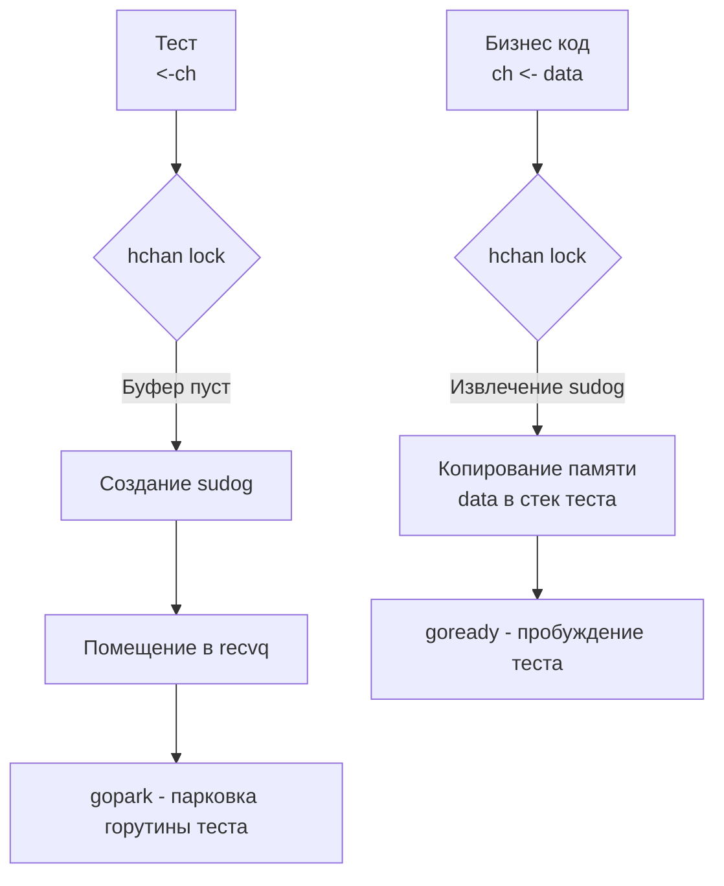

## Парадигма CSP в условиях изоляции

В философии Go красной нитью проходит правило: *"Не общайтесь через разделяемую память; разделяйте память через общение"*. Имплементацией этой парадигмы (CSP — Communicating Sequential Processes) являются каналы. 

Мы уже обсудили проблемы блокировок и утечек в [[4. Deadlock detection]]. Но тестирование кода, который активно использует каналы, бросает нам новый вызов. Канал — это синхронный примитив. Неправильное тестирование канала в лучшем случае приведет к падению `go test` по таймауту, а в худшем — скроет серьезный архитектурный баг, связанный с утечкой ресурсов.

В этой статье мы разберем паттерны тестирования двух главных сценариев: когда тестируемый код является **Продюсером** (возвращает канал) и когда он является **Консьюмером** (принимает канал).

## Mechanical Sympathy: Что такое канал в памяти?

Чтобы понимать, как ломаются тесты с каналами, нужно знать устройство канала в рантайме.

> [!info] Под капотом: Структура hchan
> Когда вы делаете `make(chan int, 3)`, рантайм аллоцирует в куче (Heap) структуру `hchan` (лежит в `runtime/chan.go`).
> Она содержит:
> 1. `buf`: Кольцевой буфер (Ring Buffer) для хранения данных (если канал буферизован).
> 2. `sendq` и `recvq`: Двусвязные списки (Wait Queues). Если горутина пытается прочитать из пустого канала, планировщик создает структуру `sudog`, оборачивает в нее текущую горутину `g`, кладет в `recvq` и **паркует** (усыпляет) горутину.
> 3. `lock`: Обычный `runtime.mutex`. **Каналы не lock-free!** Любое обращение к каналу захватывает этот мьютекс.
> 
> Когда ваш тест делает `<-ch`, а бизнес-код ничего туда не пишет, горутина теста (`g_test`) ложится в `recvq` и засыпает. Если бизнес-код завершился с ошибкой и не закрыл канал, горутина теста не проснется **никогда**. Это вызывает таймаут CI-пайплайна.



## Паттерн 1: Тестирование Продюсеров

Продюсер — это функция, которая делает какую-то асинхронную работу и возвращает канал для чтения результатов (часто используется паттерн Generator).

**Проблема:** Как убедиться, что продюсер отдал все данные и корректно закрыл канал, не повесив при этом тест?

```go
// Бизнес-логика (Продюсер)
func GenerateNumbers(ctx context.Context, max int) <-chan int {
	out := make(chan int)
	go func() {
		defer close(out) // КРИТИЧЕСКИ ВАЖНО для потребителей
		for i := 1; i <= max; i++ {
			select {
			case out <- i:
			case <-ctx.Done():
				return
			}
		}
	}()
	return out
}
```

**Идиоматичный тест:**
Мы используем цикл `for-select` с жестким таймаутом и проверяем признак закрытия канала (`ok`).

```go
package worker_test

import (
	"context"
	"testing"
	"time"

	"[github.com/stretchr/testify/require](https://github.com/stretchr/testify/require)"
	"yourproject/internal/worker"
)

func TestGenerateNumbers_Success(t *testing.T) {
	t.Parallel()

	ctx, cancel := context.WithCancel(context.Background())
	defer cancel() // Хороший тон - всегда очищать контекст

	ch := worker.GenerateNumbers(ctx, 3)

	var results []int
	
	// Используем Timer для всего теста, а не time.After на каждую итерацию,
	// чтобы избежать утечек таймеров
	timeout := time.NewTimer(1 * time.Second)
	defer timeout.Stop()

loop:
	for {
		select {
		case val, ok := <-ch:
			if !ok {
				// Канал закрыт - продюсер корректно завершил работу
				break loop
			}
			results = append(results, val)
		case <-timeout.C:
			t.Fatal("Таймаут: продюсер завис или не закрыл канал")
		}
	}

	require.Equal(t, []int{1, 2, 3}, results)
}
```

> [!tip] Собеседование
> **Вопрос:** Как неблокирующим образом проверить в тесте, закрыт ли канал?
> **Ответ:** Использовать `select` с веткой `default`.
> ```go
> select {
> case val, ok := <-ch:
>     if !ok {
>         fmt.Println("Канал закрыт")
>     } else {
>         fmt.Println("Прочитали значение:", val)
>     }
> default:
>     fmt.Println("Канал пуст, но НЕ закрыт (или нет писателей)")
> }
> ```

## Паттерн 2: Тестирование Консьюмеров

Консьюмер — это функция или горутина, которая вычитывает данные из переданного ей канала.

**Проблема:** Разработчики часто забывают закрыть канал *со стороны теста*. Если консьюмер использует `for val := range ch`, он будет бесконечно ждать новых данных, пока канал не закроют. Это приведет к утечке горутины в тесте (которую поймает `goleak`, как мы обсуждали ранее).

```go
// Бизнес-логика (Консьюмер)
// Функция читает задачи, выполняет их и возвращает сумму результатов
func ProcessTasks(in <-chan int) int {
	sum := 0
	// Цикл завершится ТОЛЬКО когда канал 'in' будет закрыт
	for val := range in {
		sum += val
	}
	return sum
}
```

**Идиоматичный тест:**
В тесте мы должны сами создать канал, отправить туда данные, **обязательно закрыть его**, а затем сверить результат.

```go
func TestProcessTasks(t *testing.T) {
	t.Parallel()

	// 1. Arrange: Создаем буферизованный канал.
	// Буфер защищает нас от дедлока, если мы хотим сначала записать всё, 
	// а потом отдать канал консьюмеру.
	inCh := make(chan int, 3)
	
	inCh <- 10
	inCh <- 20
	inCh <- 30
	
	// КРИТИЧЕСКИ ВАЖНО: Закрываем канал перед (или сразу после) передачи!
	// Если этого не сделать, ProcessTasks зависнет навсегда.
	close(inCh) 

	// 2. Act
	result := worker.ProcessTasks(inCh)

	// 3. Assert
	require.Equal(t, 60, result)
}
```

> [!warning] Ловушка / Gotcha: Буферизованные vs Небуферизованные каналы в тестах
> Если бы мы в тесте выше создали канал `make(chan int)` (без буфера) и попытались сделать три записи `inCh <- 10`, наш **тест ушел бы в Deadlock** на строке первой записи!
> Запись в небуферизованный канал блокирует писателя, пока читатель не заберет данные. Но читатель (`ProcessTasks`) еще даже не запущен!
> 
> Правило: Если в тесте вы пишете в канал *до* запуска горутины-читателя в том же потоке, канал **обязан** быть буферизованным. Если размер данных динамический, запускайте писателя в отдельной горутине:
> ```go
> inCh := make(chan int)
> go func() {
>     defer close(inCh) // Закрываем по окончании записи
>     inCh <- 10
> }()
> // Теперь можно безопасно вызывать читателя
> ProcessTasks(inCh)
> ```

## Тестирование отмены контекста (Context Cancellation)

Любой production-ready код с каналами обязан уважать `context.Context`. Мы должны тестировать, что горутина не зависнет на записи в канал, если клиент (консьюмер) отвалился. Это классический баг утечки памяти (Memory Leak) в веб-серверах на Go.

```go
// Функция, которая может зависнуть, если читатель перестанет читать из out
func FlakyProducer(ctx context.Context, out chan<- int) {
	// Долгая работа...
	result := 42
	
	select {
	case out <- result: // Запишем, если есть читатель
	case <-ctx.Done():  // Выйдем, если читатель отменил контекст
		return
	}
}
```

Тест на проверку отмены:

```go
func TestFlakyProducer_ContextCancellation(t *testing.T) {
	t.Parallel()

	ctx, cancel := context.WithCancel(context.Background())
	out := make(chan int) // Небуферизованный

	// Запускаем продюсера. Он заблокируется, так как мы не читаем из 'out'.
	go worker.FlakyProducer(ctx, out)

	// Имитируем, что клиент отвалился спустя 10мс
	time.Sleep(10 * time.Millisecond)
	cancel()

	// Как проверить, что FlakyProducer реально завершился, а не завис?
	// Используем библиотеку goleak (из прошлой статьи) 
	// или явно передаем done-канал:
	
	// Для простоты примера: если бы FlakyProducer не имел case <-ctx.Done(),
	// он бы завис навсегда. goleak поймал бы это в конце теста.
}
```

## Отлов паники: Запись в закрытый канал

Одна из архитектурных особенностей Go: запись в закрытый канал вызывает `panic: send on closed channel`.
Часто это происходит при неправильном управлении каналами с множеством писателей (Multiple Writers).

Если вам нужно покрыть такую ситуацию тестом (чтобы убедиться, что ваша обертка над каналами безопасно обрабатывает панику через `recover`), используйте функцию `require.Panics`.

```go
func TestSafeSender_PanicsOnClosed(t *testing.T) {
	ch := make(chan int)
	close(ch) // Канал уже закрыт!

	require.Panics(t, func() {
		ch <- 1 // Вызовет панику на уровне рантайма
	}, "Ожидалась паника при записи в закрытый канал")
}
```

## Итог

1.  **Каналы — это мьютексы и очереди.** Неправильная работа с ними в тестах гарантированно усыпляет горутины.
2.  При тестировании **Продюсеров** всегда используйте `select` с таймаутами (`time.NewTimer`), чтобы тест падал с понятной ошибкой, а не висел бесконечно.
3.  При тестировании **Консьюмеров** не забывайте вызывать `close(ch)` на стороне теста, иначе консьюмер (использующий `range`) уйдет в Deadlock.
4.  Помните о буферизации: запись в небуферизованный канал без запущенного в фоне читателя мгновенно заблокирует ваш тест.

Каналы — это средство коммуникации. Но сами акторы, выполняющие работу — это горутины. Как проверить, что вы не наплодили лишних воркеров, как тестировать паттерны Worker Pool и управлять их жизненным циклом (graceful shutdown)? Об этом мы подробно поговорим в следующей статье: [[6. Тестирование goroutines]].