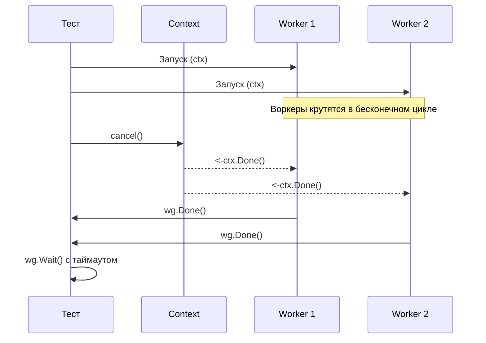

## Управление жизненным циклом и контроль хаоса

Мы уже разобрали, как выявлять зависания ([[4. Deadlock detection]]) и тестировать коммуникацию ([[5. Тестирование каналов]]). Но сами по себе мьютексы и каналы — это лишь инфраструктура. Основными «акторами», выполняющими полезную работу в Go, являются горутины. 

Дешевизна создания горутин (всего около 2 КБ памяти на старте) часто играет с разработчиками злую шутку. Ключевое слово `go` разбрасывается по коду без оглядки, что в условиях высоких нагрузок приводит к OOM (Out Of Memory) или исчерпанию пула соединений БД. 

Тестирование горутин — это не просто проверка того, что асинхронная задача выполнилась. Это строгий аудит **жизненного цикла**:
1. Соблюдается ли лимит (Concurrency Bounding)?
2. Корректно ли горутины реагируют на отмену (Cancellation)?
3. Не остаются ли они «орфанами» (Orphans - сиротами) при ошибках в соседних воркерах?

## Mechanical Sympathy: Глобальный счетчик горутин

В Go есть встроенная функция `runtime.NumGoroutine()`, которая возвращает количество активных горутин в данный момент времени. 

> [!info] Под капотом: Как работает NumGoroutine
> На уровне рантайма планировщик (Scheduler) хранит глобальный атомарный счетчик и список всех когда-либо созданных горутин `allgs`. При вызове `runtime.NumGoroutine()` рантайм не обходит все треды ОС. Он использует быстрый атомарный лоад (atomic load) внутренних счетчиков: от количества запущенных горутин отнимается количество системных и количество горутин, находящихся в кэше свободных горутин (`gFree`). 
> Это очень быстрая операция ($O(1)$), и её можно без опасений использовать в тестах. Однако горутина переходит в состояние `_Gdead` и попадает в `gFree` не мгновенно, а на этапе работы планировщика, что требует аккуратности при написании ассертов.

Начинающие разработчики часто пытаются использовать `runtime.NumGoroutine()` для проверки утечек:

```go
// ПЛОХОЙ ПАТТЕРН ТЕСТИРОВАНИЯ
func TestWorker_BadLeakCheck(t *testing.T) {
	t.Parallel() // <-- ГЛАВНАЯ ОШИБКА ЗДЕСЬ
	startGoroutines := runtime.NumGoroutine()

	runWorker()

	// Если горутин стало больше, значит есть утечка?
	require.Equal(t, startGoroutines, runtime.NumGoroutine()) 
}
```

> [!warning] Ловушка / Gotcha: Глобальное состояние и t.Parallel
> Функция `runtime.NumGoroutine()` возвращает **глобальное** количество горутин для всего процесса `go test`. 
> Если вы используете `t.Parallel()`, в фоне работают десятки других тестов, которые постоянно создают и уничтожают свои горутины. Измерение `NumGoroutine` в параллельном тесте приведет к классическим Flaky тестам (плавающим ошибкам). 
> **Правило:** Если тест полагается на `runtime.NumGoroutine()`, он **не должен** использовать `t.Parallel()`. Для параллельных тестов следует применять библиотеку `goleak` (как обсуждалось ранее), которая умеет фильтровать системные и тестовые горутины.

## Паттерн 1: Тестирование Bounded Concurrency (Лимиты)

Одна из главных задач Senior-разработчика — защитить систему от неконтролируемого роста горутин. Для этого реализуются Worker Pools или семафоры на базе каналов. Как протестировать, что ваш Worker Pool действительно не создает больше воркеров, чем разрешено?

Мы отказываемся от `t.Parallel()` для этого конкретного теста и замеряем пиковое значение.

```go
package pool_test

import (
	"context"
	"runtime"
	"sync/atomic"
	"testing"
	"time"

	"[github.com/stretchr/testify/require](https://github.com/stretchr/testify/require)"
	"yourproject/internal/pool"
)

func TestWorkerPool_ConcurrencyLimit(t *testing.T) {
	// ВАЖНО: Без t.Parallel()
	
	const maxWorkers = 5
	const totalTasks = 50

	// Фиксируем базовое количество горутин (рантайм + сам тест)
	baseGoroutines := runtime.NumGoroutine()

	p := pool.NewWorkerPool(maxWorkers)
	p.Start(context.Background())

	var activeTasks int32

	// Act: Отправляем шквал задач
	for i := 0; i < totalTasks; i++ {
		p.Submit(func() {
			atomic.AddInt32(&activeTasks, 1)
			time.Sleep(50 * time.Millisecond) // Имитируем долгую работу
			atomic.AddInt32(&activeTasks, -1)
		})
	}

	// Даем воркерам время на запуск
	time.Sleep(10 * time.Millisecond) 

	// Assert 1: Проверяем физический лимит горутин
	// Количество горутин не должно превышать: база + maxWorkers + возможно пара системных/управляющих
	currentGoroutines := runtime.NumGoroutine()
	require.LessOrEqual(t, currentGoroutines, baseGoroutines+maxWorkers+2, "Worker Pool превысил лимит горутин!")

	// Assert 2: Проверяем логический лимит (атомик)
	require.LessOrEqual(t, int(atomic.LoadInt32(&activeTasks)), maxWorkers)

	p.Stop() // Дожидаемся завершения
}
```

## Паттерн 2: Тестирование Graceful Shutdown

При остановке микросервиса (сигнал `SIGTERM`) мы должны завершить работу всех горутин корректно (дописать данные в БД, закрыть сокеты). Этот процесс называется **Graceful Shutdown**.

В Go стандартом управления жизненным циклом является `context.Context`. Тест на Graceful Shutdown должен проверять:
1. Что горутины действительно реагируют на `ctx.Done()`.
2. Что горутины успевают завершить работу за отведенное время.



Идиоматичная реализация теста:

```go
func TestService_GracefulShutdown(t *testing.T) {
	t.Parallel()

	ctx, cancel := context.WithCancel(context.Background())
	svc := service.NewBackgroundService()
	
	// Запускаем сервис (внутри он создает множество горутин)
	// Функция Start должна быть неблокирующей
	svc.Start(ctx)

	// Имитируем полезную нагрузку
	time.Sleep(10 * time.Millisecond)

	// Act: инициируем shutdown
	cancel()

	// Assert: сервис должен корректно остановиться за разумное время
	// Используем канал для превращения блокирующего Wait в неблокирующий select
	done := make(chan struct{})
	go func() {
		svc.Wait() // Дожидается внутренних wg.Wait()
		close(done)
	}()

	select {
	case <-done:
		// Успех! Все горутины завершились
	case <-time.After(500 * time.Millisecond):
		t.Fatal("Graceful Shutdown провалился: горутины не завершили работу за 500мс")
	}
}
```

> [!tip] Собеседование
> **Вопрос:** В чем разница между `sync.WaitGroup` и `errgroup.Group` из пакета `golang.org/x/sync/errgroup`, и что лучше использовать для оркестрации воркеров?
> **Ответ:** `WaitGroup` просто ведет счетчик горутин. Если один воркер упадет с ошибкой, остальные продолжат работу, тратя ресурсы впустую. 
> `errgroup.Group` (созданная через `WithContext`) связывает все горутины единым контекстом. Если хотя бы одна функция, переданная в `eg.Go(...)`, возвращает `error`, `errgroup` автоматически **отменяет контекст** для всех остальных горутин в группе. Это позволяет реализовать паттерн "Fail-Fast" и мгновенно освободить ресурсы, что делает `errgroup` стандартом де-факто для сложных конкурентных пайплайнов в Production.

## Тестирование сложной оркестрации: ErrGroup

Давайте посмотрим, как протестировать поведение "Fail-Fast", о котором мы только что говорили. Нам нужно убедиться, что ошибка в одной горутине действительно прерывает работу остальных.

```go
func TestDataPipeline_FailFast(t *testing.T) {
	t.Parallel()

	// Мокаем зависимости
	processor := mocks.NewMockProcessor(t)
	
	// Воркер 1: Зависнет навсегда, пока не отменят контекст
	processor.EXPECT().Process(gomock.Any(), "task_1").DoAndReturn(func(ctx context.Context, _ string) error {
		<-ctx.Done() // Ждем отмены
		return ctx.Err()
	})

	// Воркер 2: Сразу возвращает критическую ошибку
	expectedErr := errors.New("critical DB error")
	processor.EXPECT().Process(gomock.Any(), "task_2").Return(expectedErr)

	pipeline := worker.NewPipeline(processor)

	// Act
	start := time.Now()
	err := pipeline.RunAll(context.Background(), []string{"task_1", "task_2"})

	// Assert
	require.ErrorIs(t, err, expectedErr, "Пайплайн должен вернуть ошибку от task_2")
	
	// Если бы fail-fast не сработал, task_1 висел бы вечно (или до глобального таймаута)
	require.Less(t, time.Since(start), 100*time.Millisecond, "Пайплайн должен был упасть мгновенно")
}
```

В этом тесте мы элегантно проверяем сложную оркестрацию: мы гарантируем, что ошибка во второй горутине привела к отмене контекста первой горутины, и метод `RunAll` не заблокировался.

## Итог

1. **`runtime.NumGoroutine()`** — отличный инструмент для тестирования лимитов (Bounded Concurrency), но он ломается при использовании `t.Parallel()`. Используйте его только в изолированных (последовательных) тестах.
2. **Graceful Shutdown** — это не опция, а необходимость. Тесты должны доказывать, что отмена `context.Context` каскадно "сворачивает" все фоновые процессы за предсказуемое время без утечек.
3. **Оркестрация** проверяется через имитацию зависаний. Если один воркер падает, качественный тест докажет, что остальные не продолжили бессмысленно сжигать процессорное время (Fail-Fast).

Горутины и каналы дают нам контроль над логикой. Но мы все еще сильно зависим от воли планировщика ОС (Scheduler), который решает, какая горутина будет выполняться в данную микросекунду. Эта недетерминированность делает конкурентные тесты хрупкими. О том, можно ли взять планировщик под контроль и заставить конкурентный код выполняться предсказуемо шаг за шагом, мы поговорим в следующей статье: [[7. Deterministic concurrency testing]].