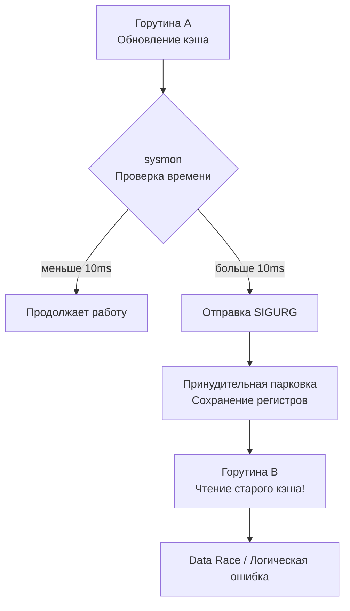

## Укрощение хаоса

Мы прошли долгий путь в изучении конкурентности. Мы научились базовой синхронизации ([[1. Тестирование конкурентного кода]]), отлову неявного повреждения памяти ([[2. Data race и race detector]]) и поиску зависаний ([[4. Deadlock detection]]). 

Но даже если ваш код не содержит Data Race и Deadlock, он всё еще подвержен главной болезни многопоточности — **Недетерминированности**.

Недетерминированность означает, что один и тот же тест с одними и теми же входными данными может вести себя по-разному. В 99% случаев он проходит успешно, а на 100-й раз (обычно в CI-пайплайне в пятницу вечером) — падает. Это классические *Flaky tests*, которые разрушают доверие команды к тестовой базе.

Тестирование конкурентного кода должно быть **детерминированным**. Мы должны архитектурно заставить планировщик Go (Scheduler) выполнять наши горутины в строго заданном порядке, чтобы предсказуемо воспроизводить самые редкие гонки состояний (Race Conditions).

## Mechanical Sympathy: Почему порядок непредсказуем?

Чтобы взять планировщик под контроль, нужно понимать, с чем мы боремся. 

В ранних версиях Go планировщик был кооперативным. Горутина отдавала управление только при системном вызове, записи в канал или вызове `runtime.Gosched()`. Это позволяло писать относительно предсказуемые тесты.

> [!info] Под капотом: Асинхронная вытесняющая многозадачность
> Начиная с версии Go 1.14, планировщик стал **асинхронно вытесняющим** (Asynchronously Preemptible). 
> В фоне работает системный поток `sysmon`. Если он видит, что горутина выполняется непрерывно более 10 миллисекунд (захватив процессор `P`), он отправляет аппаратному потоку `M` сигнал операционной системы **SIGURG**. 
> Рантайм перехватывает этот сигнал, искусственно внедряет инструкцию вызова функции в текущий стек горутины, сохраняет её регистры и насильно "снимает" её с процессора, ставя в очередь `RunQueue`.
> 
> **Вывод:** Вы физически не можете предсказать, в какой строке кода и на какой ассемблерной инструкции ваша горутина будет приостановлена.



## Стратегия 1: Инверсия времени (Time Mocking)

Главный враг детерминизма — пакет `time`. Если ваша конкурентная логика использует `time.Sleep`, `time.After` или `time.Ticker`, вы зависите от текущей загрузки процессора.

> [!warning] Ловушка / Gotcha
> Если вы пишете в тесте:
> ```go
> go worker()
> time.Sleep(10 * time.Millisecond) // Ждем, пока воркер запустится
> assertSomething()
> ```
> Вы совершаете преступление против детерминизма. На нагруженном CI-сервере (где гипервизор может заморозить вашу виртуалку на долю секунды) эти 10мс пройдут, а горутина воркера даже не успеет проинициализироваться. Тест упадет.

**Решение:** Абстрагирование времени. 
В enterprise-проектах вместо прямого вызова `time.Now()` используют интерфейс `Clock`. В Production инжектируется реальная реализация, а в тестах — **MockClock**, временем в котором вы управляете вручную.

```go
package timeutil

import "time"

// Clock абстрагирует работу со временем
type Clock interface {
	Now() time.Time
	After(d time.Duration) <-chan time.Time
}

// -- В тестовом файле --

type MockClock struct {
	currentTime time.Time
	// Канал для ручного "срабатывания" таймеров
	triggers map[time.Duration]chan time.Time 
}

func (m *MockClock) Advance(d time.Duration) {
	m.currentTime = m.currentTime.Add(d)
	// Ищем таймеры, которые должны сработать, и шлем им сигнал
	if ch, exists := m.triggers[d]; exists {
		ch <- m.currentTime
	}
}
```
Используя `MockClock`, вы можете "перемотать" время на 10 часов вперед за одну наносекунду реального времени, гарантированно спровоцировав выполнение фоновых задач очистки кэша или таймаутов, без малейшего ожидания в тестах.

## Стратегия 2: Синхронизационные Хуки (Test Hooks)

Как протестировать состояние гонки (Race Condition), если оно возникает только тогда, когда Горутина А заблокировала ресурс, но еще не успела его отпустить, а Горутина Б попыталась его прочитать?

Мы не можем использовать `time.Sleep`, чтобы "поймать" этот момент. Мы должны заставить код остановиться именно там, где нам нужно. Для этого применяется паттерн **Test Hooks (Тестовые крючки)**.

Мы модифицируем структуру бизнес-логики так, чтобы она могла принимать callback-функции, которые будут вызываться только в тестах.

```go
package cache

import "sync"

type ComplexCache struct {
	mu   sync.RWMutex
	data map[string]string

	// Хуки для тестирования (в production они равны nil)
	beforeWriteHook func()
	afterWriteHook  func()
}

// Option-паттерн для внедрения хуков
func WithTestHooks(before, after func()) func(*ComplexCache) {
	return func(c *ComplexCache) {
		c.beforeWriteHook = before
		c.afterWriteHook = after
	}
}

func (c *ComplexCache) Set(key, value string) {
	if c.beforeWriteHook != nil {
		c.beforeWriteHook() // Тест может заблокировать выполнение здесь!
	}

	c.mu.Lock()
	c.data[key] = value
	c.mu.Unlock()

	if c.afterWriteHook != nil {
		c.afterWriteHook()
	}
}
```

Теперь мы можем написать абсолютно детерминированный тест, который воспроизводит гонку состояний с точностью до ассемблерной инструкции:

```go
func TestComplexCache_ConcurrentSet_Deterministic(t *testing.T) {
	// Каналы для оркестрации
	aboutToWrite := make(chan struct{})
	allowWrite := make(chan struct{})
	writeDone := make(chan struct{})

	// Создаем кэш с хуками
	c := cache.NewComplexCache(cache.WithTestHooks(
		func() {
			close(aboutToWrite) // Сигнализируем, что мы готовы писать
			<-allowWrite        // Ждем разрешения от теста!
		},
		func() {
			close(writeDone) // Сигнализируем, что запись завершена
		},
	))

	// Запускаем горутину записи
	go c.Set("key1", "value1")

	// 1. Тест ждет, пока горутина не дойдет до критической секции
	<-aboutToWrite

	// В этот момент горутина "Set" ЗАМОРОЖЕНА прямо перед захватом мьютекса.
	// Мы можем детерминированно протестировать поведение системы в этом состоянии!
	val, err := c.Get("key1")
	require.ErrorIs(t, err, cache.ErrNotFound, "Данные не должны быть доступны до записи")

	// 2. Разрешаем горутине продолжить работу
	close(allowWrite)

	// 3. Ждем полного завершения
	<-writeDone

	// Теперь данные точно в кэше
	val, _ = c.Get("key1")
	require.Equal(t, "value1", val)
}
```

Этот подход требует изменения Production-кода ради тестов, что часто вызывает споры на Code Review. Однако в сложных распределенных системах (например, при реализации консенсуса Raft или распределенных транзакций) это **единственный** способ доказать корректность работы алгоритма.

> [!tip] Собеседование
> **Вопрос:** Вы написали конкурентный код. В тестах он работает, но вы боитесь, что на продакшене другой порядок планирования горутин вызовет баг. Как "расшатать" планировщик в тестах, чтобы проверить больше сценариев (Chaos Engineering)?
> **Ответ:** Есть два простых трюка, встроенных в тулчейн Go.
> 1. Запустить тесты с разным количеством процессоров: `go test -cpu=1,2,4,8,16`. Алгоритм планирования на 1 ядре радикально отличается от 16 ядер (появляются локальные очереди `P`, воровство работы - Work Stealing).
> 2. Использовать `runtime.Gosched()` в узких местах тестов. Это добровольная сдача процессора. Вставка этой функции заставит планировщик переключить контекст, что часто мгновенно проявляет скрытые Data Race или неверные предположения об атомарности.

## Стратегия 3: Стресс-тестирование (Stress Testing)

Если вы не можете использовать хуки (например, тестируете стороннюю закрытую библиотеку), остается метод грубой силы — запуск кода тысячи раз в надежде "поймать" баг планировщика.

В Go для этого не нужно писать циклы на `100000` итераций вручную. Используется стандартный флаг `go test -count`.

```bash
# Запустить тест 1000 раз, используя 8 ядер процессора
go test -run=TestConcurrentLogic -count=1000 -cpu=8 -race
```

Если тест упадет хотя бы 1 раз из 1000, флаг `-race` покажет вам, где именно кроется недетерминированность.

## Итог раздела

Тестирование конкурентности — это высший пилотаж в Go-разработке. 
1. Никогда не полагайтесь на `time.Sleep`. 
2. Синхронизируйте тесты с помощью каналов и `sync.WaitGroup` ([[1. Тестирование конкурентного кода]]).
3. Ловите скрытое повреждение памяти через `go test -race` ([[3. go test -race под капотом]]).
4. Проверяйте утечки горутин с помощью `goleak` ([[4. Deadlock detection]]).
5. Для идеального детерминизма внедряйте абстракцию времени (`Clock`) и тестовые хуки (Test Hooks) для заморозки горутин в нужных состояниях.

Мы завершили огромный и сложнейший блок по конкурентности. Но баги возникают не только от того, *когда* выполняется код, но и от того, *что* в него передают. Обычные тесты используют заранее придуманные программистом значения. А что, если заставить компилятор генерировать миллионы случайных, невалидных и вредоносных мутаций, чтобы найти уязвимости, о которых вы даже не думали? 

В следующем разделе мы переходим к самому современному подходу в тестировании — Фаззингу.
Следующая статья: [[1. Встроенный fuzzing в Go]].