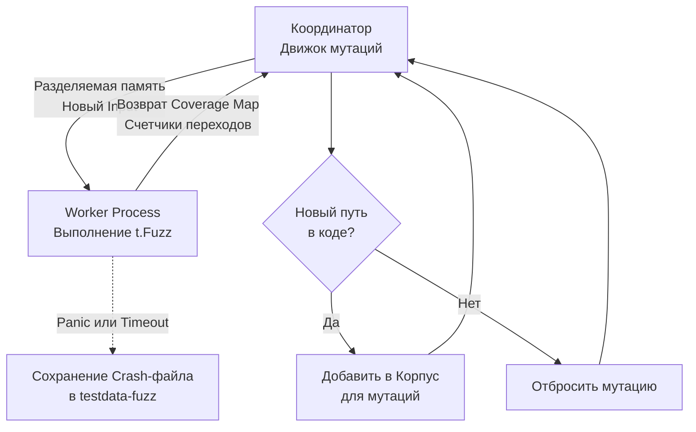

## Выход за пределы фантазии программиста

Классические Unit-тесты проверяют только то, о чем подумал разработчик. Мы пишем "счастливый путь", добавляем пару граничных условий (пустая строка, `nil`, отрицательное число) и успокаиваемся. Но реальный мир, особенно если ваш код торчит наружу (публичный API, парсер файлов, обработчик сетевых пакетов), подбрасывает данные, которые невозможно предсказать: битые кодировки, обрезанные пакеты, гигантские payload-ы.

**Fuzzing (Фаззинг)** — это метод автоматизированного тестирования, при котором на вход функции подается непрерывный поток случайно сгенерированных, мутированных и заведомо некорректных данных. Цель фаззера — заставить ваш код запаниковать (`panic`), зависнуть (infinite loop), исчерпать память (OOM) или спровоцировать гонку данных.

Начиная с версии 1.18, фаззинг стал встроенной частью тулчейна Go (`testing.F`). Вам больше не нужны сторонние инструменты вроде `go-fuzz`, всё работает "из коробки".

## Под капотом: Coverage-Guided Fuzzing

Фаззер в Go — это не просто генератор случайного мусора (`/dev/urandom`). Это умный алгоритм, основанный на обратной связи по покрытию кода (Coverage-Guided).

> [!info] Под капотом: Архитектура фаззера Go
> Когда вы запускаете `go test -fuzz`, процесс разделяется:
> 1. **Coordinator Process (Координатор):** Главный процесс, который управляет мутациями.
> 2. **Worker Processes (Воркеры):** Координатор запускает несколько рабочих процессов (по количеству ядер CPU), в которых крутится ваш бинарник теста.
> 
> Компилятор Go вставляет специальные легковесные счетчики (8-битные счетчики переходов) в каждый базовый блок (Basic Block) вашего кода. 
> Координатор отправляет мутированные байты воркеру через разделяемую память (Shared Memory / `mmap`), чтобы избежать накладных расходов на IPC-вызовы. Воркер выполняет функцию и возвращает карту покрытия (Coverage Map). 
> Если фаззер видит, что новая мутация (например, замена байта `0x00` на `0xFF`) заставила код пойти по новой ветке `if`, он сохраняет этот инпут в свой "Корпус" и начинает мутировать уже его, продвигаясь всё глубже и глубже в дебри вашей бизнес-логики.



## Анатомия Fuzz-теста

Фазз-тесты пишутся в тех же файлах `*_test.go`, что и обычные тесты, но используют тип `*testing.F` вместо `*testing.T`.

Правильный фазз-тест состоит из трех этапов:
1. Инициализация (опционально).
2. Заполнение стартового корпуса (Seed Corpus) через `f.Add()`. Это "подсказки" фаззеру, с каких нормальных данных ему стоит начать мутации.
3. Вызов `f.Fuzz()` с функцией-целью (Fuzz Target), куда рантайм будет бесконечно передавать сгенерированные данные.

### Идиоматичный пример: Парсер бинарного протокола

Предположим, у нас есть функция, которая парсит кастомный бинарный заголовок пакета. Первые 2 байта — длина полезной нагрузки, далее — сама нагрузка.

```go
package protocol

import "encoding/binary"

// ParseHeader читает длину и возвращает payload
func ParseHeader(data []byte) []byte {
	if len(data) < 2 {
		return nil
	}
	
	// Читаем заявленную длину пакета
	length := binary.BigEndian.Uint16(data[:2])
	
	// ВНИМАНИЕ: Скрытый баг! Мы не проверяем реальную длину data!
	payload := data[2 : 2+length] 
	
	return payload
}
```

Напишем фазз-тест, чтобы поймать эту уязвимость:

```go
package protocol_test

import (
	"testing"
	"yourproject/internal/protocol"
)

func FuzzParseHeader(f *testing.F) {
	// 1. Seed Corpus: Добавляем валидные примеры.
	// Фаззер начнет мутировать именно их.
	f.Add([]byte{0x00, 0x03, 'A', 'B', 'C'}) // Длина 3, 3 байта
	f.Add([]byte{0x00, 0x00})                // Пустой payload

	// 2. Fuzz Target
	f.Fuzz(func(t *testing.T, input []byte) {
		// Главное правило фаззинга: функция не должна паниковать ни при каких инпутах.
		// Если ParseHeader запаникует, t.Fuzz прервет выполнение и зафиксирует баг.
		
		_ = protocol.ParseHeader(input)
	})
}
```

## Выполнение и Жизненный цикл багов

Обычный запуск `go test` выполнит функцию `FuzzParseHeader` только один раз, используя данные из `f.Add()`. Чтобы запустить именно фаззинг, нужен специальный флаг:

```bash
go test -fuzz=FuzzParseHeader -fuzztime=30s
```

Что произойдет? Фаззер возьмет наш seed `[]byte{0x00, 0x03, 'A', 'B', 'C'}`, начнет менять байты и очень быстро сгенерирует входные данные вроде `[]byte{0xFF, 0xFF, 'A'}`.
В функции `ParseHeader` `length` станет `65535`. Попытка взять срез `data[2 : 2+65535]` вызовет `panic: runtime error: slice bounds out of range`.

**Как Go реагирует на краш?**
1. Фаззинг немедленно останавливается.
2. В консоль выводится стек-трейс паники и мини-код (reproducer), который вызвал падение.
3. Рантайм сохраняет эти "ядовитые" байты в файл внутри директории `testdata/fuzz/FuzzParseHeader/`.

Это гениальное архитектурное решение. Как только фаззер нашел баг, этот инпут **навсегда становится частью ваших Unit-тестов**. При каждом последующем обычном запуске `go test` (даже без флага `-fuzz`) Go будет читать директорию `testdata/fuzz` и прогонять этот крэш-кейс, защищая вас от регрессии. Вы коммитите эту папку в Git вместе с исправленным кодом.

> [!tip] Собеседование
> **Вопрос:** В чем фундаментальная разница между `f.Add(data)` в фаззинге и `tc := []struct{...}` в Table-Driven тестах?
> **Ответ:** В Table-Driven тесте мы знаем *ожидаемый результат* для каждого входа (Arrange-Act-Assert). В функции Fuzz-target мы подаем случайный мусор, поэтому мы не можем сделать `require.Equal(t, expected, actual)`. 
> В фаззинге мы проверяем **инварианты**: функция не должна паниковать, функция не должна возвращать ошибку и пустой интерфейс одновременно, данные после Marshal/Unmarshal должны совпадать с исходными и т.д.

## Ограничения и Ловушки

> [!warning] Ловушка / Gotcha: Глобальное состояние и БД
> Категорически запрещено использовать работу с БД, сетью или глобальными переменными (без жесткой защиты мьютексами) внутри функции `f.Fuzz(func(t *testing.T, data []byte))`.
> 
> Почему? Воркеры фаззера запускают эту функцию сотни тысяч раз в секунду в параллельных потоках. Если вы будете открывать соединение с базой на каждой итерации, вы исчерпаете пул портов (Ephemeral Ports) или положите БД за долю секунды. 
> Фаззинг предназначен для чистых (pure) функций, сложной алгоритмической логики, парсеров и криптографии. Если вам нужно фаззить интеграционный слой — используйте специализированные инструменты вроде API Fuzzer-ов.

### Поддерживаемые типы данных
Вы не можете передавать в фаззер сложные структуры (`struct`). Движок мутаций Go умеет работать только с базовыми типами: `[]byte`, `string`, `bool`, `byte`, `rune`, `float32`, `float64`, `int`, `int8` - `int64`, `uint` - `uint64`.

Если ваша бизнес-логика принимает структуру, вы должны генерировать байты, а внутри таргета конвертировать их (например, через `json.Unmarshal` или кастомный маппинг).

## Итог

1. **Встроенный Fuzzing** ищет граничные условия, до которых не додумался человек, генерируя мутированные входы.
2. Он работает на базе **обратной связи по покрытию** (Coverage-Guided), проникая в самые редкие ветки кода.
3. Главная задача Fuzz-target — не упасть в панику.
4. Найденные баги автоматически сохраняются в `testdata/fuzz` и становятся регрессионными тестами.

Фаззинг отлично находит паники. Но как проверить, что сложная бизнес-логика (например, сортировка или балансировка) при любых случайных данных возвращает математически правильный результат? Для этого фаззинг комбинируют со строгой методологией, о которой мы поговорим в следующей статье: [[2. Property based testing]].