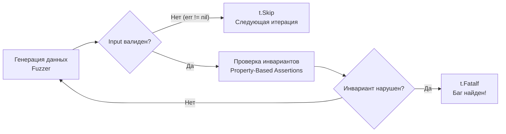

## Смена парадигмы: от Примеров к Свойствам

В прошлой статье [[1. Встроенный fuzzing в Go]] мы познакомились с механизмом фаззинга, который забрасывает нашу функцию случайным мусором в поисках паник (`panic`) и крэшей. Но отсутствие паники — это очень низкая планка качества. Функция может не падать, но при этом возвращать математически неверный результат.

Как с помощью фаззера доказать, что сложная бизнес-логика работает *правильно* для любых входных данных, если мы заранее не знаем, какими будут эти данные? Мы не можем написать `require.Equal(t, expected, actual)`, потому что у нас нет `expected`.

Здесь на сцену выходит **Property-Based Testing (PBT, Тестирование на основе свойств)**.
PBT — это смена парадигмы. Вместо того чтобы тестировать конкретные сценарии (Example-Based Testing, как в [[4. Table driven tests]]), мы описываем **фундаментальные свойства (инварианты)** нашей системы, которые должны оставаться истинными при *любых* входных данных.

Фаззер (`testing.F`) в Go — это просто движок (генератор данных). PBT — это то, как мы пишем ассерты внутри этого движка.

## Основные паттерны инвариантов

В инженерии выделяют несколько классических свойств, которые можно протестировать с помощью PBT. Рассмотрим их реализацию на идиоматичном Go.

### 1. Round-Trip (Туда и обратно)

Самый популярный паттерн. Если вы сериализуете данные, а затем десериализуете их, вы должны получить исходный результат. Это идеальный тест для парсеров, кодеров, алгоритмов сжатия и шифрования.

**Свойство:** `Decode(Encode(x)) == x`

```go
func FuzzBase64EncodeDecode(f *testing.F) {
	// Seed Corpus
	f.Add([]byte("hello world"))
	f.Add([]byte(""))

	f.Fuzz(func(t *testing.T, orig []byte) {
		// 1. Кодируем случайные байты, сгенерированные фаззером
		encoded := base64.StdEncoding.EncodeToString(orig)

		// 2. Декодируем обратно
		decoded, err := base64.StdEncoding.DecodeString(encoded)
		
		// 3. Проверяем инварианты
		require.NoError(t, err, "Декодирование валидного Base64 не должно возвращать ошибку")
		require.Equal(t, orig, decoded, "Round-Trip провалился: данные искажены")
	})
}
```

> [!info] Под капотом: State Space Explosion
> Почему бы просто не перебрать все возможные значения в цикле `for`, вместо использования фаззера? 
> Для слайса байт длиной всего 10 байт количество возможных комбинаций составляет $256^{10}$ (около $1.2 \times 10^{24}$). Обычный процессор будет перебирать их миллиарды лет. Фаззер в Go (Coverage-Guided) не перебирает всё подряд. Он ищет инпуты, которые открывают новые пути исполнения (новые ветки `if`), что позволяет найти баги сериализации (например, обработку спецсимволов) за секунды.

### 2. Test Oracle / Differential Testing (Оракул)

Этот паттерн критически важен при рефакторинге и оптимизации. У вас есть старый, медленный, но 100% рабочий алгоритм (Оракул), и новый, невероятно быстрый, сложный и "хитрый" алгоритм. Вы фаззите оба алгоритма одними и теми же случайными данными и сравниваете их результаты.

**Свойство:** `OptimizedAlgo(x) == OracleAlgo(x)`

```go
func FuzzSortAlgorithms(f *testing.F) {
	f.Add([]byte{5, 2, 9, 1, 5, 6})

	f.Fuzz(func(t *testing.T, data []byte) {
		// Клонируем данные, так как сортировка меняет слайс in-place
		dataForFast := make([]byte, len(data))
		copy(dataForFast, data)
		
		dataForOracle := make([]byte, len(data))
		copy(dataForOracle, data)

		// Вызываем наш новый сверхбыстрый Radix Sort
		algorithms.FastRadixSort(dataForFast)

		// Вызываем стандартный (проверенный годами) алгоритм Go
		slices.Sort(dataForOracle)

		// Инвариант: Результаты должны быть абсолютно идентичны
		require.Equal(t, dataForOracle, dataForFast, "Алгоритмы выдали разные результаты сортировки")
	})
}
```

### 3. Idempotence (Идемпотентность)

Применение функции к результату этой же функции не меняет состояния. Это фундаментальное свойство для нормализаторов (например, форматирование номеров телефонов, очистка HTML-тегов, приведение строк к нижнему регистру) и REST API (методы PUT/DELETE).

**Свойство:** `Process(Process(x)) == Process(x)`

```go
func FuzzURLNormalizer(f *testing.F) {
	f.Add("[https://example.com/path//to/file](https://example.com/path//to/file)")

	f.Fuzz(func(t *testing.T, rawURL string) {
		// Первое применение
		normalized1 := NormalizeURL(rawURL)
		
		// Второе применение к уже нормализованному результату
		normalized2 := NormalizeURL(normalized1)

		// Инвариант: повторная нормализация ничего не ломает
		require.Equal(t, normalized1, normalized2, "Нарушена идемпотентность")
	})
}
```

### 4. Граничные инварианты (Invariants Boundaries)

Иногда мы не можем предсказать точный результат, но знаем ограничения, которым он должен удовлетворять.
Например:
* Алгоритм архивации: `len(Compress(x)) <= len(x) + HeaderSize`.
* Поиск кратчайшего пути на графе: `Cost(A, B) <= Cost(A, C) + Cost(C, B)` (Неравенство треугольника).
* Парсинг чисел: `ParsePositiveInt(x) >= 0`.

## Игнорирование невалидных данных (t.Skip)

Фаззер будет отправлять в вашу функцию тонны "мусора". Что делать, если функция *ожидаемо* возвращает ошибку на этот мусор? Нам нужно тестировать свойства только на валидных инпутах.

Для этого в PBT используется механизм раннего выхода. В Go для этого служит функция `t.Skip()`.

```go
func FuzzJSONParser(f *testing.F) {
	f.Add(`{"name": "Gopher"}`)

	f.Fuzz(func(t *testing.T, jsonStr string) {
		var user User
		err := json.Unmarshal([]byte(jsonStr), &user)
		if err != nil {
			// Фаззер сгенерировал невалидный JSON.
			// Это нормальное поведение. Прерываем текущую итерацию, 
			// но не помечаем тест как упавший!
			t.Skip()
		}

		// Если мы дошли сюда, JSON валиден. Теперь проверяем свойства!
		require.NotEmpty(t, user.ID, "У валидного пользователя всегда должен быть ID")
	})
}
```

> [!warning] Ловушка / Gotcha: Чрезмерный t.Skip
> Если вы напишете слишком строгие условия для `t.Skip()`, ваш фаззер будет просто отбрасывать 99.9% сгенерированных данных и простаивать впустую. Вы можете получить иллюзию зеленого пайплайна, хотя полезная нагрузка вообще не тестировалась. Всегда начинайте с хорошего Seed Corpus (`f.Add`), чтобы фаззер понимал структуру ожидаемых данных.



## Mechanical Sympathy: Чистота функций (Pure Functions)

PBT заставляет нас писать архитектурно правильный код. Фаззинг несовместим с глобальным состоянием.

> [!tip] Собеседование
> **Вопрос:** Почему при Property-Based тестировании бизнес-логика должна представлять собой "Чистые функции" (Pure Functions)?
> **Ответ:** Чистая функция не имеет побочных эффектов (Side Effects) и зависит только от своих аргументов. Фаззер выполняет таргет-функцию десятки тысяч раз в секунду конкурентно на всех ядрах CPU. Если ваша функция модифицирует глобальные переменные, пишет в БД или зависит от времени (`time.Now()`), фазз-тест мгновенно сломается из-за Data Race (гонки данных) или исчерпания пула соединений. Для фаззинга вы обязаны изолировать ядро алгоритма от I/O подсистемы.

## Математические ловушки: Floating Point

PBT часто применяют для математических и финансовых расчетов. Однако тут кроется знаменитая ловушка компьютерной инженерии.

Свойство Ассоциативности математики: `(A + B) + C == A + (B + C)`.
Если вы напишете фазз-тест для этого свойства в Go с типом `float64`, **тест упадет**.

В архитектуре процессоров (IEEE 754) операции с плавающей точкой **не ассоциативны** из-за ошибок округления и потери точности при сложении очень больших и очень малых чисел. 
Для финансовых систем вы обязаны использовать типы с фиксированной точностью (например, пакеты вроде `shopspring/decimal` или хранение в `int64` копейках/центах). Фаззинг мгновенно выявит такие архитектурные просчеты.

## Итог

1. **Property-Based Testing** — это методология, где мы формулируем абсолютные законы (инварианты) нашей бизнес-логики.
2. Встроенный в Go механизм `testing.F` идеально подходит в качестве движка для генерации случайных данных для PBT.
3. Основные свойства для проверки: **Round-Trip** (сериализация), **Oracle** (оптимизации) и **Idempotence** (нормализация).
4. Используйте `t.Skip()` для отсеивания предсказуемо невалидного мусора, фокусируя ассерты на семантически корректных данных.

Мы научились закидывать нашу логику сырыми байтами и строками. Но что, если наша функция принимает сложную доменную структуру (например, `UserRequest` с вложенными массивами), а фаззер Go поддерживает только примитивные типы? В следующей статье мы разберем, как элегантно конвертировать поток энтропии в осмысленные бизнес-объекты: [[3. Генерация входных данных]].