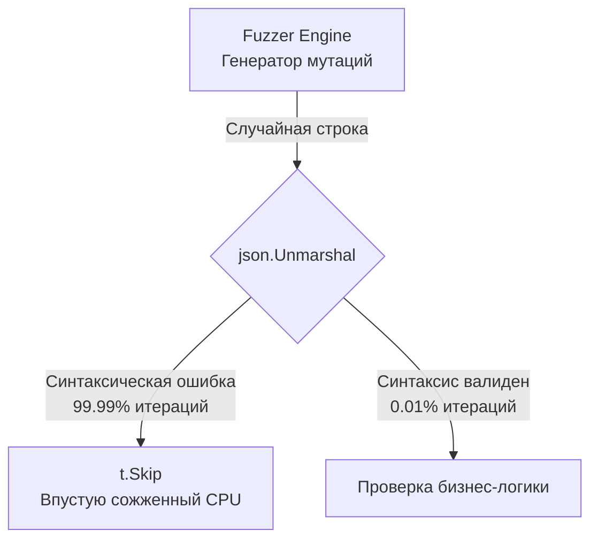

## Проблема сырой энтропии

В статье [[2. Property based testing]] мы научились описывать математически строгие свойства нашей бизнес-логики и тестировать их с помощью фаззера. Но мы намеренно обходили стороной одну серьезную архитектурную проблему: фаззер в Go (`testing.F`) умеет генерировать только примитивные типы данных (`[]byte`, `string`, `int`, `float64` и т.д.).

Ваша реальная бизнес-логика (сервисный слой) редко принимает сырые байты. Она работает со сложными доменными сущностями (Entities), DTO и структурами с десятками вложенных полей. 

Возникает фундаментальный вопрос: **Как превратить поток случайных байт (энтропию) в осмысленные бизнес-объекты для фаззинга?**

Существует три основных подхода, и первый из них, который инстинктивно выбирают новички — самый губительный для производительности.

## Антипаттерн: Десериализация (JSON Trap)

Самая очевидная идея — заставить фаззер генерировать `[]byte` или `string`, а затем парсить их через `json.Unmarshal` в нашу структуру.

```go
// ПЛОХОЙ ПОДХОД
func FuzzProcessOrder_Naive(f *testing.F) {
	f.Add(`{"item_id": 123, "amount": 2, "status": "new"}`)

	f.Fuzz(func(t *testing.T, payload string) {
		var req OrderRequest
		// Пытаемся распарсить сгенерированный мусор как JSON
		if err := json.Unmarshal([]byte(payload), &req); err != nil {
			t.Skip() // Игнорируем невалидный JSON
		}

		// Вызов бизнес-логики...
	})
}
```

> [!warning] Ловушка / Gotcha: Смерть от синтаксиса
> Фаззер ничего не знает о формате JSON. Он просто меняет байты (bit flipping), обрезает строки и вставляет магические константы (`0xFF`, `NaN`). 
> 1. Когда фаззер берет ваш валидный Seed `{"amount": 2}` и меняет один байт на `{"amount": 2A}`, парсер JSON выдает ошибку. Вы вызываете `t.Skip()`.
> 2. В 99.99% итераций фаззер будет генерировать синтаксически невалидный JSON.
> 3. **Итог:** Ваш фаззер превратится в невероятно медленный тестер пакета `encoding/json` (который и так отлично протестирован авторами Go). Он застрянет на этапе парсинга и никогда не доберется до исследования ветвей вашей бизнес-логики. Кроме того, постоянные `Unmarshal` убьют сборщик мусора (GC) бесконечными аллокациями.



## Идиоматичный подход 1: Прямой маппинг аргументов

Функция-таргет (`f.Fuzz`) может принимать не один, а **множество** аргументов базовых типов. Фаззер будет мутировать их независимо друг от друга.

Идеальный подход — заставить фаззер генерировать примитивы и "на лету" (без аллокаций в куче) собирать из них структуру.

```go
package order_test

import (
	"testing"
	"yourproject/internal/domain"
)

func FuzzCalculateDiscount(f *testing.F) {
	// Добавляем Seed Corpus. Аргументы должны строго совпадать 
	// по типам и порядку с аргументами в f.Fuzz
	f.Add(uint64(1), 100.50, true, "VIP")
	f.Add(uint64(2), 15.00, false, "REGULAR")

	// Фаззер напрямую управляет полями!
	f.Fuzz(func(t *testing.T, id uint64, total float64, hasPromo bool, tier string) {
		// Собираем структуру (аллокация на стеке, 0 нагрузки на GC)
		order := domain.Order{
			ID:       id,
			Total:    total,
			HasPromo: hasPromo,
			Tier:     tier,
		}

		// Теперь фаззер сфокусирован на логике, а не на парсинге!
		discount, err := domain.CalculateDiscount(order)
		
		// Проверка инвариантов
		if err == nil {
			require.LessOrEqual(t, discount, order.Total, "Скидка не может быть больше суммы заказа")
			require.GreaterOrEqual(t, discount, 0.0, "Скидка не может быть отрицательной")
		}
	})
}
```

Этот подход невероятно быстр. Фаззер будет подкидывать `NaN`, `+Inf`, `-Inf` в `total`, огромные числа в `id` и рандомные строки в `tier`, выявляя паники при математических операциях и нехватку `default` ветвей в `switch`.

## Идиоматичный подход 2: Бинарное конструирование (Struct Packing)

Что делать, если структура очень большая (20+ полей) или содержит вложенные слайсы? Передавать 20 аргументов в `f.Fuzz` — это антипаттерн, который сделает код нечитаемым.

В таких случаях Senior-инженеры используют детерминированную сборку структур из "сырых" байт с помощью пакета `encoding/binary`. Это позволяет превратить один массив `[]byte` в сложное дерево объектов.

> [!info] Под капотом: Ограничение энтропии через побитовые операции
> При создании структуры из случайных байт часто нужно ограничить значения (например, статус заказа должен быть от 0 до 3). Использование модульной арифметики (`val % 4`) — это самый дешевый способ для CPU (1 тактовая инструкция) привести случайный мусор фаззера к валидной области значений бизнес-домена, минуя `t.Skip`.

```go
func FuzzComplexRouting(f *testing.F) {
	f.Add([]byte{0x00, 0x01, 0xFF, 0x0A, 0x00, 0x00, 0x00, 0x05}) // 8 байт seed

	f.Fuzz(func(t *testing.T, data []byte) {
		// Защита от Out-of-bounds (минимум 8 байт для структуры)
		if len(data) < 8 {
			t.Skip()
		}

		// Конструируем структуру детерминированно
		req := routing.RouteRequest{
			// Берем 1 байт и ограничиваем значение до 0..3 (например, enum типов маршрута)
			RouteType: routing.Type(data[0] % 4), 
			
			// Берем 1 байт как bool
			IsUrgent: data[1]%2 == 0,
			
			// Читаем 2 байта как uint16 (Big Endian)
			Priority: binary.BigEndian.Uint16(data[2:4]),
			
			// Оставшиеся байты используем как payload
			Payload: data[4:], 
		}

		// Вызываем сложный алгоритм
		_ = routing.BuildPath(req)
	})
}
```
Этот подход дает 100% валидные инпуты и работает со скоростью света. Фаззер быстро поймет, что изменение первых двух байт влияет на то, по какой ветке логики пойдет `BuildPath`, и начнет целенаправленно их мутировать.

## Высший пилотаж: gofuzz (Google)

Когда вам нужно фаззить гигантские DTO (например, объекты Kubernetes), ручное бинарное конструирование становится пыткой.

В Open Source экосистеме есть стандарт де-факто для этой задачи: `github.com/google/gofuzz`. Эта библиотека умеет заполнять любые Go-структуры (включая приватные поля, карты, вложенные указатели) случайными, но типобезопасными значениями, используя поток энтропии.

Хотя изначально она создавалась для генерации моков, её идеально комбинировать со встроенным `testing.F`:

```go
package k8s_test

import (
	"testing"
	fuzz "[github.com/google/gofuzz](https://github.com/google/gofuzz)"
	"yourproject/internal/k8s"
)

func FuzzPodValidator(f *testing.F) {
	// Добавляем минимальный payload
	f.Add([]byte("seed-entropy-for-fuzzer"))

	f.Fuzz(func(t *testing.T, entropy []byte) {
		// Создаем генератор на основе потока байт от фаззера Go
		fuzzer := fuzz.NewFromGoFuzz(entropy)

		var pod k8s.PodDefinition
		
		// Магия! fuzzer рекурсивно заполняет структуру, 
		// используя детерминированный алгоритм на основе entropy
		fuzzer.Fuzz(&pod)

		// Дополнительно можно настроить фаззер для конкретных полей
		// fuzzer.Funcs(func(e *k8s.EnvironmentVar, c fuzz.Continue) {
		//      e.Name = "ENV_" + c.RandString()
		// })

		err := k8s.ValidatePod(pod)
		// Проверка: Валидация никогда не должна паниковать, 
		// даже если Pod сгенерирован абсолютно безумным
		_ = err 
	})
}
```

## Итог

1. **Не используйте текстовые форматы (JSON/XML) для генерации.** Фаззер застрянет на синтаксисе и не дойдет до логики. Ваш CPU будет обогревать помещение вхолостую.
2. Для простых доменных сущностей используйте **прямой маппинг аргументов** `f.Fuzz(func(..., arg1, arg2))`. Это самый быстрый и идиоматичный подход в Go 1.18+.
3. Для точечного контроля и высокой скорости собирайте структуры вручную из **сырых `[]byte` через побитовые маски** и `encoding/binary`.
4. Для фаззинга монструозных DTO применяйте `github.com/google/gofuzz`, пробрасывая в него байты энтропии.

Мы разобрали теорию и методологию настройки фаззинга. Теперь пришло время посмотреть на реальные примеры из индустрии. Какие конкретно уязвимости находит фаззер в коде опытных Senior-разработчиков, где не справляются ни статические линтеры, ни Code Review? Об этом мы поговорим в следующей статье: [[4. Найденные баги через fuzzing]].