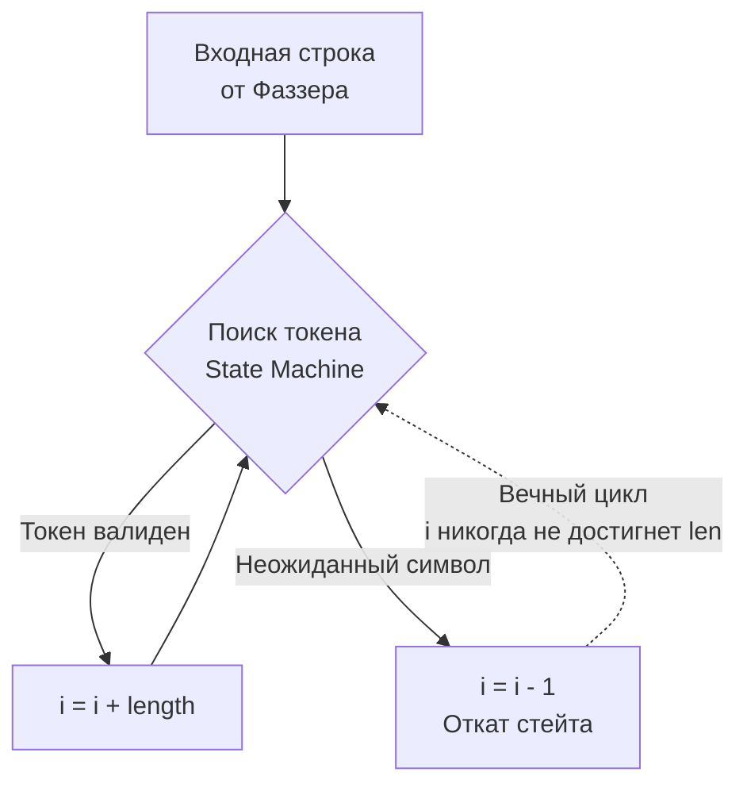

## Практика разрушения: Что фаззинг находит в дикой природе

В предыдущих статьях мы разобрали теорию фаззинга ([[1. Встроенный fuzzing в Go]]), научились описывать математические свойства систем ([[2. Property based testing]]) и правильно генерировать сложные бизнес-структуры из потока байт ([[3. Генерация входных данных]]). 

Всё это звучит как отличная академическая практика. Но Senior-разработчик мыслит прагматично: стоят ли затраты процессорного времени на фаззинг реальной выгоды? 

Ответ кроется в статистике уязвимостей (CVE). В экосистеме Go фаззинг регулярно находит критические баги даже в стандартной библиотеке (например, уязвимости в `crypto/elliptic` или парсере `net/http`). В этой статье мы препарируем классические паттерны багов, которые практически невозможно поймать на Code Review или обычными Unit-тестами, но которые фаззер выявляет за считанные секунды.

---

## 1. Смерть от короткого пакета (Index Out of Bounds)

Это самый популярный класс уязвимостей в сетевых демонах и парсерах кастомных протоколов. В Go выход за пределы слайса вызывает `panic: runtime error: slice bounds out of range`. 

> [!info] Под капотом: Bounds Checking
> В C/C++ чтение за пределами массива приведет к чтению "мусора" из памяти (или знаменитой уязвимости Heartbleed), либо к Segmentation Fault. Компилятор Go вставляет неявные инструкции проверки границ (Bounds Checking) перед каждым обращением к слайсу `data[i:j]`. Если `j > len(data)`, рантайм вызывает функцию `runtime.panicIndex`. 
> Если этот код работает в отдельной горутине (например, воркер из пула), которую вы не обернули в `defer recover()`, эта паника **убьет весь процесс приложения**. Это классический вектор атаки типа DoS (Denial of Service).

### Анатомия бага: TLV-парсер

Представьте парсер бинарного протокола Type-Length-Value (Тип-Длина-Значение):

```go
func ParseTLV(data []byte) (typ byte, val []byte) {
	if len(data) < 2 {
		return 0, nil
	}
	
	typ = data[0]
	length := int(data[1]) // Читаем заявленную длину
	
	// БАГ ЗДЕСЬ: Мы верим заявленной длине, не проверяя реальный размер data!
	val = data[2 : 2+length] 
	
	return typ, val
}
```

В Unit-тестах разработчик напишет `ParseTLV([]byte{0x01, 0x03, 'A', 'B', 'C'})` и тест пройдет. Но фаззер в первую же миллисекунду сгенерирует пакет: `[]byte{0x01, 0xFF, 'A'}`. Пакет физически содержит 3 байта, но заявляет длину `255`. Код попытается сделать срез `data[2:257]`, что мгновенно вызовет панику.

**Исправление:** Строгая валидация контракта:
```go
if 2+length > len(data) {
    return 0, nil // Или возвращаем ошибку ErrTruncatedPacket
}
```

---

## 2. Ловушка бесконечного цикла (CPU Starvation)

Фаззинг отлично находит алгоритмические баги, при которых программа не падает, а застревает в бесконечном цикле, сжигая 100% ядра процессора. Если злоумышленник отправит 1000 таких запросов на ваш бэкенд, у вас закончатся рабочие потоки (Goroutine Starvation), и сервер перестанет отвечать.

### Анатомия бага: Парсер с разделителем

```go
// ExtractChunks разбивает строку на чанки, разделенные запятой, 
// игнорируя экранированные запятые (\,).
func ExtractChunks(input string) []string {
	var chunks []string
	i := 0
	for i < len(input) {
		start := i
		// Ищем следующую запятую
		for i < len(input) && input[i] != ',' {
			if input[i] == '\\' {
				i += 2 // Пропускаем экранированный символ и следующий за ним
				continue
			}
			i++
		}
		chunks = append(chunks, input[start:i])
		i++ // Пропускаем найденную запятую для следующей итерации
	}
	return chunks
}
```

Фаззер найдет инпут, на котором этот код зависнет навсегда: строку, оканчивающуюся обратным слешем `\` (например, `"chunk1,\"`).

Когда цикл дойдет до `\`, он выполнит `i += 2`. Индекс `i` выйдет за пределы длины строки. Но условие внешнего цикла `i < len(input)` не будет проверено немедленно, так как мы вышли из внутреннего цикла. Затем происходит `chunks = append(...)` и `i++`. При следующей проверке `i < len(input)` индекс `i` может переполниться или логика окончательно сломается, но чаще всего подобные сдвиги индексов без жестких проверок приводят к тому, что счетчик "застревает", постоянно откатываясь или не увеличиваясь в ветке `else`. В данном конкретном коде при вводе `"\"` внутренний цикл сделает `i = 2`, внешний сделает `i = 3`, но представьте более сложный автомат (State Machine), где при ошибке парсинга мы делаем `i--` для отката состояния. 



**Как фаззер это ловит?** В движок встроено отслеживание времени. Если `FuzzTarget` не завершается за разумное время (зависает на несколько секунд), фаззер прерывает выполнение и рапортует о потенциальном зависании (Hang).

---

## 3. Целочисленное переполнение и Аллокационные бомбы (OOM)

Go — типобезопасный язык, но он не защищает от логики разработчика, которая просит аллоцировать гигантский объем памяти.

> [!warning] Ловушка / Gotcha: OOM Killer
> Операционная система (Linux) использует механизм OOM Killer (Out Of Memory). Если ваша программа запрашивает больше памяти, чем есть на сервере (или больше, чем разрешено лимитом cgroups в Kubernetes), ОС посылает процессу сигнал `SIGKILL` (Kill -9). Приложение умирает мгновенно, не вызывая панику внутри Go, не вызывая `defer`, логи не пишутся. Это невозможно перехватить.

### Анатомия бага: Массовая вставка

Предположим, ваш бэкенд принимает JSON-массив команд на вставку в БД. Чтобы минимизировать аллокации (как мы учились в статьях по производительности), вы решаете заранее выделить нужный объем памяти.

```go
func ParseBatchRequest(data []byte) (*Batch, error) {
	// ... парсинг заголовка ...
	// Заголовок говорит: "сейчас будет 10_000_000 записей"
	count := binary.BigEndian.Uint32(data[4:8])
	
	// БАГ ЗДЕСЬ: Мы доверяем count от клиента!
	records := make([]Record, count) 
	
	// ... заполнение records ...
	return &Batch{Records: records}, nil
}
```

Разработчик тестировал функцию с `count = 10` и `count = 1000`. 
Фаззер подставит туда `count = 4_294_967_295` (максимальное значение `uint32`).
Структура `Record` весит, скажем, 64 байта. Ваш код выполнит `make([]Record, 4294967295)`, попытавшись аллоцировать **~274 Гигабайта** оперативной памяти одним вызовом. Рантайм Go немедленно упадет с `panic: runtime error: makeslice: len out of range` (если размер превышает возможности платформы) или приложение будет убито OOM Killer'ом.

**Исправление:** Защита от аллокационных бомб:
1. Ввести жесткий лимит на уровне бизнес-логики: `if count > MaxBatchSize { return ErrTooLarge }`.
2. Избегать `make([]T, size)`, если данные поступают из недоверенного источника, и использовать `append`, либо аллоцировать кунками.

> [!tip] Собеседование
> **Вопрос:** Если мы используем `append` вместо `make` заранее, спасет ли это нас от аллокационной бомбы?
> **Ответ:** Отчасти. Если клиент пришлет 4 миллиарда реальных записей (гигабайты данных), сеть и парсер всё равно упадут по таймауту или памяти. Но если это атака типа "маленький payload, огромный заявленный размер", использование `append` спасет. Вредоносный пакет размером 10 байт заявляет `count = 4_000_000_000`. При `make` мы сразу падаем от OOM. При `append` мы прочитаем реальные 10 байт, добавим 1 элемент, цикл завершится, и мы просто вернем ошибку "неожиданный конец файла".

---

## 4. Нарушение инвариантов бизнес-логики (Property Fails)

До сих пор мы рассматривали креши. Но фаззинг, объединенный с PBT ([[2. Property based testing]]), находит глубокие логические дефекты.

### Анатомия бага: Финансовый балансировщик

У нас есть функция, которая распределяет сумму платежа между N получателями в заданных пропорциях (например, сплит счета в ресторане).

```go
// Инвариант: Сумма долей должна быть строго равна исходной сумме.
func SplitPayment(total int64, weights []int) []int64 {
	sumWeights := 0
	for _, w := range weights {
		sumWeights += w
	}
	
	if sumWeights == 0 {
		return nil
	}

	result := make([]int64, len(weights))
	for i, w := range weights {
		// Расчет доли с округлением вниз (целочисленное деление)
		result[i] = total * int64(w) / int64(sumWeights) 
	}
	
	return result
}
```

В Unit-тестах: `SplitPayment(100, []int{1, 1})` вернет `[50, 50]`. `50+50 == 100`. Идеально.

Запускаем фаззер, который проверяет свойство: `sum(result) == total`.
Фаззер генерирует: `SplitPayment(100, []int{1, 1, 1})`.
Внутри функции:
* `sumWeights = 3`
* Получатель 1: `100 * 1 / 3 = 33`
* Получатель 2: `100 * 1 / 3 = 33`
* Получатель 3: `100 * 1 / 3 = 33`
* Сумма в результате: `99`. 

**Фаззер ловит баг потери точности.** 1 цент/копейка потерялась! В финтехе такие ошибки недопустимы, так как баланс системы перестает сходиться. 

**Исправление:** Алгоритм должен сохранять остаток от деления (modulo) и распределять его (например, добавив "потерянные" копейки первым получателям или случайным образом). Это сложный алгоритмический кейс, который фаззер находит за долю секунды.

## Итог

Фаззинг в Go — это не просто инструмент для параноиков из отдела ИБ (InfoSec). Это ежедневный инструмент Senior-инженера для создания "пуленепробиваемых" (bulletproof) бэкендов.

Он гарантированно выявляет:
1. **Паники индексов (Out of Bounds)** в парсерах.
2. **Аллокационные бомбы (OOM)** при слепом доверии входным параметрам размера.
3. **Бесконечные циклы** и блокировки процессора из-за необработанных edge-кейсов в автоматах состояний.
4. **Потерю точности и округлений** при тестировании математических инвариантов бизнес-логики.

Осознание того, на что способен фаззинг, заставляет переосмыслить подход к написанию кода. Однако, фаззинг требует ресурсов (CPU и времени). Нужно ли писать фазз-тесты для каждого CRUD-хэндлера? Где та грань, где фаззинг превращается из необходимой защиты в бессмысленную трату времени? Об этом мы поговорим в завершающей статье раздела: [[5. Когда fuzzing реально нужен]].