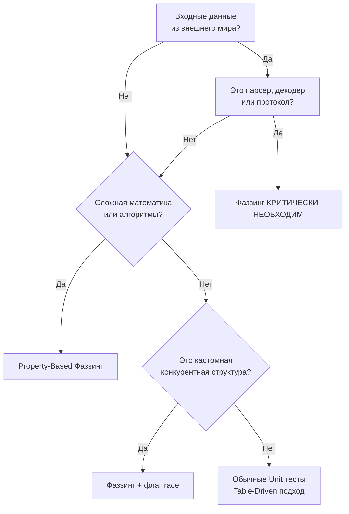

## Прагматика разрушения: Серебряных пуль не бывает

Мы изучили механику фаззинга, научились применять Property-Based Testing ([[2. Property based testing]]) и генерировать сложные доменные сущности ([[3. Генерация входных данных]]). Теперь пришло время посмотреть на этот инструмент глазами Архитектора и Principal Engineer.

Фаззинг — это дорогой инструмент. Он сжигает огромное количество процессорного времени (CPU time), требует тщательной настройки инвариантов и усложняет CI/CD пайплайны. Если вы попытаетесь фаззить каждый CRUD-хэндлер или каждый метод репозитория, вы потратите недели на написание тестов, которые никогда не найдут реальных багов, но сделают процесс сборки невыносимо долгим.

Тестирование — это всегда вопрос ROI (Return on Investment). Мы должны применять фаззинг только там, где обычные [[4. Table driven tests]] бессильны, а цена ошибки катастрофична.

## Когда фаззинг КРИТИЧЕСКИ необходим

Существуют три класса задач, где отсутствие фаззинга в современном бэкенде считается инженерной халатностью.

### 1. Парсеры и обработчики недоверенных данных

Главное правило: **Любой код, который принимает поток байт из внешнего мира и пытается придать ему структуру, должен быть отфаззен.**

* **Кастомные сетевые протоколы:** Парсинг TCP/UDP пакетов, бинарные заголовки, кастомные RPC.
* **Декодеры форматов:** Если вы пишете свой парсер CSV, JSON, XML, изображений (PNG, JPEG) или архивов (ZIP, Tar).
* **Криптография:** Обработка сертификатов, подписей, ключей (ASN.1, PEM).

> [!info] Под капотом: State Space Explosion
> Почему здесь не справляются Unit-тесты? Парсеры обычно реализуются как конечные автоматы (State Machines) со множеством ветвлений и циклов `for`. Количество путей выполнения (Execution Paths) в парсере растет экспоненциально. Разработчик может написать 50 тест-кейсов, покрыв 90% строк кода (Statement Coverage), но покрыть лишь 5% реальных путей (Path Coverage). Фаззер Go, опираясь на Coverage-Guided движок, целенаправленно ищет "ядовитые" последовательности байт, которые загоняют автомат в непредвиденное состояние или бесконечный цикл.

### 2. Сложная алгоритмика и математика

Если ваш код принимает решения на основе множества переменных, и правильность этих решений трудно проверить "глазами".

* **Финансовые движки:** Сплит транзакций, расчет сложных налоговых ставок, плавающие комиссии.
* **Системы балансировки и роутинга:** Алгоритмы выбора шардов баз данных, распределение нагрузки (Consistent Hashing), расчет кратчайшего пути.
* **Нормализаторы и санитайзеры:** Очистка HTML от XSS-уязвимостей, парсинг и форматирование телефонных номеров, валидация сложных email-адресов.

В этих сценариях фаззинг применяется исключительно в связке с Property-Based Testing для проверки инвариантов (например, "сумма всех сплитов равна исходной сумме").

### 3. Конкурентные структуры данных

Мы привыкли ловить гонки данных через `go test -race` (о чем говорили в [[2. Data race и race detector]]). Но чтобы детектор гонок сработал, тест должен физически пройти по уязвимой ветке кода одновременно из двух горутин.

Если вы пишете свой кастомный потокобезопасный кэш (Concurrent Cache), Worker Pool или Ring Buffer, вы можете использовать фаззинг для генерации случайных сценариев нагрузки:

```go
f.Fuzz(func(t *testing.T, opsData []byte) {
    // Используем opsData как инструкцию для воркеров:
    // Байт 0x01 -> Запись, Байт 0x02 -> Чтение, Байт 0x03 -> Удаление
    // Запускаем их конкурентно в горутинах
})
```
Запуск такого фазз-теста с флагом `-race` создает невероятно агрессивную и хаотичную среду, которая выявляет дедлоки и Data Races, недостижимые в стерильных условиях обычных тестов.



## Антипаттерны: Когда фаззинг бесполезен

Не пытайтесь "натянуть сову на глобус". Фаззинг будет пустой тратой времени в следующих случаях:

1.  **Типовой CRUD и Бизнес-логика слоев Usecase/Service:**
    Если ваш метод `CreateUser` просто проверяет пару `if` и делает `INSERT` в PostgreSQL, фаззить его бессмысленно. Вы либо будете тестировать парсер SQL-драйвера, либо убьете базу данных шквалом запросов. Интеграционных тестов (например, через [[8. HTTP integration тесты]]) здесь более чем достаточно.
2.  **Функции с тяжелым I/O (Диск, Сеть):**
    Фаззинг требует скорости. Чтобы найти баг, фаззер должен выполнить `Target Function` десятки тысяч раз в секунду. Если ваша функция делает сетевой запрос (даже замоканный через локальный сокет), скорость упадет до сотен итераций в секунду. Фаззинг потеряет свою эффективность. Фаззинг — для чистых (Pure) функций в оперативной памяти.
3.  **Клей-код (Glue Code):**
    Код, который просто перекладывает данные из одной структуры в другую (мапперы DTO). У него нет ветвлений, там нечего фаззить.

> [!warning] Ловушка / Gotcha: Мутация криптографических подписей
> Если вы пытаетесь фаззить HTTP-хэндлер, который защищен проверкой JWT-токена или HMAC-подписью, фаззер никогда не пройдет дальше мидлвари валидации. Он будет бесконечно мутировать байты токена, получая `HTTP 401 Unauthorized`. 
> Чтобы фаззить полезную нагрузку (Payload) за защищенным контуром, вы должны вынести эту логику в отдельную функцию, не зависящую от подписей, и фаззить именно её.

## Фаззинг в CI/CD: Стратегия Senior-инженера

Одна из главных проблем внедрения фаззинга — это его бесконечность. Команда `go test -fuzz` работает, пока вы её не остановите (или пока не найдет баг). Как встроить это в CI/CD пайплайн, чтобы не заблокировать релизы?

> [!tip] Собеседование
> **Вопрос:** Как вы интегрируете встроенный фаззинг Go в конвейер CI/CD? Запускаете ли вы его на каждый Pull Request?
> **Ответ:** Мы разделяем запуск на две фазы. 
> 1. **На каждый Pull Request (PR):** Мы запускаем `go test ./...` *без* флага `-fuzz`. В этом режиме Go выполняет фазз-тесты как обычные юнит-тесты, подавая на вход только Seed Corpus (`f.Add`) и краш-кейсы из папки `testdata/fuzz/`. Это выполняется мгновенно и защищает от регрессий (повторного появления уже найденных багов).
> 2. **Ночные сборки (Nightly) / Continuous Fuzzing:** В отдельном пайплайне, который не блокирует разработчиков, мы запускаем `go test -fuzz=FuzzName -fuzztime=30m` (или непрерывно на выделенном сервере через OSS-Fuzz). Если за ночь находится баг, CI создает тикет, и "ядовитый" инпут коммитится в репозиторий.

## Итог раздела

Раздел фаззинга завершен. Подведем итоги того, как вывели автоматизированное тестирование на новый уровень:
1. Мы узнали, что Go обладает встроенным **Coverage-Guided** фаззером, который сам ищет уязвимости ([[1. Встроенный fuzzing в Go]]).
2. Мы перешли от тестирования примеров к тестированию математических инвариантов бизнес-логики ([[2. Property based testing]]).
3. Мы научились конвертировать сырую энтропию в строгие доменные структуры ([[3. Генерация входных данных]]).
4. Мы препарировали реальные уязвимости (OOM, Hangs, Panics), которые фаззер находит в дикой природе ([[4. Найденные баги через fuzzing]]).

Надежность — это важно. Но в мире высоконагруженного бэкенда код должен быть не только безошибочным, но и молниеносно быстрым. Насколько быстр ваш код? Сколько мусора он генерирует? И как доказать, что ваша оптимизация действительно сработала, а не стала жертвой иллюзий компилятора? 

Мы переходим к следующему фундаментальному разделу инженерии: Производительность.
Следующая статья: [[1. Benchmarking в Go]].