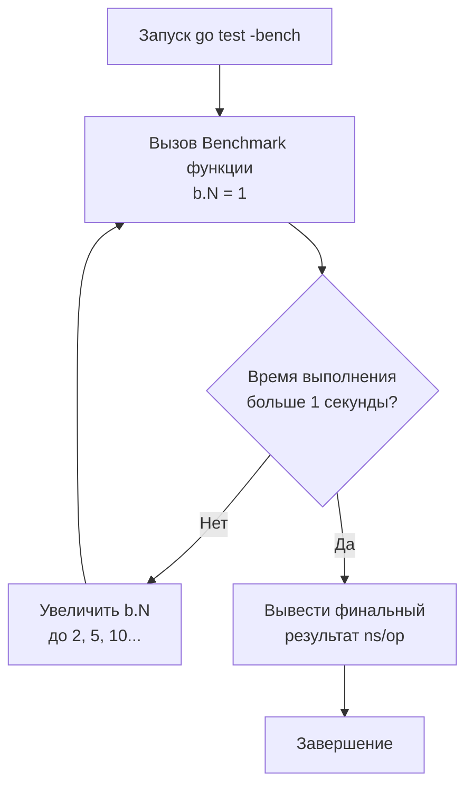

## Искусство измерения: Зачем нам Benchmarks

В предыдущих разделах мы досконально разобрали функциональное тестирование: от базовых юнит-тестов до фаззинга и валидации контрактов. Мы научились доказывать, что наш код работает **правильно**. Но в мире высоконагруженного бэкенда правильность — это лишь половина дела. Код должен работать **быстро**, потреблять минимум процессора и не перегружать Garbage Collector (GC).

Язык Go создавался с прицелом на производительность, и именно поэтому инструменты для микрооптимизаций встроены прямо в стандартную библиотеку. В Go вам не нужно гадать, какой алгоритм быстрее: конкатенация строк через `+` или `strings.Builder`. Вы можете написать **Benchmark** за 30 секунд и получить точный, математически обоснованный ответ.

## Базовый синтаксис и магия b.N

Бенчмарки в Go живут в тех же файлах `*_test.go`, что и обычные тесты. Вместо `*testing.T` они принимают указатель на `*testing.B`.

Главная особенность бенчмарка — это цикл `for i := 0; i < b.N; i++`.

```go
package performance_test

import (
	"strings"
	"testing"
)

// BenchmarkBuilder тестирует конкатенацию через strings.Builder
func BenchmarkBuilder(b *testing.B) {
	// Подготовительный код (выполняется 1 раз)
	words := []string{"Go", "is", "awesome", "and", "fast"}

	// Сбрасываем таймер, чтобы подготовка не вошла в результат
	b.ResetTimer()

	// Сам бенчмарк (выполняется b.N раз)
	for i := 0; i < b.N; i++ {
		var builder strings.Builder
		for _, w := range words {
			builder.WriteString(w)
		}
		_ = builder.String()
	}
}
```

Чтобы запустить бенчмарк, используется флаг `-bench`:
```bash
# Запустить все бенчмарки в текущем пакете. 
# Обычные тесты игнорируются (точка - это регулярка, совпадающая со всем)
go test -bench . -benchmem
```

> [!info] Под капотом: Как рантайм подбирает b.N
> Если вы пришли из языков вроде PHP или Python, вы привыкли писать тесты производительности с жестко заданным количеством итераций (например, `for i := 0; i < 10000`). Это плохой подход: если операция занимает 1 наносекунду, 10000 итераций выполнятся за микросекунду, и планировщик ОС исказит результат (погрешность переключения контекста).
> 
> В Go значение `b.N` **динамическое**. Фреймворк `testing` запускает ваш бенчмарк несколько раз.
> Сначала `b.N` равно 1. Если бенчмарк завершился слишком быстро (быстрее, чем `benchtime`, по умолчанию 1 секунда), фреймворк увеличивает `b.N` (1, 2, 5, 10, 20, 50, 100...) и запускает функцию заново.
> Это продолжается до тех пор, пока цикл не проработает достаточно долго для сбора статистически значимой метрики (исключающей всплески загрузки CPU фоновыми процессами ОС).



## Управление таймером (Timer Management)

Часто перед выполнением критического участка кода нам нужно сгенерировать мегабайты тестовых данных. Если мы не исключим время генерации, наш бенчмарк покажет завышенное время (Latency).

Для этого есть методы `b.ResetTimer()`, `b.StopTimer()` и `b.StartTimer()`.

> [!tip] Собеседование
> **Вопрос:** В чем ошибка вызова `b.ResetTimer()` внутри цикла `for i := 0; i < b.N; i++`?
> **Ответ:** Это фатальная ошибка, которая сломает статистику. Если вызывать сброс таймера на каждой итерации, вы будете измерять время только последней итерации (когда `i == b.N - 1`), а не сумму всех итераций. Более того, постоянные вызовы функций таймера добавят колоссальный оверхед, сделав бенчмарк бессмысленным. Таймер нужно останавливать и запускать **вокруг** тяжелых подготовительных операций внутри цикла, но лучше избегать аллокаций внутри цикла вообще, если они не являются целью теста.

Правильный паттерн со сложной подготовкой внутри цикла:
```go
func BenchmarkComplexSort(b *testing.B) {
	for i := 0; i < b.N; i++ {
		b.StopTimer() // Останавливаем секундомер
		
		// Генерируем новый несортированный массив на 100 000 элементов 
		// (тяжелая операция аллокации и рандома)
		data := generateRandomData(100000) 
		
		b.StartTimer() // Включаем секундомер

		// Измеряем только саму сортировку!
		algorithms.Sort(data)
	}
}
```

## Ловушка: Компилятор умнее вас (Dead-code elimination)

Современный компилятор Go — это агрессивная машина оптимизаций. Если вы напишете бенчмарк неправильно, компилятор просто "вырежет" ваш код (Dead-code elimination).

```go
// ПЛОХОЙ БЕНЧМАРК
func BenchmarkAddBad(b *testing.B) {
	for i := 0; i < b.N; i++ {
		// Компилятор видит, что результат сложения нигде не используется
		// и может полностью удалить эту строку из ассемблерного кода!
		_ = 1 + 2 
	}
}
```

В результате бенчмарк покажет невероятную скорость (например, `0.3 ns/op`), потому что цикл будет пустым.

**Идиоматичное решение:** Сохранять результат в глобальную переменную уровня пакета.

```go
var Result int // Экспортируемая (или неэкспортируемая) глобальная переменная

func BenchmarkAddGood(b *testing.B) {
	var r int
	for i := 0; i < b.N; i++ {
		r = 1 + 2
	}
	// Присваиваем локальный результат в глобальную переменную.
	// Компилятор не знает, кто и когда может прочитать Result, 
	// поэтому он ОБЯЗАН выполнить вычисления в цикле.
	Result = r
}
```

## Бенчмаркинг Аллокаций (Mechanical Sympathy)

Производительность в Go почти всегда упирается не в такты процессора (CPU cycles), а в аллокации памяти. Создание объекта в куче (Heap) — это дорогая операция (поиск свободного блока памяти), а последующая сборка мусора (GC) останавливает весь мир (Stop The World) или отнимает кванты времени у горутин.

Для отслеживания аллокаций используйте флаг `-benchmem` в консоли или вызывайте `b.ReportAllocs()` внутри бенчмарка.

```go
func BenchmarkStringConcat(b *testing.B) {
	b.ReportAllocs() // Эквивалентно запуску с флагом -benchmem
	var s string
	for i := 0; i < b.N; i++ {
		// Эта операция форсирует Escape Analysis отправить строку в Heap
		s = "hello" + " " + "world"
	}
	GlobalStr = s
}
```

Вывод будет выглядеть так:
`BenchmarkStringConcat-8   50000000    25.5 ns/op    16 B/op    1 allocs/op`
Это означает: на 1 операцию уходит 25.5 наносекунд, выделяется 16 байт памяти и происходит 1 аллокация в куче.

> [!warning] Ловушка / Gotcha: Escape Analysis в Бенчмарках
> Будьте осторожны при вызове функций интерфейсов (например `io.Writer`) в бенчмарках. Если вы передаете локальную переменную в метод, принимающий интерфейс (например, `fmt.Fprintf(&buf, ...)`), эта переменная **утекает в кучу** (Escapes to Heap) просто из-за семантики работы `any` или интерфейсов в Go. Ваш бенчмарк может показать лишние аллокации, которых на самом деле не будет в Production-коде, если там используется инлайнинг (Inlining) или конкретные типы.

## Конкурентные Бенчмарки: b.RunParallel

В бэкенде код почти никогда не выполняется последовательно в одном потоке. Чтобы протестировать, как ваша структура данных (например, `sync.RWMutex` или `sync.Pool`) ведет себя под конкурентной нагрузкой и возникает ли **Lock Contention** (борьба за блокировки), используют `b.RunParallel()`.

```go
func BenchmarkAtomicStore(b *testing.B) {
	var val int64
	
	// RunParallel создает несколько горутин (по умолчанию равно GOMAXPROCS)
	// и распределяет итерации b.N между ними.
	b.RunParallel(func(pb *testing.PB) {
		// pb.Next() возвращает true, пока есть выделенные для этой горутины итерации
		for pb.Next() {
			atomic.AddInt64(&val, 1)
		}
	})
}
```

Если вы хотите сымитировать нагрузку, в 10 раз превышающую количество ядер процессора, перед вызовом `RunParallel` используйте `b.SetBytes` (для расчета пропускной способности MB/s) или `b.SetParallelism(10)`. Это увеличит количество запускаемых горутин, заставляя планировщик Go агрессивно переключать контекст, имитируя суровую реальность высоконагруженного веб-сервера.

## Эффекты Кэша L1/L2 (Cache Warming)

Бенчмарки — это "лабораторные мыши". Они часто показывают результаты, далекие от Production, из-за механического устройства процессора.

Если ваш бенчмарк сортирует слайс из 100 элементов по кругу миллион раз, этот слайс "залипает" в сверхбыстром кэше L1 процессора (Cache Warming). Операции обращения к памяти будут занимать 1-2 наносекунды.
Но в Production ваш код будет обрабатывать 100 элементов среди гигабайтов других данных. Эти данные не поместятся в L1/L2 и будут считываться из RAM (Main Memory), что занимает ~100 наносекунд. Производительность в реальности может быть в 50-100 раз хуже, чем в бенчмарке!

Чтобы этого избежать, в бенчмарках используют массивы случайных данных, размер которых значительно превышает объем кэша L3 (например, аллоцируют 50 Мегабайт фиктивных данных и итерируются по ним случайным образом).

## Итог

1. Бенчмарки в Go пишутся легко, но требуют математической и инженерной строгости (управление таймером, победа над оптимизатором компилятора).
2. Динамическое значение `b.N` гарантирует статистическую значимость теста.
3. Показатель `allocs/op` (аллокации в куче) часто важнее, чем `ns/op` (чистое процессорное время).
4. `b.RunParallel()` — ваш главный инструмент для выявления деградации алгоритмов при конкурентном доступе.

Вы запустили бенчмарк, и он показывает 2000 ns/op и 15 allocs/op. Это много или мало? А главное — **где именно** программа теряет эти наносекунды и выделяет эту память? Чтобы ответить на этот вопрос, нам придется заглянуть в "черный ящик" выполнения нашей программы. Переходим к следующей статье: [[2. Profiling внутри тестов]].