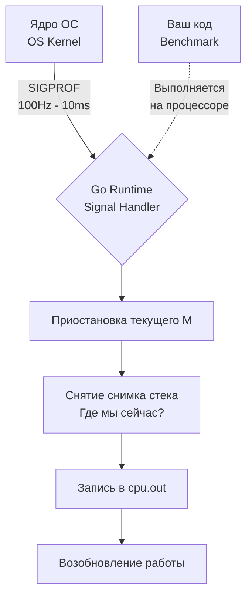

## От диагноза к лечению: Зачем нужен профайлинг

В предыдущей статье [[1. Benchmarking в Go]] мы научились измерять производительность нашего кода с математической точностью. Бенчмарк честно скажет вам, что функция `ProcessData` занимает 2 миллисекунды и делает 45 аллокаций. Но он **не скажет**, какая именно строчка кода тормозит процессор и какой именно объект "утекает" в кучу (Heap).

Бенчмаркинг — это термометр. Профайлинг — это МРТ вашего приложения.

Экосистема Go поставляется со встроенным и невероятно мощным инструментом профилирования — `pprof`. В этой статье мы разберем, как генерировать профили прямо во время запуска тестов и как этот механизм работает на уровне взаимодействия рантайма и операционной системы.

## Флаги тестирования: Профайлинг из коробки

Самый простой и идиоматичный способ собрать профиль — передать специальные флаги утилите `go test`. Вам не нужно менять ни строчки бизнес-кода или кода бенчмарков.

```bash
# Запускаем бенчмарки и собираем профиль CPU и памяти
go test -bench=^BenchmarkProcessData$ -cpuprofile=cpu.out -memprofile=mem.out
```

> [!warning] Ловушка / Gotcha: Профайлинг обычных тестов
> Новички часто пытаются собрать профиль обычного unit-теста без флага `-bench`:
> `go test -cpuprofile=cpu.out`. 
> Результат такого профиля будет практически бесполезным. Unit-тесты выполняются за микросекунды. Профайлер просто не успеет собрать достаточное количество выборок (сэмплов), и вы увидите пустой или сильно искаженный отчет, состоящий из функций инициализации пакета `testing`. 
> **Золотое правило:** Профайлинг всегда выполняется поверх долгоиграющих бенчмарков (где рантайм сам подбирает `b.N` для длительного выполнения).

В результате выполнения команды в вашей директории появятся два бинарных файла: `cpu.out` и `mem.out`. Это сжатые файлы в формате Protocol Buffers, которые содержат сырые статистические данные.

## Mechanical Sympathy: Как работает pprof под капотом

Профайлер в Go — это не магический сканер, который "видит" всё. Это статистический инструмент, работающий по принципу **Семплирования (Sampling)**. Чтобы правильно читать профили, нужно понимать физику их сбора.

### 1. CPU Profiling (Профилирование процессора)

Когда вы передаете флаг `-cpuprofile`, рантайм Go обращается к ядру операционной системы с просьбой настроить аппаратный таймер (OS Timer).

1. ОС начинает посылать процессу Go специальный сигнал `SIGPROF` ровно **100 раз в секунду** (каждые 10 миллисекунд).
2. Когда поток ОС (M) получает этот сигнал, он немедленно прерывает выполнение текущей горутины (G).
3. Рантайм Go "замораживает" стек вызовов (Stack Trace) прерванной горутины, записывает, какая функция выполнялась в эту наносекунду, и сохраняет это в буфер профиля.
4. Выполнение продолжается до следующего прерывания.



**Следствие для инженера:** Если функция невероятно быстрая (выполняется за 1 микросекунду) и вызывается редко, она может *никогда* не попасть в срез `SIGPROF`. CPU-профиль показывает не *точное* время выполнения каждой функции, а **вероятностную долю** времени, которую функция занимала на процессоре во время теста.

### 2. Memory Profiling (Профилирование памяти)

Профайлер памяти работает иначе. Он не использует прерывания по времени. Вместо этого он интегрирован прямо в аллокатор памяти Go (функция `mallocgc`).

По умолчанию Go записывает стек-трейс **каждые выделенные 512 Килобайт** памяти в куче (Heap). 
* Если вы аллоцируете мелкие объекты по 16 байт, профиль запишет только каждый 32768-й объект. 
* Если вы выделите массив на 1 Мегабайт, профайлер гарантированно зафиксирует это событие.

> [!tip] Собеседование
> **Вопрос:** Мы запустили бенчмарк с флагом `-memprofile` и видим, что профиль показывает меньше выделенной памяти, чем реальный RSS процесса в диспетчере задач ОС. Почему?
> **Ответ:** Во-первых, memprofile учитывает только аллокации в куче (Heap), он не видит память стеков горутин, внутренние структуры рантайма и кэши аллокатора ОС (mmap). Во-вторых, memprofile использует вероятностное семплирование (1 на 512 КБ). Мелкие аллокации могут проскользнуть мимо семплера. Если для точного дебага нужно зафиксировать *каждую* аллокацию, можно изменить рейт сэмплирования через `runtime.MemProfileRate = 1`, но это катастрофически замедлит выполнение кода.

## Эффект наблюдателя (Observer Effect)

В квантовой физике измерение системы меняет её состояние. В системной инженерии это называется **Observer Effect (Оверхед профилирования)**.

Сбор профиля CPU (особенно прерывания `SIGPROF`) замедляет выполнение программы на 1-5%. Сбор профиля памяти добавляет нагрузку на аллокатор.

> [!warning] Ловушка / Gotcha: Смешивание профилей
> Категорически не рекомендуется собирать CPU и Memory профили одновременно, если вам нужна хирургическая точность бенчмарка.
> Оверхед от работы сэмплирования памяти (дополнительные вызовы в аллокаторе) изменит профиль использования CPU. Рантайм будет тратить процессорное время на запись данных профиля памяти, и это отразится в `cpu.out`.
> **Правильный подход:** Делайте два независимых запуска `go test`.
> 1. `go test -bench . -cpuprofile cpu.out`
> 2. `go test -bench . -memprofile mem.out`

## Хирургический профайлинг внутри кода

Флаги `go test` собирают профиль **всего** времени выполнения бинарника, включая фазы подготовки (Setup) и очистки (Teardown). Мы уже знаем, что методы `b.ResetTimer()` останавливают секундомер бенчмарка. Но они **не останавливают** сборщик CPU-профиля! `SIGPROF` продолжает "тикать" и записывать функции генерации фиктивных данных в ваш `cpu.out`.

Если фаза подготовки огромна, ваш профиль будет "загрязнен" нерелевантными вызовами. В таких случаях Senior-инженеры включают профайлер программно, оборачивая только критическую секцию.

Для этого используется пакет `runtime/pprof`:

```go
package performance_test

import (
	"os"
	"runtime/pprof"
	"testing"
	"yourproject/internal/heavy"
)

func BenchmarkSurgicalProfile(b *testing.B) {
	// 1. Тяжелая подготовка данных (НЕ попадет в профиль)
	data := heavy.GenerateHugeDataset(1000000)

	// 2. Подготовка файла для профиля
	f, err := os.Create("surgical_cpu.out")
	if err != nil {
		b.Fatal(err)
	}
	defer f.Close()

	b.ResetTimer()

	// 3. Запускаем профайлинг ТОЛЬКО для нужного участка
	if err := pprof.StartCPUProfile(f); err != nil {
		b.Fatal(err)
	}

	for i := 0; i < b.N; i++ {
		heavy.ProcessDataset(data)
	}

	// 4. Останавливаем профайлинг
	pprof.StopCPUProfile()
}
```
Этот профиль будет кристально чистым, содержащим только вызовы внутри цикла `for i < b.N`.

## Другие виды профилей

Хотя CPU и Memory — это хлеб с маслом оптимизации, `go test` поддерживает генерацию специфических профилей для отладки конкурентности:

* **`-blockprofile=block.out`**: Показывает, где горутины блокируются (ждут) на каналах, мьютексах и `select`. Критически важно для поиска "бутылочных горлышек" в конвейерах (Pipelines) и Worker Pools.
* **`-mutexprofile=mutex.out`**: Фокусируется конкретно на `sync.Mutex` и `sync.RWMutex`. Показывает, какие мьютексы вызывают наибольшую задержку (Lock Contention) при конкурентном доступе из параллельных бенчмарков (`b.RunParallel`).

## Итог

1. Бенчмарки без профайлинга — это слепое гадание. Используйте флаги `-cpuprofile` и `-memprofile` вместе с `go test -bench`.
2. Профайлеры Go работают на основе **семплирования** (SIGPROF для CPU, хуки в аллокаторе для RAM), что делает их легкими, но вероятностными.
3. Избегайте "Эффекта наблюдателя": запускайте профилирование CPU и памяти отдельными командами.
4. Если подготовка теста занимает много времени, управляйте профилировщиком вручную через пакет `runtime/pprof`.

Мы сгенерировали бинарные файлы `.out`. Они лежат на диске, но в текстовом редакторе выглядят как нечитаемый мусор. Как превратить эти сырые байты в понятные графы вызовов (Call Graphs), Flame-графики и ассемблерные инструкции? Для этого мы воспользуемся главным инструментом оптимизатора — утилитой `go tool pprof`. Подробный разбор ее интерфейса и паттернов поиска узких мест ждет нас в следующей статье: [[3. CPU и memory profiling]].