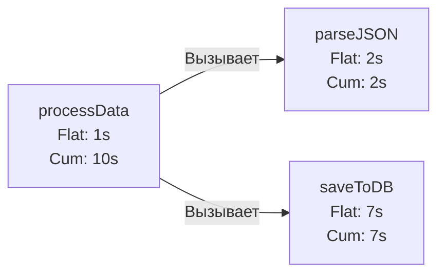

## Вскрытие черного ящика: Анализ с помощью pprof

В прошлой статье [[2. Profiling внутри тестов]] мы сгенерировали бинарные файлы профилей: `cpu.out` и `mem.out`. Сами по себе они — лишь сжатые наборы статистических данных (Protocol Buffers). Чтобы превратить их в инсайты, которые позволят ускорить ваш код в десятки раз, нам нужен интерпретатор.

В экосистему Go встроена мощнейшая утилита для визуализации и анализа профилей — `go tool pprof`.

Существует два способа работы с ней: классический консольный интерфейс (CLI) и современный Web UI. Мы разберем оба, так как каждый имеет свои уникальные сценарии применения.

## Современный подход: Web UI и Флейм-графы

Забудьте на минуту про консоль. Самый быстрый способ найти узкое место (bottleneck) в 2026 году — это визуализация. Запустите pprof с флагом `-http`:

```bash
go tool pprof -http=:8080 cpu.out
```

Эта команда поднимет локальный веб-сервер и откроет браузер. По умолчанию вы увидите **Граф вызовов (Call Graph)**, где прямоугольники — это функции, а стрелки — вызовы. Чем больше прямоугольник и толще стрелка, тем больше ресурсов потребляет этот путь.

Но самый мощный инструмент скрыт в меню `View -> Flame Graph`.

### Как читать Flame Graph (Граф пламени)

Флейм-граф — это абсолютный стандарт индустрии профилирования. 
* **Ось X (Ширина):** Показывает процент времени, которое процессор потратил на функцию. Чем шире блок, тем больше ресурсов он "съел". Порядок блоков по горизонтали не имеет значения (это не шкала времени выполнения, а агрегация).
* **Ось Y (Высота):** Показывает глубину стека вызовов (Stack Depth). Функция наверху вызывает функции под ней.

Если вы видите очень **широкий блок без "детей"** (под ним нет других блоков) — это ваша идеальная мишень для оптимизации. Программа проводит львиную долю времени прямо внутри этой функции.

> [!info] Под капотом: Куда пропадают функции? (Inlining)
> Вы смотрите на Flame Graph и не можете найти свою маленькую вспомогательную функцию `calculateDiscount()`, хотя точно знаете, что она вызывается миллионы раз. Почему?
> Современный компилятор Go использует агрессивный **Инлайнинг (Inlining)**. Если функция достаточно простая, компилятор не делает ассемблерный вызов `CALL`, а просто вставляет тело этой функции прямо в место вызова (чтобы сэкономить накладные расходы на работу со стеком). 
> Профайлер видит уже скомпилированный код, поэтому заинлайненные функции "сливаются" со своими родителями на графике. Чтобы отключить инлайнинг для чистого эксперимента, запустите тесты с флагом `go test -gcflags="-l"`.

## Терминология: Flat vs Cum (Плоское vs Накопленное)

Если вы перейдете в режим `View -> Top`, вы увидите таблицу функций. Это самый сложный момент для новичков. У каждой функции есть две главные метрики: **Flat** и **Cum** (Cumulative).

Разберем на простом примере:
```go
func main() {
    processData() // Заняла 10 секунд
}

func processData() {
    // Какая-то своя логика (1 секунда)
    parseJSON()   // (2 секунды)
    saveToDB()    // (7 секунд)
}
```

* **Flat (Плоское время):** Время, потраченное **исключительно внутри** самой функции, не считая времени, потраченного в функциях, которые она вызывала.
    * `Flat(processData)` = 1 секунда.
* **Cum (Накопленное время):** Время, потраченное внутри функции **ПЛЮС** время всех её дочерних вызовов.
    * `Cum(processData)` = 1 + 2 + 7 = 10 секунд.



**Как это использовать?**
* Сортировка по **Flat** (по умолчанию) показывает функции, которые *сами по себе* тяжело нагружают процессор (например, хэширование, математика, конкатенация строк, системные вызовы `syscall`).
* Сортировка по **Cum** показывает "дирижеров" — функции верхнего уровня (например, HTTP-хэндлеры), которые управляют тяжелыми процессами.

## Хирургическое вмешательство: Режим CLI и команда list

Web UI отлично подходит для поиска проблемы на уровне архитектуры. Но когда вы нашли "виновную" функцию, вам нужно понять, какая конкретно строка в ней тормозит. Для этого лучше подходит консольный режим.

```bash
go tool pprof cpu.out
```

Вы попадете в интерактивную оболочку `(pprof)`.
Введите команду `top` (или `top 10`), чтобы увидеть самые тяжелые функции (по Flat).

Допустим, вы увидели, что ваша функция `yourproject/pkg.ProcessBatch` находится в топе. Используйте команду `list`, чтобы "препарировать" её:

```text
(pprof) list ProcessBatch

Total: 5s
ROUTINE ======================== yourproject/pkg.ProcessBatch
     100ms         5s (flat, cum)  2.0% of Total
         .          .     42: func ProcessBatch(data []byte) {
         .          .     43:    var result []string
      50ms       50ms     44:    parts := bytes.Split(data, []byte("\n"))
         .          .     45:    for _, p := range parts {
      40ms        4s      46:        parsed := json.Unmarshal(p, &obj) // <--- ВОТ ПРОБЛЕМА! (Cum: 4s)
      10ms      950ms     47:        result = append(result, parsed.ID)
         .          .     48:    }
         .          .     49: }
```
`pprof` покажет ваш исходный код построчно, разметив каждую строку временем (Flat и Cum). Сразу видно, что `json.Unmarshal` сжирает 80% времени цикла (4 секунды из 5), а аллокации в `append` — еще около секунды.

## Профилирование памяти (Memory Profiling)

Анализ профиля памяти (`mem.out`) концептуально отличается от CPU. Проблема памяти в Go имеет два вектора: **Утечки (Leaks)** и **GC Давление (Garbage Collection Pressure)**.

В `pprof` есть 4 режима просмотра памяти. Переключаться между ними в Web UI можно через меню `Sample`, а в CLI — вводя соответствующие команды:

1.  **`alloc_objects`**: Количество аллоцированных объектов за все время теста.
2.  **`alloc_space`**: Объем памяти (в байтах), аллоцированный за все время.
3.  **`inuse_objects`**: Количество объектов, которые находятся в куче прямо сейчас (на момент снятия профиля).
4.  **`inuse_space`**: Объем памяти (в байтах), который используется прямо сейчас.

> [!tip] Собеседование
> **Вопрос:** Ваш бэкенд на Go "ест" 100% процессора. CPU-профиль показывает, что 40% времени уходит на функцию `runtime.mallocgc` и `runtime.gcBgMarkWorker`. Куда смотреть дальше?
> **Ответ:** Это классическое **GC Pressure** (давление на сборщик мусора). Ваше приложение выделяет память так быстро, что Garbage Collector работает без перерыва, отнимая процессорное время у бизнес-логики.
> Чтобы найти виновника, нужно открыть Memory профиль (`mem.out`) и переключиться в режим **`alloc_space`** (или `alloc_objects`). Режим `inuse` не поможет: он покажет, что памяти сейчас используется мало, так как GC успешно её очищает. Проблема не в том, что вы храните данные (утечка), а в том, что вы генерируете слишком много "мусора", который GC вынужден постоянно убирать.

### Поиск утечек (inuse_space)
Если память вашего сервиса медленно растет и не падает после отработки GC (выявление через метрики Prometheus/Grafana), вам нужно использовать режим **`inuse_space`**. Запустите профилирование на работающем (или запущенном в интеграционном тесте) приложении. `pprof` покажет вам глобальные переменные, кэши без `TTL` (Time To Live) или зависшие горутины, которые удерживают огромные объемы памяти, не давая сборщику мусора их очистить.

## Итог

1.  **`go tool pprof -http=:8080`** — ваш лучший друг для быстрой навигации по профилю через визуализацию (Flame Graph).
2.  Различайте **Flat** (время внутри функции) и **Cum** (время внутри функции и её "детей"). Широкие блоки на Флейм-графе без "детей" — цели для микрооптимизации.
3.  Команда **`list <func_name>`** в консольном режиме покажет цену каждой строки вашего кода.
4.  Для борьбы с загрузкой CPU сборщиком мусора смотрите на **`alloc_space`** (сколько выделяли всего). Для поиска утечек памяти смотрите на **`inuse_space`** (что висит в памяти прямо сейчас).
