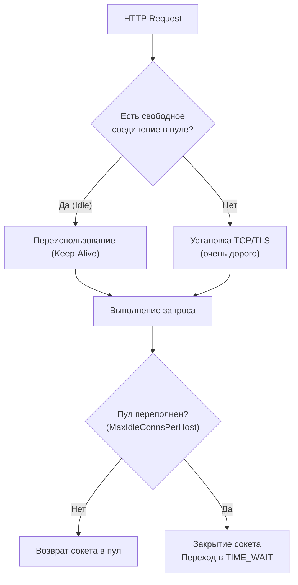

## Выход в реальный мир: Зачем нужно нагрузочное тестирование

В предыдущих статьях мы разобрали микроуровень: микро-бенчмарки (`go test -bench`), профилирование CPU и анализ памяти. Мы довели до идеала наши алгоритмы сортировки и парсинга JSON. 

Но в реальном мире пользователи не вызывают ваши Go-функции напрямую. Они отправляют HTTP-запросы через интернет. Запрос проходит через балансировщик (Nginx/Envoy), попадает в HTTP-сервер Go, роутер, мидлвари, слой бизнес-логики, а затем делает сетевой вызов к базе данных (PostgreSQL) или другому микросервису по gRPC.

Микро-бенчмарк не покажет вам, что ваш пул соединений с базой данных исчерпан. Он не покажет, что операционная система закрыла сокеты из-за нехватки файловых дескрипторов. 

**Нагрузочное тестирование (Load Testing)** — это симуляция реального или экстремального пользовательского трафика на полностью собранную и запущенную систему.

## Главные метрики: Почему "Среднее время" — это ложь

Прежде чем запускать тесты, нужно понять, на что мы смотрим. Senior-инженеры никогда не измеряют производительность API "в среднем".

> [!warning] Ловушка / Gotcha: Иллюзия среднего значения (Average Latency)
> Если 99 запросов выполнились за 10 мс, а 1 запрос "завис" из-за сборщика мусора (GC) и выполнялся 1000 мс, среднее время составит ~20 мс. Вы посмотрите на график, увидите 20 мс и решите, что всё отлично. Но один из ста ваших реальных пользователей только что ждал целую секунду и, возможно, ушел к конкурентам.

В индустрии стандартом являются **Перцентили (Percentiles)**:
* **p50 (Медиана):** 50% запросов выполнились быстрее этого времени. Отражает "типичного" пользователя.
* **p95:** 95% запросов выполнились быстрее.
* **p99 (Tail Latency):** 99% запросов выполнились быстрее. Это метрика "хвоста". Именно здесь прячутся паузы Garbage Collector'а, блокировки мьютексов и сетевые таймауты. 

Оптимизация высоконагруженного бэкенда — это всегда битва за снижение **p99**.

## Инструменты экосистемы Go

Хотя на рынке существуют мощные enterprise-комбайны вроде JMeter или Gatling (Java), в экосистеме Go принято использовать легковесные утилиты, написанные на самом Go (что позволяет им генерировать гигантскую нагрузку при минимальном потреблении ресурсов).

### 1. Vegeta (Для HTTP)

Де-факто стандарт для нагрузочного тестирования HTTP-сервисов в мире Go. Выделяется тем, что поддерживает постоянный RPS (Requests Per Second), независимо от того, как быстро отвечает сервер (в отличие от инструментов вроде `ab` или `wrk`, которые зависят от concurrency).

Запуск из консоли максимально прост:
```bash
echo "GET http://localhost:8080/api/v1/users" | vegeta attack -rate=1000 -duration=10s | vegeta report
```

Вы также можете использовать Vegeta как библиотеку прямо в ваших Go-тестах для проверки SLA (Service Level Agreement):

```go
package load_test

import (
	"testing"
	"time"

	vegeta "[github.com/tsenart/vegeta/v12/lib](https://github.com/tsenart/vegeta/v12/lib)"
	"[github.com/stretchr/testify/require](https://github.com/stretchr/testify/require)"
)

func TestAPI_LoadSLA(t *testing.T) {
	// Поднимаем сервис (предполагается, что он запущен или поднимается в testcontainers)
	targeter := vegeta.NewStaticTargeter(vegeta.Target{
		Method: "GET",
		URL:    "http://localhost:8080/api/users",
	})

	// Атакуем: 500 RPS в течение 5 секунд
	attacker := vegeta.NewAttacker()
	rate := vegeta.Rate{Freq: 500, Per: time.Second}
	duration := 5 * time.Second

	var metrics vegeta.Metrics
	for res := range attacker.Attack(targeter, rate, duration, "API Test") {
		metrics.Add(res)
	}
	metrics.Close()

	// Assert SLA
	require.Equal(t, 1.0, metrics.Success, "Должно быть 100% успешных запросов (200 OK)")
	require.Less(t, metrics.Latencies.P99, 50*time.Millisecond, "p99 Latency должна быть меньше 50мс")
}
```

### 2. ghz (Для gRPC)

Если вы тестируете микросервисное взаимодействие по gRPC (которое мы разбирали в [[5. Тестирование gRPC]]), Vegeta вам не поможет. Вам нужен инструмент, который понимает бинарный протокол HTTP/2 и Protobuf. Стандартом здесь является `ghz`.

```bash
ghz --insecure \
  --proto ./helloworld.proto \
  --call helloworld.Greeter.SayHello \
  -d '{"name":"Gopher"}' \
  -c 50 -n 10000 \
  localhost:50051
```

### 3. k6 (Для сложных сценариев)

Если вам нужно симулировать сложный путь пользователя: залогиниться (получить JWT-токен), извлечь ID из JSON-ответа, сделать запрос на корзину, подождать 2 секунды и оформить заказ — вам нужен **k6** (разрабатывается Grafana Labs). Он написан на Go, но сценарии пишутся на JavaScript, что делает его невероятно гибким.

## Mechanical Sympathy: Ограничения операционной системы

Когда вы начнете генерировать нагрузку в 10,000 RPS на свой локальный Go-сервер, он упадет. Но упадет он не из-за нехватки процессора или плохой архитектуры. Он упрется в лимиты операционной системы (OS Limits).

### Проблема 1: Исчерпание файловых дескрипторов (ulimit)
В Linux всё есть файл. Каждое входящее TCP-соединение — это открытый файловый дескриптор. По умолчанию большинство дистрибутивов ограничивают процесс 1024 открытыми файлами. При нагрузке в 2000 RPS ваш сервер начнет сыпать ошибками `socket: too many open files`.
**Решение:** Увеличить лимиты ОС (`ulimit -n 65535` для локального тестирования или настройки `LimitNOFILE` в systemd/Docker).

### Проблема 2: Эфемерные порты и TIME_WAIT
Когда клиент (ваш генератор нагрузки или ваш сервис, обращающийся к БД) закрывает TCP-соединение, оно не исчезает мгновенно. Оно переходит в состояние `TIME_WAIT` (обычно на 60 секунд), чтобы гарантировать, что заблудившиеся в сети пакеты не попадут в новое соединение.
Количество клиентских портов (ephemeral ports) ограничено (около 28-30 тысяч по умолчанию). При высокой нагрузке у вас закончатся свободные порты (Port Exhaustion), и вы получите `bind: address already in use`.

**Решение (идиоматичное для Go):** Настроить Connection Pooling (Переиспользование соединений).
В стандартной библиотеке Go клиент `http.Client` и драйвер базы данных `sql.DB` имеют пулы соединений "под капотом". Но по умолчанию настройки пула HTTP-клиента подходят для браузера, а не для микросервиса!

```go
// ПРАВИЛЬНАЯ настройка http.Client для высоконагруженного сервиса
t := http.DefaultTransport.(*http.Transport).Clone()
t.MaxIdleConns = 100            // Максимум открытых бездействующих соединений
t.MaxIdleConnsPerHost = 100     // ВАЖНО! По умолчанию 2. Если вы делаете 1000 RPS к одному сервису, 998 соединений будут закрываться и падать в TIME_WAIT каждую секунду!
t.IdleConnTimeout = 90 * time.Second

client := &http.Client{
	Transport: t,
	Timeout:   10 * time.Second,
}
```



## Главное правило: Изоляция генератора

> [!warning] Ловушка / Gotcha: Эффект наблюдателя 2.0 (Co-location interference)
> Никогда не запускайте генератор нагрузки (Vegeta/k6) и тестируемый сервис на одной физической машине (или на одном ноутбуке), если хотите получить точные цифры. 
> Генерация 10,000 RPS сама по себе требует огромного количества CPU и контекстных переключений. Генератор и сервер начнут жестко конкурировать за кэши L3 процессора, ресурсы планировщика ОС и пропускную способность loopback-интерфейса (`localhost`). Ваш сервис покажет результаты в 2-3 раза хуже реальных.
> **Правильный сетап:** Генератор нагрузки на одной виртуалке, Сервер — на другой, объединенные быстрой сетью (10-100 Gbps).

## Синергия: Load Testing + pprof

Нагрузочное тестирование само по себе лишь ставит диагноз ("система держит 2000 RPS при p99=400ms"). Чтобы вылечить систему, нам нужно скомбинировать нагрузку с профайлингом, который мы изучили в статье [[3. CPU и memory profiling]].

В Go есть пакет `net/http/pprof`. Он позволяет снимать профили прямо с работающего "боевого" сервера.

1.  Подключите `_ "net/http/pprof"` в `main.go`. (Это автоматически зарегистрирует роуты на `DefaultServeMux`).
2.  Запустите сервер.
3.  Запустите нагрузочное тестирование с другой машины на 3-5 минут (чтобы прогреть кэши, забить пулы соединений и активировать сборщик мусора).
4.  Прямо **во время работы генератора нагрузки**, соберите профиль с сервера:
    ```bash
    go tool pprof -http=:8080 http://your-server:8080/debug/pprof/profile?seconds=30
    ```

Только профиль, снятый под реальным сетевым давлением, покажет истинные бутылочные горлышки (Bottlenecks): мьютексы, упершиеся в лимит (Lock Contention), избыточный парсинг JSON в горячем цикле или задержки сетевых драйверов БД.

## Итог всего блока (Тестирование и Производительность)

Мы завершили фундаментальное погружение в обеспечение качества и скорости Go-кода.
Вы прошли путь инженера высшего уровня:

1.  **Надежность:** От простых Table-Driven тестов до сложнейших интеграций через Contract Testing.
2.  **Конкурентность:** Вы взяли под контроль хаос горутин, научились ловить неявные Data Race и дедлоки.
3.  **Безопасность:** Внедрили Fuzzing и Property-Based тестирование для защиты от непредсказуемых входных данных.
4.  **Скорость:** Вы освоили Benchmarking, чтение Flame-графов через `pprof` и провели честные нагрузочные испытания.

Тестирование и оптимизация — это не разовая акция. Это культура. Инженер, который умеет математически доказать корректность своего кода и найти миллисекунду задержки в графе вызовов, стоит десятка тех, кто просто пишет "работающий" код. Применяйте эти инструменты прагматично, и ваши системы будут нерушимы.