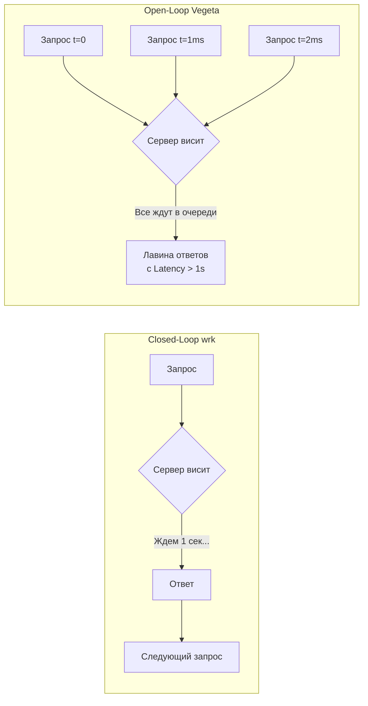

## Время — деньги: Анатомия задержек

В статье [[4. Load testing]] мы вскользь упомянули метрику p99 и выяснили, что "среднее время ответа" — это иллюзия. Нагрузочное тестирование показывает, *сколько* запросов в секунду (Throughput / RPS) может переварить ваш сервер. Тестирование Latency показывает, *как долго* каждый конкретный пользователь ждет ответа.

Высокий Throughput не гарантирует низкую Latency. Ваш сервер может обрабатывать 10 000 запросов в секунду, но если каждый запрос ждет в очереди по 2 секунды, пользователи уйдут. В современных распределенных системах (где один запрос от клиента порождает веер из 10 микросервисных вызовов) задержка p99 самого медленного микросервиса становится задержкой p50 для всей системы (Tail Latency Amplification).

В этой статье мы разберем главный математический парадокс тестирования задержек и изучим инструмент, который позволяет увидеть время глазами планировщика Go.

## Главная ловушка: Coordinated Omission

Это концепция, незнание которой сводит на нет 90% всех тестов производительности. На Senior-собеседованиях вопрос о **Coordinated Omission (Скоординированном упущении)** — классический фильтр.

Представьте, что вы тестируете сервер с помощью популярных утилит вроде `ab` (Apache Bench) или `wrk`. Вы говорите: *"Запусти 100 конкурентных потоков"*.

> [!warning] Ловушка / Gotcha: Closed-Loop генераторы
> Генераторы вроде `wrk` работают по принципу замкнутого цикла (Closed-Loop). Рабочий поток генератора отправляет запрос, **ждет ответа**, и только потом отправляет следующий.
> 
> **Сценарий:** Сервер работает идеально и отвечает за 1 мс. Внезапно запускается тяжелая сборка мусора (GC), и сервер "зависает" на 1 секунду. 
> В реальном мире (в интернете) пользователи продолжают кликать. За эту секунду на сервер придет еще 1000 запросов, они встанут в очередь, и их Latency составит 1000мс, 1001мс, 1002мс. 
> Но что сделает `wrk`? Его 100 потоков отправят запросы, упрутся в зависший сервер и... **замолчат на секунду, ожидая ответа**. Генератор "вежливо" перестанет нагружать сервер. 
> 
> В итоге `wrk` зафиксирует 100 медленных запросов (по 1000мс), а затем, когда сервер "отвиснет", он за миллисекунды нагенерирует еще 10 000 быстрых запросов (по 1мс). На графике 100 медленных запросов растворятся в массе быстрых, и ваш p99 покажет 2мс. Вы пойдете пить кофе, думая, что всё отлично, хотя реальные пользователи страдали.

**Решение: Open-Loop генераторы.**
Для тестирования Latency **обязательно** использовать генераторы открытого цикла (Open-Loop), такие как `Vegeta` или `k6`. Они не ждут ответа. Если вы сказали Vegeta делать 1000 RPS, она будет отправлять 1000 запросов в секунду строго по таймеру, даже если сервер перестал отвечать. Запросы начнут копиться в TCP-буферах, и Vegeta честно зафиксирует катастрофический рост Latency.



## Инструмент последней надежды: go tool trace

В статье [[3. CPU и memory profiling]] мы использовали `pprof`. 
`pprof` отвечает на вопрос: **"На что тратится процессорное время?"**.
Но когда вы боретесь с Latency, процессор часто *простаивает*. Задержка возникает не потому, что функция долго считает математику, а потому, что горутина **чего-то ждет** (сети, мьютекса, планировщика ОС или завершения GC).

Для поиска таких пауз `pprof` слеп. Здесь на сцену выходит **Execution Tracer (`go tool trace`)**.

Трейсер записывает события с наносекундной точностью: создание горутин, блокировки на каналах, системные вызовы, фазы сборки мусора и переключения контекста планировщика.

### Как собрать трейс в тесте

```go
package latency_test

import (
	"os"
	"runtime/trace"
	"testing"
)

func BenchmarkLatencyCriticalPath(b *testing.B) {
	// Создаем файл для трейса
	f, err := os.Create("trace.out")
	if err != nil {
		b.Fatal(err)
	}
	defer f.Close()

	// Запускаем трассировку
	if err := trace.Start(f); err != nil {
		b.Fatal(err)
	}
	defer trace.Stop()

	b.ResetTimer()
	for i := 0; i < b.N; i++ {
		// Ваша бизнес-логика
		processOrder()
	}
}
```

Запускаем визуализатор:
```bash
go tool trace trace.out
```

### Как читать интерфейс Trace

Интерфейс трейсера (работающий в браузере) выглядит пугающе для новичков, так как представляет собой гигантский таймлайн, похожий на кардиограмму.

Главные секции, на которые обращает внимание Senior-инженер:

1.  **Goroutine analysis:** Показывает, сколько времени горутина находилась в статусе `Runnable` (готова к выполнению, но ждет процессора), `Running` (выполняется) и `Waiting` (заблокирована на I/O или каналах). Если у вас огромное время `Runnable`, значит, вы создали слишком много горутин, и планировщик не справляется с переключением контекста (Scheduler Latency).
2.  **Network blocking profile:** Граф вызовов, показывающий, где именно горутины ждали сетевых ответов.
3.  **Synchronization blocking profile:** Показывает, какие `sync.Mutex` или каналы заставляли горутины спать.

> [!tip] Собеседование
> **Вопрос:** Вы смотрите в `go tool trace` и видите множество пробелов на линии `PROCS` (ядра процессора простаивают), но при этом P99 Latency ваших запросов огромна. Ваше приложение делает много запросов в базу данных. В чем может быть проблема?
> **Ответ:** Это классический "Затор на I/O" или проблема с пулом соединений (Connection Pool Starvation). Горутины пытаются взять соединение с базой из пула (`sql.DB`), но пул исчерпан (`MaxOpenConns`). Горутины уходят в сон (`Waiting`), освобождая процессор. Процессор простаивает, так как делать нечего, но для конечного пользователя время (Latency) продолжает идти. `trace` покажет это в Synchronization blocking profile как ожидание на семафоре пула БД.

## Mechanical Sympathy: Борьба с Garbage Collector

Главный спонсор "хвостов" (Tail Latency) в Go — это сборщик мусора. Хотя в современных версиях Go (1.18+) паузы Stop-The-World составляют доли миллисекунд, фаза разметки графа объектов (Mark Phase) выполняется конкурентно и отнимает **до 25% CPU**.

Если ваш тест показывает спорадические всплески Latency, вы можете "подкрутить" механику GC.

### GOGC (Trade-off: Память vs CPU)
Переменная окружения `GOGC` (по умолчанию 100) говорит рантайму: *"Запускай GC, когда размер новых аллокаций достигнет 100% от размера выживших объектов"*.
Если у вас много оперативной памяти, но критична Latency, вы можете увеличить это значение (например, `GOGC=500`). GC будет запускаться в 5 раз реже, сохраняя CPU для бизнес-логики, но приложение будет потреблять больше RAM.

### Soft Memory Limit (GOMEMLIMIT)
> [!info] Под капотом: Магия Go 1.19+
> До версии 1.19 в Go была проблема: если вы ставили высокий `GOGC`, чтобы снизить Latency, приложение могло внезапно "пробить" лимит RAM контейнера и умереть от OOM.
> Появление `GOMEMLIMIT` изменило правила игры. Теперь вы можете установить:
> `GOGC=off` (или `1000`)
> `GOMEMLIMIT=900MiB` (для контейнера в 1 ГБ).
> Рантайм не будет запускать GC вообще, минимизируя Latency до абсолютного предела, пока куча не достигнет 900 Мегабайт. Как только лимит близко — GC просыпается и агрессивно чистит память. Это лучший тюнинг для микросервисов, критичных к времени ответа.

## Как интегрировать тестирование Latency в CI

Как и функциональные тесты, тесты производительности должны ломать сборку (Fail the build), если SLA нарушен. Но писать парсеры для вывода `vegeta` неудобно. 

Для интеграции в код можно использовать кастомные бенчмарки с явными ассертами времени:

```go
func TestCriticalPathLatencySLA(t *testing.T) {
	if testing.Short() {
		t.Skip("Пропускаем тяжелый тест задержек")
	}

	const totalRequests = 10000
	const maxP99 = 50 * time.Millisecond

	latencies := make([]time.Duration, totalRequests)
	
	// Используем WaitGroup для симуляции конкурентной нагрузки
	var wg sync.WaitGroup
	wg.Add(totalRequests)

	for i := 0; i < totalRequests; i++ {
		i := i
		go func() {
			defer wg.Done()
			
			start := time.Now()
			processOrder() // Функция-мишень
			latencies[i] = time.Since(start)
		}()
	}

	wg.Wait()

	// Сортируем массив задержек для расчета перцентилей
	slices.Sort(latencies)
	
	// Индекс для 99-го перцентиля (9900-й элемент из 10000)
	p99Index := int(float64(totalRequests) * 0.99)
	p99 := latencies[p99Index]

	t.Logf("P99 Latency: %v", p99)

	if p99 > maxP99 {
		t.Fatalf("SLA Нарушен! P99 latency: %v, допустимо: %v", p99, maxP99)
	}
}
```

## Итог

1.  **Averages Lie:** Никогда не оценивайте производительность бэкенда по среднему времени (Average Latency). Измеряйте и оптимизируйте p99.
2.  **Coordinated Omission:** Для тестов Latency используйте только Open-Loop генераторы (`Vegeta`, `k6`), иначе инструменты скроют от вас моменты "зависания" сервера.
3.  **Trace > Pprof:** Если процессор простаивает, а Latency высокая — `pprof` не поможет. Используйте `go tool trace`, чтобы увидеть горутины, ожидающие мьютексов или планировщика.
4.  **Тюнинг GC:** Для жестких требований по задержкам используйте связку `GOMEMLIMIT` и высокого `GOGC`, чтобы обменять дешевую оперативную память на дорогое процессорное время.

На этом мы закрываем главу о производительности и измерениях в Go. От профилирования аллокаций до манипуляций со сборщиком мусора — вы освоили арсенал, который отличает просто программиста от инженера, создающего высоконагруженные системы.