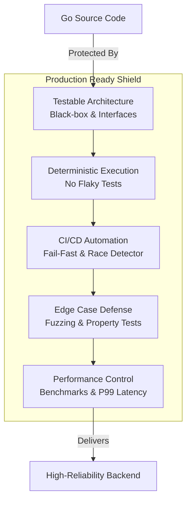

## Итоги раздела: Философия Production-Ready Тестирования

Мы прошли долгий и насыщенный инженерный путь. Модуль **«Тестирование в Go (QA & Testing)»** начался с простого вызова `t.Error()` и завершился проектированием распределенных CI-пайплайнов, анализом Flame-графов и профилированием сборщика мусора.

Написание тестов — это не наказание, не налог на разработку и не бюрократия. В мире бэкенда, где ваш код ежесекундно управляет реальными деньгами, персональными данными и инфраструктурой, **тесты — это ваш единственный экзоскелет**. Они позволяют вам рефакторить монолиты, менять архитектуру и мерджить Pull Request'ы в пятницу вечером без страха обрушить production.

Но не каждый тест полезен. В этой финальной статье мы сведем воедино все концепции и выведем формулу **Production-Ready Тестирования** — стандарта, по которому работают лучшие команды в индустрии.

---

## 5 Столпов Production-Ready Тестирования

Код покрыт тестами на 100%, но CI падает через раз, а пользователи находят баги? Ваш подход не Production-Ready. Настоящее качество держится на пяти фундаментальных столпах.

### 1. Архитектура и Изоляция (Дизайн для тестов)
Тестируемость кода закладывается до написания самих тестов.
* **Black-box подход:** Использование пакетов `_test` для проверки публичных контрактов, а не приватной реализации.
* **Table-Driven Tests:** Матричный подход к описанию сценариев, где добавление нового тест-кейса — это одна новая строка в массиве структур, а не 50 строк дублирующегося кода.
* **Слабая связность (Loose Coupling):** Использование интерфейсов для генерации моков (`gomock`), позволяющих тестировать бизнес-логику без поднятия реальной PostgreSQL или Kafka.

### 2. Контроль Хаоса (Конкурентность и Детерминизм)
Go создавался для многопоточности, и это ваш главный враг в тестировании.
* **Race Detector:** Флаг `-race` включен во всех юнит-интеграционных пайплайнах CI по умолчанию. Это абсолютный закон.
* **Борьба с Flaky-тестами:** Полный отказ от `time.Sleep` в пользу синхронизации через каналы, `sync.WaitGroup` или библиотеки вроде `testify/require.Eventually`.
* **Отсутствие глобального состояния:** Тесты с `t.Parallel()` не конфликтуют друг с другом, потому что не делят общие переменные и поднимают уникальные инстансы сервисов.

### 3. Инварианты вместо Примеров (Fuzzing)
Выход за пределы фантазии разработчика.
* **Property-Based Testing:** Проверка не конкретных примеров (`2+2=4`), а математических свойств алгоритма (идемпотентность, Round-Trip сериализация).
* **Go Fuzzing:** Использование встроенного движка `testing.F` для мутации входных данных с целью поиска OOM-бомб, бесконечных циклов и `panic: slice bounds out of range` в парсерах и публичных API.

### 4. Метрики реального мира (Производительность)
Быстрый код, который выдает неверный результат — бесполезен. Медленный код, который выдает верный результат — мертв.
* **Микро-оптимизации:** Использование `go test -bench` и анализ `allocs/op` для снижения давления на Garbage Collector в "горячих" путях.
* **Инструментальная точность:** Работа с `go tool pprof` (CPU/Memory) и `go tool trace` (ожидания горутин) для хирургического удаления узких мест.
* **Правильные KPI:** Оптимизация метрик **p95/p99 (Tail Latency)** вместо бесполезного "среднего времени ответа", использование Open-Loop генераторов (`Vegeta`, `k6`) для честного нагрузочного тестирования.

### 5. Прагматичный CI/CD (Культура качества)
Тесты должны служить команде, а не наоборот.
* **Fail-Fast пайплайн:** Линтеры $\rightarrow$ Юнит-тесты $\rightarrow$ Интеграция $\rightarrow$ Сборка. Пайплайн падает на самом быстром этапе, экономя время разработчика.
* **Сдвиг влево (Shift-Left):** Баги вылавливаются локально или в CI за минуты, а не QA-инженером на Staging-стенде за дни.
* **Минимальный Достаточный Coverage (MSC):** Команда не молится на 100%. 70–80% покрытия с жестким гейтом от деградации (Coverage Delta) и Risk-Based подходом к зонам ответственности.

---

## Чек-лист: Готов ли ваш проект к Production?

Используйте этот чек-лист для аудита ваших текущих и будущих Go-проектов:

- [ ] **Организация:** Тесты лежат рядом с кодом. Имена функций и пакетов соответствуют `Naming Conventions`.
- [ ] **Скорость CI:** Юнит-тесты с детектором гонок выполняются быстрее 2-3 минут.
- [ ] **Изоляция:** Интеграционные тесты (с БД) закрыты тегом `//go:build integration` и не запускаются при локальном TDD.
- [ ] **Детерминизм:** В тестах нет `time.Sleep`. Параллельные тесты не ломают друг друга. Flaky-тесты изолируются и чинятся, а не перезапускаются.
- [ ] **Безопасность API:** Все публичные парсеры и обработчики недоверенных данных покрыты Fuzz-тестами.
- [ ] **Мониторинг падений:** Вместо `fmt.Println` используется `t.Logf`. При падении E2E/API тестов в лог сбрасывается дамп HTTP-запроса (`httputil.DumpRequest`).
- [ ] **Культура:** Падение покрытия блокирует Pull Request (Coverage Gate).

---

## Эпилог: Код — это ответственность

В книге "Clean Code" есть отличная мысль: *"Код без тестов — это legacy-код в момент его написания"*. 

Разработка на Go — это часто системная инженерия. Мы пишем оркестраторы, сетевые демоны, базы данных и высоконагруженные микросервисы. В этих доменах цена ошибки астрономическая. 

Теперь вы вооружены полным арсеналом практик Quality Assurance. Вы знаете, как заставить компилятор искать баги за вас, как читать профили памяти и как доказать бизнесу, что ваша архитектура выдержит пиковые нагрузки.

Применяйте эти инструменты прагматично. Не превращайте тестирование в карго-культ, но и не оставляйте систему без защиты. 