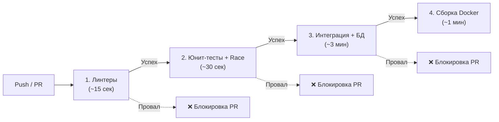

## Автоматизация доверия: Тестирование в CI/CD

В предыдущих статьях мы навели идеальный порядок в репозитории ([[1. Организация тестов в проекте]]) и стандартизировали имена ([[2. Naming conventions]]). Но пока тесты запускаются только локально на ноутбуке разработчика, они не стоят ничего. Фраза _"У меня на машине всё работает"_ — главный враг стабильного production.

Continuous Integration (CI) — это безжалостный, автоматизированный арбитр. Он не забывает запустить линтер, не ленится прогнать тысячу итераций фаззинга и никогда не отправляет код с ошибками компиляции в релизную ветку. В этой статье мы разберем архитектуру идеального CI-пайплайна для Go-проекта и посмотрим на конкретные реализации для GitHub Actions и GitLab CI.

## Архитектура Pipeline: Паттерн Fail-Fast

Главная метрика хорошего CI — это **Время обратной связи (Feedback Loop Time)**. Если ваш пайплайн выполняется 40 минут, разработчики начнут переключать контекст (уходить пить кофе, брать другие задачи). Когда через 40 минут придет ошибка линтера (забытая запятая), разработчик потратит еще 15 минут, чтобы вспомнить контекст задачи.

Чтобы этого избежать, CI строится по принципу **Fail-Fast (Падай быстро)**: самые быстрые и строгие проверки идут первыми.



1. **Линтинг:** Статический анализ (`golangci-lint`). Ловит синтаксические ошибки, неиспользуемые переменные и горутины без `defer`.
2. **Юнит-тесты:** Запуск `go test -short -race ./...`. Здесь выполняются только Black-box и White-box тесты бизнес-логики без походов в сеть. Флаг `-race` **обязателен** на этом этапе.
3. **Интеграционные тесты:** Здесь поднимаются базы данных (через Testcontainers или Docker Compose) и прогоняются тесты с тегом `//go:build integration`.
4. **Сборка:** Компиляция бинарника (`go build`), чтобы убедиться, что код вообще собирается под целевую архитектуру (например, `GOOS=linux GOARCH=amd64`).

## Mechanical Sympathy: Кэширование в Go

В отличие от локальной машины, каждый шаг в CI часто запускается в абсолютно "голом" (ephemeral) Docker-контейнере. Если не настроить кэширование, Go будет каждый раз заново скачивать мегабайты зависимостей и компилировать стандартную библиотеку.

Рантайм Go использует две главные директории для кэша:

1. **`GOMODCACHE`** (обычно `~/go/pkg/mod`): Здесь лежат скачанные исходники библиотек. Кэшируется на основе файла `go.sum`.
2. **`GOCACHE`** (обычно `~/.cache/go-build`): Здесь лежат скомпилированные объектные файлы (`.o`). Если код пакета не менялся, Go не будет его перекомпилировать при следующем `go test`.

> [!warning] Ловушка / Gotcha: Инвалидация кэша
> 
> Если вы кэшируете `GOCACHE` в CI, ваши тесты могут проходить _слишком_ быстро. Если Go видит, что ни исходный код теста, ни код пакета не изменились, он выведет `(cached)` и вообще не будет выполнять тест!
> 
> Для юнит-тестов это отлично. Но если у вас есть интеграционные E2E тесты, которые зависят от внешнего API (которое могло измениться), кэшированный результат вас обманет.
> 
> **Решение:** Для flaky-тестов или E2E используйте флаг `go test -count=1`. Он принудительно отключает чтение из `GOCACHE` для результатов тестов.

## Реализация 1: GitHub Actions

GitHub Actions — де-факто стандарт для Open Source и многих коммерческих проектов. Официальный экшен `actions/setup-go` версии v4+ автоматически берет на себя всю сложную работу по управлению `GOMODCACHE` и `GOCACHE`.

Файл: `.github/workflows/ci.yml`

```yaml
name: Go CI
on:
  push:
    branches: [ "main" ]
  pull_request:
    branches: [ "main" ]

jobs:
  lint:
    name: Lint
    runs-on: ubuntu-latest
    steps:
      - uses: actions/checkout@v4
      - uses: actions/setup-go@v5
        with:
          go-version: '1.22'
          cache: false # golangci-lint управляет кэшем сам
      
      # Используем официальный action линтера
      - name: golangci-lint
        uses: golangci/golangci-lint-action@v4
        with:
          version: v1.56.2

  test-unit:
    name: Unit Tests
    needs: lint # Запускаем только если линтер прошел (Fail-Fast)
    runs-on: ubuntu-latest
    steps:
      - uses: actions/checkout@v4
      - uses: actions/setup-go@v5
        with:
          go-version: '1.22'
          # Кэш включен по умолчанию

      - name: Run Unit Tests with Race Detector
        # Запускаем только быстрые тесты, включаем детектор гонок
        # Собираем профиль покрытия (coverage)
        run: go test -short -race -coverprofile=coverage.out ./...

      - name: Upload Coverage
        # Сохраняем артефакт, чтобы потом отправить в SonarQube или Codecov
        uses: actions/upload-artifact@v4
        with:
          name: go-coverage
          path: coverage.out

  test-integration:
    name: Integration Tests
    needs: test-unit
    runs-on: ubuntu-latest
    steps:
      - uses: actions/checkout@v4
      - uses: actions/setup-go@v5
        with:
          go-version: '1.22'

      - name: Run Integration Tests
        # Включаем теги интеграции, отключаем кэш результатов теста
        run: go test -tags=integration -count=1 ./internal/repository/...
```

## Реализация 2: GitLab CI

В энтерпрайз-секторе часто правит бал GitLab. Здесь нам придется настраивать кэширование переменных окружения вручную.

Файл: `.gitlab-ci.yml`

```yaml
image: golang:1.22-alpine

# Настройка кэша для ускорения сборок
variables:
  GOPATH: $CI_PROJECT_DIR/.go
  GOCACHE: $CI_PROJECT_DIR/.go/build-cache
  GOMODCACHE: $CI_PROJECT_DIR/.go/pkg/mod

cache:
  paths:
    - .go/build-cache
    - .go/pkg/mod

stages:
  - lint
  - test
  - integration

lint:
  stage: lint
  image: golangci/golangci-lint:v1.56.2
  script:
    - golangci-lint run -v

unit_tests:
  stage: test
  # Альпайн не имеет CGO по умолчанию, а -race требует CGO и gcc!
  before_script:
    - apk add --no-cache gcc musl-dev
  script:
    - go test -short -race -coverprofile=coverage.out ./...
  artifacts:
    paths:
      - coverage.out

integration_tests:
  stage: integration
  # Если используете Testcontainers, нужен docker-in-docker (dind)
  services:
    - docker:24-dind
  variables:
    DOCKER_HOST: tcp://docker:2375
  script:
    - go test -tags=integration -count=1 ./...
```

## Контроль качества: Coverage Gates (Гейты покрытия)

Многие команды совершают ошибку, превращая процент покрытия (Code Coverage) в самоцель, требуя 100%. Это приводит к написанию бессмысленных тестов, которые просто вызывают код ради зеленой галочки, не проверяя инварианты (Assertion-Free Tests).

> [!tip] Собеседование
> 
> **Вопрос:** Какой процент покрытия (Coverage) считается хорошим, и как заблокировать слияние PR, если покрытие падает?
> 
> **Ответ:** Золотым стандартом индустрии считается **70-80%** покрытия. Гнаться за 100% нерентабельно. Важно другое: покрытие не должно деградировать. Если в ветке `main` было 75%, а ваш PR снижает его до 72% — CI должен отклонить PR (Coverage Gate).

В Go есть встроенная утилита для проверки покрытия. Добавьте этот шаг в свой CI:

Bash

```
# 1. Генерируем профиль
go test -coverprofile=coverage.out ./...

# 2. Выводим результат в консоль и проверяем порог (например, 80%)
# go tool cover возвращает код ошибки, если покрытие ниже порога!
go tool cover -func=coverage.out | grep total | awk '{print substr($3, 1, length($3)-1)}' | awk '{if ($1 < 80.0) {print "Coverage failed: " $1 "%"; exit 1}}'
```

_Примечание: Вышеуказанный bash-скрипт — классический хак. В реальных пайплайнах лучше использовать специализированные инструменты вроде `go-test-coverage` ([https://github.com/vladopajic/go-test-coverage](https://github.com/vladopajic/go-test-coverage)), которые парсят `coverage.out` и изящно падают с ошибкой, если процент ниже заданного в конфиге._

## Flaky Tests: Болезнь распределенных систем

Если ваш пайплайн иногда падает, а при нажатии кнопки "Re-run jobs" проходит успешно — у вас завелись **Flaky Tests (Мерцающие тесты)**.

Это худшее, что может случиться с CI. Они уничтожают доверие к пайплайну. Разработчики перестают смотреть на ошибки, автоматически нажимая "Restart". В этот момент баг уезжает в production.

**Причины Flaky тестов в Go:**

1. **Data Races:** Вы забыли `-race` в CI, либо гонка происходит очень редко.
2. **Зависимость от времени:** Использование `time.Sleep` вместо синхронизации через каналы или `sync.WaitGroup` (см. [[1. Тестирование конкурентного кода]]).
3. **Порядок сортировки:** Ожидание, что ключи в `map` будут итерироваться в определенном порядке (в Go порядок рандомизирован). Или БД вернула строки без явного `ORDER BY`.
4. **Утечки состояния (State Leaks):** Один тест записал данные в глобальную базу (или глобальную переменную `var`), не очистил за собой (`t.Cleanup`), а следующий тест упал, так как ожидал пустую базу. Это часто проявляется только в CI, потому что локально вы запускаете один тест, а в CI они бегут пачкой или параллельно (`t.Parallel()`).

**Как лечить?**

Никогда не игнорируйте Flaky тест. Если не можете починить его сейчас — пропустите его явно через `t.Skip("Flaky: ticket-123")`.

Чтобы локально воспроизвести "мерцание", используйте флаг `-count` и стресс-тест процессора:

Bash

```
# Запустить тест 1000 раз подряд в 8 потоков. 
# Если он хоть раз упадет - вы поймаете лог.
go test -run=TestFlakyEndpoint -count=1000 -cpu=1,4,8 -race
```

## Итог всего модуля QA & Testing

На этом мы завершаем грандиозный блок, посвященный тестированию, качеству и производительности в Go.

Вы прошли путь от базовых концепций до архитектуры уровня Principal Engineer:

1. **Фундамент:** Освоили интерфейс `testing`, Table-Driven подход и работу с моками.
2. **Конкурентность:** Научились тестировать горутины, ловить дедлоки и гонки данных в теневой памяти.
3. **Безопасность и Инварианты:** Внедрили Fuzzing и Property-Based тестирование, чтобы ловить OOM-уязвимости и логические бреши.
4. **Производительность:** Разобрали Benchmarks, Flame-графы (`pprof`) и поняли, почему средняя задержка (Average Latency) вам врет.
5. **Инфраструктура:** Упорядочили проект, стандартизировали имена и закрепили всё это железобетонным CI/CD пайплайном.

Код, написанный с применением этих практик, перестает быть просто "скриптом, который как-то работает". Он становится надежным инженерным продуктом, готовым к высоким нагрузкам, командной разработке и годам бесперебойной эксплуатации в production.