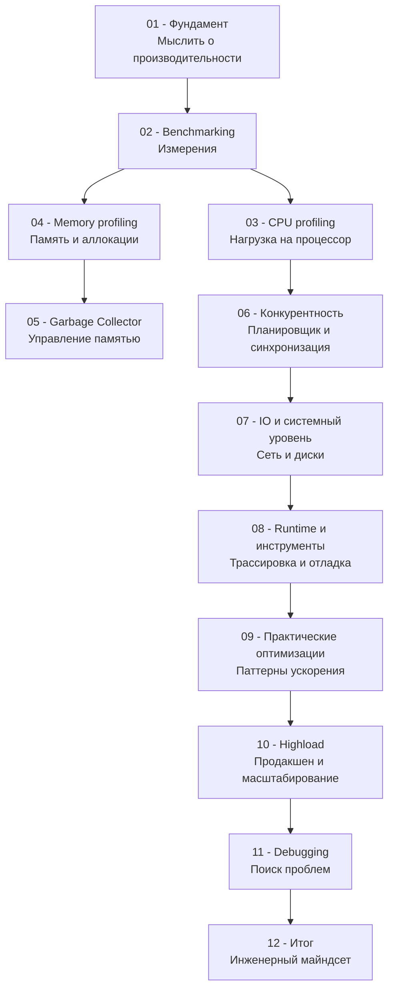

## Добро пожаловать: почему производительность — это не «потом»

Производительность в бэкенд-разработке часто воспринимают как нечто, что «можно настроить перед релизом». Это опасное заблуждение. В мире Go, где микросервисы обрабатывают десятки тысяч запросов в секунду, а пауза GC может стать причиной тайм-аута у сотен клиентов, производительность — это архитектурная характеристика, а не косметическая доработка.

Этот раздел знаний не сделает из вас «оптимизатора на час». Он сформирует **инженерный майндсет**, при котором вы:

- смотрите на код через призму тактов процессора и промахов кэша;
- понимаете, во что обходится каждый системный вызов и аллокация в куче;
- не гадаете по логам, а измеряете p99 latency и знаете, почему она «плывёт»;
- проектируете систему, которую можно профилировать и отлаживать без деплоя с флагом `-race` на проде.

Раздел адресован всем, кто хочет пройти путь от «работает — и ладно» до уровня Senior/Lead Go Engineer, способного объяснить команде, *почему* их код быстр или медленен, и какие законы «железа» за этим стоят.

## Обзор структуры раздела

Двенадцать подразделов выстроены так, чтобы провести вас от фундаментальных принципов мышления о производительности до отладки инцидентов на продакшене.

### 01. Фундамент
Прежде чем браться за профайлер, мы закладываем теоретическую базу.  
В статьях [[2. Latency vs throughput]], [[3. CPU bound vs IO bound задачи]] и [[4. Amdahl law и масштабирование]] вы вспомните классические законы, которые управляют любой вычислительной системой — от мобильного процессора до кластера K8s.  
[[5. Mechanical sympathy в backend разработке]] объясняет, почему знание иерархии памяти и кэш-линий CPU напрямую влияет на выбор структуры данных в Go.  
Завершается блок разговором о метриках: [[6. Метрики. p50, p95, p99]] и [[7. Tail latency и почему она важна]] — без них вы не сможете доказать, что ваша оптимизация действительно помогла.

### 02. Benchmarking
Сердце инженерного подхода — измерение.  
Вы изучите [[2. Benchmarking в Go]] и [[3. go test -bench под капотом]], чтобы понимать, как стандартный инструмент превращает ваш код в повторяемый эксперимент.  
Особое внимание уделим ловушкам: [[4. Подводные камни benchmark тестов]] (dead code elimination, эффекты прогрева, шум ОС), а также разнице между micro и macro бенчмарками ([[5. microbenchmarks vs macrobenchmarks]]). Без стабилизации результатов ([[6. Стабилизация результатов]]) и умения сравнивать версии ([[8. Сравнение версий кода]]) все замеры — это лишь иллюзия контроля.

### 03. CPU profiling
Когда приложение упирается в процессор, на сцену выходит `pprof`.  
Мы разберем [[1. pprof. Введение]], [[2. CPU profiling в Go]] и [[3. Flamegraph]] — инструментарий, с которым вы будете засыпать и просыпаться.  
Далее копнём глубже: [[4. Top functions анализ]] научит приоритизировать горячие точки, [[5. Inline и влияние на performance]] покажет, как решения компилятора умножают или съедают такты, а [[6. Branch prediction и код]] и [[7. SIMD и Go]] — как писать код, дружественный спекулятивному исполнению и векторным инструкциям. Венчает подраздел [[8. Cache friendliness]] — мост между вашим кодом и L1-кэшем ядра.

### 04. Memory profiling
Go берёт на себя управление памятью, но Senior обязан знать, где именно.  
[[1. Memory model Go]] освежит модель памяти языка и гарантии. Затем [[2. Heap vs stack]] и [[3. Escape analysis]] — фундамент понимания аллокаций: когда значение «убегает» в кучу и во что это обходится.  
С помощью [[4. Allocation profiling]] и [[5. pprof memory profile]] вы научитесь видеть каждый выделенный байт, диагностировать [[6. Утечки памяти]], [[7. Fragmentation]] и анализировать [[8. Object lifetime]] — как долго живут объекты и когда их подметает GC.

### 05. Garbage Collector
GC в Go — низколатентный и конкурентный, но не волшебный.  
После [[1. GC в Go. Обзор]] мы разберем алгоритм [[2. Tri color marking]], причины [[3. Stop the world]] (да, они есть), механику [[4. Concurrent GC]] и роль [[5. Write barriers]].  
Вы узнаете, как измерять [[6. GC pause и latency]] и вооружитесь практическими ручками тюнинга: [[7. GOGC и tuning]] и [[8. GOMEMLIMIT]]. А в [[9. Когда GC становится bottleneck]] поймете, когда оптимизация памяти важнее оптимизации CPU.

### 06. Конкурентность
Горутины легковесны, но их взаимодействие — источник самых неприятных проблем производительности.  
Мы начнем с модели [[1. Scheduler Go. G-M-P модель]] и [[2. Goroutines под капотом]], разберем [[3. Work stealing]] и цену [[4. Контекстные переключения]].  
Затем перейдем к синхронизации: [[5. Sync primitives и их стоимость]], [[6. Mutex vs channel]], [[7. Contention и lock profiling]]. Особый акцент — на низкоуровневые ловушки вроде [[8. False sharing]] и [[9. Cache line и выравнивание]], где ошибка может стоить 40% производительности.

### 07. IO и системный уровень
Даже идеально написанный код упирается в syscall.  
[[1. Системные вызовы и их стоимость]] напомнит, во сколько обходится переход в Ring 0. Мы изучим [[2. IO bottlenecks]], природу [[3. Network latency]] и, самое важное для Go-сетевого кода, — [[4. epoll, kqueue и netpoller]].  
Практические техники: [[5. Zero copy подходы]], [[6. Buffer reuse]], [[7. File IO оптимизация]] и [[8. Connection pooling]] — всё, что делает сетевой и дисковый ввод-вывод быстрым и предсказуемым.

### 08. Runtime и инструменты
Внутренности рантайма и инструменты, которые редко используют, но Senior обязан знать.  
Мы погрузимся в [[1. runtime пакет]], разберем [[2. trace tool]] и [[3. execution tracer]] для анализа событий рантайма, научимся делать [[4. goroutine dump]] и использовать [[5. block profile]] и [[6. mutex profile]]. Статья [[7. scheduler trace]] раскроет, как работает планировщик, а [[8. debug tools]] соберет арсенал от `GODEBUG` до `go tool compile`.

### 09. Практические оптимизации
Теоретический фундамент превращается в код.  
Конкретные идиомы: [[1. Уменьшение аллокаций]], [[2. sync Pool]], [[3. Reuse объектов]]. Методики [[4. Предвыделение памяти]], [[5. Оптимизация структур данных]] и [[6. Cache friendly структуры]] дадут тактическое преимущество. Завершают подраздел принципы [[7. Удаление лишних абстракций]], [[8. Inline оптимизации]] и, для самых требовательных участков, [[9. Zero allocation подход]].

### 10. Highload
Оптимизация в вакууме — ничто; оптимизация под нагрузкой — всё.  
[[1. Load testing]] с инструментами типа `vegeta` или `k6`, [[2. Profiling в production]] с minimal overhead, [[3. Feature flags для оптимизаций]] и [[4. Canary releases]] — как внедрять изменения безопасно.  
Мы обсудим [[5. Performance regression detection]] в CI, [[6. Capacity planning]], [[7. Autoscaling]], [[8. Observability и performance]] и научимся формулировать цели через [[9. SLO и SLA]].

### 11. Debugging
Когда всё пошло не по плану.  
[[1. Debugging в Go]] как дисциплина, [[2. Delve debugger]] для интерактивного исследования, [[3. Race detector в проде]] (хотя лучше не доводить), [[4. Логи и debugging]], [[5. Postmortem анализ]] и [[6. Core dumps]] — чтобы разобрать аварию по косточкам. В [[7. Debugging latency проблем]] закрепим системный подход к поиску недетерминированных «тормозов».

### 12. Итог
Финальная статья [[1. Итоги раздела. Performance engineering mindset]] соберет все нити в единую картину и опишет, как применять полученные знания в ежедневной работе, код-ревью и проектировании систем.

## Как мыслить о производительности: принципы, а не рецепты

> [!NOTE]
> Мышление «делай X, потому что это быстро» не работает. Работает — «измеряй, понимай, улучшай, проверяй».

### 1. Данные превыше всего (Metrics-Driven)
Первое правило performance engineering: **без цифр вы не оптимизируете — вы гадаете**.
Прежде чем трогать код, вы должны уметь ответить:
- Какая операция медленная? (latency p95)
- Сколько запросов в секунду мы обрабатываем? (throughput)
- Какую долю времени занимает GC? (`GODEBUG=gctrace=1`)
- Где аллокации? (`pprof -alloc_space`)

Именно поэтому раздел начинается с метрик, а не с кода: [[6. Метрики. p50, p95, p99]] и [[2. Latency vs throughput]] — ваш первый щит против бесполезных правок.

### 2. Знай свою «модель стоимости»
Писать производительный Go — значит понимать **относительную стоимость** операций. Ментальная модель:
- Присвоение регистра / операция в кэше L1: ~1 нс
- Доступ к L3 / невыровненный доступ: ~10-50 нс
- Вызов `make([]byte, 4096)` с аллокацией: ~100-200 нс (если повезёт с GC)
- Системный вызов / блокировка мьютекса с ожиданием: от 1 мкс до нескольких миллисекунд

В этом разделе мы часто будем ссылаться на [[5. Mechanical sympathy в backend разработке]] — умение сопоставлять абстракцию кода с физическими процессами в железе. Без него вы никогда не поймете, почему переход от связного списка к слайсу ускорил обход в 5 раз (cache locality), или почему буферизованный канал иногда хуже мьютекса.

### 3. Избегай преждевременной оптимизации, но уважай архитектуру
Классическое «premature optimization is the root of all evil» (Дональд Кнут) не означает «пиши медленно». Оно означает:
- Не жертвуй читаемостью ради микрооптимизаций, которые не подтверждены профайлером.
- В первую очередь выбирай правильные структуры данных и алгоритмы (O-большое), а не крути биты.
- Помни, что **архитектурная производительность** (шардирование, кэширование, асинхронность) часто даёт кратный выигрыш, в то время как локальные фиксы — проценты.

Этот раздел даст вам умение видеть разницу: когда достаточно заинлайнить функцию ([[5. Inline и влияние на performance]]), а когда пора перекраивать схему базы данных.

### 4. Цикл оптимизации: Measure → Profile → Optimize → Verify
Этот цикл — ваш основной алгоритм работы во всех подразделах.

1. **Measure (Измерь)**: Собери метрики под нагрузкой или бенчмарками (`go test -bench`).
2. **Profile (Профилируй)**: Подключи `pprof` (CPU, memory, block, mutex) или трассировщик (`go tool trace`), чтобы найти узкое место. Смотри [[2. CPU profiling в Go]], [[5. pprof memory profile]], [[7. Contention и lock profiling]].
3. **Optimize (Оптимизируй)**: Примени релевантную технику (sync.Pool, уменьшение escape-аллокаций, батчинг syscall'ов).
4. **Verify (Проверь)**: Повтори бенчмарк или нагрузочный тест; докажи, что p95 действительно снизился, а потребление памяти не выросло.

Без стадии Verify вы рискуете построить «быструю поделку», которая упадет под реальным трафиком.

> [!tip] Собеседование
> **Вопрос:** Как вы подходите к оптимизации нового микросервиса на Go?
> **Ожидаемый ответ:** Не оптимизирую вслепую. Поднимаю нагрузочное тестирование ([[1. Load testing]]), снимаю CPU и memory профили, смотрю на топ-5 функций по аллокациям и времени CPU. Проверяю, нет ли contention на мьютексах ([[7. Contention и lock profiling]]). Если p99 latency упирается в GC — анализирую pause time и тюню GOGC / GOMEMLIMIT. Итеративно улучшаю, сравнивая бенчмарки между версиями ([[8. Сравнение версий кода]]).

### 5. Mechanical Sympathy: говорим на языке железа
Go — управляемый язык, но он не изолирует вас от «железа» полностью. Компилятор, GC и рантайм работают поверх кэш-линий, TLB, NUMA-узлов и планировщика ОС.
Поэтому каждая статья (особенно в подразделах 06 и 07) будет проводить параллель:
- **False sharing** ([[8. False sharing]]) разрушает производительность из-за протокола когерентности кэшей MESI.
- **Слайс байт против связного списка** — разница не в алгоритмической сложности, а в пространственной локальности и промахах мимо кэша (cache misses).
- **Буферизованный канал** — это не только структура в памяти, но и взаимодействие с планировщиком горутин через `gopark`/`goready`.

Игнорировать эти эффекты на уровне Senior — значит оставлять на столе 30-50% производительности.

### 6. Производительность — это фича, а не свойство
В высоконагруженных системах производительность напрямую влияет на SLO, бюджет железа и, в конечном итоге, на деньги компании. Мы рассмотрим, как встраивать перформанс-требования в CI ([[5. Performance regression detection]]), как профилировать «вживую» ([[2. Profiling в production]]) и как принимать решения о горизонтальном масштабировании на основе [[6. Capacity planning]].

## Mechanical Sympathy: Почему этот раздел хардкорный

> [!info] Под капотом
> Когда вы вызываете `json.Unmarshal`, под капотом происходят тысячи аллокаций мелких объектов, escape-анализ решает, что часть из них уходит в кучу, GC в фоне обходит граф объектов и чистит мусор, а ядро ОС переключает контексты между вашими горутинами и потоками ядра.
> Этот раздел научит вас видеть всё это «под капотом» — от структуры `hmap` до ассемблерного выхлопа функции, заинлайненной компилятором Go.

С таким багажом знаний вы перестаете быть просто разработчиком и становитесь инженером, который может спроектировать систему, способную обработать 100 000 RPS на одном сервере. Или честно объяснить, почему для этого нужно три.

Мы начинаем с фундамента — с понятий latency, throughput и с того, как правильно ставить измерительные приборы. Следующая статья: [[2. Latency vs throughput]].