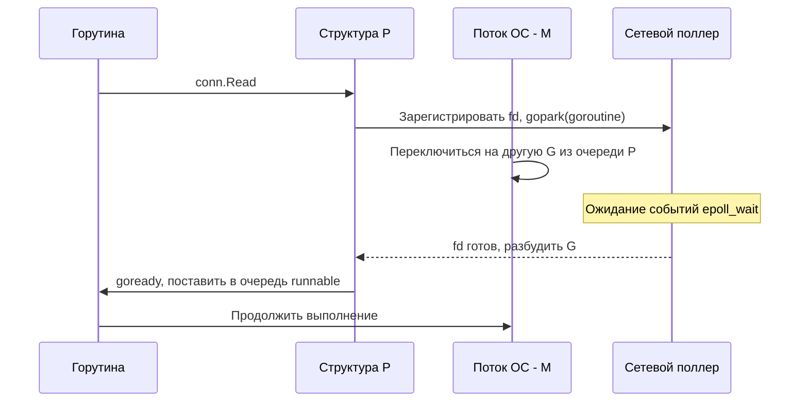

## Классификация задач по типу узкого места

В [[2. Latency vs throughput]] мы ввели две основные меры производительности. В этой статье мы разберём, *чем именно занято время*, проведённое в системе: вычислениями или ожиданием ввода-вывода. Классификация «CPU-bound против IO-bound» — фундамент, на котором строятся все решения по конкурентности, размерам пулов, тюнингу GOMEMLIMIT и выбору стратегии профилирования в Go.

### Определения

**CPU-bound (вычислительно-ограниченная) задача** — задача, чья скорость выполнения определяется исключительно тактовой частотой процессора и его архитектурой. Узким местом является арифметико-логическое устройство, а не подсистема ввода-вывода.

**IO-bound (ограниченная вводом-выводом) задача** — задача, чья скорость лимитирована пропускной способностью или задержкой устройства ввода-вывода (сеть, диск, терминал, IPC). Процессор большую часть времени простаивает в ожидании завершения операции.

В реальности чисто CPU- или чисто IO-bound нагрузки встречаются редко: типичный веб-обработчик разбирает JSON (CPU), делает запрос в БД (IO), формирует ответ (CPU). Ключ к эффективности — умение измерить и классифицировать *доминирующий* тип ограничения.

### Почему Go-разработчику это важно

Легковесные горутины создают иллюзию, что можно просто запустить «много горутин» и забыть о классификации. Это опасный самообман.

- **Для CPU-bound нагрузки** избыток горутин (больше, чем `GOMAXPROCS`) вызывает лишние переключения контекста, конкуренцию за кэш и падение throughput (см. [[1. Scheduler Go. G-M-P модель]], [[4. Контекстные переключения]]).
- **Для IO-bound нагрузки** недостаток горутин приведёт к недозагрузке внешних ресурсов и низкому throughput, а их избыток — к переполнению очередей, росту потребления памяти и рваным хвостовым задержкам (tail latency, [[7. Tail latency и почему она важна]]).

Правильная классификация определяет, *на что именно* нацеливать профайлер, и какие примитивы конкурентности использовать.

## Как определить тип границы: признаки и инструменты

### Признаки CPU-bound

- `%user` в `top`/`htop` около 100% на ядро.
- Высокая утилизация CPU, низкое IO-ожидание (`%iowait`).
- Пропускная способность слабо реагирует на увеличение числа горутин сверх числа ядер.
- Профайлер CPU (`pprof -top`) показывает функции «чистых вычислений» (хеширование, сжатие, мат. операции).
- В `go tool trace` пробы `Proc start` не прерываются длинными `Proc stop`.

### Признаки IO-bound

- Процессор загружен слабо, много `iowait` (для дискового IO) или просто ядра простаивают (для сетевого IO через epoll).
- Throughput растёт при увеличении числа соединений/горутин до определённого предела.
- Профайлер CPU показывает функции, уходящие в `runtime.netpollblock`, `syscall.Read`, `epollwait`.
- Профайлер блокировок (`block` profile, [[5. block profile]]) и мьютексов (`mutex` profile, [[6. mutex profile]]) укажет на ожидания.

### Профайлеры и трассировка

В Go мы можем напрямую измерить, где проводит время программа.

- **CPU profiling** (`runtime/pprof`, [[2. CPU profiling в Go]]) показывает только то время, когда горутина *использует* процессор. Если функция «спит» на IO, она туда не попадёт.
- **Block profile** ([[5. block profile]]) фиксирует события ожидания на блокирующих операциях: чтение/запись в канал, ожидание мьютекса, сетевой вызов. Идеален для обнаружения IO-bound участков.
- **Execution tracer** (`go tool trace`, [[3. execution tracer]]) даёт картину в разрезе «состояний горутины» (Executing, Runnable, Waiting). Если горутины много времени проводят в состоянии `Waiting` из-за syscall или работы с сетью — перед вами IO-bound.

> [!tip] Собеседование
> **Вопрос:** Как быстро определить, является ли сервис CPU-bound или IO-bound, не имея сложного мониторинга?
> **Ответ:** Взгляните на `GOMAXPROCS` и загрузку ядер. Если все ядра загружены на 100%, а среднее время ответа растёт с числом одновременных запросов — вероятно, CPU-bound. Если ядра простаивают менее чем на 70%, а latency растёт при увеличении concurrency — нужно смотреть IO. Профайлер CPU (`curl localhost:6060/debug/pprof/profile?seconds=30`) даст точную картину.

## Механика ОС и Go при разной нагрузке

### CPU-bound: монопольное владение ядром

Когда горутина занята вычислениями, она не уходит в syscall. Планировщик Go, реализующий кооперативную многозадачность, вставляет точки прерывания (проверки флага стека, вызовы функций). Если такие точки редки, горутина может захватить поток ОС на длительное время, не давая другим горутинам выполняться.

Внутри модели G-M-P:
- G (горутина) привязана к M (потоку ОС), который в свою очередь закреплён за P (логическим процессором).
- P не может одновременно исполнять более одной G.
- Если количество CPU-bound горутин превышает число P (равное `GOMAXPROCS`, по умолчанию числу ядер), избыточные горутины помещаются в очередь runnable и ждут.
- Переключение между ними добавляет накладные расходы ([[4. Контекстные переключения]]), а из-за несовпадения данных в кэшах ядер может возникать false sharing ([[8. False sharing]]).

Таким образом, для CPU-bound нагрузки **оптимальное количество горутин ≈ GOMAXPROCS**. Дальнейшее увеличение лишь добавляет contention.

### IO-bound: передача управления без блокировки

Когда горутина делает сетевой вызов (например, `conn.Read()`), в дело вступает **сетевой поллер** (netpoller, [[4. epoll, kqueue и netpoller]]). В Linux это базируется на `epoll`, в macOS/BSD — на `kqueue`.



Горутина не блокирует поток M на весь период ожидания — она паркуется (`gopark`), а M немедленно берёт другую горутину из локальной очереди P или ворует у другого P ([[3. Work stealing]]). Это позволяет десяткам тысяч IO-bound горутин сосуществовать на нескольких потоках ОС.

Но не весь IO в Go неблокирующий. Обычный файловый ввод-вывод (`os.ReadFile`, чтение из файла без O_NONBLOCK) блокирует M целиком. Чтобы не оголять P, рантайм открепляет заблокированный M от P, создаёт или берёт из пула новый M, и работа продолжается. Поэтому файловый IO — более «тяжёлый» с точки зрения планировщика.

> [!info] Под капотом
> В исходниках `runtime` за это отвечают `entersyscallblock` и `exitsyscall`. Когда горутина входит в блокирующий системный вызов, `P` открепляется от `M`. При выходе из syscall рантайм пытается снова прикрепиться к тому же `P` или встать в очередь.

## Mechanical Sympathy: что происходит на уровне CPU и памяти

Для CPU-bound задач на первый план выходят:
- Спекулятивное исполнение и предсказание ветвлений (branch prediction, [[6. Branch prediction и код]]). Неудачное ветвление стоит 10-20 тактов.
- Кэш-промахи (cache misses). Данные, не попавшие в L1/L2, тянут за собой ожидание в сотни тактов. Поэтому слайсы предпочтительнее связных списков.
- Возможности SIMD ([[7. SIMD и Go]]), которые в Go ограничены, но компилятор способен векторизовать простые циклы.

Для IO-bound задач решающую роль играют механизмы DMA (Direct Memory Access) и обработчики прерываний. Процессор не обязан побайтово пересылать данные с сетевой карты в память — это делает контроллер DMA. А когда передача завершена, генерируется прерывание, которое ОС превращает в событие epoll. Go-рантайм реагирует на это без лишних копирований (стремится к zero-copy, [[5. Zero copy подходы]]).

## Связь с масштабированием и законом Амдала

Классификация CPU/IO важна для прогноза масштабирования.

- **CPU-bound** задачи подчиняются [[4. Amdahl law и масштабирование]]: ускорение ограничено последовательной долей. Если программа на 90% распараллеливается, максимальное ускорение на бесконечном числе ядер — всего в 10 раз.
- **IO-bound** задачи с неограниченным источником запросов часто масштабируются по закону Густавсона (Gustafson's Law), так как мы увеличиваем размер задачи, а не время выполнения. Однако они упираются в пропускную способность подсистемы ввода-вывода.

В реальном сервисе может быть смешанная нагрузка: JSON-парсер (CPU) и обращение к сети (IO). Тогда модель распределения ресурсов подбирается через профилирование и нагрузочное тестирование ([[1. Load testing]]).

## Стратегии оптимизации в зависимости от типа границы

### Если приложение CPU-bound

1. Снижаем количество горутин до `GOMAXPROCS`, возможно — явный пул воркеров.
2. Уменьшаем вычислительную сложность: битовые операции, таблицы поиска, использование эффективных структур данных.
3. Добиваемся cache friendliness ([[8. Cache friendliness]]), компактно упаковываем поля структур, избегаем указателей, где можно.
4. Разрешаем компилятору инлайнить маленькие функции ([[5. Inline и влияние на performance]]).
5. Профилируем CPU и оптимизируем горячие точки.

### Если приложение IO-bound

1. Увеличиваем параллелизм (больше горутин), пока задержка или пропускная способность не упрутся в сеть/диск.
2. Используем буферизованный IO (`bufio.Reader/Writer`), пулы соединений (`sql.DB`, `net.Conn`), чтобы амортизировать стоимость системных вызовов ([[1. Системные вызовы и их стоимость]]).
3. Применяем асинхронные паттерны, конкурентную обработку (fan-out/fan-in), но следим за хвостовой задержкой ([[7. Tail latency и почему она важна]]).
4. Если есть дисковый IO — рассмотреть переход на асинхронный подход (например, `io_uring` в Linux) или вынос в отдельные горутины с ограниченным количеством, чтобы не плодить потоки ОС.

## Пример: определение типа и адаптация

```go
package main

import (
    "fmt"
    "net/http"
    _ "net/http/pprof"
    "time"
    "crypto/sha256"
)

func cpuBound() [32]byte {
    data := []byte("some data to hash")
    // Симулируем CPU-нагрузку
    for i := 0; i < 100000; i++ {
        data = append(data, byte(i%256))
    }
    return sha256.Sum256(data)
}

func ioBound() string {
    resp, err := http.Get("https://httpbin.org/get")
    if err != nil {
        return err.Error()
    }
    defer resp.Body.Close()
    return resp.Status
}

func handler(w http.ResponseWriter, r *http.Request) {
    // Комбинация: CPU + IO
    _ = cpuBound()
    status := ioBound()
    fmt.Fprintf(w, "Status: %s\n", status)
}

func main() {
    go func() {
        http.ListenAndServe("localhost:6060", nil) // pprof
    }()

    http.HandleFunc("/", handler)
    http.ListenAndServe(":8080", nil)
}
```

Снимем CPU-профиль: `go tool pprof -http=:8081 localhost:6060/debug/pprof/profile?seconds=30`. Если в топе `crypto/sha256` и `runtime.memhash`, — ядро CPU-bound. Блокировочный профиль покажет ожидания на `http.Get`. Так мы разделяем вклад каждой компоненты.

## Частые ошибки и ловушки

- **Перепутать причину медленной работы.** Разработчик видит высокую загрузку CPU, решает увеличить число горутин — становится только хуже из-за contention.
- **Считать, что весь IO неблокирующий.** Файловый IO (чтение/запись через стандартную библиотеку) в Linux блокирует M, и это может привести к созданию десятков потоков ОС. Для высоконагруженных решений стоит использовать `io_uring` (через сторонние пакеты) или вынести файловые операции в отдельный пул горутин.
- **Пренебрежение хвостовой задержкой в IO-bound.** Большое количество конкурентных запросов к общему ресурсу (БД) может дать хороший средний throughput, но p99 может выйти за пределы SLO.
- **Недооценка накладных расходов GC в CPU-bound.** Интенсивные аллокации в цикле приводят к тому, что GC начинает конкурировать за CPU с вычислительной работой, снижая throughput (см. [[9. Когда GC становится bottleneck]]).

> [!warning] Ловушка / Gotcha
> В Go программы, активно работающие с сетью, могут выглядеть как CPU-bound в профилировщике, если работа netpoller учитывается как `runtime.findrunnable` или `epollwait`. Смотрите на контекст: `epollwait` в топе означает, что поток ищет работу, а не выполняет полезные вычисления. Правильно интерпретируйте позади простоя.

## Итог

- CPU-bound и IO-bound — фундаментальная классификация, направляющая оптимизацию и архитектурные решения.
- Игнорирование типа границы приводит к неверному выбору числа горутин, тюнингу и потере производительности.
- Используйте профилировщики CPU, block и execution tracer, чтобы точно определить сценарий.
- Для CPU-bound фокусируйтесь на алгоритмах, кэш-эффективности и уменьшении contention; для IO-bound — на асинхронности, буферизации и управлении параллелизмом.
- Всегда помните о связи с планировщиком Go и накладных расходах системных вызовов.

В следующей статье мы применим эти знания к количественному прогнозированию масштабирования: [[4. Amdahl law и масштабирование]].