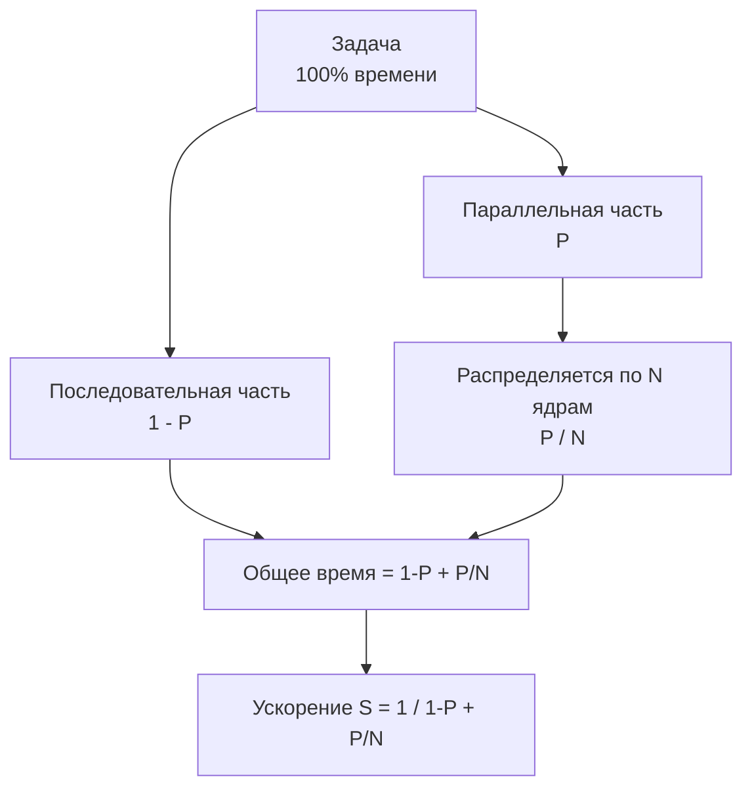

## Закон Амдала: математика масштабирования

В [[2. Latency vs throughput]] мы разделили время ответа и пропускную способность, а в [[3. CPU bound vs IO bound задачи]] классифицировали нагрузку по типу ограничения. Теперь вооружимся количественной моделью, которая предсказывает, *насколько именно* ускорится система при добавлении ядер или горутин. Эта модель — **закон Амдала** (Amdahl's Law).

Закон Амдала, сформулированный Джином Амдалом в 1967 году, отвечает на вопрос: «Какое максимальное ускорение получит задача, если часть её можно выполнять параллельно, а часть — только последовательно?». В контексте Go это не абстракция, а практический инструмент для принятия решений: стоит ли распараллеливать обработку, добавлять горутины, или мы уже упёрлись в последовательное «бутылочное горлышко».

### Формулировка

Пусть:
- $P$ — доля времени выполнения задачи, которая **может** быть распараллелена (0 ≤ P ≤ 1).
- $1 - P$ — доля, которая **обязана** выполняться строго последовательно.
- $N$ — количество равноправных вычислителей (ядер CPU, потоков ОС, горутин при условии равного распределения).

Тогда теоретическое ускорение (speedup) $S$ по сравнению с однопоточным выполнением равно:

$$S(N) = \frac{1}{(1 - P) + \frac{P}{N}}$$

Из формулы видно: при $N \to \infty$ знаменатель стремится к $1 - P$, и максимальное ускорение $S_{max} = \frac{1}{1 - P}$. Даже на гипотетической машине с бесконечным числом ядер, однопоточное узкое место ставит жёсткий потолок.

Примеры:
- Если 80% кода можно распараллелить (P=0.8), то $S_{max} = 1 / 0.2 = 5$. Никакое число ядер не даст ускорения выше 5×.
- Если P=0.95, максимум — 20×.
- Если P=0.99, всё ещё «всего» 100×.

### Визуализация эффекта



На практике формула показывает, что скромное последовательное «бутылочное горлышко» катастрофически снижает отдачу от многоядерности. Поэтому Senior-инженер обязан выявлять и минимизировать такие участки.

## Закон Амдала и Go: горутины, потоки и синхронизация

На первый взгляд кажется: Go с его тысячами горутин идеально подходит для параллельных вычислений, и закон Амдала не страшен — ведь горутины не привязаны жёстко к потокам, и мы можем запустить их сколь угодно много. Это опасное упрощение.

Закон Амдала оперирует *полезной параллельной работой*, а не числом горутин. Каждая горутина, выполняющая CPU-работу, требует физического ядра, чтобы реально ускорить вычисления. Модель G-M-P ([[1. Scheduler Go. G-M-P модель]]) гарантирует, что одновременно исполняется не больше `GOMAXPROCS` горутин (по умолчанию — число ядер). Остальные ждут в очередях. Таким образом, N в формуле Амдала для CPU-bound задач — это реальное число потоков ОС, выполняющих полезную работу, а не общее число горутин.

Более того, в любом параллельном коде на Go возникают *неизбежные* последовательные участки:
- Захват `sync.Mutex` или `sync.RWMutex` (критическая секция).
- Операции с каналами, когда они являются точкой синхронизации.
- Атомарные операции, создающие contention на кэш-линиях.
- Выделение памяти и последующая сборка мусора (фазы stop-the-world — см. [[3. Stop the world]]).
- Системные вызовы, временно блокирующие M (см. [[1. Системные вызовы и их стоимость]]).

Каждый такой участок снижает эффективный P, а значит, и достижимое ускорение.

### Пример расчёта в Go-сервисе

Рассмотрим гипотетический обработчик HTTP:

```go
func handler(w http.ResponseWriter, r *http.Request) {
    // Последовательная часть: парсинг заголовков, routing — 2% времени
    // Параллельная часть: вычисления — 98% времени
    // Но: внутри параллельной части есть мьютекс на общий кэш,
    // который занимает 5% времени выполнения запроса.
}
```

Если кэш защищён `sync.Mutex`, то доступ к нему сериализует все горутины. Таким образом, реальная доля параллельного кода не 0.98, а 0.98 - 0.05 = 0.93. При $N = 8$ ядрах ускорение составит:

$$S = \frac{1}{0.07 + 0.93/8} \approx \frac{1}{0.07 + 0.11625} = \frac{1}{0.18625} \approx 5.37$$

Без мьютекса (P=0.98) было бы $S \approx 7.0$. Контеншн на мьютексе «съел» почти 23% потенциальной производительности.

> [!tip] Собеседование
> **Вопрос:** Как оценить максимальное ускорение микросервиса, если профилирование показывает, что 10% времени уходит на ожидание мьютекса, а остальные 90% — на независимые вычисления?
> **Ответ:** Ожидание мьютекса — часть последовательной доли, т.к. критические секции выполняются последовательно. Эффективная последовательная доля 1-P = 10% = 0.1. Максимальное ускорение на бесконечном числе ядер: 1 / 0.1 = 10. Дальнейшее увеличение ядер не даст прироста.

## Mechanical Sympathy: что в «железе» усиливает закон Амдала

Закон Амдала идеализирован: он предполагает мгновенную коммуникацию и нулевые накладные расходы на распараллеливание. Реальность суровее. Механизмы «под капотом» действуют как умножитель последовательной доли:

- **Согласованность кэшей (cache coherence).** Когда горутины на разных ядрах пишут в одну кэш-линию ([[8. False sharing]]), протокол MESI генерирует трафик инвалидации. Это увеличивает латентность операций и фактически превращает часть параллельного времени в «сериализованное ожидание».
- **Ветвления и спекулятивное исполнение.** Неудачно предсказанные переходы ([[6. Branch prediction и код]]) стоят десятков тактов, увеличивая время последовательных фрагментов и ухудшая общий P.
- **Пропускная способность памяти.** Даже идеально параллельные задачи упираются в bandwidth контроллера памяти. Если восемь ядер одновременно запрашивают данные из RAM, они встают в очередь — и это последовательная точка на уровне микросхемы.
- **Прерывания и работа планировщика ОС.** Ядро не может одновременно обслуживать прерывание и выполнять инструкции приложения. Чем больше ядер, тем выше вероятность, что одно из них отвлечётся на обработку сетевого пакета или таймера, создавая «шум» и увеличивая дисперсию времени выполнения (что критично для tail latency, [[7. Tail latency и почему она важна]]).

Таким образом, реально достижимое ускорение всегда ниже теоретического, потому что «железо» само добавляет скрытую последовательную составляющую.

## Закон Амдала против закона Густавсона

Часто путают закон Амдала и закон Густавсона (Gustafson's Law). Амдал фиксирует размер задачи и спрашивает: «Насколько быстрее я решу *ту же самую* задачу на большем числе процессоров?». Густавсон фиксирует время и спрашивает: «Насколько *большую* задачу я смогу решить за то же время?».

Для веб-серверов, баз данных и стриминговых систем типична ситуация роста нагрузки: с увеличением числа клиентов мы задействуем больше ядер для обработки дополнительных запросов. Тут работает скорее закон Густавсона: параллельная часть масштабируется вместе с числом процессоров, а последовательная доля остаётся константной. Поэтому масштабирование выглядит почти линейным, пока сеть или диск не упрутся в свой предел.

Однако, если внутри каждого запроса появляется синхронизация (например, глобальный счётчик или кэш с мьютексом), закон Амдала снова вступает в силу, ограничивая throughput.

## Измерение «P» в реальном коде на Go

Чтобы применять закон Амдала осмысленно, нужно не гадать, а измерять долю последовательного времени. Методика:

1. **Запустить бенчмарк с `-cpu=1`**, измерить время выполнения одного экземпляра задачи (например, через `testing.B`).
2. **Запустить с `-cpu=N`** (где N — сколько ядер доступно) при фиксированной нагрузке, засечь новое время.
3. Вычислить ускорение $S$, затем решить уравнение относительно $P$: $P = \frac{N \cdot (S - 1)}{S \cdot (N - 1)}$.

В Go бенчмарки можно снабдить флагом `-cpu`:

```bash
go test -bench=. -cpu=1,2,4,8 -count=5
```

После этого построить кривую ускорения и сравнить с теоретической. Отклонения укажут на наличие скрытых последовательных участков.

Более точные методы — профилирование мьютексов (`go test -mutexprofile`, см. [[6. mutex profile]]) и трассировка исполнения ([[3. execution tracer]]). Они покажут, сколько времени горутины проводят в состоянии `Waiting` из-за синхронизации.

## Практические выводы для Go-разработчика

- **Не гонитесь за количеством горутин.** Закон Амдала напоминает, что параллелизм ценен только в той мере, в какой есть независимая работа. Запуск 1000 горутин для задачи с 1% параллельного кода — бессмысленный расход памяти и времени планировщика.
- **Уменьшайте последовательные доли.** В первую очередь — contention на мьютексах. Используйте шардирование (разделение кэша по ключам), lock-free структуры (каналы, atomic), минимизируйте время удержания блокировок.
- **Помните о GC.** Аллокации в параллельных горутинах могут выглядеть независимыми, но стадия mark termination stop-the-world ([[3. Stop the world]]) сериализует работу. Тюнинг GOGC и GOMEMLIMIT ([[7. GOGC и tuning]], [[8. GOMEMLIMIT]]) помогает сократить эту долю.
- **Масштабируйте осознанно.** Прежде чем выделять 64 ядра под микросервис, профилировщиком найдите истинную параллельную долю. Если она 90%, то переход с 8 на 16 ядер даст лишь 1.2× ускорение, а затраты ресурсов вырастут вдвое.

```go
// Пример: шардирование для снижения последовательной доли
type ShardedCache struct {
    shards []*CacheShard
    numShards int
}

type CacheShard struct {
    mu sync.RWMutex
    store map[string]interface{}
}

func (sc *ShardedCache) Get(key string) interface{} {
    shard := sc.shards[hash(key)%sc.numShards]
    shard.mu.RLock()
    defer shard.mu.RUnlock()
    return shard.store[key]
}
```

Разделение одного мьютекса на несколько шардов снижает вероятность коллизий и увеличивает эффективную параллельную долю P.

## Итог

- Закон Амдала связывает долю параллельного кода с максимальным ускорением при росте числа вычислителей.
- В Go параллелизм ограничен числом `GOMAXPROCS` и неизбежными синхронизациями, что напрямую влияет на ускорение.
- Реальное ускорение всегда ниже теоретического из-за накладных расходов железа (кэш-когерентность, прерывания, bandwidth памяти).
- Для измерения P используйте бенчмарки и профилировщики; заменяйте контеншн на шардирование и lock-free структуры.
- Закон Густавсона объясняет, почему серверы могут масштабироваться почти линейно при росте нагрузки, но и там последовательные участки рано или поздно ставят предел.
- Осознанное применение закона Амдала предотвращает неоправданные траты ресурсов и даёт количественную основу для архитектурных решений.

Понимание закона Амдала — это мост от абстрактного «почему не ускоряется» к инженерной диагностике конкретных bottleneck'ов. В следующей статье [[5. Mechanical sympathy в backend разработке]] мы заглянем глубже в «железо» и научимся сопрягать структуры данных Go с архитектурой процессора для максимальной производительности.