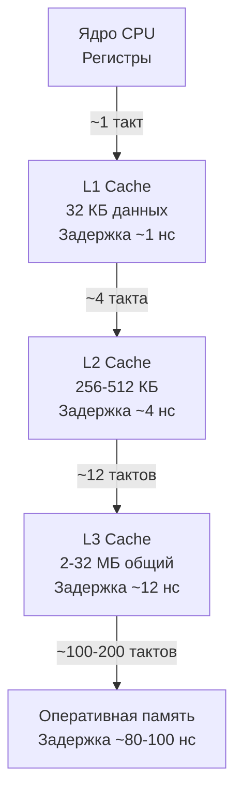

## Что такое Mechanical Sympathy

Термин «Mechanical Sympathy» ввёл инженер-программист Мартин Томпсон. Он означает способность разработчика проектировать программное обеспечение, понимая, как оно реально исполняется на физическом оборудовании. Это не про низкоуровневое программирование ради скорости, а про архитектурную осознанность: почему одна структура данных в 5 раз быстрее другой, почему 10 горутин на 8-ядерном процессоре дают лучший результат, чем 100, и почему перестановка полей в структуре экономит гигабайты памяти.

Для Go-разработчика уровня Senior/Lead механическая эмпатия — ключ к принятию верных решений без гадания. Язык абстрагирует многие детали (сборку мусора, планировщик горутин, системные вызовы), но стоимость этих абстракций выражается в тактах процессора, промахах кэша и задержках протокола когерентности. Без понимания этих механизмов вы будете бессильны объяснить, почему p99 latency под нагрузкой начинает «плыть», а throughput падает, хотя профилировщик CPU не показывает явных горячих точек.

В предыдущих статьях мы заложили фундамент: [[1. Обзор раздела. Как мыслить о производительности]], [[2. Latency vs throughput]], [[3. CPU bound vs IO bound задачи]], [[4. Amdahl law и масштабирование]]. Теперь мы погрузимся в «железо» и научимся сопрягать архитектуру Go-программ с архитектурой процессора.

## Почему абстракции врут: иерархия памяти

Современный процессор выполняет инструкции за доли наносекунды, но данные для этих инструкций лежат в оперативной памяти, доступ к которой в 100–200 раз медленнее. Чтобы скрыть эту пропасть, между процессором и RAM расположена многоуровневая иерархия кэшей.



Программист на Go, который оперирует слайсами, мапами и горутинами, обязан держать в уме эту пирамиду. Каждый промах мимо L1 или L2 обходится в десятки–сотни тактов, в течение которых ядро простаивает. Знание иерархии памяти превращает интуитивный выбор «слайс против связного списка» в инженерно обоснованный.

### Кэш-линия: атомарная единица обмена

Процессор никогда не читает из памяти отдельные байты. Он всегда загружает и сохраняет данные блоками фиксированного размера — **кэш-линиями**. На подавляющем большинстве современных x86-64 и ARM-процессоров размер кэш-линии — 64 байта. Это означает, что два поля структуры, расположенные в пределах 64 байт, всегда «путешествуют» по иерархии памяти вместе.

Из этого следует критически важное для конкурентности следствие: если две горутины на разных ядрах модифицируют две разные переменные, но те оказались в одной кэш-линии, процессор вынужден постоянно синхронизировать эту линию между ядрами. Это явление называется **false sharing** ([[8. False sharing]]) и способно разрушить производительность даже идеально параллельного кода.

> [!info] Под капотом
> Протокол когерентности кэшей (MESI/MOESI) гарантирует, что все ядра видят согласованную память. Когда ядро пишет в кэш-линию, оно рассылает сообщения инвалидации (Invalidate) другим ядрам, заставляя их перечитать линию из L3 или RAM. Если два ядра одновременно «борются» за одну линию, возникает лавина инвалидаций, а пропускная способность системы падает.

### Пример False Sharing в Go

```go
type Counter struct {
    A uint64
    // между A и B нет зазора — они в одной 64-байтной линии
    B uint64
}

func (c *Counter) IncA() {
    for i := 0; i < 1e6; i++ {
        c.A++
    }
}

func (c *Counter) IncB() {
    for i := 0; i < 1e6; i++ {
        c.B++
    }
}
```

Если две горутины одновременно вызывают `IncA` и `IncB` на общем экземпляре `Counter`, они постоянно инвалидируют одну и ту же кэш-линию, даже несмотря на то, что `A` и `B` — разные переменные. Бенчмарк покажет 2–4-кратное падение производительности по сравнению с вариантом, где поля разнесены на разные линии.

**Исправление** — выравнивание с помощью заполнителя:

```go
type CounterAligned struct {
    A uint64
    _ [56]byte // заполнитель до следующей 64-байтной границы
    B uint64
}
```

Современный Go предлагает встроенный способ через пакет `cpu` (пока экспериментальный, но идея понятна). В продакшен-коде часто используют структуры с явным паддингом для горячих разделяемых объектов. Подробнее в статьях [[9. Cache line и выравнивание]] и [[8. False sharing]].

## Пространственная и временная локальность

Производительный код на Go эксплуатирует два фундаментальных свойства программ:

- **Временная локальность** — если к данным обратились один раз, к ним, скорее всего, обратятся снова в ближайшее время.
- **Пространственная локальность** — если обратились к некоторому адресу, вероятно, скоро понадобятся соседние адреса.

Аппаратный префетчер (prefetcher) процессора предсказывает паттерны доступа и подгружает данные заранее. Он отлично справляется с последовательным перебором слайса и пасует перед разбросанными по куче указателями.

### Слайс против связного списка

```go
// Слайс — последовательный блок памяти
sum := 0
for _, v := range slice {
    sum += v
}

// Связный список — каждый элемент в отдельной аллокации
for node := list.Front(); node != nil; node = node.Next() {
    sum += node.Value
}
```

Слайс выигрывает по двум причинам:
- Одна кэш-линия (64 байта) вмещает 8–16 элементов (в зависимости от размера типа), и префетчер безошибочно подгружает следующие линии.
- Связный список вынуждает процессор постоянно разрешать указатели — каждый переход по `Next()` потенциально означает промах мимо всех кэшей и поход в RAM.

Разница в скорости обхода может достигать десятков раз, несмотря на одинаковую алгоритмическую сложность O(n). Это классический пример, когда mechanical sympathy перевешивает асимптотику.

### Структуры и компоновка полей

Порядок полей в структуре влияет на её размер и на то, сколько кэш-линий она занимает. Go выравнивает поля по их естественному размеру: uint64 — по 8 байт, uint32 — по 4, и т.д. Неудачный порядок приводит к паддингу между полями и раздуванию структуры.

```go
type Bad struct {
    a bool   // 1 байт + 7 байт паддинга
    b uint64 // 8 байт
    c bool   // 1 байт + 7 байт паддинга
} // 24 байта

type Good struct {
    a bool   // 1 байт
    c bool   // 1 байт + 6 байт паддинга
    b uint64 // 8 байт
} // 16 байт
```

Экономия 8 байт на миллионе экземпляров даёт 8 МБ памяти и, что важнее, увеличивает долю объектов, помещающихся в L1/L2 кэш. Это напрямую сказывается на throughput ([[6. Cache friendly структуры]]).

## Ветвления и предсказатель переходов

Процессоры используют конвейер (pipeline), чтобы выполнять несколько инструкций параллельно. Когда встречается условный переход (`if`, `for`), процессор не ждёт вычисления условия — он предсказывает, куда перейдёт исполнение, и начинает спекулятивно выполнять инструкции. Если предсказание оказалось неверным, конвейер сбрасывается, а потраченные такты пропадают. Ошибка предсказания ветвления стоит от 10 до 20 тактов.

Для Go-разработчика это означает, что горячие циклы с непредсказуемыми условиями работают существенно медленнее.

```go
// Непредсказуемое условие
for i := 0; i < len(data); i++ {
    if data[i] > 0 { // 50% true, 50% false — предсказатель ошибается в 50% случаев
        sum += data[i]
    }
}
```

Гораздо дружественнее предсказателю отсортировать данные перед циклом:

```go
sort.Ints(data)
for i := 0; i < len(data); i++ {
    if data[i] > 0 { // теперь true, а потом false — предсказатель легко запоминает паттерн
        sum += data[i]
    }
}
```

На практике это может дать прирост в 20–40% на больших объёмах данных. Подробнее в [[6. Branch prediction и код]].

## SIMD: векторные инструкции

Современные процессоры способны выполнять одну и ту же арифметическую операцию над несколькими данными одновременно (SIMD — Single Instruction, Multiple Data). Например, инструкция AVX512 обрабатывает 8 значений uint64 за один такт. Компилятор Go пока не умеет автоматически векторизовать циклы (в отличии, скажем, от GCC или Rust), но вы можете применять ассемблерные вставки или пакеты вроде `github.com/klauspost/cpuid/v2` и `github.com/tetratelabs/wazero` для вызова inlined-ассемблера.

Впрочем, для большинства бизнес-задач более ощутимый выигрыш даёт не ручная SIMD-оптимизация, а правильная организация памяти и устранение false sharing. Тем не менее, в разделах, связанных с криптографией, сжатием и обработкой потоков данных, эта техника может быть востребована ([[7. SIMD и Go]]).

## Escape Analysis, стек и куча

Размещение переменной на стеке или в куче — фундаментальное решение компилятора Go, которое влияет не только на GC, но и на локальность данных. Стековая память чрезвычайно горяча: она постоянно находится в L1/L2 кэше, так как вершина стека используется почти непрерывно. Куча «размазана» по адресному пространству, и проход по кучевым объектам неизбежно вызывает кэш-промахи.

**Escape Analysis** ([[3. Escape analysis]]) решает, может ли переменная «сбежать» из функции. Если нет — она размещается на стеке. С точки зрения mechanical sympathy, это означает, что:

- Избегание указателей в горячих структурах снижает нагрузку на GC, но также улучшает локальность (весь объект лежит в стеке или внутри родительской структуры, а не разбросан по куче).
- Функции с возвратом по значению, а не по указателю, могут быть быстрее, потому что не требуют разыменования.

Пакет `sync.Pool` ([[2. sync Pool]]) эксплуатирует временную локальность: однажды выделенный объект возвращается в пул и при следующем использовании, вероятно, всё ещё находится в кэше процессора.

## Сборщик мусора и кэш

Конкурентный GC в Go ([[1. GC в Go. Обзор]], [[4. Concurrent GC]]) сканирует граф достижимых объектов, проходя по указателям. Это сканирование «холодной» кучи заполняет кэши мусором, вытесняя оттуда полезные данные приложения. Кроме того, **write barriers** ([[5. Write barriers]]) добавляют небольшие накладные расходы при каждой записи в указатели, что может замедлить и без того горячие участки кода.

Понимание этих эффектов позволяет осознанно тюнить GC ([[7. GOGC и tuning]], [[8. GOMEMLIMIT]]) и минимизировать количество указателей в критических по производительности структурах.

## Планировщик горутин и локальность кэша

Планировщик Go распределяет горутины по P (логическим процессорам), которые привязаны к ядрам ОС. Модель work stealing ([[3. Work stealing]]) может перенести горутину с одного ядра на другое. В этот момент теряется весь «прогретый» кэш (L1, L2), что добавляет десятки микросекунд задержки при первом обращении к данным на новом ядре.

Для чувствительных к задержкам систем (high-frequency trading, real-time обработка) иногда применяют привязку горутин к ядрам через `runtime.LockOSThread()` в сочетании с `taskset` или `cgroups`. Однако это крайнее средство; в большинстве приложений выгоднее мириться с миграцией и оптимизировать сами структуры данных.

> [!tip] Собеседование
> **Вопрос:** Почему производительность горутины может резко упасть после миграции между P? Как это измерить?
> **Ответ:** При миграции горутина теряет локальность кэша L1/L2, что вызывает множество cache miss при первом касании данных. Измерить можно через `perf stat -e cache-misses,cache-references` или `pprof` с профилем кэша (косвенно). В Go также можно включить трассировщик ([[3. execution tracer]]) и увидеть моменты миграции между P.

## Инструменты для проверки механической эмпатии

- **`perf stat`** (Linux) — показывает общее количество cache-misses, branch-misses, instructions-per-cycle (IPC) для процесса.
- **`go tool pprof`** с CPU-профилем — горячие точки, но не даёт прямой информации о кэше. Косвенно: много времени в функциях с простым циклом — повод проверить кэш-эффективность.
- **Бенчмарки с `-benchmem`**, `-cpuprofile`, `-trace` для детального анализа.
- **Ассемблерный листинг** (`go tool compile -S`) — позволяет увидеть, какие инструкции генерирует компилятор, и оценить потенциальные узкие места.

Пример профилирования с `perf`:

```bash
perf stat -e task-clock,cycles,instructions,cache-misses,branch-misses ./my_binary
```

Сравнение двух версий кода по этим метрикам даёт объективную картину: если количество cache-misses упало, а IPC вырос — вы на верном пути.

## Итог: Mechanical Sympathy как инженерная дисциплина

- Проектирование производительного Go-кода требует понимания иерархии памяти, кэш-линий, предсказателя ветвлений и модели памяти языка.
- Структуры данных с хорошей пространственной локальностью (слайсы, плотно упакованные struct) радикально быстрее связных списков и размазанных по куче объектов с указателями.
- False sharing — главный враг параллельного кода; его диагностируют и лечат выравниванием кэш-линий ([[8. False sharing]], [[9. Cache line и выравнивание]]).
- Escape analysis помогает удерживать горячие переменные на стеке, снижая нагрузку на GC и улучшая локальность.
- Оптимизация ветвлений (сортировка данных) и учёт работы GC (write barriers) позволяют выжать дополнительные проценты производительности.
- Инструменты `perf`, `pprof` и `go tool trace` дают количественную обратную связь для проверки гипотез.

Механическая эмпатия — это не разовая техника, а постоянная практика: каждый раз, выбирая структуру данных или паттерн конкурентности, задавайте вопрос «как это будет жить в кэше?». Ответ на него ведёт к системам, которые не просто «работают», а работают предсказуемо и эффективно на реальном железе.

Следующая статья [[6. Метрики. p50, p95, p99]] перенесёт нас от внутренностей процессора к измерению пользовательских характеристик: как правильно собирать и интерпретировать перцентили задержек, почему среднее арифметическое вводит в заблуждение, и почему p99 — ваш главный союзник в борьбе за стабильный сервис.