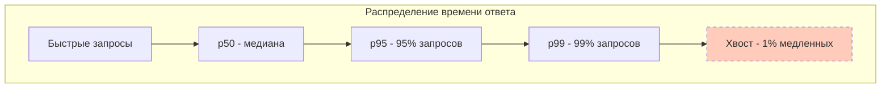

## Почему среднее арифметическое лжёт

В [[2. Latency vs throughput]] мы определили latency как время выполнения одной операции. Теперь критичный вопрос: *как именно измерять latency*? Ответ «среднее время ответа» — классическая ошибка, которую Senior-инженер Go допускать не может.

Представьте HTTP-сервер: 99 запросов отработали за 10 мс, а один — за 500 мс из-за паузы GC. Среднее арифметическое: (99×10 + 500) / 100 = 14.9 мс. Выглядит приемлемо. Но реальность такова: **каждый стотысячный клиент испытывает полусекундную задержку**, и если этот клиент — ваш платёжный шлюз или сервис авторизации, ошибка каскадом разрушает latency всей распределённой системы.

Метрики производительности, основанные на среднем, не показывают хвост распределения. Поэтому в инженерии надежности приняты **перцентили (процентили)**.

## Перцентили: p50, p95, p99 и другие

**Перцентиль** — это значение, ниже которого попадает заданный процент наблюдений. Для времени ответа:
- **p50 (медиана)** — половина запросов быстрее этого значения, половина медленнее. Характеризует «типичного пользователя».
- **p95** — 95% запросов быстрее, 5% медленнее. Показывает, насколько быстро работает сервис для подавляющего большинства, исключая редкие выбросы.
- **p99** — только 1% запросов хуже. Ключевой индикатор «хвостовой задержки» (tail latency), важный для стабильности внутренних сервисов.

Аналогично используют p90, p999, p9999 в зависимости от требований SLA. Чем выше процентиль, тем он ближе к максимальной задержке в выборке, и тем сильнее на него влияют выбросы.



> [!info] Под капотом
> Математически p-й перцентиль вычисляется по отсортированной выборке размера N: берут значение с индексом `ceil(p/100 * N)`. При малых N возможна грубая оценка; в мониторинге используют аппроксимации через гистограммы с экспоненциальными корзинами.

## Как выглядят распределения задержек в реальности

Задержки в компьютерах редко подчиняются нормальному распределению. Обычно мы наблюдаем:
- **Мультимодальность:** часть запросов обслуживается из кэша (микросекунды), часть — через реальный syscall (миллисекунды), часть — с GC-паузой (сотни миллисекунд).
- **Длинный правый хвост (heavy-tail):** из-за очередей, блокировок, конкуренции за ресурсы всегда есть ненулевая вероятность очень долгого выполнения.

Типичный пример: веб-запросы. Распределение может иметь пик на 1 мс (попадание в keep-alive + кэш), второй пик на 20 мс (дисковый кэш), и плавный спад до секунд (сборка мусора, переполнение буфера).

Поэтому p50 может быть 2 мс, а p99 — 800 мс. Среднее будет где-то 30 мс, что полностью скрывает хвост.

## Вычисление процентилей в Go

Простейший способ для бенчмарков или локальной отладки — собрать слайс длительностей, отсортировать и взять значение по индексу:

```go
func percentile(data []time.Duration, p float64) time.Duration {
    if len(data) == 0 {
        return 0
    }
    sort.Slice(data, func(i, j int) bool { return data[i] < data[j] })
    idx := int(math.Ceil(p/100.0 * float64(len(data)))) - 1
    if idx < 0 {
        idx = 0
    }
    return data[idx]
}
```

Однако хранить в памяти все замеры на продакшене нереально. Поэтому системы мониторинга строят **гистограммы**: диапазон возможных значений разбивается на корзины (buckets) и считается количество попаданий в каждую. В Go для Prometheus используется пакет `github.com/prometheus/client_golang`, позволяющий задать корзины, например:

```go
var requestDuration = prometheus.NewHistogramVec(
    prometheus.HistogramOpts{
        Name:    "http_request_duration_seconds",
        Help:    "Длительность HTTP-запросов",
        Buckets: prometheus.DefBuckets, // .005, .01, .025, .05, .1, .25, .5, 1, 2.5, 5, 10
    },
    []string{"handler", "method"},
)
```

По накопленным корзинам Prometheus вычисляет приближённые процентили через `histogram_quantile`. Точность зависит от выбора границ корзин: чем больше корзин, тем точнее оценка, но выше расход памяти. Это компромисс, отражающий нашу тему [[5. Mechanical sympathy в backend разработке]]: метрики тоже потребляют ресурсы.

> [!warning] Ловушка / Gotcha
> Функция `histogram_quantile` Prometheus интерполирует внутри корзины линейно, что даёт погрешность, особенно в хвосте, если корзины широкие. Например, если верхняя корзина от 1 с до +Inf, любой p99, попавший в неё, будет усреднён до 1 с, что может занизить реальное значение. Всегда добавляйте достаточное число верхних корзин, соответствующих вашим SLO.

## Сбор метрик в production Go-сервисе

Простой middleware, собирающий summary (квантили на лету) без внешних библиотек, можно построить с использованием `github.com/codahale/hdrhistogram` или самодельного кольцевого буфера. Но для наглядности покажем примитивный подход с резервуарным сэмплированием:

```go
type LatencyTracker struct {
    mu     sync.Mutex
    samples []time.Duration
    maxSamples int
    rng    *rand.Rand
}

func NewLatencyTracker(maxSamples int) *LatencyTracker {
    return &LatencyTracker{
        maxSamples: maxSamples,
        rng:        rand.New(rand.NewSource(time.Now().UnixNano())),
    }
}

func (lt *LatencyTracker) Record(d time.Duration) {
    lt.mu.Lock()
    defer lt.mu.Unlock()
    if len(lt.samples) < lt.maxSamples {
        lt.samples = append(lt.samples, d)
    } else {
        // Заменяем случайный элемент для сохранения распределения
        idx := lt.rng.Intn(len(lt.samples))
        lt.samples[idx] = d
    }
}

func (lt *LatencyTracker) Percentile(p float64) time.Duration {
    lt.mu.Lock()
    defer lt.mu.Unlock()
    if len(lt.samples) == 0 {
        return 0
    }
    sorted := make([]time.Duration, len(lt.samples))
    copy(sorted, lt.samples)
    sort.Slice(sorted, func(i, j int) bool { return sorted[i] < sorted[j] })
    idx := int(math.Ceil(p/100.0 * float64(len(sorted)))) - 1
    if idx < 0 {
        idx = 0
    }
    return sorted[idx]
}
```

Этот код не годится для высокоточного мониторинга, но иллюстрирует, как из потока событий извлекается статистика. В реальном проекте вы подключите OpenTelemetry с экспортом метрик, где агрегация выполняется на стороне сборщика.

## Связь с SLO и SLA

SLA (Service Level Agreement) часто формулируется в терминах процентилей: «99% запросов должны выполняться быстрее 200 мс». Здесь p99 — прямая цель. Если p99 превышает установленный порог, SLA нарушается, что может приводить к штрафам или потере доверия.

SLO (Service Level Objective) — внутренняя цель, например «p99 ≤ 150 мс», чтобы оставался запас. Инженер Go использует эти метрики для настройки алертов и планирования ёмкости ([[6. Capacity planning]]).

> [!tip] Собеседование
> **Вопрос:** Как выбрать между p95 и p99 для мониторинга?
> **Ответ:** p95 лучше для раннего оповещения о деградации большинства пользователей, p99 важен для сервисов, где хвостовые задержки каскадно влияют на другие компоненты (например, внутренний API). Часто мониторят оба. Выбор зависит от того, насколько критичен 5% худших запросов против 1%.

## Mechanical Sympathy: почему возникают хвостовые выбросы

Заглянем под капот Go-приложения. Время ответа складывается из многих этапов, каждый из которых имеет своё распределение:

- **Планирование горутины:** если все P заняты, горутина ждёт в очереди. Время ожидания зависит от загрузки системы.
- **Конкуренция за мьютексы:** ожидание `sync.Mutex` может быть микросекундами при быстром пути (CAS в userspace) или миллисекундами, если поток ушёл в `futex` в ядре.
- **GC-паузы:** конкурентный GC в Go имеет короткие stop-the-world фазы, но при mark termination все горутины приостанавливаются ([[3. Stop the world]]). Даже 1 мс пауза добавляет хвост.
- **Системные вызовы и сеть:** блокирующие вызовы ([[1. Системные вызовы и их стоимость]]) могут задерживать горутину, а TCP-переповторы и потери пакетов создают всплески в миллисекундах.
- **Иерархия памяти:** cache miss заставляет ядро ждать данные из RAM (80-100 нс), но если происходит NUMA-перекос или TLB miss, задержки увеличиваются.

Эти факторы создают мультимодальное распределение. Например, 99% операций чтения из памяти попадают в L1 (1 нс), 0.9% — в L3 (12 нс), 0.1% — в RAM (80 нс). Получаем p99 ≈ 80 нс при среднем 2 нс.

Закон Литтла ([[2. Latency vs throughput]]) даёт ещё одно объяснение: если через систему проходит λ запросов в секунду, а средняя задержка W, то одновременно в системе L = λ×W запросов. Увеличение λ или W ведёт к росту очередей. Запрос, попавший в длинную очередь, испытывает значительную задержку, расширяя хвост.

> [!info] Под капотом
> В Go сетевой поллер добавляет свои особенности. Горутины, ожидающие ввода-вывода, паркуются, но пробуждение происходит через netpoll, который привязан к планировщику. При большом количестве готовых горутин может возникнуть "thundering herd", что добавляет дисперсию.

## Инструментарий Go для метрик задержек

- **`runtime/metrics`** — встроенный пакет, предоставляющий метрики GC, планировщика, памяти. Не даёт процентилей задержек приложения, но необходим для корреляции хвостов с GC (например, `/gc/scan/latency:microseconds`).
- **`expvar`** — публикация произвольных метрик в JSON через HTTP. Можно зарегистрировать `expvar.Func`, вычисляющий процентили на лету, но не масштабируется на много сервисов.
- **Prometheus client** (`promhttp`) — де-факто стандарт. Предоставляет гистограммы и сводки (summaries), автоматически собирает процентили на клиенте (но Prometheus рекомендует гистограммы, т.к. они агрегируются на сервере).
- **OpenTelemetry** — SDK, поддерживающий экспорт метрик в разные бекенды (Prometheus, OTLP). Использует аналогичные механизмы.

Выбор инструмента зависит от наблюдаемости, описанной в разделе [[8. Observability и performance]].

## Практический пример: измеряем p99 и выявляем выбросы

Запустим сервер, который под нагрузкой демонстрирует ненормальный p99:

```go
var (
    reqDuration = prometheus.NewHistogram(prometheus.HistogramOpts{
        Name:    "req_duration_seconds",
        Buckets: prometheus.ExponentialBuckets(0.001, 2.0, 15), // 1ms, 2ms, 4ms...
    })
)

func handler(w http.ResponseWriter, r *http.Request) {
    start := time.Now()
    defer func() { reqDuration.Observe(time.Since(start).Seconds()) }()
    // Симуляция периодической задержки GC
    if rand.Intn(100) < 1 {
        runtime.GC()
    }
    time.Sleep(10 * time.Millisecond)
}
```

Через `curl localhost:2112/metrics` мы увидим гистограмму. График p99 в Grafana выявит периодические всплески, вызванные принудительным GC. Корреляция с `go_gc_duration_seconds` подтвердит причину. Это классический сценарий: без p99 вы бы не заметили эпизодических задержек.

## Культура измерения: от разработчика до инженера

Принятие решений на основе процентилей — часть инженерного мышления, заложенного в [[1. Обзор раздела. Как мыслить о производительности]]. Нельзя говорить «стало быстрее», надо говорить «p95 уменьшился на 20%, а p99 не изменился». Только тогда вы понимаете, пожертвовали ли вы хвостом ради среднего, и не нарушили ли SLO.

Профилирование ([[2. CPU profiling в Go]], [[5. pprof memory profile]]) и бенчмарки ([[2. Benchmarking в Go]]) должны сопровождаться метриками распределения времени выполнения, чтобы уловить дисперсию, а не только среднее.

## Итог

- Средняя задержка — опасный и вводящий в заблуждение показатель. Процентили p50, p95, p99 раскрывают поведение системы для большинства пользователей и для наихудших случаев.
- Хвостовые выбросы (p99, p999) критичны для надёжности, потому что в распределённых системах задержки накапливаются и один медленный сервис может замедлить все цепочки вызовов.
- В Go для измерения процентилей используют гистограммы с экспоненциальными корзинами, экспортируемые в Prometheus или OTel, что позволяет агрегировать метрики без хранения всех замеров.
- Mechanical sympathy объясняет природу хвостов: конкурентность, GC, иерархия памяти делают распределение задержек многомодальным.
- Инженерная зрелость требует формулировать требования (SLO) в терминах процентилей и использовать их в алертах, CI/CD регрессиях и планировании ёмкости.

В следующей статье мы углубимся в феномен, который составляет суть p99 и выше: [[7. Tail latency и почему она важна]]. Вы узнаете, как хвостовые задержки накапливаются в микросервисной архитектуре и какие методы борьбы с ними существуют на уровне кода, инфраструктуры и протоколов.