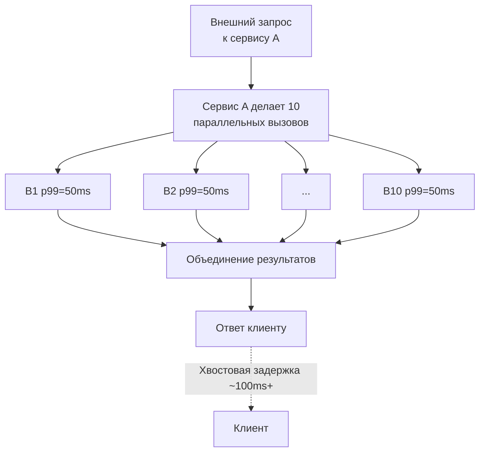

## Почему хвост важнее головы

В [[6. Метрики. p50, p95, p99]] мы определили перцентили и выяснили, что среднее арифметическое — плохой советчик. Теперь мы погрузимся в ту самую область, которую описывают p99 и p999 — **tail latency**, хвостовую задержку. Именно она разрушает пользовательский опыт, взрывает бюджеты SLO и делает микросервисные архитектуры хрупкими. Почему? Потому что в распределённых системах хвостовые задержки не усредняются — они накапливаются.

Представьте: один сервис совершает 10 параллельных вызовов к базам данных и соседним микросервисам, чтобы собрать страницу. Если каждый из этих вызовов имеет p99 = 50 мс, то вероятность, что *хотя бы один* окажется в хвосте, составляет `1 - (0.99)^10 ≈ 9.6%`. То есть почти каждый десятый запрос к сервису будет хвостовым, даже если каждый внутренний компонент хвастается «99% запросов быстрее 50 мс». Это катастрофа.

Для Go-разработчика, проектирующего систему на горутинах, эта проблема стоит особенно остро: горутины порождают высокую степень параллелизма, а значит, fan-out запросов типичен. К тому же внутренние механизмы Go (GC, планировщик) могут создавать микроскопические, но внезапные паузы, которые собираются в хвосты.

## Физика хвостов: закон больших чисел и очереди

Хвостовая задержка не рождается из ниоткуда. Она растёт из двух фундаментальных источников:

1. **Накопление независимых событий.** Даже если каждый компонент имеет отличную медиану, при умножении вызовов растёт вероятность «не повезти» хотя бы с одним.
2. **Коррелированные выбросы.** Действия, которые одновременно затрагивают все запросы: пауза GC, скачок нагрузки на CPU, прерывание от сетевой карты, захват глобального мьютекса. В этом случае страдают сразу многие запросы, и хвост расширяется драматически.

### Модель накопления в fan-out



Если сервис A ждёт все ответы (например, собирая данные для страницы), его собственная p99 будет грубо равна максимуму из десяти случайных величин. Для экспоненциального распределения (которое часто приближает задержки сети) хвостовой процентиль растёт пропорционально логарифму числа вызовов. Для практики это означает, что p99 может вырасти с 50 мс до 120–200 мс без каких-либо изменений в самих B1...B10.

### Очереди и закон Литтла

Вспомним закон Литтла из [[2. Latency vs throughput]]: $L = \lambda \times W$. Когда throughput $\lambda$ приближается к границе пропускной способности системы, среднее число запросов $L$ в ней стремительно растёт, а с ним — и время ожидания в очередях. Теория массового обслуживания говорит, что для системы M/M/1 (пуассоновский вход, экспоненциальное обслуживание) среднее время ответа $W = \frac{1}{\mu - \lambda}$, где $\mu$ — интенсивность обслуживания. При $\lambda \to \mu$, $W \to \infty$. Хвост распределения задержек при этом становится гиперэкспоненциальным.

Для Go-приложений это означает, что даже небольшой перегруз CPU или кратковременный всплеск аллокаций (с последующей GC) может вызвать резкое расширение хвоста, так как система приближается к насыщению.

## Источники хвостов в Go-рантайме

> [!info] Под капотом
> Даже идеально написанный код обслуживается средой выполнения, которая нет-нет да и остановит все горутины или отвлечёт поток ОС.

### 1. Сборщик мусора (GC)

Конкурентный сборщик Go ([[1. GC в Go. Обзор]], [[4. Concurrent GC]]) с минимальными паузами — это правда. Но stop-the-world (STW) фазы всё равно существуют: mark termination и, в редких случаях, sweeping определённых структур требуют остановки всех горутин ([[3. Stop the world]]). Типичная STW-пауза в хорошо настроенном GC — единицы микросекунд, но при пиковых нагрузках или нехватке памяти может растянуться до десятков микросекунд. Этого достаточно, чтобы создать задержку, которая для p50 незаметна, но для p99 становится заметным всплеском.

Кроме того, фазы конкурентного mark используют CPU время. Это не останавливает горутины напрямую, но снижает доступный процессор, увеличивая длительность обработки запросов и раздувая хвосты при большой нагрузке. Настройка `GOGC` и `GOMEMLIMIT` ([[7. GOGC и tuning]], [[8. GOMEMLIMIT]]) — ключевые рычаги управления.

### 2. Планировщик горутин

Модель G-M-P ([[1. Scheduler Go. G-M-P модель]]) эффективна, но когда количество готовых к выполнению горутин превышает `GOMAXPROCS`, они встают в очередь. Время ожидания в очереди runnable добавляется к задержке. Если горутина, обрабатывающая запрос, была вытеснена с P (преемпшн по времени или из-за блокировки канала), она может провести в очереди десятки микросекунд, пока ей снова не достанется P. Это превращается в хвост.

Work stealing ([[3. Work stealing]]) помогает балансировке, но не мгновенно. К тому же миграция горутины на другое ядро сбрасывает кэш L1/L2, что добавляет задержку при первом касании данных ([[5. Mechanical sympathy в backend разработке]]).

### 3. Системные вызовы и блокировки

Блокирующие системные вызовы ([[1. Системные вызовы и их стоимость]]), например файловый ввод-вывод без O_NONBLOCK или DNS-резолвинг через cgo, открепляют M от P. Пока M заблокирован в ядре, P вынужден искать новый M. Если свободных M нет, рантайм создаёт новый тред ОС — на это уходят миллисекунды. Аналогично, если горутина держит `sync.Mutex` и уходит в `futex` в ядре, ожидание может затянуться. Профилировщик блокировок ([[5. block profile]]) и мьютексов ([[6. mutex profile]]) прямо показывает такие места.

### 4. Ложное разделение кэша (False sharing)

Две горутины, обновляющие разные переменные в одной кэш-линии ([[8. False sharing]]), порождают лавину инвалидаций кэша. Это не просто снижает throughput, но и создаёт внезапные провалы, когда оба ядра одновременно «борются» за линию. Временные затраты на разрешение когерентности могут вносить существенный разброс в длительность выполнения.

### 5. Сеть и netpoller

Сетевой поллер Go ([[4. epoll, kqueue и netpoller]]) интегрирован с планировщиком. Когда горутина блокируется на чтении из сокета, она паркуется, а P берёт другую работу. По готовности сокета сетеполлер помечает горутину как runnable. Однако эта цепочка добавляет латентность: между приходом пакета и пробуждением горутины проходят микросекунды. Более того, при массовом пробуждении (thundering herd) планировщик может перегрузиться, вызывая разброс задержек.

## Методы борьбы с хвостовой задержкой в Go

### 1. Установка таймаутов и контроль параллелизма

Каждый сетевой вызов, каждая операция с каналом должна иметь дедлайн. `context.Context` с `context.WithTimeout` предотвращает бесконечное ожидание и обрывает хвосты:

```go
ctx, cancel := context.WithTimeout(r.Context(), 50*time.Millisecond)
defer cancel()
resp, err := client.Do(req.WithContext(ctx))
```

Но таймаут сам по себе не сокращает хвост — он лишь обрезает его и не даёт испортить общую задержку. Чтобы активно снизить хвост, применяют хеджирование (hedging).

### 2. Хеджирование запросов (Request Hedging)

Если запрос не уложился в определённый бюджет (например, 90% от тайм-аута), отправляется дублирующий запрос к другому экземпляру сервиса. Тот, кто ответит первым, побеждает, а остальные отменяются. Это круто снижает p99 ценой дополнительного расхода ресурсов:

```go
func hedgedCall(ctx context.Context, fn func(context.Context) (string, error)) (string, error) {
    ctx, cancel := context.WithCancel(ctx)
    defer cancel()
    resCh := make(chan string, 2)
    errCh := make(chan error, 2)

    for i := 0; i < 2; i++ {
        go func() {
            res, err := fn(ctx)
            if err != nil {
                errCh <- err
                return
            }
            resCh <- res
        }()
    }

    select {
    case res := <-resCh:
        return res, nil
    case err := <-errCh:
        // ждём второй, может быть успех
        select {
        case res := <-resCh:
            return res, nil
        case <-ctx.Done():
            return "", ctx.Err()
        }
    }
}
```

Для нагрузок, где важен каждый процент CPU, хеджирование дозированно: отправляют дополнительный запрос только для небольшой доли запросов (например, для тех, что уже ждут дольше p95).

### 3. Приоритезация и обратное давление

Разделение запросов на критические и некритические позволяет при перегрузке ронять некритические запросы быстрее и сохранять ресурсы для критических, удерживая их хвост в рамках. В Go это реализуется через очереди с приоритетом или семафоры с разными SLA:

```go
type PrioritySemaphore struct {
    high chan struct{}
    low  chan struct{}
}

func (ps *PrioritySemaphore) Acquire(ctx context.Context, highPri bool) error {
    if highPri {
        select {
        case ps.high <- struct{}{}:
            return nil
        default:
            // ждём или возвращаем ошибку при перегрузке
        }
    }
    // ...
}
```

Другой механизм — **backpressure**: не принимать новые запросы, если очередь заполнена. Это защищает системные ресурсы и не даёт хвостам «заражать» удачные запросы.

### 4. Настройка GC и аллокаций

Минимизация аллокаций ([[1. Уменьшение аллокаций]], [[2. sync Pool]]) уменьшает частоту и длительность GC-пауз, улучшая хвосты. `sync.Pool` переиспользует объекты, сохраняя их в кэше процессора, что также сокращает разброс времени доступа. Тюнинг `GOGC` и `GOMEMLIMIT` ([[7. GOGC и tuning]], [[8. GOMEMLIMIT]]) позволяет удерживать GC под контролем, жертвуя памятью ради стабильности хвоста.

### 5. Избегание горячих блокировок и false sharing

Шардирование мьютексов (разбивка по ключу) снижает contention и устраняет источник непредсказуемого ожидания. Выравнивание структур до границы кэш-линии ([[9. Cache line и выравнивание]]) ликвидирует false sharing и его влияние на дисперсию.

### 6. Асинхронная обработка и отложенные работы

Всё, что не критично для ответа пользователю, можно вынести в фоновые горутины или очереди ([[13. Очереди, брокеры сообщений и оркестраторы]]). Это напрямую не уменьшает хвост того, что остаётся на критическом пути, но сужает его, убирая лишние операции.

## Мониторинг хвостов: инструменты для Go

- **pprof** (CPU, memory, block, mutex) — помогает найти источники задержек, описанные выше.
- **Execution tracer** ([[3. execution tracer]]) — визуализирует состояния горутин, GC-паузы, миграции. Позволяет увидеть «провалы» во времени.
- **Prometheus гистограммы** с правильно заданными корзинами для p99/p999.
- **Distributed tracing** (OpenTelemetry) — коррелирует задержки по цепочке сервисов, выявляя накопительный эффект хвостов.
- **Нагрузочное тестирование** с измерением высоких процентилей ([[1. Load testing]]).

> [!tip] Собеседование
> **Вопрос:** Как вы будете расследовать внезапный рост p99 в Go-микросервисе?
> **Ответ:** Проверю корреляцию с GC-метриками (`/gc/pause:seconds`), загрузкой CPU и числом горутин. Сниму CPU-профиль на пике, блокировочный профиль и трассировку. Оценю contention на мьютексах и возможный false sharing через `perf stat`. Проверю, не появилась ли зависимость с высоким fan-out. Затем проверю, нет ли системных вызовов, вызывающих блокировку тредов. На основе этого предложу шардирование, буферизацию или тюнинг GC.

## Итог: хвост как архитектурный компас

- Хвостовая задержка (tail latency) — это не шум, а фундаментальное свойство системы, которое мультиплицируется в распределённой архитектуре.
- В Go основной вклад в хвост вносят GC-паузы, конкуренция за планировщик и мьютексы, блокирующие syscall'ы и эффекты кэш-когерентности.
- Методы борьбы: таймауты, хеджирование, приоритезация, backpressure, тюнинг GC, минимизация аллокаций и устранение contention.
- Измерять хвост нужно через гистограммы с высокими процентилями (p99, p999) и трассировку; среднее бесполезно.
- Инженерный подход требует, чтобы SLO включали не только p50 или p95, но и p99, а также планы действий при их нарушении.

Tail latency — это зеркало вашей системы. Оно показывает, где копятся микроскопические паузы и как они превращаются в катастрофу для клиента. В следующей статье мы вооружимся инструментом, без которого все разговоры о производительности остаются гаданием: [[1. Почему нельзя оптимизировать без измерений]].