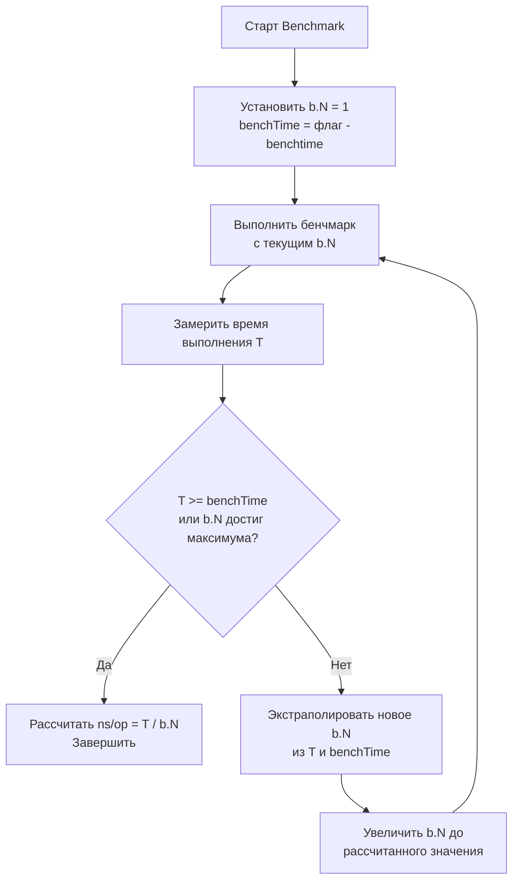

## Как `go test -bench` устроен внутри

В [[2. Benchmarking в Go]] мы изучили практический синтаксис бенчмарков: функции `BenchmarkXxx`, адаптивный `b.N`, таймеры, `b.RunParallel`. Теперь настало время заглянуть под капот — понять, как именно фреймворк бенчмаркинга реализует эти механики внутри, как взаимодействует с рантаймом Go и операционной системой. Без этих знаний невозможно интерпретировать артефакты измерений, диагностировать нестабильность и строить достоверные бенчмарки.

Рассматривать мы будем реализацию в `testing` пакете, код которого находится в `src/testing/benchmark.go` (для Go 1.21+). Внутренние механизмы тесно связаны с планировщиком горутин и сборщиком мусора, что делает бенчмаркинг в Go непохожим на аналоги в C или Java.

## Адаптивный алгоритм определения `b.N`

Сердце бенчмарка — цикл автоматического подбора числа итераций, обеспечивающий измерение заданной длительности (по умолчанию 1 секунда, настраивается флагом `-benchtime`). Цель — минимизировать погрешность усреднения при сохранении разумного времени выполнения.

Внутренняя логика, сильно упрощая, такова:

В действительности логика уточнена:

- На первой итерации `b.N` = 1, производится прогон. Если время меньше `benchTime`, фреймворк предсказывает необходимое `b.N` по простой пропорции: `желаемое_N = round(float64(benchTime) / (T / b.N))`. Однако чтобы избежать слишком агрессивного роста, делается это с запасом — обычно умножается на 1.2–1.5.
- После нескольких итераций `b.N` стабилизируется; окончательное значение `b.N` гарантирует, что общее время выполнения последнего прогона >= `benchTime` (по умолчанию 1 секунда).
- Если бенчмарк настолько быстр, что даже при `b.N` = 1 достигается `benchTime`, он так и остаётся с N=1.

Этот подход означает, что **количество итераций не фиксируется заранее**, а зависит от скорости самой целевой операции. Поэтому один и тот же бенчмарк, выполняемый на разном железе, будет иметь разное `b.N` — но `ns/op` сохранит сопоставимость.

> [!info] Под капотом
> В исходном коде `testing.B.launch()` (до Go 1.21 использовался `runN`) есть счётчик циклов, контролирующий увеличение. Также отслеживается, чтобы не превысить максимальное количество итераций (1e9) и не уйти в бесконечный рост при чрезвычайно быстрых операциях.

## Как работают таймеры: `ResetTimer`, `StopTimer` и `StartTimer`

Бенчмарк измеряет чистое время выполнения итераций, исключая подготовку и очистку. Это достигается через три метода, манипулирующих внутренними счётчиками времени и числа итераций.

Внутри `testing.B` есть поля:

- `duration` — накопленное чистое время выполнения.
- `netAllocs` / `netBytes` — аллокации.
- `timerOn` — флаг, указывающий, идёт ли сейчас замер.

Механика:

- `StartTimer()` — запускает таймер (вызывает `time.Now()` для стартовой метки). Если таймер уже был запущен, паникует.
- `StopTimer()` — останавливает таймер, прибавляя прошедший с последнего старта интервал к `duration`, и сбрасывает флаг.
- `ResetTimer()` — сбрасывает накопленное время `duration` и счётчик итераций в ноль, но **не останавливает** таймер, если он был запущен. Это эквивалентно `StopTimer()` затем сбросу, затем `StartTimer()`, но сделано атомарно для простоты использования.

Важно: `b.N` не зависит от этих операций — он управляется внешним циклом адаптации. Таймеры лишь определяют, какой кусок времени попадёт в результат.

> [!warning] Ловушка / Gotcha
> Если вы после `b.ResetTimer()` оставите код, который всё же выполняет значительную работу (например, вызов внешнего API), то эта работа будет учтена, так как таймер идёт. `ResetTimer` не телепортирует вас в идеальное состояние; он лишь обнуляет накопленные метрики, но таймер продолжает тикать.

## Влияние сборщика мусора

Go-рантайм может инициировать GC в любое время, если куча растёт. Внутри бенчмарка `testing.B` **не изолирует GC** — он работает в общем рантайме. Однако фреймворк пытается минимизировать его влияние на измерения:

- Перед началом каждого запуска бенчмарка (после определения `b.N`) принудительно вызывается `runtime.GC()` для стабилизации состояния кучи.
- Но в процессе выполнения итераций GC может случиться снова. Его работа будет включена в измеренное время, что добавит непредсказуемый «шум» и может завысить `ns/op`.
- Чтобы уменьшить шум, рекомендуется делать `b.ReportAllocs()` и отслеживать количество аллокаций. Высокое число аллокаций на итерацию предсказывает больший вклад GC.

В [[4. Подводные камни benchmark тестов]] мы разберём, как GC может полностью исказить результаты и как этого избежать.

## Монотонные часы и `time.Now`

`testing.B` использует стандартный `time.Now()`, который в Go с версии 1.9 опирается на монотонные часы ОС при измерении интервалов. Это означает, что расчёт длительности корректен даже при переводе системных часов. Однако `time.Now()` всё равно требует системного вызова (в Linux — `clock_gettime(CLOCK_MONOTONIC)`), и этот вызов входит в измеряемое время для быстрых операций. Именно поэтому для наносекундных бенчмарков стоит учитывать стоимость самого измерения.

Внутри `benchmark.go` время замеряется до и после цикла, а разница делится на `b.N`. Таким образом, стоимость `time.Now()` амортизируется на все итерации, но при очень малом `b.N` может появиться систематическая погрешность.

## Работа `b.RunParallel` изнутри

`b.RunParallel` — не просто запуск нескольких горутин. Его реализация обеспечивает равномерное распределение итераций между горутинами и корректный учёт параллельного времени.

Упрощённая схема:

1. Определяется `procs` = `GOMAXPROCS * b.parallelism` (по умолчанию `b.parallelism` = 1).
2. Вычисляется целевое общее количество итераций `b.N`, как и для последовательного бенчмарка — адаптивным циклом, но с учётом параллелизма. Однако цикл адаптации работает последовательно: сначала фреймворк запускает бенчмарк в одногорутовом режиме для грубой оценки времени одной итерации, затем включает параллелизм и пересчитывает `b.N`.
3. Создаётся `procs` горутин. Каждая горутина получает локальный счётчик итераций, распределённый через атомарный общий счётчик. Горутина вызывает пользовательскую функцию, передавая `*testing.PB`, у которого метод `Next()` атомарно декрементирует общий `b.N` и возвращает `true`, пока итерации не исчерпаны.
4. Главная горутина ждёт завершения всех рабочих горутин, после чего останавливает таймер. Итоговое время — общее время выполнения *всех* горутин, делённое на `b.N`. Таким образом, `ns/op` означает среднее время одной итерации *в условиях параллелизма*, учитывающее contention и синхронизацию.

> [!tip] Собеседование
> **Вопрос:** Почему `RunParallel` при `GOMAXPROCS=1` всё равно может дать результат, отличный от обычного бенчмарка?
> **Ответ:** Даже при одном логическом процессоре `RunParallel` запускает одну горутину, но путь через `atomic` и планировщик добавляет накладные расходы. Также бенчмарк может быть быстрее или медленнее из-за другого порядка исполнения или эффектов кэша. Плюс адаптивный подбор `b.N` для параллельного варианта может выбрать другое N, что повлияет на амортизацию.

## Сбор профилей внутри бенчмарка

Флаги `-cpuprofile`, `-memprofile`, `-blockprofile`, `-mutexprofile` инструктируют `testing` начать профилирование на время выполнения бенчмарка. Делается это с использованием `runtime/pprof`. Внутренне бенчмарк:

- Стартует профилировщик перед последним, стабилизированным запуском (когда `b.N` уже финальное).
- Останавливает профилировщик сразу после выполнения цикла.
- Записывает профиль в файл.

Таким образом, профиль соответствует именно тому прогону, который дал финальные `ns/op`. Это позволяет соотнести горячие точки с измеряемым временем. Подробнее в [[7. Профилирование внутри benchmark]].

## Влияние кэш-иерархии и оптимизаций компилятора

Бенчмарк в Go — это обычная Go-программа, выполняемая на реальном процессоре. Поэтому эффекты кэша, branch prediction и спекулятивного исполнения полностью влияют на результат. Например, если бенчмарк измеряет функцию, которая на малом размере данных помещается в L1, а при росте итераций данные выходят за его пределы, то адаптивный рост `b.N` может привести к переходу через границу кэша, и `ns/op` резко изменится. Это одна из причин, почему бенчмарк должен достичь насыщения по `b.N` — чтобы амортизировать как кэш-попадания, так и промахи.

Компилятор Go может инлайнить функцию, константно сворачивать выражения и устранять мёртвый код. Если бенчмарк не сохраняет результат, DCE полностью удалит операцию — и время станет нулевым. Фреймворк бенчмаркинга **не защищает** от этого; это задача разработчика. Подробно об этом в [[4. Подводные камни benchmark тестов]].

## Механическая эмпатия: откуда берётся дисперсия

Даже если бенчмарк идеально написан, повторные запуски показывают разброс. Причины:

- **Планировщик горутин.** Go-рантайм может мигрировать бенчмарк-горутину между ядрами, что приводит к потере прогретого кэша. Это проявляется как всплески времени при первом касании данных после миграции.
- **Прерывания и обработка прерываний.** Сетевые пакеты, таймеры, дисковые прерывания крадут такты CPU. В Linux можно изолировать ядро через `isolcpus` и `taskset`.
- **DVFS (динамическое масштабирование частоты).** Процессор меняет частоту в зависимости от нагрузки и температуры. Для стабильных замеров фиксируют частоту (`cpupower frequency-set -g performance`) или отключают Turbo Boost.
- **ASLR и выравнивание стека/кучи.** Расположение данных в памяти случайно, что влияет на ассоциативность кэша и частоту конфликтов.
- **GC и асинхронные задачи рантайма.** Например, периодический опрос сети (netpoll) или запись трейсов.

Понимание этих факторов необходимо для [[6. Стабилизация результатов]].

## Сравнение с бенчмарками в других языках

- **Java (JMH):** JMH изолирует прогревочные итерации, обрабатывает dead code с помощью возврата значений через «чёрные дыры» (Blackhole), и активно борется с влиянием JIT-компиляции. В Go AOT-компиляция избавляет от эффектов JIT, но проблемы с DCE и прогревом кэша/GC остаются.
- **C/C++ (Google Benchmark):** Там тоже адаптивный подбор итераций, но меньше проблем с GC. Зато больше контроля над выравниванием, inlining и ассемблером.
- **C# (BenchmarkDotNet):** Мощный фреймворк, автоматически изолирующий GC, прогревающий Tiered Compilation и предоставляющий статистику. Go-бенчмарк проще, но требует большей ручной дисциплины.

## Итог

- Внутренний алгоритм `go test -bench` адаптивно подбирает `b.N`, добиваясь стабильного среднего времени операции при заданном бюджете `-benchtime`.
- Таймеры `b.ResetTimer`/`StopTimer`/`StartTimer` управляют накоплением чистого времени, исключая инициализацию.
- `b.RunParallel` детально распределяет итерации через атомарный счётчик, обеспечивая корректный замер конкурентной производительности.
- Профилирование (`-cpuprofile`, `-memprofile`) включается на финальном стабильном прогоне, что даёт точное соответствие профиля и метрик.
- Результаты бенчмарков подвержены влиянию GC, планировщика, кэш-эффектов и частотного масштабирования — инженер обязан это учитывать и стабилизировать окружение.
- Понимание «подкапотной» механики отличает Senior-разработчика, способного спроектировать бенчмарк, который не лжёт.

Дальше мы рассмотрим врага номер один любого бенчмарка — [[4. Подводные камни benchmark тестов]]: как компилятор обнуляет ваши измерения, почему GC «плывёт» и как не стать жертвой собственных тестов.