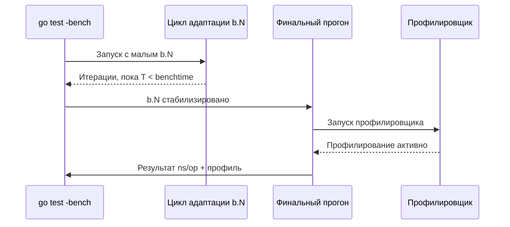

## Зачем совмещать бенчмарк и профилировщик

В предыдущих статьях мы освоили бенчмаркинг как изолированный инструмент измерения времени и аллокаций ([[2. Benchmarking в Go]]), узнали его внутреннее устройство ([[3. go test -bench под капотом]]) и научились стабилизировать результаты ([[6. Стабилизация результатов]]). Однако `ns/op` и `B/op` отвечают на вопрос «насколько?», но молчат о «почему». Почему функция A на 30% медленнее функции B? Где внутри неё узкое место? Какие строки нагружают GC?

Именно здесь на сцену выходит **профилирование внутри бенчмарка** — способ снять CPU-профиль, профиль памяти, блокировок или мьютексов одновременно с выполнением измеряемого цикла. Это превращает бенчмарк из градусника в полноценный диагностический аппарат. Вы не просто фиксируете факт регрессии, а сразу видите её анатомию.

## Как `go test -bench` запускает профилировщик

Механика, кратко затронутая в [[3. go test -bench под капотом]], такова: фреймворк не включает профилирование на всех итерациях адаптивного подбора `b.N`. Вместо этого он дожидается окончательной стабилизации `b.N`, и только на **последнем, финальном прогоне** активирует профилировщик. Это гарантирует, что профиль отражает именно ту нагрузку, которая дала итоговые `ns/op`, а не разогрев или короткие предварительные запуски.

Управление профилированием происходит через стандартные флаги:
- `-cpuprofile <file>` — записывает CPU-профиль.
- `-memprofile <file>` — записывает профиль памяти (аллокации).
- `-blockprofile <file>` — профиль блокировок (ожидания на каналах, мьютексах, syscall).
- `-mutexprofile <file>` — профиль конкуренции на мьютексах.

Все они работают одновременно с бенчмарком, и результирующие файлы можно анализировать через `go tool pprof`.



> [!info] Под капотом
> При использовании `-cpuprofile` фреймворк вызывает `pprof.StartCPUProfile`, перед циклом последнего прогона и `pprof.StopCPUProfile` сразу после него. Профиль памяти снимается через `runtime.MemProfile` после завершения всех итераций финального прогона, фиксируя итоговое состояние кучи (аллокации, накопленные за прогон). Блокировочный и мьютексный профили аналогично активируются через вызовы `runtime.SetBlockProfileRate` / `runtime.SetMutexProfileFraction` непосредственно перед стартом финального запуска.

## CPU-профилирование внутри бенчмарка

Самый частый сценарий: бенчмарк показывает высокое `ns/op`, и нужно понять, на что уходит процессорное время.

### Запуск

```bash
go test -bench=BenchmarkJSON -cpuprofile=cpu.prof
```

После выполнения получим файл `cpu.prof`. Открываем интерактивно:

```bash
go tool pprof cpu.prof
```

Или сразу в веб-интерфейсе с flamegraph ([[3. Flamegraph]]):

```bash
go tool pprof -http=:8080 cpu.prof
```

### Интерпретация

Профиль покажет, какие функции заняли больше всего процессорного времени. Если бенчмарк вызывал `json.Unmarshal`, а 60% времени ушло на `runtime.mallocgc`, значит проблема не в логике JSON, а в аллокациях, порождаемых десериализацией. Это может направить оптимизацию в русло переиспользования объектов ([[2. sync Pool]]) или замены декодера.

> [!tip] Собеседование
> **Вопрос:** Бенчмарк показывает, что операция занимает 10 мкс. Вы сняли CPU-профиль, но `runtime.memmove` занимает 60% времени. Что делать?
> **Ответ:** `runtime.memmove` — это копирование памяти (обычно при росте слайсов или присваивании больших структур). Нужно проверить, не происходит ли множественных копирований больших кусков данных, возможно, стоит перейти на указатели или `copy` в буфер. Также проверить, нет ли неявных копирований из-за передачи структур по значению. Посмотреть на `-benchmem`, чтобы подтвердить гипотезу об аллокациях.

## Профилирование памяти: `-benchmem` и `-memprofile`

Флаг `-benchmem` даёт агрегированные цифры: `B/op` и `allocs/op`. Но он не говорит, *какие именно* строки кода аллоцируют. Для этого предназначен `-memprofile`.

```bash
go test -bench=BenchmarkConcat -memprofile=mem.prof
go tool pprof -alloc_space mem.prof  # аллокации, а не «живущие» объекты
```

Параметр `-alloc_space` показывает, где были выделены байты, даже если они давно освобождены. Альтернативно `-inuse_space` показывает объекты, живущие в куче на момент снятия профиля. Для бенчмарков обычно важнее первое — именно аллокации создают нагрузку на GC, а не долгоживущие объекты.

> [!warning] Ловушка / Gotcha
> Профиль памяти снимается *после* последней итерации финального прогона. Если объекты короткоживущие и GC уже подчистил их, `-inuse_space` покажет неполную картину. Поэтому для анализа аллокаций в бенчмарке всегда используйте `-alloc_space`.

## Блокировочный профиль внутри бенчмарка

Конкурентные бенчмарки (`b.RunParallel`) часто страдают от ожиданий на каналах или мьютексах, которые не видны в CPU-профиле (там горутина «спит»). Решение: снять блокировочный профиль.

```bash
go test -bench=BenchmarkParallel -blockprofile=block.prof
go tool pprof block.prof
```

Профиль покажет, сколько времени горутины провели в состоянии `Waiting`:
- `select` на канале,
- ожидание `sync.Mutex.Lock`,
- `chan send/receive`.

Анализ этих точек позволяет понять, где конкуренция разрушает параллелизм (см. [[7. Contention и lock profiling]]).

## Профиль мьютексов

Блокировочный профиль фиксирует *время ожидания*. Мьютексный профиль (флаг `-mutexprofile`) фиксирует *моменты конкуренции*, когда горутина пыталась захватить мьютекс, удерживаемый другой горутиной. Это более прямой индикатор contention, чем просто время блокировки.

```bash
go test -bench=BenchmarkMutex -mutexprofile=mutex.prof
go tool pprof mutex.prof
```

В выводе будет видно, какой мьютекс является «горячим», и какая горутина его удерживает. Это отправная точка для шардирования или перехода на lock-free алгоритмы.

## Комбинирование профилей в одном запуске

Флаги можно комбинировать, получая полный диагностический снимок:

```bash
go test -bench=. -count=5 \
    -cpuprofile=cpu.prof \
    -memprofile=mem.prof \
    -blockprofile=block.prof \
    -mutexprofile=mutex.prof
```

Все профили будут сняты с одного и того же финального прогона, что гарантирует их взаимную согласованность. Анализируя их параллельно (например, открыв несколько вкладок `go tool pprof -http` на разных портах), вы можете коррелировать CPU-горячие точки с аллокациями и contention.

## Влияние профилирования на результаты бенчмарка

Профилировщик — не бесплатный. CPU-профилирование с частотой 100 Гц (по умолчанию) добавляет небольшие накладные расходы (обычно 1–3%), но может изменить распределение времени, особенно для очень быстрых операций. Memory-профилирование практически не замедляет выполнение, но увеличивает потребление памяти, так как рантайм сохраняет учётные записи. Блокировочный и мьютексный профили дороже, так как требуют инструментирования каждого события блокировки/разблокировки.

**Практический подход:**
- При сравнении версий кода снимайте профили только с одной из версий (или со всех, но не принимайте решения только по `ns/op` из профилированного прогона).
- Для чистых временных замеров используйте запуск без профилировщиков, а после включайте их для анализа.
- Если overhead значителен, уменьшайте частоту CPU-профилирования через `runtime.SetCPUProfileRate` (но стандартных флагов для этого нет, потребуется ручное управление в коде бенчмарка).

## Mechanical Sympathy: что профили говорят о «железе»

Профилировщик CPU показывает не только код, но и косвенно — поведение процессора. Например:
- Высокий процент в `runtime.memmove` или `runtime.memclr` — возможны частые переходы в RAM, вызывающие кэш-промахи.
- Много времени в `runtime.duffcopy` — большие копирования структур.
- Значительное время в `runtime.cgocall` — переходы в C-код, которые могут сбрасывать кэш и нарушать инлайнинг.
- Функции синхронизации (`runtime.lock`, `runtime.unlock`) в топе — contention на структурах рантайма (например, при частых аллокациях).

Профиль памяти, особенно в разрезе `-alloc_space`, прямо связан с [[1. Уменьшение аллокаций]] и [[3. Escape analysis]]: он показывает, какие переменные «убегают» в кучу.

Блокировочный профиль, показывающий `epollwait` или `netpollblock`, указывает на IO-bound природу задачи ([[3. CPU bound vs IO bound задачи]]).

## Практический пример: от бенчмарка к профилю и обратно

Возьмём бенчмарк конкатенации строк:

```go
var globalResult string

func BenchmarkConcatBuilder(b *testing.B) {
    parts := []string{"Hello", " ", "World", "!", " ", "Go"}
    for i := 0; i < b.N; i++ {
        var sb strings.Builder
        for _, p := range parts {
            sb.WriteString(p)
        }
        globalResult = sb.String()
    }
}
```

`-benchmem` показывает 0 allocs/op — отлично. Но CPU-профиль может выявить, что время уходит на `runtime.memmove` внутри `sb.WriteString`, когда буфер растёт. Это подскажет предвыделить `sb.Grow` нужного размера и срезать накладные расходы на копирование.

Другой пример: параллельный бенчмарк инкремента счётчика `atomic.AddInt64` показывает 50 нс/оп при одном ядре и 200 нс/оп при восьми. Блокировочный профиль укажет на `runtime.lock` — contention на кэш-линии (false sharing, [[8. False sharing]]). После выравнивания счётчиков до 64 байт время возвращается.

## Интеграция в CI/CD

Профили, снятые в бенчмарках CI, можно сохранять как артефакты и сравнивать между сборками. Это позволяет не только фиксировать регрессии, но и сразу видеть их причину. Например, CI-задача:
1. Запускает бенчмарк с `-cpuprofile` и `-memprofile`.
2. Сохраняет профили с меткой версии.
3. При обнаружении регрессии разработчик скачивает профили, сравнивает через `go tool pprof -diff_base` и находит функцию-виновницу.

## Итог

- Профилировщики (`-cpuprofile`, `-memprofile`, `-blockprofile`, `-mutexprofile`) встраиваются прямо в `go test -bench` и снимают данные на финальном стабильном прогоне.
- Они превращают бенчмарк из «таймера» в диагностический инструмент, показывающий не только «насколько», но и «почему».
- Каждый тип профиля нацелен на свой аспект: CPU — горячие функции, память — аллокации, блокировки — ожидания, мьютексы — contention.
- Профилирование добавляет overhead, поэтому важно понимать меру и не подменять чистое измерение диагностикой.
- Совместный анализ нескольких профилей даёт полную картину поведения кода на уровне рантайма и процессора.

Получив срез производительности конкретной версии кода, мы готовы сравнивать его с другими версиями и отслеживать динамику изменений. Следующая статья: [[8. Сравнение версий кода]].