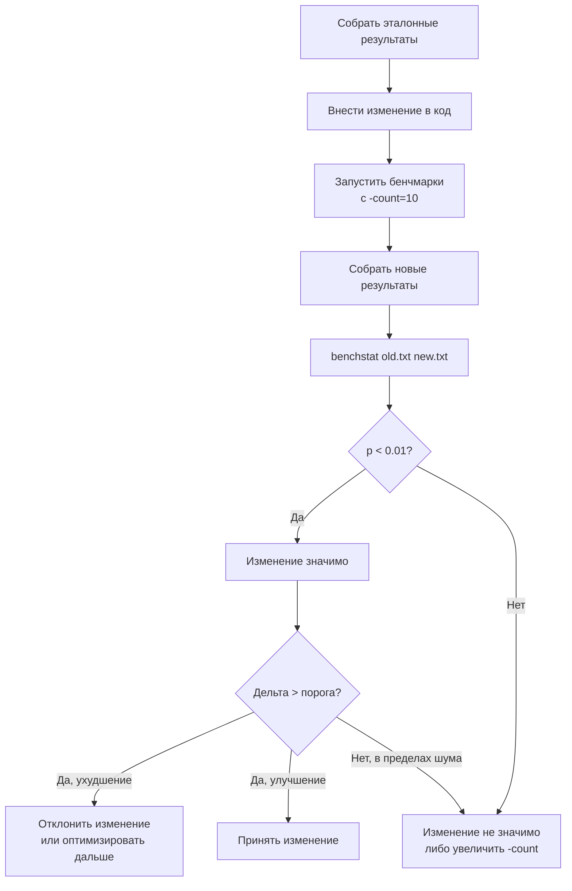

## Зачем сравнивать версии

Бенчмарк, измеряющий одну версию кода, бесполезен без точки отсчёта. Производительность всегда относительна: «быстрее» или «медленнее» имеет смысл только по сравнению с предыдущим состоянием, эталоном или альтернативной реализацией. Сравнение версий — завершающий этап цикла Measure → Profile → Optimize → Verify, сформулированного в [[1. Обзор раздела. Как мыслить о производительности]].

Senior-инженер не просто фиксирует `ns/op`, а выносит вердикт: «изменение X дало ускорение на 15% ± 2% с достоверностью 99.9% и не увеличило хвостовые аллокации». Такой вывод требует методологии, статистики и инструментов, которые мы систематизируем в этой статье.

Мы уже знаем, как писать бенчмарки ([[2. Benchmarking в Go]]), как избегать ловушек ([[4. Подводные камни benchmark тестов]]) и как стабилизировать результаты ([[6. Стабилизация результатов]]). Теперь замкнём цикл: научимся корректно сравнивать две выборки и принимать обоснованные решения.

## Базовые принципы сравнения

Сравнение версий в бенчмаркинге Go строится на трёх аксиомах:

1. **Один код — одна переменная.** Сравниваются две версии, отличающиеся только целевым изменением. Если между замерами менялось ещё и окружение (версия компилятора, нагрузка на стенд, настройки ОС), выводы недостоверны.
2. **Статистическая строгость.** Разница средних — не повод для вывода. Нужно оценить доверительный интервал и вероятность того, что разница случайна (p-value).
3. **Сравниваем не только среднее, но и распределение.** Даже если среднее улучшилось, хвост (p99) мог ухудшиться. Туда смотрят макробенчмарки и метрики, но и в микро можно оценить стабильность через stddev ([[5. microbenchmarks vs macrobenchmarks]]).

## Инструменты сравнения

### 1. `benchstat` — основной инструмент

Утилита `benchstat` (из `golang.org/x/perf/cmd/benchstat`) сравнивает два набора результатов бенчмарков, вычисляя:

- Среднее изменение (delta %).
- Стандартное отклонение (σ).
- Доверительный интервал.
- p-значение (вероятность нулевой гипотезы «изменения нет»).

Вход: текстовые файлы с выводом `go test -bench` (обычно с флагом `-count` для нескольких запусков).

```bash
go test -bench=. -count=10 > old.txt
# ... вносим изменение ...
go test -bench=. -count=10 > new.txt
benchstat old.txt new.txt
```

Пример вывода:

```
name        old time/op    new time/op    delta
Foo-8        12.3µs ± 2%    10.1µs ± 1%  -17.89%  (p=0.000 n=10+10)
Bar-8         5.6µs ± 5%     5.8µs ± 6%   +3.57%  (p=0.234 n=10+10)
```

- `Foo` — значимое улучшение: p < 0.05, доверительный интервал не пересекает ноль.
- `Bar` — изменение статистически незначимо: p=0.234, разницу списали на шум.

`benchstat` также умеет сравнивать несколько групп (старый, новый, вариант), выводить `B/op` и `allocs/op`.

### 2. `go test -bench` с флагами профилирования

Помимо `benchstat`, для сравнения версий используются профилировщики, снятые на каждом варианте, и сравниваемые через `pprof -diff_base` (см. [[7. Профилирование внутри benchmark]]). Это позволяет понять, *куда* ушло или откуда взялось время/память.

### 3. Собственные скрипты и CI

В CI ([[5. Performance regression detection]]) обычно автоматизируют связку: `go test -bench` → сохранение артефакта → `benchstat` против эталонного файла → алерт при превышении порога.

## Пошаговая методология сравнения



### 1. Сбор эталона

Эталон (baseline) — результат бенчмарков до изменений. Важно, чтобы он был получен в том же окружении, что и новый замер. В идеале — на одной машине, в рамках одного CI-джоба, с одной и той же нагрузкой от соседей.

```bash
git stash  # или checkout на baseline-коммит
go test -bench=. -count=10 -benchmem > baseline.txt
```

### 2. Внесение изменения и замер

Применяем целевую оптимизацию и повторяем замер:

```bash
git pop  # или переходим на новую версию
go test -bench=. -count=10 -benchmem > optimized.txt
```

### 3. Статистическое сравнение

```bash
benchstat baseline.txt optimized.txt
```

### 4. Интерпретация

- Если p < 0.01 и дельта отрицательна (ускорение) и превышает, скажем, 3-5% — оптимизация успешна.
- Если p < 0.01 и дельта положительна (замедление) — регресс, нужно разбираться.
- Если p > 0.05 — результат статистически незначим. Надо либо увеличить `-count` до 20-30, либо стабилизировать окружение ([[6. Стабилизация результатов]]), либо признать, что изменение в пределах шума.
- Если дельта велика, но stddev огромен (±15%), результат ненадёжен — сначала стабилизировать.

## Сравнение профилей CPU и памяти

Числа `ns/op` не показывают, за счёт чего произошло изменение. Для этого сравнивают профили:

```bash
go test -bench=BenchmarkTarget -cpuprofile=cpu_old.prof  # на старом коде
# меняем код
go test -bench=BenchmarkTarget -cpuprofile=cpu_new.prof
go tool pprof -http=:8080 -diff_base=cpu_old.prof cpu_new.prof
```

Флаг `-diff_base` вычитает старый профиль из нового. Flamegraph (`-http`) покажет красным функции, потребляющие больше CPU в новой версии, зелёным — те, что стали легче. Это позволяет сразу увидеть, что, например, время ушло из `json.Unmarshal` в `runtime.mallocgc` (намекая на лишние аллокации).

Аналогично для памяти:

```bash
go tool pprof -http=:8081 -diff_base=mem_old.prof mem_new.prof
```

Особый случай: если изменение снизило аллокации, `-alloc_space` покажет отрицательную дельту в соответствующих функциях.

> [!tip] Собеседование
> **Вопрос:** После оптимизации бенчмарк показывает ускорение на 20%, но pprof -diff_base не показывает значимых изменений в горячих функциях. Как это возможно?
> **Ответ:** Возможно, изменение повлияло на инлайнинг или escape analysis. Компилятор мог начать размещать переменные на стеке вместо кучи (или наоборот), что не отражается в процентах одной функции, но снижает общее время из-за отсутствия аллокаций и GC. Стоит проверить `-benchmem` и вывод `go build -gcflags="-m"`.

## Что сравнивать, кроме времени и аллокаций

Хотя бенчмарки традиционно фокусируются на `ns/op` и `B/op`, Senior может сравнивать и другие характеристики:

- **Размер бинарника:** `go version -m <binary>` или `ls -l` после `go build`. Большие изменения могут сигнализировать о лишних зависимостях.
- **Число выполняемых инструкций:** `perf stat -e instructions:u ./binary`. При равном времени меньшее число инструкций может означать более эффективный код.
- **Кэш-промахи:** `perf stat -e cache-misses:u ./binary`. Оптимизация могла улучшить cache friendliness ([[8. Cache friendliness]]).
- **Число горутин и их состояния:** через `runtime.NumGoroutine()` в контрольных точках бенчмарка или через execution tracer.

Эти метрики обычно не автоматизируют, но применяют ad hoc при расследовании узких мест.

## Автоматизация в CI/CD

Сравнение версий должно быть автоматическим, чтобы регрессии не просачивались в main. Типовой workflow (подробнее в [[5. Performance regression detection]]):

1. В репозитории хранится файл `testdata/benchmarks/baseline.txt` (эталон для main).
2. На каждый PR CI запускает `go test -bench=. -count=10 > pr.txt`.
3. Выполняется `benchstat baseline.txt pr.txt`.
4. Если обнаружена статистически значимая регрессия (p < 0.05 и дельта > порога, например, +5%), CI пишет комментарий в PR или блокирует слияние.
5. При мерже в main эталон обновляется результатами из PR (если изменения приемлемы).

Такая практика превращает производительность в контролируемую характеристику, не позволяя «тихо» деградировать.

## Mechanical Sympathy: почему контекст окружения важен при сравнении

Сравнение версий, полученных на разном железе или в разное время, ненадёжно. Процессор с другим размером кэша, другая версия ядра Linux, обновлённый планировщик Go — всё это меняет абсолютные показатели, но не должно влиять на *дельту* при честном сравнении. Поэтому золотой стандарт — сравнивать версии в рамках одного CI-джоба, на одном раннере, с фиксированной частотой и изоляцией ([[6. Стабилизация результатов]]).

Если же вам принесли бенчмарки с чужой машины, будьте скептичны. Без контроля окружения никакая статистическая значимость не спасёт от систематической ошибки.

## Пример полного цикла сравнения

Допустим, мы оптимизируем функцию копирования слайса. Эталонный бенчмарк:

```go
var resultSlice []byte

func BenchmarkCopy(b *testing.B) {
    src := make([]byte, 4096)
    for i := 0; i < b.N; i++ {
        dst := make([]byte, len(src))
        copy(dst, src)
        resultSlice = dst
    }
}
```

Запуск эталона:

```bash
go test -bench=Copy -count=15 -benchmem > old.txt
```

После оптимизации (предвыделение буфера переиспользованием через `sync.Pool`) запускаем снова:

```bash
go test -bench=Copy -count=15 -benchmem > new.txt
benchstat old.txt new.txt
```

Результат:

```
name    old time/op    new time/op    delta
Copy-8    1.09µs ± 3%    0.32µs ± 4%  -70.64%  (p=0.000 n=15+15)

name    old alloc/op   new alloc/op   delta
Copy-8    4.10KB ± 0%    0.00KB       -100.00%  (p=0.000 n=15+15)

name    old allocs/op  new allocs/op  delta
Copy-8     1.00 ± 0%      0.00       -100.00%  (p=0.000 n=15+15)
```

Вывод: оптимизация дала трёхкратное ускорение и полностью убрала аллокации. Изменение статистически значимо (p < 0.001). Можно мержить.

## Итог

- Сравнение версий кода — обязательная часть цикла оптимизации; без него нельзя утверждать, что изменение принесло пользу.
- Основной инструмент — `benchstat`, который вычисляет дельту, доверительный интервал и p-value по многократным запускам бенчмарков.
- Профили (`-cpuprofile`, `-memprofile`) сравниваются через `pprof -diff_base` для понимания структурных сдвигов.
- Статистическая значимость (p < 0.01) и низкая дисперсия (stddev < 3-5%) — необходимые условия для принятия решения.
- Автоматизация сравнения в CI с эталонными результатами предотвращает деградацию производительности.
- Mechanical sympathy напоминает: сравнивать можно только результаты, полученные в одинаковых, строго контролируемых условиях.

С этой статьёй мы закрываем подраздел «Benchmarking». Мы научились не только писать корректные бенчмарки, но и делать из них обоснованные выводы. Теперь мы переходим от «сколько» к «почему» — в следующий подраздел: «CPU profiling», где первой статьёй будет [[1. pprof. Введение]].