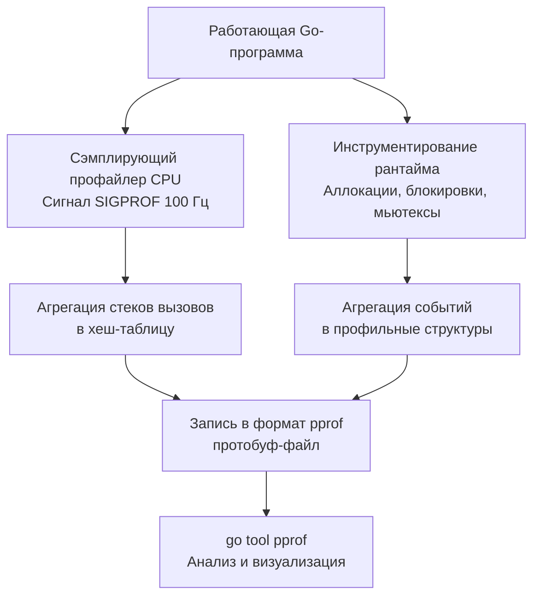
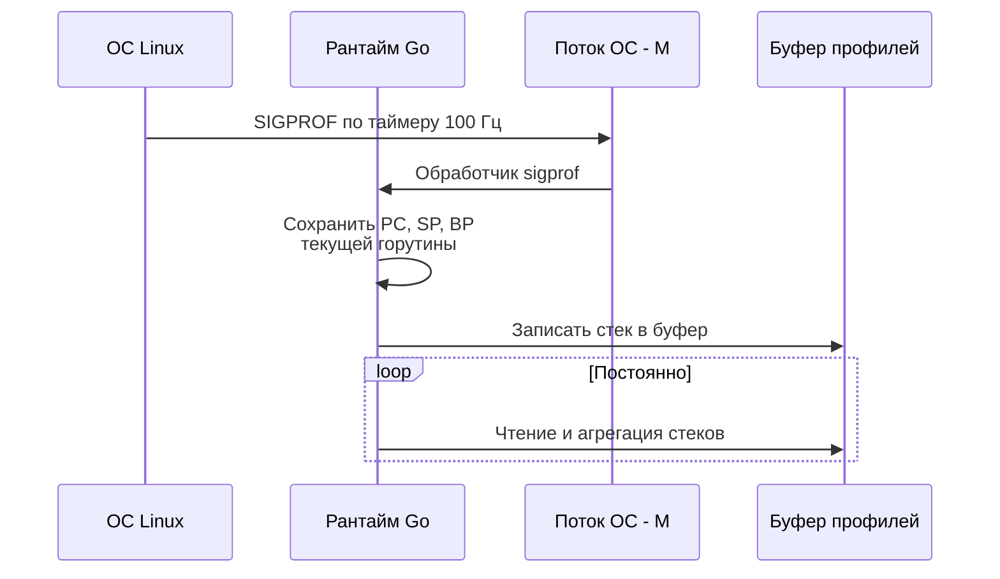

## Что такое pprof и зачем он нужен

В подразделе «Benchmarking» мы научились измерять производительность: писать корректные бенчмарки ([[2. Benchmarking в Go]]), стабилизировать результаты ([[6. Стабилизация результатов]]), снимать профили внутри замеров ([[7. Профилирование внутри benchmark]]) и сравнивать версии ([[8. Сравнение версий кода]]). Бенчмарки отвечают на вопрос «насколько быстрее или медленнее?», но не объясняют *почему*. Почему функция потребляет 80% времени? Какие строки кода нагружают GC? Где горутины уходят в ожидание?

Для ответа на эти вопросы в Go существует **pprof** — встроенный в рантайм фреймворк профилирования. Он позволяет заглянуть внутрь работающей программы и увидеть распределение процессорного времени, памяти, блокировок и конкурентных конфликтов. Именно pprof — главный инструмент в арсенале Senior Go-инженера для диагностики узких мест, от CPU до contention на мьютексах.

Эта статья открывает подраздел «CPU profiling». Мы разберём, как pprof устроен на уровне ОС и рантайма, какие виды профилей существуют, как получить профиль из приложения и как начать с ним работать. Последующие статьи углубятся в конкретные техники анализа: [[2. CPU profiling в Go]], [[3. Flamegraph]], [[4. Top functions анализ]] и другие.

## Архитектура pprof: сэмплирование и инструментирование

pprof объединяет два механизма сбора данных:

- **Сэмплирование (CPU profile).** Через равные промежутки времени (по умолчанию 100 Гц) рантайм приостанавливает выполнение и записывает текущий стек вызовов. Агрегируя тысячи таких снимков, мы получаем статистическую картину: в каких функциях программа проводит больше всего тактов.
- **Инструментирование (heap, mutex, block, goroutine).** Рантайм явно ведёт учёт событий: каждая аллокация, блокировка, создание горутины регистрируются в специальных структурах. Периодически эти записи агрегируются в профиль.

Комбинация обоих подходов позволяет строить детальные карты поведения приложения с минимальным overhead.



## Виды профилей в pprof

Пакет `runtime/pprof` и его HTTP-обёртка `net/http/pprof` предоставляют несколько типов профилей. Каждый отвечает на свой вопрос:

| Профиль | Вопрос | Ключевая статья |
|---------|--------|-----------------|
| **CPU** | На что тратится процессорное время? | [[2. CPU profiling в Go]] |
| **Heap (inuse_space)** | Сколько памяти занято сейчас? | [[5. pprof memory profile]] |
| **Heap (alloc_space)** | Где выделялась память за всё время? | [[4. Allocation profiling]] |
| **Goroutine** | Какие горутины запущены и где они остановлены? | [[4. goroutine dump]] |
| **Block** | Где горутины ждут на каналах, мьютексах, syscall? | [[5. block profile]] |
| **Mutex** | Где возникает конкуренция за мьютексы? | [[6. mutex profile]] |
| **Threadcreate** | Где создаются потоки ОС? | раздел «Runtime и инструменты» |

Каждый профиль ортогонален другим. CPU не покажет ожидания на канале, а Memory — contention на мьютексе. Senior обязан знать, какой профиль снимать под конкретную проблему.

## Как работает сэмплирующий CPU-профайлер

CPU-профиль — самый востребованный. Его механика опирается на сигнал операционной системы.

1. **Включение.** `pprof.StartCPUProfile(w)` вызывает `runtime.SetCPUProfileRate(100)` (по умолчанию) и запускает фоновый поток, который принимает сигналы ОС.
2. **Сигнал SIGPROF.** В Linux ОС по таймеру (через `setitimer(ITIMER_PROF)`) посылает процессу сигнал `SIGPROF` с заданной частотой. Этот сигнал прерывает любую выполняющуюся горутину.
3. **Обработчик сигнала.** Рантайм Go перехватывает `SIGPROF`. Обработчик сохраняет стек вызовов текущего M (потока ОС) — значения регистров PC, SP, BP — и помещает запись в буфер.
4. **Постобработка.** Буфер периодически читается, стеки разрешаются (символизируются) и агрегируются в хеш-таблицу: ключ — стек, значение — счётчик попаданий.
5. **Выключение.** `pprof.StopCPUProfile()` останавливает таймер и записывает агрегированные данные в `io.Writer` в формате protobuf.



> [!info] Под капотом
> В Linux `SIGPROF` доставляется процессу, а не конкретному потоку. Ядро выбирает любой поток, у которого не заблокирован этот сигнал. Рантайм Go блокирует `SIGPROF` для определённых M (например, выполняющих системные вызовы) и направляет сигнал на активные M. Внутри сигнал-хендлера код написан на C (в `runtime/os_linux.c` и `runtime/signal_unix.go`), который через `sigprof` вызывает сборщик стеков.

Частота 100 Гц выбрана как компромисс: достаточная детализация для выявления горячих точек, но приемлемый overhead (обычно 1–3%). При необходимости частоту можно изменить через `runtime.SetCPUProfileRate(hz)`, но значения выше 1000 Гц могут заметно замедлить программу.

## Погрешность сэмплирующего профайлера

Сэмплирование — статистический метод. Он не даёт точного числа тактов, а лишь аппроксимирует долю времени. Погрешность складывается из:

- **Случайная ошибка.** Чем больше сэмплов, тем точнее оценка. Для 1 секунды профилирования на частоте 100 Гц получаем 100 сэмплов — грубо. Для 30 секунд — 3000 сэмплов, уже можно видеть функции с долей >1%.
- **Систематическая ошибка.** Сэмплы берутся только в моменты, когда M исполняет Go-код. Время, проведённое в ядре (syscall), в CGO или в ожидании, не сэмплируется. Поэтому CPU-профиль недопустимо использовать для анализа IO-bound.
- **Смещение выжившего (survivorship bias).** Очень быстрые функции могут не попасть в сэмплы вообще, даже если они исполняются миллионы раз. Это нормально: они не являются горячими точками.
- **Слияние стеков.** Агрегация стеков может склеить разные пути, если символизация неоднозначна (например, рекурсивные функции).

> [!tip] Собеседование
> **Вопрос:** Почему CPU-профиль на 1 секунду может показать, что 50% времени занимает `runtime.memmove`, а на 30 секундах — только 5%?
> **Ответ:** Короткий профиль недостаточно представителен. Если в первую секунду попала фаза GC или активное копирование данных, сэмплы смещены. Длительное профилирование усредняет выбросы и даёт более точную картину. Всегда профилируйте не менее 10–30 секунд.

## Способы получения профиля

### 1. HTTP-эндпоинт `net/http/pprof`

Самый распространённый способ для долгоживущих сервисов. Импорт `_ "net/http/pprof"` автоматически регистрирует обработчики на DefaultServeMux:

```go
package main

import (
    "net/http"
    _ "net/http/pprof"
)

func main() {
    go func() {
        http.ListenAndServe("localhost:6060", nil)
    }()
    // основной код
    select {}
}
```

Эндпоинты:
- `/debug/pprof/` — список профилей.
- `/debug/pprof/profile?seconds=30` — CPU-профиль (дефолт 30 секунд).
- `/debug/pprof/heap` — профиль памяти.
- `/debug/pprof/goroutine?debug=1` — все горутины с трейсами.
- `/debug/pprof/block` — блокировочный профиль.
- `/debug/pprof/mutex` — профиль мьютексов.

Запустив `curl -o cpu.prof http://localhost:6060/debug/pprof/profile?seconds=10`, мы получим файл для анализа.

### 2. Прямой вызов `runtime/pprof`

Для скриптов, утилит или тестов, где HTTP-сервер неудобен:

```go
f, _ := os.Create("cpu.prof")
pprof.StartCPUProfile(f)
defer pprof.StopCPUProfile()
// выполняем работу
```

### 3. Через `go test -bench`

Обсуждалось в [[7. Профилирование внутри benchmark]]: флаги `-cpuprofile`, `-memprofile` и другие включают профилировщик на финальном стабильном прогоне бенчмарка.

## Анализ профиля: `go tool pprof`

После получения файла начинается анализ. Основной инструмент — `go tool pprof`.

### Интерактивный режим

```bash
go tool pprof cpu.prof
```

Команды:
- `top` — топ-функций по потреблению CPU.
- `top -cum` — по кумулятивному времени (с учётом потомков).
- `list functionName` — показать исходный код функции с аннотациями, сколько времени ушло на каждую строку.
- `web` — открыть граф вызовов в браузере (требует Graphviz).
- `weblist functionName` — совмещает list и web.
- `pdf` — сгенерировать PDF.

### Веб-интерфейс

```bash
go tool pprof -http=:8080 cpu.prof
```

Открывает богатый веб-дашборд с:
- Graph (граф вызовов),
- Flamegraph ([[3. Flamegraph]]),
- Top (таблица),
- Source (аннотированный код).

Flamegraph — самый наглядный способ увидеть иерархию вызовов и найти «широкие» полосы — функции, съедающие много процессора.

### Пример сессии

```
(pprof) top
Showing nodes accounting for 1.80s, 90% of 2.00s total
Dropped 15 nodes (cum <= 0.01s)
      flat  flat%   sum%        cum   cum%
     0.50s 25.00% 25.00%      0.80s 40.00%  runtime.mallocgc
     0.30s 15.00% 40.00%      0.30s 15.00%  runtime.memmove
     0.20s 10.00% 50.00%      0.20s 10.00%  encoding/json.unmarshalString
     ...
```

- `flat` — время непосредственно в функции (не считая вызванных).
- `cum` — время в функции и всех её потомках.

Если `flat` большой, а `cum` почти равен `flat` — функция сама выполняет работу. Если `flat` мал, а `cum` велик — она выступает диспетчером, вызывая тяжёлые методы.

## Mechanical Sympathy: влияние профилирования на производительность

Сэмплирование CPU не бесплатно. Каждый сигнал SIGPROF заставляет процессор прервать конвейер, сохранить состояние и выполнить код обработчика в ядре, а затем — в рантайме Go. Это стоит десятки микросекунд на срабатывание. При частоте 100 Гц накладные расходы обычно 0.5–2% CPU. Однако на высоконагруженных системах с тысячами горутин обработка сигнала может совпасть с критической секцией или вызвать каскадные эффекты (например, замедление GC из-за дополнительных аллокаций в буфере профиля).

Увеличивать частоту сэмплирования стоит только для поиска микроскопических задержек, и обязательно проверять, не искажает ли сам профайлер картину.

Memory-профили (`heap`) имеют ещё одну особенность: они требуют вызова `runtime.GC()` перед снятием, чтобы учесть только живые объекты. Принудительный GC может внести паузу и исказить время выполнения, если профиль снимается в latency-sensitive участке.

> [!warning] Ловушка / Gotcha
> Порт pprof, открытый на `0.0.0.0:6060`, — огромная дыра в безопасности. Злоумышленник может снять CPU-профиль и восстановить логику приложения, прочитать heap — увидеть данные пользователей, а через `goroutine?debug=2` получить стек вызовов со значениями переменных. Всегда вешайте pprof на localhost или за аутентификацию.

## Связь профилей с разделами

Каждый профиль — дверь в конкретный подраздел нашей базы знаний:

- **CPU** → статьи [[2. CPU profiling в Go]], [[3. Flamegraph]], [[4. Top functions анализ]], [[5. Inline и влияние на performance]], [[6. Branch prediction и код]], [[7. SIMD и Go]], [[8. Cache friendliness]].
- **Memory** → подраздел «Memory profiling»: [[2. Heap vs stack]], [[3. Escape analysis]], [[4. Allocation profiling]], [[5. pprof memory profile]], [[6. Утечки памяти]], [[7. Fragmentation]].
- **Block / Mutex** → [[5. block profile]], [[6. mutex profile]], [[7. Contention и lock profiling]], [[8. False sharing]].

## Итог

- `pprof` — встроенный в Go фреймворк профилирования, базирующийся на сэмплировании (CPU) и инструментировании (память, блокировки, мьютексы).
- CPU-профайлер работает по сигналу SIGPROF (100 Гц) и даёт статистическую картину распределения процессорного времени, пригодную для поиска горячих точек.
- Профили получают через HTTP (`net/http/pprof`), прямой вызов `runtime/pprof` или флаги `go test -bench`.
- `go tool pprof` — мощный интерактивный и веб-инструмент анализа с поддержкой top, list, flamegraph и diff.
- Каждый тип профиля отвечает на свой класс вопросов; смешивать их — значит делать неверные выводы.
- Профилирование имеет цену (overhead) и требует осторожности в production, особенно в части безопасности.

Теперь, вооружённые базовыми знаниями о pprof, мы перейдём к практическому использованию CPU-профиля для диагностики вычислительных узких мест. Следующая статья: [[2. CPU profiling в Go]].