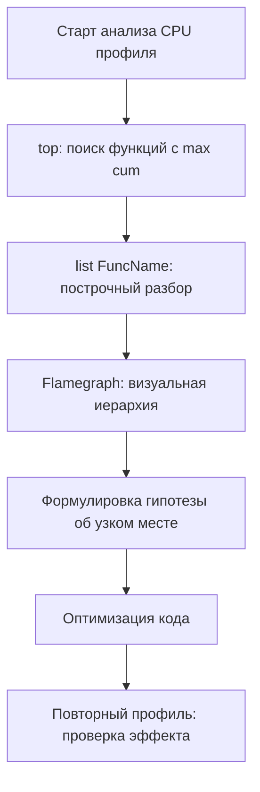

## Введение: от «медленно» к конкретной функции

В [[1. pprof. Введение]] мы разобрали архитектуру pprof и виды профилей. Теперь мы погружаемся в самый частый сценарий: **CPU profiling**. Именно он отвечает на вопрос «почему процессор загружен на 100%, а запросы тормозят?» и прямо указывает на функции, которые сжигают такты.

CPU-профиль — это не замер времени выполнения, а карта плотности процессорного времени. Он показывает, в каких функциях программа проводит время *пропорционально* их вкладу. Это делает его идеальным инструментом для диагностики CPU-bound задач ([[3. CPU bound vs IO bound задачи]]) и для проверки гипотез после бенчмарков ([[2. Benchmarking в Go]], [[7. Профилирование внутри benchmark]]).

В этой статье мы научимся получать CPU-профиль из любого Go-приложения, интерпретировать отчёт `top`, различать `flat` и `cum`, выявлять типичные паттерны перерасхода CPU и связывать их с фундаментальными причинами — от лишних аллокаций до промахов кэша.

## Получение CPU-профиля

### 1. Через HTTP-эндпоинт `net/http/pprof`

Универсальный метод для долгоживущих серверов. Подключаем пакет и запускаем HTTP-сервер на отладочном порту:

```go
import (
    "net/http"
    _ "net/http/pprof"
)

func main() {
    go func() {
        log.Println(http.ListenAndServe("localhost:6060", nil))
    }()
    // основной код приложения
}
```

Профиль CPU снимается GET-запросом с указанием длительности в секундах:

```bash
curl -o cpu.prof "http://localhost:6060/debug/pprof/profile?seconds=30"
```

Сервер заблокирует ответ на 30 секунд, собирая сэмплы, затем вернёт бинарный pprof-файл. Важно, чтобы в это время приложение находилось под нагрузкой — иначе профиль покажет только idle.

### 2. Прямой вызов `runtime/pprof`

Для CLI-утилит, скриптов или специфичных участков кода:

```go
f, _ := os.Create("cpu.prof")
pprof.StartCPUProfile(f)
defer pprof.StopCPUProfile()

// целевая работа
expensiveComputation()
```

Этот способ даёт полный контроль над моментом старта и остановки. Минус — нельзя интерактивно менять длительность, и нужно встраивать вызовы в код.

### 3. Через `go test`

При запуске бенчмарков или тестов, которые выполняют тяжёлую работу:

```bash
go test -bench=BenchmarkFoo -cpuprofile=cpu.prof
```

Профиль запишется только для финального стабильного прогона бенчмарка (как описано в [[3. go test -bench под капотом]] и [[7. Профилирование внутри benchmark]]). Это удобно для изолированных измерений.

## Настройка частоты сэмплирования

По умолчанию CPU-профилировщик работает на частоте 100 Гц (100 прерываний в секунду). Этого достаточно для большинства сценариев. Увеличить частоту можно через `runtime.SetCPUProfileRate(hz)`, вызванную до `StartCPUProfile`. Но:

- Частота выше 1000 Гц резко увеличивает overhead (вплоть до 10-15% CPU).
- Слишком высокая частота может исказить профиль, «сдвинув» его в сторону кода самого профилировщика.
- Низкая частота (< 50 Гц) пропускает короткоживущие функции.

Рекомендация: на продакшене использовать 100 Гц, для локальной отладки можно поднять до 500 Гц, если ищете микроскопические задержки.

> [!info] Под капотом
> Сигнал `SIGPROF` в Linux генерируется не аппаратным таймером, а через `setitimer(ITIMER_PROF)`, который считает время только когда процесс исполняется в пользовательском или системном режиме. Это означает, что если процесс заблокирован в `epoll_wait` или `futex`, таймер не тикает, и сэмплы не берутся. Поэтому CPU-профиль «чист»: в нём нет времени ожидания ввода-вывода.

## Интерпретация отчёта: flat, cum, top

После сбора профиля запускаем интерактивный анализ:

```bash
go tool pprof cpu.prof
```

В консоли `(pprof)` доступны команды. Основная — `top`:

```
(pprof) top
Showing nodes accounting for 4.50s, 90% of 5.00s total
      flat  flat%   sum%        cum   cum%
     1.20s 24.00% 24.00%      1.20s 24.00%  runtime.mallocgc
     0.90s 18.00% 42.00%      0.90s 18.00%  encoding/json.Unmarshal
     0.50s 10.00% 52.00%      1.70s 34.00%  mypkg.ProcessRecord
```

- **flat** — время, проведённое непосредственно в теле функции (исключая вызванные из неё). Если функция вызывает другие, это время в flat не включается.
- **cum** (cumulative) — полное время от входа в функцию до выхода из неё, включая всех потомков. Показывает «стоимость» функции вместе с её зависимостями.
- **sum%** — накопительный процент flat.

Типичная аналитическая логика:

1. Смотрим на функции с большим `cum` — они «диспетчеры», в которых скрыто реальное узкое место.
2. Смотрим на функции с большим `flat` — они сами выполняют тяжёлую работу (например, копирование памяти, вычисления хешей).
3. Выбираем интересующую функцию и уточняем `list FuncName` — получаем аннотированный исходный код с процентом времени на каждой строке.

Пример `list ProcessRecord`:

```go
(pprof) list ProcessRecord
ROUTINE ======================== mypkg.ProcessRecord
     0.50s      1.70s (flat, cum) 34.00% of Total
         .          .    100:func ProcessRecord(r *Record) error {
         .      0.10s    101:    data, err := json.Marshal(r)
         .      0.80s    102:    if err != nil {
         .          .    103:        return err
         .          .    104:    }
     0.50s      0.50s    105:    return store.Save(data)
```

Видно, что 0.10s ушло на `Marshal`, 0.80s — на `Save` (кумулятивно), а 0.50s — непосредственно внутри `ProcessRecord` (вероятно, подготовка данных после маршалинга). Это позволяет сказать: «80% времени ProcessRecord занимает запись в хранилище, 10% — сериализация, 50% — некоторая постобработка».

> [!tip] Собеседование
> **Вопрос:** Что означает, если у функции большой `flat`, а `cum` почти равен `flat`?
> **Ответ:** Это «листовая» функция, которая сама выполняет тяжёлую работу, не вызывая другие дорогие функции. Оптимизировать нужно именно её тело. Если же `flat` маленький, а `cum` большой — функция выступает координатором, и узкое место внутри вызываемых ею методов.

## Визуализация: flamegraph и граф вызовов

Хотя детально flamegraph разбирается в [[3. Flamegraph]], здесь важно понимание интерфейса. Команда `go tool pprof -http=:8080 cpu.prof` открывает веб-дашборд, где можно переключиться на Flamegraph и увидеть иерархию вызовов, где ширина полосы пропорциональна времени. Это более наглядно для обнаружения «раздутых» путей.



## Практические примеры диагностики

### Пример 1: JSON-сериализация съедает 60% CPU

Профиль показывает:

```
flat  flat%   cum%
0.80s 16.00% 1.60s 32.00%  encoding/json.Marshal
0.30s  6.00% 0.90s 18.00%  runtime.mallocgc
0.20s  4.00% 0.20s  4.00%  runtime.memmove
```

Интерпретация: `Marshal` вызывает массу аллокаций (`mallocgc`) и копирований (`memmove`). Это не проблема процессора как такового, а проблема аллокаций, которые заставляют процессор тратить время на управление памятью. Решение:

- Использовать `easyjson` или `sonic`, генерирующие меньше аллокаций.
- Или переиспользовать буферы через `sync.Pool` ([[2. sync Pool]]).

### Пример 2: «Пустой» цикл нагружает CPU

top показывает:

```
flat  flat%   cum%
1.50s 30.00% 1.50s 30.00%  mypkg.contains
```

`list contains`:

```go
func contains(items []string, target string) bool {
    for _, item := range items {
        if item == target {
            return true
        }
    }
    return false
}
```

Это линейный поиск по большому слайсу. Решение — заменить на `map[string]struct{}` для O(1) или использовать сортировку + бинарный поиск. Механическая эмпатия: даже замена слайса на map не гарантирует ускорения, если не учесть cache friendliness ([[8. Cache friendliness]]).

### Пример 3: Высокое время в `runtime.cgocall`

Если в топе `runtime.cgocall` и `runtime.asmcgocall`, значит много времени уходит в вызовы C-кода (например, драйвер БД или специфичные библиотеки). Такой профиль — сигнал к ревизии использования CGO. Подробнее о системных вызовах: [[1. Системные вызовы и их стоимость]].

## Типичные CPU-bound паттерны в Go

Зная типовые «горячие» паттерны, можно быстрее ставить диагноз.

### 1. Сериализация / десериализация

`json.Marshal/Unmarshal`, `xml.Decode`, `protobuf.Marshal`. Кроме прямого времени, генерируют много аллокаций, что видно по соседству `runtime.mallocgc` в top.

### 2. Регулярные выражения

`regexp.MustCompile` + `FindAll`. Компиляция и выполнение regexp — CPU-ёмкие. Если выражение статично, компилировать один раз глобально.

### 3. Строковые операции в циклах

Конкатенация через `+` в цикле порождает множество аллокаций и копирований. Профиль может показать `runtime.memmove` и `runtime.growslice`. Использовать `strings.Builder`.

### 4. Хеш-таблицы с плохой хеш-функцией

`runtime.mapaccess` с большим процентом может указывать на избыточные эвакуации бакетов (рост мапы) или коллизии. Решение — предвыделение размера (`make(map[K]V, size)`).

### 5. Синхронизация, реализованная через busy-wait

Например, попытки атомарного CAS в цикле без отката. Профиль покажет `runtime.procyield` или `runtime.osyield`.

### 6. Частые системные вызовы

В CPU-профиль они не попадают напрямую (так как ядерное время не сэмплируется), но могут проявляться через `runtime.syscall` или пакеты-обёртки. Если есть подозрение на IO, нужно смотреть блокировочный профиль ([[5. block profile]]).

## Mechanical Sympathy: CPU-профиль и микроархитектура

Профиль процессора отражает не только код, но и взаимодействие с «железом»:

- **Кэш-промахи:** большое время в `runtime.memmove` или `runtime.duffcopy` при копировании слайсов намекает на неэффективную работу с памятью. Оптимизация: структуры, дружественные кэшу ([[6. Cache friendly структуры]]).
- **Ветвления:** если функция с множеством `if` занимает неожиданно много времени, но `list` не показывает отдельных дорогих строк, проблема может быть в ошибках предсказания ветвлений ([[6. Branch prediction и код]]). Косвенно это можно выявить через `perf stat -e branch-misses`.
- **Инлайнинг:** маленькие функции, которые не инлайнятся, добавляют накладные расходы на вызов. Профиль покажет их в топе, хотя тело простое. Корректируется перестройкой кода для удовлетворения эвристик инлайнинга компилятора ([[5. Inline и влияние на performance]]).

Инструментарий профилирования не всегда детализирует такие эффекты, но опытный инженер, зная внутренности рантайма и процессора, может строить гипотезы и проверять их через дополнительные утилиты (`perf`, `objdump`).

## Ошибки и ловушки при работе с CPU-профилем

> [!warning] Ловушка / Gotcha
> **Игнорирование времени ожидания.** Разработчик видит, что CPU загружен на 100% и пытается оптимизировать вычисления. Но профиль CPU не показывает ожидания (блокировки, сетевые задержки). Если приложение тормозит, но CPU-профиль почти пуст — проблема в IO или синхронизации. Нужен блокировочный профиль или трассировка.

- **Слишком короткий профиль.** 5 секунд может попасть на пик аллокаций и показать искажённую картину. Минимум 30 секунд под стабильной нагрузкой.
- **Неучтённый overhead профилировщика.** При очень высокой частоте или на микро-бенчмарках профилировщик может «накрутить» десятки процентов. Проверяйте: временно отключите профилировщик и сравните пропускную способность.
- **Профилирование без нагрузки.** Снятый на idle-сервере профиль покажет `runtime.gopark`, `netpoll`, `findrunnable`. Это бесполезно. Нужна нагрузка, репрезентативная для production.
- **Неправильная интерпретация flat/cum.** Новичок может смотреть только на flat и упустить, что 90% времени скрыто в `cum` родительской функции. Всегда анализируйте иерархию.

## Связь с остальными инструментами

CPU-профиль — часть пазла. Когда он показывает аномалию, мы идём глубже:

- Если много аллокаций (mallocgc) → memory profile ([[5. pprof memory profile]]), чтобы найти источники.
- Если видны блокировки (select, chan) → block profile ([[5. block profile]]).
- Если подозреваем contention → mutex profile ([[6. mutex profile]]).
- Если нужна динамика во времени → execution tracer ([[3. execution tracer]]).

И обязательно подкрепляем профили бенчмарками для количественной оценки оптимизаций ([[8. Сравнение версий кода]]).

## Итог

- CPU-профиль в Go, получаемый через `net/http/pprof` или `runtime/pprof`, показывает распределение процессорного времени с точностью до функции и строки кода.
- Основные метрики: `flat` (время внутри функции) и `cum` (время с учётом потомков). Их анализ через `top`, `list` и `flamegraph` позволяет точно локализовать узкое место.
- Типичные CPU-bound паттерны — сериализация, строковые операции, избыточные вычисления, плохие структуры данных.
- Профиль CPU не показывает ожидания и системные вызовы; для полной картины нужно комплексировать с другими профилями.
- При интерпретации важно учитывать микроархитектурные эффекты (кэш, ветвления, инлайнинг) — механическая эмпатия превращает подозрения в обоснованные гипотезы.
- Полученный навык читать CPU-профиль — фундамент, без которого невозможен переход к более сложным темам: flamegraph, оптимизации inline, анализ branch prediction и cache friendliness.

Теперь, освоив плоскую таблицу `top`, мы переходим к визуальному методу, который делает очевидной иерархию вызовов: [[3. Flamegraph]].