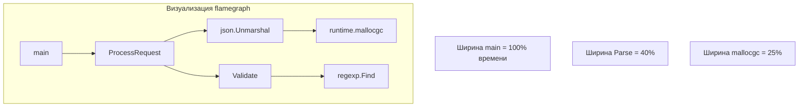
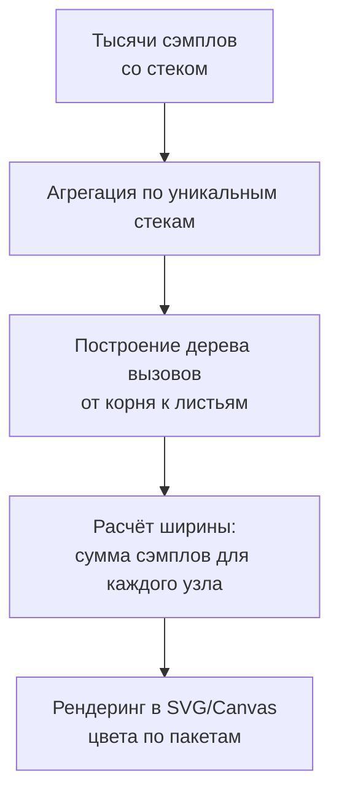

## Почему пламя — лучший друг инженера

В [[2. CPU profiling в Go]] мы научились получать CPU-профиль и читать таблицу `top` с `flat` и `cum`. Но таблица бессильна, когда нужно понять иерархию вызовов: «кто позвал эту тяжёлую функцию?», «какой путь съедает больше всего процессора?». Ответ даёт **flamegraph** — интерактивная визуализация, превращающая тысячи сэмплов стека в цветную карту времени.

Flamegraph (граф-пламя) изобрёл Брендан Грегг для анализа производительности Linux, а затем инструмент был адаптирован для многих языков. В Go flamegraph встроен в `go tool pprof` и доступен через веб-интерфейс. Он заменяет гадание на таблицах пониманием: одним взглядом видно, какая функция «раздута» и через какую цепочку вызовов она исполняется.

Эта статья — мост между сухими цифрами [[2. CPU profiling в Go]] и глубинными причинами: инлайнингом ([[5. Inline и влияние на performance]]), предсказанием ветвлений ([[6. Branch prediction и код]]), симметричным расположением в кэше ([[8. Cache friendliness]]). Flamegraph даёт картину, а дальше мы раскладываем её на составляющие.

## Как устроен flamegraph

Flamegraph — это горизонтальная столбчатая диаграмма, в которой:

- **Ось Y** — глубина стека вызовов. Снизу вверх: от `main` или точки входа горутины до листовых функций.
- **Ось X** — время, потраченное процессором. Ширина прямоугольника пропорциональна суммарному времени, проведённому в данной функции и её потомках (cumulative time).
- **Цвета** — условно назначаются по пакетам, но могут отражать другие категории. В `pprof` по умолчанию цвета тёплые (красный/оранжевый) для кода пользователя, холодные (синий/зелёный) для рантайма, но это настраивается.



Каждый прямоугольник — это функция. Если навести курсор, всплывает подсказка: имя функции, пакет, абсолютное время (миллисекунды) и процент от общего. Прямоугольники, расположенные один над другим, образуют стек: функция снизу вызвала функцию сверху.

Таким образом, flamegraph визуализирует иерархическое распределение *cumulative time*. Чтобы найти узкое место, мы ищем «широкие» полосы на верхних уровнях — это функции, которые сами исполняются долго и не передают управление дальше (flat time велик). Или широкие полосы в середине — диспетчеры, вызывающие дорогие операции.

## Создание flamegraph в Go

Первый способ — встроенный в `go tool pprof` веб-интерфейс:

```bash
go tool pprof -http=:8080 cpu.prof
```

В открывшемся браузере в верхнем меню выбрать `View` → `Flamegraph`. Страница отобразит интерактивный граф. Можно масштабировать, кликать на ячейки для фокусировки, искать по имени функции.

Второй способ — генерация статического SVG (если нужен автономный файл для отчёта) с помощью утилиты `flamegraph.pl` Брендана Грегга и `go tool pprof -raw`:

```bash
go tool pprof -raw cpu.prof | stackcollapse-go.pl | flamegraph.pl > flame.svg
```

Но этот путь требует внешних скриптов и менее удобен; встроенный веб-интерфейс предпочтителен для интерактивного анализа.

Третий способ — непосредственно в консоли `pprof` вызвать `web` (откроет граф вызовов, не flamegraph), или использовать `go tool pprof -flamegraph` для записи flamegraph-данных в файл (начиная с Go 1.17+):

```bash
go tool pprof -flamegraph flame.out cpu.prof
```

Этот файл можно потом открыть через тот же веб-интерфейс.

## Чтение flamegraph: от цвета к проблеме

### Шаг 1: Найти широкую полосу в верхней части

Широкий прямоугольник на уровне листьев (над ним нет детей) означает функцию, которая сама выполняет много работы. Если это код вашего приложения — вероятно, в нём узкое место. Если это `runtime.mallocgc` — проблема в аллокациях, порождаемых где-то ниже по стеку. В отличие от таблицы `top`, здесь видно, кто именно вызвал `mallocgc`: можно проследить вниз и найти родительский вызов `json.Unmarshal` или `strings.Builder`.

### Шаг 2: Оценить «стоимость» диспетчеров

Функция с умеренной собственной шириной, но с широкими «детьми» над ней, является диспетчером. Например, `ProcessRequest` может сама занимать 2% ширины, но над ней раздуты `json.Unmarshal` (30%) и `db.Query` (20%). Вывод: узкое место не в `ProcessRequest`, а в вызываемых сервисах. Оптимизировать нужно их.

### Шаг 3: Анализировать «размазанность» стека

Много узких полосок, сливающихся в широкую башню — признак абстракций, которые по отдельности малы, но вместе создают накладные расходы. Например, глубоко вложенные мидлвари, декораторы, обёртки. Flamegraph это визуализирует как множество слоёв. Часто можно устранить несколько слоёв инлайнингом или упрощением.

### Шаг 4: Сравнить два профиля

С помощью `pprof -diff_base` (упоминалось в [[8. Сравнение версий кода]]) можно открыть два профиля и во Flamegraph увидеть красные (прирост времени) и зелёные (снижение) полосы. Это мгновенно показывает, какая функция стала жрать процессор после рефакторинга.

## Под капотом: как pprof строит flamegraph

Внутренне flamegraph — это преобразование протобуф-профиля pprof в формат, понятный JavaScript-библиотеке. Профиль содержит записи:

```protobuf
message Profile {
  repeated Sample sample = 1;
  repeated Location location = 2;
  repeated Function function = 3;
  ...
}

message Sample {
  repeated uint64 location_id = 1; // стек, снизу вверх
  repeated int64 value = 2;        // количество сэмплов
}
```

При генерации flamegraph инструмент «сворачивает» одинаковые стеки, суммируя значения. Затем для каждого уникального стека строится путь от корня к листу. Ширина корневого узла (например, `main`) равна сумме всех сэмплов. Дочерние узлы получают ширину, пропорциональную сумме сэмплов, в которых они присутствуют.



Таким образом, flamegraph — это просто визуализация кумулятивного времени, но в отличие от плоского списка `top`, он сохраняет контекст вызова.

> [!info] Под капотом
> В pprof есть несколько алгоритмов фильтрации и свёртки (collapse). Flamegraph по умолчанию показывает «cumulative» слои. Если вы переключитесь в режим «flat», ширина будет отражать только собственное время функции, но тогда иерархия не будет вертикально согласованной. Поэтому flamegraph для CPU практически всегда смотрится в кумулятивном режиме.

## Ловушки и типичные ошибки при чтении flamegraph

> [!warning] Ловушка / Gotcha
> **Ширина = время, а не количество вызовов.** Функция, вызванная миллион раз, но очень лёгкая, будет выглядеть тонкой полоской. Тяжёлая функция, вызванная единожды, займёт много места. Не путайте частоту с длительностью.

- **Неверное чтение глубины.** Глубина стека не коррелирует с проблемой. Глубокие цепочки могут быть нормой (например, gRPC сериализация). Фокус на ширине, а не на высоте.
- **Игнорирование мелких фрагментов.** Множество тонких полосок могут сливаться в значимую площадь, особенно если это системные вызовы или аллокации. Используйте поиск, чтобы найти все вхождения функции.
- **Эффект «раздутого» GC.** Если вы видите широкие полосы `runtime.gcBgMarkWorker` или `runtime.mallocgc`, причина не в GC как таковом, а в коде, который генерирует мусор. Проследите вниз до инициатора аллокаций.
- **Слишком короткий профиль.** Flamegraph из 5-секундного профиля будет отражать случайные флуктуации. Дайте профилировщику не менее 30 секунд под стабильной нагрузкой.

## Mechanical Sympathy: что flamegraph рассказывает о «железе»

Flamegraph не показывает кэш-промахи или ошибки предсказания ветвлений, но опытный инженер может их заподозрить по косвенным признакам.

- **Широкие полосы `runtime.memmove` / `runtime.duffcopy`** при копировании слайсов или строк — признак недружественной кэшу работы. Данные, перекладываемые большими кусками, могут не помещаться в L1/L2 и вызывать каскадные промахи. Подробнее в [[8. Cache friendliness]].
- **Широкие полосы `runtime.lock` / `runtime.unlock`** или `sync.Mutex.Lock` — contention. Если они выстроены в стеке над вашим кодом, пора смотреть [[6. mutex profile]] и [[8. False sharing]].
- **Узкие, но многочисленные вызовы функций** могут говорить об отсутствии инлайнинга ([[5. Inline и влияние на performance]]). Если flamegraph показывает частокол из коротких функций — проверьте, почему компилятор не встроил их.
- **Большое время в `runtime.cgocall`** — переходы в C-код, которые сбрасывают кэш процессора и стоят дорого.

Таким образом, flamegraph используется как карта для дальнейшего расследования с помощью `perf stat` и других утилит из раздела [[16. Профилирование, отладка и производительность]].

## Интеграция с рабочим процессом

Рекомендуемый цикл для Senior:

1. Получить CPU-профиль нагруженного сервиса.
2. Открыть flamegraph, найти самую широкую «горячую» цепочку.
3. Кликнуть на неё для фокусировки и изучить список вызываемых функций.
4. Переключиться на `Top` для точных процентов, затем `list` для построчного кода (как в [[2. CPU profiling в Go]]).
5. Выдвинуть гипотезу (аллокации, лишние копирования, ожидания).
6. Проверить гипотезу через другие профили (memory, block, mutex) или через `benchstat` после оптимизации.
7. Повторить профилирование для подтверждения.

## Итог

- **Flamegraph** — визуализация кумулятивного времени, строящая мост между сырыми профилями и пониманием иерархии вызовов.
- Создаётся встроенным `go tool pprof -http` и не требует внешних инструментов.
- Читается по принципу: ширина — время, глубина — стек вызовов; широкие листья — прямые кандидаты на оптимизацию, широкие диспетчеры указывают, где искать дорогих потомков.
- Позволяет мгновенно увидеть вклад аллокаций (`mallocgc`), конкуренции (`Lock`), CGO (`cgocall`) и обнаружить избыточные слои абстракций.
- Не заменяет количественный анализ (`top`, `list`), а дополняет его визуальным контекстом.
- Служит отправной точкой для глубокого изучения причин: инлайнинг, кэш, ветвления, SIMD.

Пламя осветило иерархию. Теперь мы спускаемся на уровень ниже — к систематическому анализу `top` функций и методу исключения, который описан в [[4. Top functions анализ]].