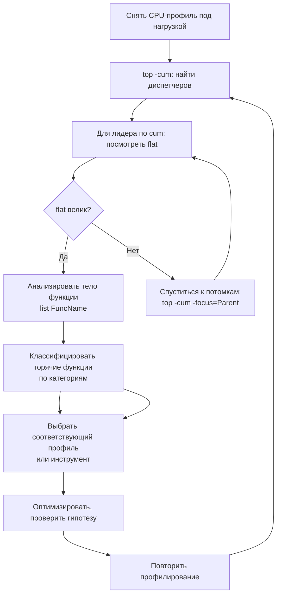

## Зачем системно анализировать top-функции

В [[2. CPU profiling в Go]] мы научились читать таблицу `top`: что означают `flat`, `cum` и как получить построчный `list`. Во [[3. Flamegraph]] мы добавили визуальную иерархию. Теперь пришло время превратить эти навыки в строгую, повторяемую методологию — **Top Functions Analysis**.

Суть метода: не просто увидеть «горячие» функции, а классифицировать их, понять причину дороговизны, связать с конкретным профилем (память, блокировки, contention) и выйти на целенаправленную оптимизацию. Senior-инженер не бросается на первую строку в `top` — он задаёт вопросы: «это flat или cum?», «это мой код или рантайм?», «это аллокация, копирование или ожидание?», «как это связано с кэшем и ветвлениями?».

Эта статья выстраивает полный аналитический фреймворк, который станет для вас алгоритмом на все случаи CPU-профилирования.

## Два взгляда: flat против cum

Напомним ключевые определения из [[2. CPU profiling в Go]]:

- **flat** — время, проведённое непосредственно в теле функции, исключая вызванные ею.
- **cum** (cumulative) — полное время от входа до выхода, включая все дочерние вызовы.

Оба взгляда важны, но отвечают на разные вопросы:

| Вопрос | Какой взгляд |
|--------|-------------|
| Какая функция сама выполняет тяжёлую работу? | flat |
| Какой путь стоит оптимизировать целиком? | cum |
| Где узкое место скрыто за вызовами? | cum (родитель) + flat (потомки) |
| Какая листовая функция — конечный потребитель тактов? | flat |

Алгоритм анализа:
1. Сортируем по `cum` (`top -cum`), находим «диспетчеров» с большим кумулятивным временем. Это входные точки для оптимизации.
2. Для каждого диспетчера смотрим его `flat`. Если `flat` мал — проблема в потомках. Используем `list` или `web` для детализации.
3. Сортируем по `flat` (`top -flat`), находим «листья», которые сами жрут такты.

> [!tip] Собеседование
> **Вопрос:** В top-списке функция имеет `flat=1.5s`, `cum=1.5s`. О чём это говорит?
> **Ответ:** Это листовая функция, которая не вызывает других дорогих операций. Всё время проводится в её теле. Оптимизировать нужно именно её код.

## Методология анализа top-функций

### Шаг 1. Сбор качественного профиля

Условия для достоверного профиля:
- Приложение под реалистичной нагрузкой (иначе увидим `runtime.gopark`, `netpoll`).
- Длительность не менее 30 секунд (меньше — риск смещения).
- Частота 100 Гц (по умолчанию), если не ищем наносекундные эффекты.
- Профиль снят на том же железе, где наблюдалась проблема.

### Шаг 2. Первичный осмотр: `top -cum`

```bash
go tool pprof cpu.prof
(pprof) top -cum
```

Вывод показывает функции, на которые приходится максимум *общего* времени. Вверху — корневые диспетчеры. Игнорируем `runtime.main`, `runtime.goexit` (это каркас). Ищем функции нашего кода с наибольшим `cum`.

Пример:

```
      flat  flat%   sum%        cum   cum%
     0.10s  2.00%  2.00%      3.50s 70.00%  myapp.ProcessRequest
     0.50s 10.00% 12.00%      2.00s 40.00%  encoding/json.Unmarshal
     0.80s 16.00% 28.00%      1.20s 24.00%  myapp.ValidateRecord
     0.20s  4.00% 32.00%      0.80s 16.00%  runtime.mallocgc
```

Вывод: `ProcessRequest` «стоит» 70% всего CPU. Но её собственный `flat` всего 0.10s — смотрим потомков. `json.Unmarshal` — 40% cum; `ValidateRecord` — 24% cum. Идём в них.

### Шаг 3. Выделение «потомков-лидеров»

Для каждой подозрительной функции смотрим:

```
(pprof) list ProcessRequest
(pprof) top -cum -focus=ProcessRequest
```

Или через веб-интерфейс (`-http`) — flamegraph, сфокусированный на `ProcessRequest`. Определяем, какие дочерние вызовы отъедают время.

### Шаг 4. Классификация «горячего» кода

Это центральный этап, где механическая эмпатия превращает цифры в диагноз. Ниже — классификация типичных «жителей» top-списка.

## Классификация «горячих» функций и стратегия действий

### Класс 1: Функции рантайма — аллокации (`mallocgc`, `newobject`)

**Симптом:** в top значительный `flat` у `runtime.mallocgc` или `runtime.newobject`.

**Причина:** код аллоцирует память в куче с высокой частотой. Это тянет за собой не только CPU на выделение, но и нагрузку на GC ([[5. pprof memory profile]]).

**Стратегия:**
- Перейти к memory profile (`-alloc_space`), найти источники аллокаций ([[4. Allocation profiling]]).
- Уменьшить аллокации: предвыделение, `sync.Pool` ([[2. sync Pool]]), возврат по значению вместо указателя, смена структуры ([[1. Уменьшение аллокаций]]).

### Класс 2: Копирование памяти (`memmove`, `duffcopy`, `memclrNoHeapPointers`)

**Симптом:** `runtime.memmove` или `runtime.duffcopy` в top.

**Причина:** большие копирования (слайсы, строки, структуры). Часто это передача по значению, динамический рост слайса (`growslice`), или сериализация.

**Стратегия:**
- Проверить на `list`, откуда вызывается копирование.
- Перейти на передачу по указателю или `copy` в предварительно выделенный буфер.
- Использовать `strings.Builder` с предварительным `Grow`.
- Рассмотреть zero-copy подходы ([[5. Zero copy подходы]]).

> [!warning] Ловушка / Gotcha
> `runtime.memmove` сам по себе очень быстр (SIMD-оптимизирован), но его наличие означает, что данные перекладываются. Если копирование повторяется многократно (например, при росте слайса), это создаёт каскадные накладные расходы и вымывает кэш ([[8. Cache friendliness]]).

### Класс 3: Блокировки и ожидания (`lock`, `unlock`, `semacquire`)

**Симптом:** `runtime.lock`, `runtime.unlock`, `runtime.semacquire` в топе, обычно с большим `flat` или заметным `cum`.

**Причина:** contention на мьютексах или ожидание на каналах (но ожидание на каналах чаще видно в block profile). CPU-профиль показывает только время *захвата* блокировки, а не время ожидания (оно вне CPU). Но если захват дорогой, значит ядро упирается в атомарные операции или futex.

**Стратегия:**
- Перейти к [[6. mutex profile]] и [[5. block profile]] для точной картины contention.
- Уменьшить критическую секцию, шардировать мьютексы, использовать lock-free структуры (atomic).
- Проверить false sharing ([[8. False sharing]]), если contention необъясним.

### Класс 4: CGO (`cgocall`, `asmcgocall`)

**Симптом:** `runtime.cgocall` в топе.

**Причина:** частые переходы в C-код (например, драйвер БД, библиотеки). CGO-вызов — это смена стека, сброс кэша TLB, иногда syscall.

**Стратегия:**
- Минимизировать количество CGO-вызовов, агрегировать операции в батчи.
- Если возможно, заменить C-библиотеку на Go-аналог.
- См. [[1. Системные вызовы и их стоимость]] для понимания накладных расходов.

### Класс 5: Операции с мапами (`mapaccess`, `mapassign`)

**Симптом:** `runtime.mapaccess1_fast64` (или подобные), `runtime.mapassign`, `runtime.growWork` в топе.

**Причина:** хеш-таблица активно используется, возможно, с неоптимальным размером, что вызывает рост и эвакуацию бакетов.

**Стратегия:**
- Предвыделять размер: `make(map[K]V, expectedSize)`.
- Использовать `struct{}` для значений-флагов.
- Проверить хеш-функцию, не вызывает ли тип коллизий.
- При сверхбольших объёмах — специализированные структуры ([[20. Алгоритмы и структуры данных (DSA) на Go]]).

### Класс 6: Рост слайсов (`growslice`)

**Симптом:** `runtime.growslice` в топе.

**Причина:** слайс растёт динамически, вызывая аллокации и копирование.

**Стратегия:**
- Предвыделять `make([]T, 0, capacity)`.
- Использовать `sync.Pool` для переиспользования.
- См. [[4. Предвыделение памяти]].

### Класс 7: Сериализация / десериализация

**Симптом:** `encoding/json.Unmarshal`, `xml.Decode`, `protobuf.Marshal` с высоким `flat` или `cum`.

**Причина:** формат неоптимален, много рефлексии (в случае JSON), много аллокаций.

**Стратегия:**
- Перейти на более быстрые библиотеки (sonic, easyjson).
- Использовать Protobuf/gRPC для внутренних сервисов.
- Для JSON — `json.Decoder` с переиспользованием буферов.

### Класс 8: Регулярные выражения

**Симптом:** `regexp.(*Regexp).FindAllString`, `regexp.(*Regexp).Find`.

**Причина:** компиляция regexp на лету или сложное выражение.

**Стратегия:**
- Вынести `regexp.MustCompile` в глобальные переменные.
- Заменить на более простые строковые операции, если возможно.

## Процесс анализа: алгоритмический подход



Классификация и выбор следующего шага:

| Категория в top | Следующий шаг |
|-----------------|--------------|
| `runtime.mallocgc` / `newobject` | Memory profile, [[4. Allocation profiling]] |
| `runtime.memmove` / `duffcopy` / `growslice` | Исследовать копирования, [[8. Cache friendliness]] |
| `runtime.lock` / `semacquire` / `sync.Mutex` | [[6. mutex profile]], [[5. block profile]] |
| `runtime.cgocall` | Ревизия CGO-вызовов |
| `mapaccess` / `mapassign` | Оптимизация мап |
| `json.Unmarshal` / `Marshal` | Пул буферов, альтернативные библиотеки |
| `regexp.Find` | Предкомпиляция |
| Пользовательские функции с большим `flat` | Построчный `list`, оценка алгоритма, инлайнинг |

## Пример системного анализа

Возьмём реальный профиль микросервиса:

```
(pprof) top -cum
      flat  flat%   sum%        cum   cum%
     0.05s  1.00%  1.00%      4.20s 84.00%  main.handleRequest
     0.30s  6.00%  7.00%      3.80s 76.00%  myapp.BusinessLogic
     0.20s  4.00% 11.00%      2.50s 50.00%  encoding/json.Unmarshal
     0.40s  8.00% 19.00%      1.80s 36.00%  runtime.mallocgc
     0.10s  2.00% 21.00%      0.90s 18.00%  myapp.Validate
     0.70s 14.00% 35.00%      0.70s 14.00%  runtime.memmove
```

Анализ:
- `handleRequest` — точка входа, cum=84%, но собственного времени почти нет.
- Спускаемся в `BusinessLogic` (cum=76%), flat=0.30s — диспетчер.
- В `BusinessLogic` потомки: `json.Unmarshal` (50%), `Validate` (18%), `mallocgc` (36%).
- `json.Unmarshal` вызывает `mallocgc` и `memmove` — это основной источник затрат.
- `memmove` с flat=0.70s — листовая, копирует данные при анмаршалинге.

Решение: заменить `encoding/json` на `sonic` (снижает аллокации). После замены повторный профиль должен показать снижение `mallocgc` и `memmove`.

## Mechanical Sympathy: читаем между строк

Опытный инженер видит в top-функциях не просто названия, а физические процессы:

- **`runtime.memmove`** = данные физически перемещаются между ячейками памяти. При большом объёме это означает вымывание L1/L2 кэша. Даже если это «всего лишь» копия, она может разрушить cache friendliness ([[8. Cache friendliness]]).
- **`runtime.lock` / `runtime.unlock`** с большим flat может указывать не только на contention, но и на частое переключение контекста, которое сбрасывает TLB и BTB (branch target buffer). Эти накладные расходы не фиксируются профилем, но ощущаются в throughput.
- **Вызовы функций из `top -cum` с малой шириной в flamegraph, но большим cum**, говорят о глубокой иерархии. Вложенные вызовы могут мешать инлайнингу ([[5. Inline и влияние на performance]]) и увеличивать давление на стек.

Понимание этих связей превращает догадку в уверенный диагноз.

## Итог

- **Top functions анализ** — системный метод, идущий от `cum`-лидеров к `flat`-листьям, с обязательной классификацией функций по типу затрат.
- `flat` показывает, где именно тратятся такты; `cum` — кто за это отвечает. Игнорировать `cum` — потерять контекст.
- Каждый класс «горячих» функций (аллокация, копирование, блокировки, CGO, мапы, сериализация) имеет стандартный протокол дальнейшего исследования через memory, block, mutex профили или алгоритмический анализ.
- Механическая эмпатия позволяет интерпретировать названия функций рантайма как индикаторы кэш-промахов, contention или проблем инлайнинга.
- Системный подход предотвращает бессистемную оптимизацию и гарантирует, что каждое действие обосновано цифрами.

Теперь, вооружившись умением находить конкретные «горячие» функции, мы переходим к тому, как решения компилятора — инлайнинг — кардинально влияют на то, какие функции вообще попадают в этот top. Следующая статья: [[5. Inline и влияние на performance]].