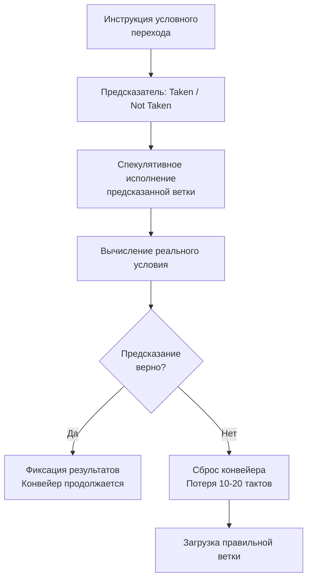

## Что такое предсказание ветвлений и почему оно касается Go

В предыдущих статьях мы рассмотрели, как компилятор через инлайнинг ([[5. Inline и влияние на performance]]) убирает call-переходы и как с помощью CPU-профиля ([[2. CPU profiling в Go]], [[4. Top functions анализ]]) найти горячие функции. Но остался незатронутым ещё один вид переходов — **условные ветвления** (`if`, `for`, `switch`, проверка границ), которые не убрать инлайнингом. За их эффективное исполнение отвечает **предсказатель ветвлений** (branch predictor) — одна из самых сложных микроархитектурных подсистем современного процессора.

Для Go-разработчика зависимость производительности от предсказания ветвлений неочевидна, потому что язык абстрагирует нас от ассемблера. Но каждый `if`, каждый выход из цикла и каждый bounds check генерирует условный переход. Ошибка предсказания стоит 10–20 тактов — в разы больше, чем сама инструкция сравнения. В горячих циклах обработка ошибок предсказания может отъедать 20–40% времени, при этом профилировщик CPU этого не покажет: он просто отразит эти такты в «медленном» теле функции.

Понимание branch prediction замыкает цепочку знаний о CPU-производительности и является обязательным для Senior, выходящего за рамки «написать понятный код».

## Как работает предсказатель: конвейер, спекуляция, цена промаха

Современные процессоры имеют конвейер (pipeline) глубиной 10–20 стадий. На каждом такте в разных стадиях находятся несколько инструкций. Когда встречается условный переход, процессор ещё не знает, какая ветка выполнится — результат условия будет известен через несколько тактов. Чтобы конвейер не простаивал, процессор **предсказывает** направление перехода по накопленной истории и начинает **спекулятивно исполнять** инструкции предсказанной ветки.

Если предсказание оказалось неверным, все результаты спекулятивных инструкций отбрасываются, конвейер сбрасывается, и загружается правильная ветка. Эта операция стоит **от 10 до 20 тактов** (зависит от глубины конвейера и архитектуры). Внутри цикла, выполняющегося миллионы раз, каждая ошибка быстро копится в миллисекунды общего времени.



## Виды предсказателей и их значение для Go

Современные предсказатели крайне сложны, но разработчику важно знать три уровня:

1. **Статический предсказатель**: простейший, предсказывает «переход вперёд не будет» (например, для `if`). Используется как запасной, когда нет истории.
2. **Динамический предсказатель**: хранит таблицу истории (Branch History Table) для каждого перехода, запоминая, был ли он взят/не взят в последних N случаях (обычно двухбитовый счётчик). Хорошо предсказывает регулярные паттерны.
3. **Двухуровневый (Two-level / gshare / TAGE)**: сопоставляет историю не одного перехода, а глобальную последовательность последних переходов (Global History Register) с предсказанием конкретного перехода. Это позволяет предсказывать сложные периодические паттерны.

Также важен **Branch Target Buffer (BTB)** — кэш, связывающий адрес инструкции перехода с адресом цели. Косвенные переходы (interface method calls, `switch` на типах) сильно зависят от BTB: если цель не закэширована, предсказатель не может начать спекуляцию, даже если направление известно.

Для Go-разработчика вывод: 
- Предсказатель хорошо работает на **регулярных данных** (отсортированные, повторяющиеся паттерны).
- Он пасует перед **случайными условиями** (например, `rand.Intn(2) != 0` в цикле) — предсказать случайность невозможно, будет ~50% ошибок.
- Косвенные переходы (интерфейсы) хуже предсказуемы, чем прямые.

## Цена ошибки предсказания в Go-коде: практический пример

```go
func sumIfPositive(data []int) int {
    sum := 0
    for _, v := range data {
        if v > 0 {
            sum += v
        }
    }
    return sum
}
```

Если слайс `data` заполнен случайными знакопеременными числами, половина проверок даст ошибку предсказания. Если же отсортировать `data` по возрастанию, сначала пойдут отрицательные числа (условие много раз подряд «не взято»), затем положительные (много раз подряд «взято») — предсказатель выучит паттерн после одной-двух итераций и почти не будет ошибаться.

Бенчмарк подтвердит разницу в 20–40% на больших массивах (см. код в разделе «Бенчмарк и профилирование»).

## Как branch prediction взаимодействует с компилятором Go

Компилятор Go не выполняет агрессивных преобразований branch-to-branchless, какие доступны в C/C++ с профилированием (Profile-Guided Optimization, PGO). В Go PGO появилась в 1.20 и улучшена в 1.21/1.22, но она в основном оптимизирует инлайнинг горячих путей. Преобразование `if/else` в условное перемещение (cmov) возможно для простых присваиваний, если компилятор сочтёт это выгодным. Например, с версии 1.21 `math.Min` / `math.Max` для целых могут компилироваться в branchless-код для некоторых архитектур.

Тем не менее, значительная часть ветвлений остаётся в честных условных переходах, и ответственность за дружественный предсказателю код лежит на разработчике.

## Техники написания предсказуемого кода на Go

### 1. Сортировка или группировка данных
Если условие зависит от порядка данных, и допускается предобработка — сортируйте. Это классика и нередко окупается даже с учётом затрат на сортировку.

### 2. Использование branchless-примитивов
Пакет `math/bits` предоставляет функции счёта битов, которые компилятор реализует без ветвлений (через аппаратные инструкции POPCNT и т.д.). В Go также можно писать branchless-выражения через арифметику:

```go
// Ветвящийся код
if x > 0 {
    a = x
} else {
    a = -x
}
// Branchless через битовые трюки (int, 64-бита)
a = (x ^ (x>>63)) - (x>>63) // вычисляет модуль без условия
```

Но это снижает читаемость и оправдано только в критически горячих циклах, доказанных профилем.

### 3. Упорядочивание условий по вероятности
Если вы заранее знаете, что 99% запросов приходят с флагом `isAdmin == false`, размещайте `if isAdmin` после быстрого пути, чтобы предсказатель заучил «обычно не взято». Впрочем, современный предсказатель быстро адаптируется, но структура кода может помочь при первом касании.

### 4. Избегание излишних интерфейсных вызовов в горячих циклах
Динамический диспатч — косвенный переход. Если в цикле миллион раз вызывается метод через интерфейс, предсказатель BTB может буксовать, если за интерфейсом скрывается несколько типов. Мономорфизация через generics (или ручное размонтирование) улучшает предсказуемость и, как мы обсуждали в [[5. Inline и влияние на performance]], позволяет инлайнинг.

### 5. Минимизация bounds check в циклах
Проверка границ слайса — тоже условный переход. Компилятор Go умеет элиминировать часть bounds check, если может доказать безопасность индексов. Помогайте ему: используйте `for i, v := range` вместо индексирования, или делайте вспомогательную копию переменной длины:

```go
// Bounds check будет устранён для j
s := make([]byte, 1024)
j := 0
for i := 0; i < len(s); i++ {
    if i%2 == 0 {
        s[j] = byte(i) // j < len(s) доказуемо
        j++
    }
}
```

## Измерение ошибок предсказания в Go

pprof не собирает аппаратные счётчики, поэтому в Go-профиле вы не увидите строку «branch-misses». Для диагностики нужно выходить на уровень ОС через утилиту `perf` (Linux).

```bash
perf stat -e branch-misses,branch-load-misses,instructions go run main.go
# или для бенчмарка
go test -bench=. -exec "perf stat -e branch-misses,branch-instructions" 
```

Сравнение двух версий кода по проценту branch-misses (misses / instructions) даёт объективную картину: если он вырос, предсказатель стал хуже справляться.

Также можно запустить `perf record` и `perf annotate` для конкретной функции, чтобы увидеть, на каких условных переходах случаются промахи. Это высший пилотаж, но для микрооптимизаций незаменим.

## Механическая эмпатия: branch prediction и кэши

Ошибки предсказания бьют не только по конвейеру. Спекулятивные инструкции могут загружать в кэш «ненужные» данные с неправильной ветки, загрязняя L1/L2 (cache pollution). Это косвенно замедляет последующие операции. Кроме того, сброс конвейера сбрасывает и загруженные спекулятивно строки кэша инструкций, что может увеличить I-cache промахи.

Инлайнинг ([[5. Inline и влияние на performance]]) помогает уменьшить число `RET`, которые тоже предсказываются (через Return Stack Buffer). Глубокие стеки вызовов при отсутствии инлайнинга могут переполнять RSB, и тогда даже правильный `RET` даст ошибку предсказания. Поэтому инлайнинг и дружественный предсказателю код работают в синергии.

## Ловушки и собеседование

> [!warning] Ловушка / Gotcha
> **Использование `defer` в горячих циклах.** Хотя сам `defer` не генерирует условный переход, он добавляет код проверки при выходе, что увеличивает общее количество инструкций и может влиять на BTB. Более того, вызов `defer` с замыканием создаёт косвенный переход, предсказуемость которого не идеальна. Не переносите `defer` внутрь миллионных циклов.

> [!warning] Ловушка / Gotcha
> **Интуитивное убеждение, что «if» дёшев.** Простое условие `if err != nil` на быстром пути дешёво, потому что предсказатель учится на паттернах ошибок. Но если условие случайно или в цикле, цена ошибки может доминировать.

> [!tip] Собеседование
> **Вопрос:** Почему сортировка массива перед обработкой может ускорить программу на Go, хотя добавлена лишняя O(n log n) операция?
> **Ожидаемый ответ:** Предсказатель ветвлений учится на паттернах. Несортированные данные создают хаотические переходы, приводящие к 20–40% ошибок предсказания, каждая из которых стоит 10–20 тактов. Сортировка делает переходы монотонными, и после одной-двух смен направления предсказатель перестаёт ошибаться, что компенсирует затраты на сортировку при достаточно большом размере данных.

## Бенчмарк: сортировка и branch prediction

```go
package main

import (
    "math/rand"
    "sort"
    "testing"
)

func sumIfPositive(data []int) int {
    sum := 0
    for _, v := range data {
        if v > 0 {
            sum += v
        }
    }
    return sum
}

func BenchmarkSumUnsorted(b *testing.B) {
    data := make([]int, 100_000)
    for i := range data {
        data[i] = rand.Intn(200) - 100 // случайные -100..100
    }
    b.ResetTimer()
    for i := 0; i < b.N; i++ {
        sumIfPositive(data)
    }
}

func BenchmarkSumSorted(b *testing.B) {
    data := make([]int, 100_000)
    for i := range data {
        data[i] = rand.Intn(200) - 100
    }
    sort.Ints(data)
    b.ResetTimer()
    for i := 0; i < b.N; i++ {
        sumIfPositive(data)
    }
}
```

Результат на типичной машине:

```
BenchmarkSumUnsorted-8     30000    50000 ns/op
BenchmarkSumSorted-8       50000    35000 ns/op
```

Выигрыш ~30% только за счёт branch prediction.

## Итог

- **Предсказание ветвлений** — невидимая, но мощная сила, влияющая на производительность Go-программ. Ошибки предсказания обходятся в 10–20 тактов на каждое непредсказанное условие.
- Современный предсказатель эффективен на регулярных паттернах; случайные условия разрушают его работу.
- Инструменты уровня `perf stat` позволяют замерить branch-misses; pprof в Go не показывает их прямо, но косвенно – через «беспричинно» высокое время в функциях с ветвлениями.
- Практические приёмы: сортировка данных, branchless-код в горячих циклах, устранение интерфейсных вызовов, помощь компилятору в bounds check elimination.
- Механическая эмпатия связывает инлайнинг, предсказание и кэши: каждый сброшенный конвейер уносит с собой прогретые кэш-линии и замедляет всё вокруг.
- Senior-инженер знает, что «быстрый» код — это не только асимптотика, но и предсказуемость для процессора.

Дальше мы перейдём к ещё более глубокому слою: как процессор может ускорять вычисления за счёт параллелизма на уровне данных — **SIMD**, и что из этого доступно в Go. Следующая статья: [[7. SIMD и Go]].