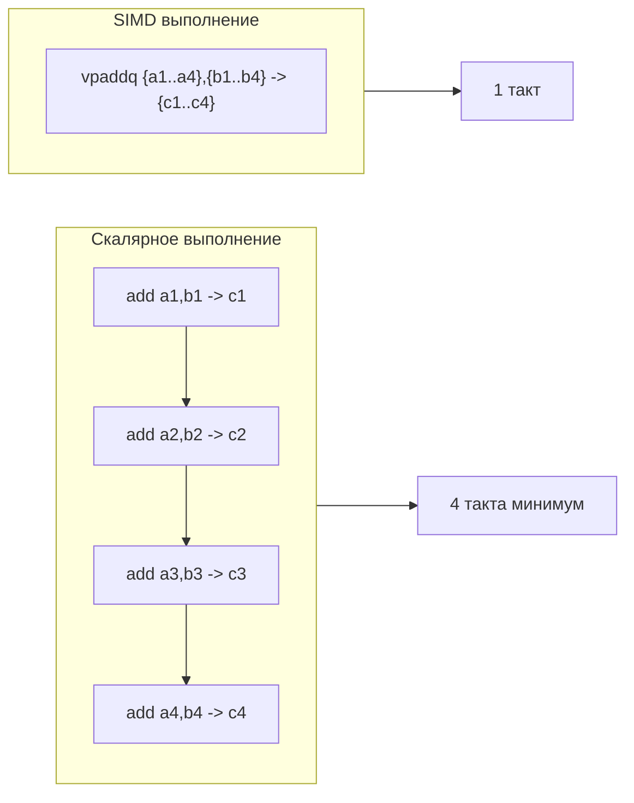

## Что такое SIMD и почему оно важно для Go-разработчика

**SIMD** (Single Instruction, Multiple Data) — архитектурный принцип, при котором одна инструкция процессора выполняет одну и ту же операцию над несколькими элементами данных одновременно. Это ключевой механизм ускорения вычислительно-насыщенных задач: обработки изображений, криптографии, сжатия, научных расчётов и любых циклов с однородной арифметикой.

Для Go-разработчика SIMD долгое время находилось в тени: компилятор Go исторически не умел автоматически векторизовать циклы, в отличие от GCC или компиляторов JVM. Это создавало разрыв в производительности CPU-bound задач по сравнению с C/Rust. Однако с развитием языка, PGO и ростом ручных ассемблерных оптимизаций в стандартной библиотеке, SIMD перестало быть «магией зарубежных языков» и стало практическим инструментом, который Senior обязан понимать и уметь применять там, где это даёт измеримый выигрыш.

Эта статья закрывает тему CPU-оптимизаций перед переходом к кэш-эффективности ([[8. Cache friendliness]]). Мы уже знаем, как анализировать горячие функции ([[4. Top functions анализ]]), помогать компилятору инлайнингом ([[5. Inline и влияние на performance]]) и писать предсказуемый для процессора код ([[6. Branch prediction и код]]). Теперь добавим последний штрих: параллелизм на уровне данных.

## Аппаратная основа: регистры и наборы инструкций

Современные x86-64 процессоры обладают специализированными регистрами для SIMD:

- **SSE** (Streaming SIMD Extensions): 128-битные регистры XMM. Обрабатывают 2×int64, 4×int32, 4×float32, 2×float64.
- **AVX2**: 256-битные регистры YMM. Удваивают пропускную способность.
- **AVX-512**: 512-битные регистры ZMM. Доступны в серверных и некоторых потребительских CPU.

Архитектура ARM (Apple M, AWS Graviton) имеет свой SIMD-набор — **NEON** (128 бит), в новейших версиях ARMv8.4-A+ — расширения до 256 бит (SVE). Go компилируется под обе платформы, поэтому понимание кросс-архитектурности критично.

Одна SIMD-инструкция, например `VPADDQ` (AVX2 packed add quadwords), складывает 4 пары uint64 за один такт. Это теоретически даёт 4-кратное ускорение по сравнению со скалярным `ADD`. Практический выигрыш чуть ниже из-за накладных расходов на загрузку/выгрузку данных и выравнивания, но всё равно измеряется сотнями процентов.



## Компилятор Go и автовекторизация

Главная новость: **компилятор Go (gc) не выполняет автоматической векторизации циклов**. Он не превращает цикл суммирования слайса в SIMD-инструкции. Причины:

- Отсутствие подходящей промежуточной модели (SSA, на которой работает оптимизатор, не содержит векторных типов).
- Приоритет скорости компиляции и простоты.
- Опасения по поводу усложнения семантики и отладки.

Однако это не означает, что Go-программы обделены SIMD. Напротив, **ключевые функции стандартной библиотеки написаны на ассемблере с использованием SIMD** и подключаются автоматически. Таким образом, разработчик получает преимущества «бесплатно», не думая об инструкциях.

> [!info] Под капотом
> Функции вроде `runtime.memmove`, `runtime.memclr`, `crypto/sha256`, `hash/crc32`, `math/big` содержат ассемблерные файлы с реализациями для каждой поддерживаемой архитектуры (amd64, arm64). Компилятор выбирает нужную во время сборки. Эти функции оптимизированы вручную и используют SSE/AVX/NEON. Именно поэтому `copy` между слайсами или хеширование могут быть неожиданно быстрыми.

## Где SIMD уже работает в Go

### 1. Копирование и обнуление памяти

`copy(dst, src)` и `for i := range s { dst[i] = src[i] }` в критических случаях компилируются в вызов `runtime.memmove`. Эта функция использует SIMD для копирования большими блоками. Аналогично `make` с нулевым значением вызывает `runtime.memclr`, которая обнуляет память векторным способом.

В CPU-профилях это видно как `runtime.memmove` или `runtime.duffcopy`. Как мы обсуждали в [[4. Top functions анализ]], большой flat у этих функций — сигнал о копировании данных, но не всегда о проблеме: они работают очень быстро благодаря SIMD.

### 2. Криптография

Пакеты `crypto/aes`, `crypto/sha256`, `crypto/sha512`, `hash/crc32` содержат ассемблерные версии, ускоренные через AES-NI, SSE, AVX512. Например, `sha256.Sum256` на x86 вызывает `SHA256` с ручной AVX2-реализацией, способной обрабатывать 16 блоков параллельно. Для серверов, вычисляющих тысячи TLS-хешей в секунду, это даёт экономию десятков процентов CPU.

### 3. Обработка изображений

Пакет `image/jpeg` использует SIMD для декодирования/кодирования через ассемблер. Пакет `image` для работы с цветами опирается на векторные операции. При профилировании вы заметите аномально быстрые пиксельные операции без явных горячих точек.

### 4. Математика больших чисел

`math/big` содержит арифметику с длинными числами. Для больших операндов умножение и деление реализованы через ассемблер с использованием SIMD (например, умножение Карацубы с AVX2). Это критично для блокчейн-проектов и криптографии.

### 5. Внешние библиотеки

Сообщество Go создало ряд пакетов для прямого доступа к SIMD:

- **`github.com/klauspost/cpuid/v2`** — детектирование возможностей CPU. Стандарт де-факто для выбора функции под конкретное железо во время выполнения.
- **`github.com/klauspost/compress/snappy`** и другие — реализация сжатия с AVX2/AVX512 версиями, автоматически подключаемыми через `cpuid`.
- **`github.com/minio/sha256-simd`** — альтернативный SHA-256 для AVX512/ARM.
- **`gonum`** библиотека линейной алгебры использует SIMD через cgo/ассемблер.

Типичный паттерн: пакет на старте проверяет `cpuid.CPU.AVX2()` и подставляет соответствующую реализацию. Это позволяет одному бинарнику быть оптимальным на разных процессорах.

## Ручное использование SIMD в Go

### Ассемблер Plan9

Go поддерживает собственный ассемблерный синтаксис (Plan9). Можно написать `.s` файл с векторными инструкциями, экспортировать функцию и вызывать из Go. Это требует глубоких знаний, поддержки всех архитектур и сопряжено с риском ошибок. Редко применяется в прикладном коде, но стандартная библиотека построена именно так.

### cgo

Вызов C-функций, написанных с использованием интринсиков (intrinsics) SIMD. Cgo добавляет overhead, поэтому подходит только для крупных векторизованных операций, где выигрыш перевешивает переход.

### Чистый Go и надежда на компилятор

В чистом Go самый практичный способ стимулировать векторизацию — писать компактные циклы, использующие функции из `math/bits` (которые компилятор может заинлайнить), и надеяться, что будущие версии компилятора начнут векторизовать. Но пока это лишь надежда.

## Профилирование и SIMD

pprof не показывает, используется ли SIMD, но косвенно отражает эффект: функции с SIMD-ускорением имеют большой `flat` и маленькое время выполнения относительно скалярных аналогов.

Для прямого подтверждения используйте аппаратные счётчики через `perf`:

```bash
perf stat -e fp_arith_inst_retired.128b_packed_single,\
fp_arith_inst_retired.256b_packed_single go test -bench=.
```

Если прирост производительности не объясним инлайнингом или предсказанием, а счётчик векторных инструкций высок — значит, работает SIMD.

> [!tip] Собеседование
> **Вопрос:** Почему `crypto/sha256` на Go может быть быстрее аналогичной реализации на Python, но всё равно проигрывает C-версии с AVX-512?
> **Ответ:** Go-версия использует ассемблер с AVX2, который даёт значительное ускорение, но AVX-512 обрабатывает вдвое больше данных за такт и может иметь оптимизации под конкретное микроархитектурное поведение. Однако разрыв невелик, и в типичном веб-сервере это не станет bottleneck'ом.

## Механическая эмпатия: выравнивание и кэш

SIMD-инструкции быстрее работают с **выровненными** по границе регистра данными (например, 16-байтный SSE, 32-байтный AVX2). Невыровненный доступ на старых процессорах вызывал замедление или ошибку; современные CPU обрабатывают unaligned загрузки почти без штрафа (около 1 такта), но по-прежнему следует выравнивать данные, чтобы избежать пересечения кэш-линий и снизить TLB-промахи.

Go не даёт прямого контроля над выравниванием, но компилятор уважает выравнивание структур (через паддинг). Для пользовательского SIMD-кода часто выделяют буферы большего размера и используют `uintptr` с маской для выравнивания (см. [[9. Cache line и выравнивание]]).

## Ловушки и ограничения

- **Разные наборы инструкций.** Если вы собираете бинарник на машине с AVX2 и запускаете на старом сервере с SSE4, программа упадёт с SIGILL, если не проверять поддержку через `cpuid`. Всегда используйте динамический выбор функции или флаги сборки.
- **Раздувание бинарника.** Включение нескольких ассемблерных реализаций под разные архитектуры увеличивает размер исполняемого файла.
- **Снижение читаемости.** Ручной ассемблер — экстремальная мера, которая должна иметь доказанную потребность. Без бенчмарков и профилей не трогайте.
- **Эффект dark silicon.** При активном использовании AVX-512 процессор может понижать частоту, сводя выигрыш на нет. Тестируйте на реальном железе.

## Когда думать о SIMD в Go-проекте

Senior-разработчик использует SIMD осознанно. Приоритет действий:

1. **Измерить.** Убедиться через профили ([[2. CPU profiling в Go]]), что функция действительно CPU-bound и занимает значимую долю времени.
2. **Попытаться обычными оптимизациями.** Уменьшить аллокации ([[1. Уменьшение аллокаций]]), улучшить кэш-локальность ([[8. Cache friendliness]]), применить инлайнинг ([[5. Inline и влияние на performance]]), отсортировать данные для предсказателя ([[6. Branch prediction и код]]).
3. **Искать готовые SIMD-решения.** Проверить стандартную библиотеку и пакеты типа `klauspost/compress`, `minio/sha256-simd`. Возможно, вашу задачу уже решили.
4. **Только если нет готового — писать своё.** Начинать с `cpuid` и ассемблера на критический участок, с поддержкой только основных архитектур (amd64, arm64). Закладывать бенчмарки на эталонном железе.

## Итог

- SIMD — архитектурный принцип «одна инструкция — много данных», способный ускорить CPU-bound код в 2–8 раз.
- Компилятор Go не векторизует автоматически, но стандартная библиотека поставляет SIMD-оптимизированный код для копирования, криптографии и математики.
- Ключевые пакеты `runtime`, `crypto`, `math/big` используют ручной ассемблер с SSE/AVX/NEON.
- Для прикладных задач применяются сторонние библиотеки, детектирующие возможности процессора через `cpuid`.
- Ручное написание SIMD на ассемблере Plan9 или через cgo — крайняя мера, требующая профилей и бенчмарков.
- При анализе производительности учитывайте, что SIMD-функции видны в pprof как «плоские» горячие точки; используйте `perf` для проверки векторных инструкций.
- Сочетание знаний о ветвлениях, инлайнинге и SIMD делает вас инженером, способным выжать максимум из процессора.

Далее мы завершим раздел CPU-профилирования, изучив как организация кода влияет на попадание в кэш, — фундамент для всех предыдущих оптимизаций: [[8. Cache friendliness]].