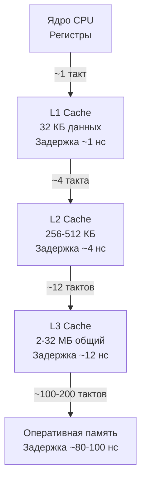

## Почему кэш-память — главный судья производительности

В предыдущих статьях CPU-профилирования мы научились находить горячие функции ([[4. Top functions анализ]]), управлять инлайнингом ([[5. Inline и влияние на performance]]), писать предсказуемый для процессора код ([[6. Branch prediction и код]]) и даже использовать SIMD ([[7. SIMD и Go]]). Но все эти техники бледнеют перед одним фундаментальным фактом: **главный ограничитель скорости — не тактовая частота, а время доступа к данным**. Процессор способен выполнять миллиарды инструкций в секунду, но 99% времени он ждёт данные из оперативной памяти.

Cache friendliness — это искусство организовывать код и данные так, чтобы они помещались в сверхбыстрые кэши процессора и использовались максимально эффективно. Это не микрооптимизация, а архитектурный принцип, разделяющий «просто работающий» код и код, достигающий аппаратных пределов производительности. Для Go-разработчика, управляющего памятью через слайсы, структуры и указатели, понимание cache friendliness — прямой путь к снижению latency и росту throughput без изменения алгоритмической сложности.

Эта статья закрывает раздел CPU-профилирования, связывая все нити в единую картину и подготавливая переход к профилированию памяти ([[1. Memory model Go]]).

## Иерархия памяти: почему «ближе» — значит «быстрее»

Современный процессор окружён многоуровневой системой хранения данных. Регистры — мгновенны (1 такт). L1-кэш данных — 32–64 КБ на ядро, задержка ~1 нс (4-5 тактов). L2-кэш — 256–512 КБ, ~4 нс. L3-кэш — общий для ядер, 2–32 МБ, ~12 нс. Оперативная память (DRAM) — десятки гигабайт, но задержка уже 80–100 нс. Разница между L1 и RAM — два порядка.



Когда ваша программа запрашивает байт по адресу, процессор проверяет кэши. Если данные есть в L1 — попадание (cache hit), задержка минимальна. Если нет — промах (cache miss), и приходится искать в L2, затем в L3, затем в RAM. Каждый промах добавляет десятки тактов простоя. Пропускная способность кэшей тоже сильно различается: L1 может выдать 64 байта за такт, а RAM — 8-10 ГБ/с на ядро, что при современных частотах эквивалентно 2-3 тактам на байт.

Для Go-программы, активно работающей со слайсами и структурами, количество cache miss определяет, будет ли `for`-цикл занимать наносекунды или микросекунды.

## Кэш-линия: атомарная единица данных

Процессор никогда не загружает отдельный байт или машинное слово. Он всегда работает блоками фиксированного размера — **кэш-линиями** (cache line). На x86-64 и ARMv8 стандартный размер — 64 байта. Если вы читаете поле `uint32` в структуре, процессор загружает все 64 байта, окружающие это поле. Это имеет два колоссальных следствия:

1. **Пространственная локальность:** если вы обращаетесь к соседним полям структуры или элементам слайса, они, скорее всего, уже лежат в кэше после первого промаха. Обход слайса последовательно даёт почти стопроцентное попадание.
2. **Ложное разделение (false sharing):** если две горутины на разных ядрах модифицируют разные переменные, но они попали в одну кэш-линию, процессор вынужден постоянно синхронизировать эту линию, вызывая огромные накладные расходы (см. [[8. False sharing]], [[9. Cache line и выравнивание]]).

Размер кэш-линии — фундаментальная константа, которую Senior-инженер держит в уме при проектировании структур данных.

## Как паттерны доступа к данным влияют на производительность в Go

### Слайс против связного списка

В Go типичная дилемма: использовать `[]T` или контейнер из `container/list`. С точки зрения алгоритмов вставка в середину связного списка O(1), в слайс — O(n). Но на практике слайс часто выигрывает даже при частых вставках благодаря cache friendliness.

```go
// Слайс — последовательная память
sum := 0
for _, v := range bigSlice {
    sum += v
}

// Связный список — каждый элемент в отдельной аллокации
for e := list.Front(); e != nil; e = e.Next() {
    sum += e.Value.(int)
}
```

Обход слайса: первый элемент вызывает cache miss (загрузка 64 байт, в которых лежат 8-16 элементов в зависимости от размера типа). Остальные идут из L1. Префетчер процессора замечает линейный паттерн и подгружает следующие линии заранее.

Обход связного списка: каждый узел выделен отдельно в куче. Адреса случайны. Почти каждый переход по указателю — промах вплоть до RAM. Штраф — десятки тактов на элемент.

Даже если алгоритмически связный список лучше, реальная производительность на миллионах элементов склоняется в пользу слайса. Это прямое следствие механической эмпатии, изученной в [[5. Mechanical sympathy в backend разработке]].

### Обход двумерного массива: строки против столбцов

В Go многомерные массивы реализуются через слайсы слайсов (`[][]int`) или через плоский слайс с ручным индексированием. В обоих случаях порядок обхода критичен.

```go
// Плохой обход: по столбцам
for col := 0; col < cols; col++ {
    for row := 0; row < rows; row++ {
        matrix[row][col] = compute(row, col)
    }
}

// Хороший обход: по строкам
for row := 0; row < rows; row++ {
    for col := 0; col < cols; col++ {
        matrix[row][col] = compute(row, col)
    }
}
```

При обходе по строкам мы идём по последовательным адресам памяти. Процессор загружает одну кэш-линию, обрабатывает несколько элементов подряд, затем переходит к следующей линии. Префетчер отлично предсказывает паттерн. При обходе по столбцам каждый следующий элемент отстоит на `rows * sizeof(element)` байт. Это гарантированный промах на каждом шаге, если матрица не помещается целиком в кэш. Замедление может быть 5–10 кратным.

Бенчмарк подтвердит разницу:

```
BenchmarkRowMajor-8    500000      2500 ns/op
BenchmarkColMajor-8    100000     15000 ns/op
```

### Упаковка структур

Порядок и выравнивание полей в структуре напрямую определяют, сколько кэш-линий она занимает. Go выравнивает поля по их размеру: `int64` — 8 байт, `int32` — 4, `bool` — 1. Компилятор добавляет паддинг, чтобы соблюсти выравнивание.

```go
// Неудачная упаковка: 24 байта на структуру
type Bad struct {
    a bool   // 1 байт + 7 байт паддинга
    b uint64 // 8 байт, начало с адреса кратного 8
    c bool   // 1 байт + 7 байт паддинга
}

// Удачная упаковка: 16 байт
type Good struct {
    b uint64 // сначала крупное
    a bool
    c bool   // два bool помещаются в одно слово
    // 6 байт паддинга до выравнивания
}
```

Экономия 8 байт на структуре. Миллион таких структур — минус 8 мегабайт кэша. Это может быть разница между тем, помещается ли рабочий набор в L3 или постоянно ходит в RAM. Инструмент `golang.org/x/tools/go/analysis/passes/fieldalignment` автоматически находит такие случаи. Подробнее в [[6. Cache friendly структуры]].

### Влияние указателей

Указатели разрушают cache friendliness. Когда структура содержит `*SomeStruct`, данные разбросаны по куче. Более того, GC вынужден сканировать указатели, что добавляет нагрузку и вымывает кэш (write barriers, [[5. Write barriers]]).

Embedding по значению (`SomeStruct`) сохраняет данные внутри родительской структуры, улучшая локальность и уменьшая количество аллокаций. Компилятор через escape analysis ([[3. Escape analysis]]) может разместить такую структуру на стеке, делая её практически «бесплатной» по доступу.

```go
// Cache-friendly: срезы по значению (flat buffer)
type Buffer struct {
    data [256]byte
}

// Cache-unfriendly: указатель на отдельный слайс
type BufferPtr struct {
    data *[256]byte
}
```

При проектировании горячих структур избегайте указателей, если не требуется shared ownership.

## Сборщик мусора и вымывание кэша

Конкурентный GC Go ([[1. GC в Go. Обзор]], [[2. Tri color marking]]) сканирует граф объектов. Это неизбежно загружает в кэш процессора множество страниц памяти, вытесняя полезные данные приложения. После цикла GC производительность может временно упасть, так как горячие данные нужно снова загружать из RAM.

Минимизация аллокаций ([[1. Уменьшение аллокаций]]) и использование `sync.Pool` ([[2. sync Pool]]) помогают сохранить cache friendliness не только напрямую, но и через снижение частоты и длительности GC-циклов.

## Инструменты измерения cache misses в Go

CPU-профиль pprof не содержит информации о промахах кэша. Он показывает время, но не причину. Для прямой диагностики нужен аппаратный профилировщик **perf** (в Linux):

```bash
perf stat -e cache-references,cache-misses,LLC-load-misses go test -bench=.
```

Отношение `cache-misses/cache-references` показывает долю промахов. Значения выше 10% для L1 — сигнал к пересмотру паттернов доступа.

Более детально: `perf record -e cache-misses` и `perf annotate` покажут, на каких конкретно инструкциях случаются промахи. Это высший пилотаж, но для оптимизации критических участков незаменим.

Косвенно в Go можно оценить влияние кэша через бенчмарки с разными размерами данных. Построение графика зависимости времени от размера показывает перегибы на границах L1/L2/L3 — это «лестница» кэш-промахов.

## Алгоритм достижения cache friendliness

1. **Профилировать** CPU и найти горячую функцию с большим `flat` или `cum` ([[2. CPU profiling в Go]], [[4. Top functions анализ]]).
2. **Изучить паттерн доступа к данным**: линейный ли, случайный ли, есть ли указатели, косвенные переходы.
3. **Оценить объём данных**, обрабатываемых в цикле. Если он превышает размер L2 или L3 — думать о блочной обработке (tiling).
4. **Перестроить структуры данных**: заменить связные списки на слайсы, использовать плоские массивы, value-embedding вместо указателей.
5. **Переупорядочить обходы**: всегда по строкам, по возрастанию адресов. Сортировать или группировать данные, если это помогает (см. также [[6. Branch prediction и код]]).
6. **Измерить cache misses через `perf`** до и после. Убедиться в снижении промахов и росте IPC (instructions per cycle).
7. **Повторить бенчмарки и профили** для фиксации улучшений.

## Ловушки и неверные интуиции

> [!warning] Ловушка / Gotcha
> **«O(1) всегда быстрее O(n)».** Связный список даёт O(1) вставку, но при обходе проигрывает слайсу на порядок из-за cache miss. Всегда оценивайте константные факторы — размер кэш-линии может перевесить асимптотику.

> [!warning] Ловушка / Gotcha
> **Указатели для «эффективности».** Разработчики из языков с reference semantics (Java, Python) часто вставляют указатели «на всякий случай», чтобы избежать копий. В Go передача небольшой структуры по значению часто быстрее, потому что сохраняет локальность и не генерирует аллокации. Копирование 64 байт по значению — это одна кэш-линия, почти бесплатно.

> [!warning] Ловушка / Gotcha
> **Избыточная оптимизация упаковки.** Порядок полей важен, но не стоит жертвовать читаемостью ради выигрыша в несколько байт на структуре, если только это не миллионы экземпляров в горячем пути.

## Связь с другими разделами

Cache friendliness — не изолированная тема. Она фундамент для:
- **Уменьшения аллокаций** ([[1. Уменьшение аллокаций]]): объекты на стеке отлично ложатся в кэш.
- **Оптимизации структур** ([[6. Cache friendly структуры]]): детальный разбор упаковки.
- **False sharing** ([[8. False sharing]]): прямое следствие кэш-линий в конкурентном коде.
- **Sync.Pool** ([[2. sync Pool]]): переиспользование сохраняет объекты горячими в кэше.
- **Escape analysis** ([[3. Escape analysis]]): определяет, попадёт ли переменная в кучу (холодную) или останется на стеке (горячей).

## Итог

- **Cache friendliness** — способность кода и данных эффективно использовать кэш-память процессора. Это главный фактор производительности CPU-bound программ в Go.
- Кэш-линия (64 байта) — атомарная единица обмена. Пространственная локальность (последовательный доступ) эксплуатирует её на 100%, связные списки и случайный доступ — разрушают.
- В Go слайсы, value-embedding и обход по строкам — лучшие друзья кэша. Указатели, `container/list`, обход по столбцам — враги.
- GC вымывает кэш; уменьшение аллокаций улучшает не только паузы, но и среднюю производительность.
- Инструмент `perf` даёт прямые метрики промахов, а pprof — косвенные через время выполнения.
- Оптимизация кэш-эффективности должна опираться на измерения и следовать строгому циклу: профиль → анализ паттернов → изменение структуры данных → проверка `perf stat`.
- Это не микрооптимизация, а фундаментальное архитектурное решение, влияющее на throughput и tail latency.

На этом мы завершаем раздел CPU-профилирования. Мы прошли путь от снятия профиля и flamegraph до управления инлайнингом, предсказанием ветвлений, SIMD и, наконец, расположением данных в кэше. Теперь мы спускаемся на уровень ниже — к тому, как Go управляет памятью, где живут объекты и как измерять аллокации. Следующая статья открывает подраздел «Memory profiling»: [[1. Memory model Go]].