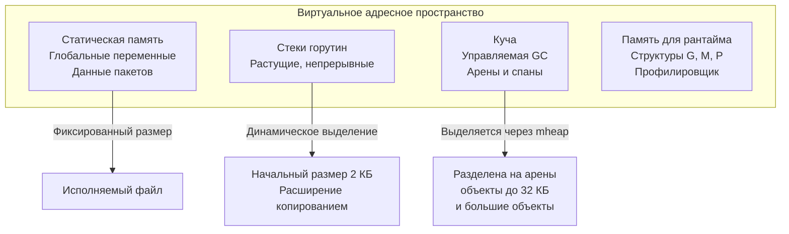
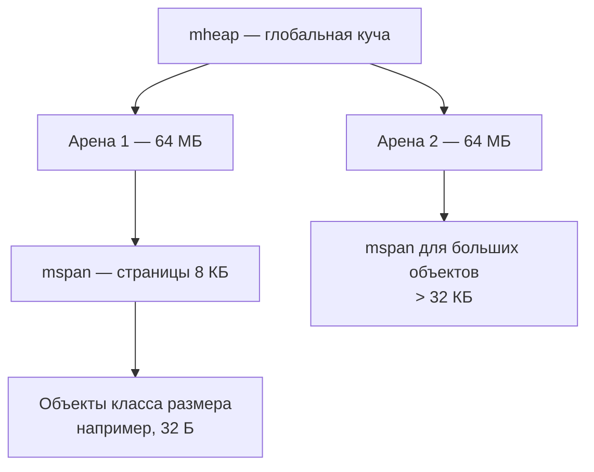

## Что такое «модель памяти» в контексте Go

Завершив раздел CPU-профилирования (финальная статья — [[8. Cache friendliness]]), мы переходим к памяти. Производительность приложения определяется не только тактовой частотой, но и тем, откуда берутся данные — из стека, кучи или из L1-кэша, и как разные горутины видят изменения этих данных. Всё это регулируется **моделью памяти** (memory model) Go.

Термин «модель памяти» в Go имеет два взаимодополняющих значения, и Senior обязан владеть обоими:

1. **Спецификация модели памяти** (Go Memory Model) — формальный набор гарантий, определяющих, при каких условиях запись в память, сделанная в одной горутине, будет видна другой. Это напрямую связано с корректностью конкурентных программ и рассматривается в разделе [[06. Конкурентность]].

2. **Архитектурная модель памяти** — как рантайм Go организует адресное пространство процесса: стек горутины, куча, статические данные, как они распределены по виртуальной памяти, и как это влияет на скорость доступа. Именно этот аспект — фундамент для [[2. Heap vs stack]], [[3. Escape analysis]], [[4. Allocation profiling]] и всего раздела.

В этой статье мы разберём оба слоя, свяжем их с механической эмпатией ([[5. Mechanical sympathy в backend разработке]]) и покажем, как организация памяти определяет, будет ли код укладываться в кэш процессора или постоянно промахиваться мимо TLB.

## Модель памяти с точки зрения конкурентности

Спецификация Go Memory Model (https://go.dev/ref/mem) описывает отношения **happens-before** — гарантии порядка выполнения операций. Она не так строга, как модели последовательной согласованности, и требует явной синхронизации для упорядочения доступов к памяти между горутинами.

Ключевые принципы:
- Если горутина A делает запись, а горутина B читает ту же переменную, и между ними нет happens-before-связи, B может увидеть устаревшее значение или вообще частично записанные данные.
- Happens-before создаётся:
  - Запуском горутины (`go func()`).
  - Завершением горутины (через `sync.WaitGroup`, `channel close`).
  - Синхронизацией через `sync.Mutex`, `sync.Once`, `sync.Cond`.
  - Отправкой/получением из канала (`chan`).
  - Атомарными операциями (`sync/atomic`).

Без этих точек синхронизации компилятор и процессор могут переупорядочивать операции, и данные могут находиться в кэшах разных ядер, не попадая в общую память.

Пример классической гонки:

```go
var a, b int

func f1() { a = 1; b = 2 }
func f2() { print(b); print(a) }
```

Без синхронизации вывод может быть `02` — потому что запись `a=1` ещё не видна, а `b` уже прочитано.

Для производительности Go Memory Model важна тем, что **не каждая атомарная операция требует барьера памяти**. Атомики `sync/atomic` по умолчанию используют relaxed ordering (начиная с Go 1.19 есть явные методы для разных порядков), что быстрее, но требует осознанной синхронизации. Подробнее в [[5. Sync primitives и их стоимость]], [[6. Mutex vs channel]].

> [!tip] Собеседование
> **Вопрос:** Какие операции в Go гарантируют happens-before между горутинами?
> **Ответ:** Запуск горутины (go), завершение горутины через WaitGroup или канал, операции с sync.Mutex (Unlock -> последующий Lock), sync.Once.Do, sync.Cond (Signal/Broadcast), отправка и получение из канала, атомарные операции с правильным ordering.

## Архитектурная модель памяти: как Go раскладывает данные

Рантайм Go управляет памятью процесса, разделяя её на несколько логических зон.



### Статическая память

Глобальные переменные, строковые литералы, константы (кроме числовых значений — те в коде) размещаются в секциях `.data` и `.rodata` исполняемого файла и загружаются ОС в память при старте. Это «бесплатная» память: она никогда не участвует в GC, всегда доступна и не вызывает TLB-промахов чаще кучи. Однако большие глобальные слайсы или мапы всё равно аллоцируют свои данные в куче.

### Стек горутины

Каждая горутина стартует со стеком размером всего **2 КБ**. Это в десятки раз меньше, чем стек потока ОС (обычно 1–8 МБ). Стек растёт и сжимается динамически.

До Go 1.3 использовались сегментированные стеки (segmented stack): когда стек заполнялся, выделялся новый сегмент, и они связывались. Это вызывало накладные расходы при переходе между сегментами. Начиная с Go 1.4 применяется **непрерывный стек** (contiguous stack): когда горутина нуждается в большем стеке, рантайм выделяет новый, вдвое больший, копирует туда содержимое старого и освобождает старый. Копирование — дорогостоящая операция, но она происходит редко, при глубоких рекурсиях или очень больших фреймах.

Инструменты для мониторинга стека:
- `runtime.Stack(buf, true)` — получить стек текущей горутины.
- `pprof` горутин ([[4. goroutine dump]]) показывает размер и состояние стека каждой горутины.
- `GODEBUG=stacktrace=1` при панике — детальный трейс.

Почему стек важен для производительности:
- **Стековая память сверхбыстра.** Она непрерывно расширяется, почти всегда сидит в L1/L2 кэше, так как процессор активно использует RSP/FP регистры.
- **Нет GC.** Стек — это область памяти, подчищаемая автоматически при возврате из функции. Escape analysis ([[3. Escape analysis]]) определяет, может ли переменная остаться на стеке, и это главный способ избежать нагрузки на GC.

### Куча

Всё, что не может быть размещено на стеке, попадает в кучу. Куча управляется сборщиком мусора, которому посвящён отдельный раздел ([[05. Garbage Collector]]). Здесь рассмотрим только её организацию с точки зрения модели памяти.

Куча Go состоит из **арен** (arena) — крупных непрерывных регионов виртуальной памяти (на 64-битных системах — 64 МБ каждая). Арены делятся на **спаны** (span) — страницы памяти (обычно 8 КБ), которые в свою очередь разбиваются на объекты одинакового размера (классов размеров). Это снижает фрагментацию и упрощает аллокатор.

Основные структуры:
- `mheap` — глобальная куча, содержит все арены.
- `mspan` — слой, управляющий страницами.
- `mcache` — локальный кэш для каждого P, чтобы избежать блокировок при выделении мелких объектов.
- `mcentral` — центральная очередь свободных спанов для конкретного класса размера.

Эта иерархия обеспечивает быстрые аллокации без глобальных блокировок (см. [[4. Allocation profiling]]).



> [!info] Под капотом
> Размеры классов строго заданы: 8, 16, 24, 32, 48, 64, 80, 96 ... до 32768 байт. Объект округляется до ближайшего класса. Это гарантирует быстрое выделение из списка свободных ячеек, но вызывает небольшую внутреннюю фрагментацию.

### Память для рантайма

Структуры `g`, `m`, `p`, очереди горутин, профили, стек трейсов — всё это аллоцируется из той же кучи, но с помощью специального аллокатора, устойчивого к рекурсивным вызовам (например, профилировщик сам не должен попасть в профиль). Разработчику это обычно невидимо, но при анализе утечек ([[6. Утечки памяти]]) стоит знать, что не вся память кучи — это ваши объекты.

## Virtual Memory и TLB: ещё один уровень

Виртуальная память ОС изолирует процессы. Каждый указатель в Go — это виртуальный адрес, транслируемый MMU через таблицы страниц в физический. Для ускорения трансляции используется **Translation Lookaside Buffer (TLB)** — это крошечный кэш внутри MMU, хранящий несколько сотен записей трансляции виртуальной страницы в физическую.

- **Стек** очень дружествен TLB: страница стека активна, запись почти никогда не вытесняется.
- **Куча** фрагментирована: разбросанные объекты на множестве страниц ведут к частым TLB-промахам, каждый из которых стоит ~10–20 нс дополнительно к задержке кэш-промаха.
- **Крупные страницы** (2 МБ, 1 ГБ — transparent hugepages) уменьшают промахи, но Go не использует их автоматически. ОС может прозрачно продвигать страницы, но это ненадёжно.

Механическая эмпатия предписывает минимизировать разброс данных. Слайс вместо разрозненных указателей, предвыделение памяти ([[4. Предвыделение памяти]]) — всё это не только для кэша, но и для TLB.

## Аппаратное выравнивание и атомарность

Модель памяти Go также подразумевает соглашения с процессором о выравнивании данных. Поля структур выравниваются по их размеру, что приводит к паддингу. Невыровненный доступ к целым числам на некоторых архитектурах (до x86 недавно) вызывал замедление или исключение. Сейчас компилятор гарантирует корректное выравнивание для всех типов.

Атомарные операции `sync/atomic` требуют естественного выравнивания (например, `int64` должен быть по адресу, кратному 8). Компилятор следит за этим, но если разработчик создаёт структуры вручную через `unsafe`, он должен обеспечить выравнивание сам. Подробнее в [[9. Cache line и выравнивание]].

## Инструменты исследования памяти

- **Размер стека:** `runtime/debug.SetMaxStack` ограничивает максимальный размер стека горутины (по умолчанию 1 ГБ на 64-битных системах), `runtime/debug.PrintStack()` показывает текущий стек.
- **Статистика кучи:** `runtime.ReadMemStats(&m)` — кол-во объектов, байт, фрагментация.
- **GODEBUG=memprofilerate=1** — регулирует частоту сэмплов для memory profile.
- **pprof memory** ([[5. pprof memory profile]]) — показывает inuse_space и alloc_space.
- **`/proc/<pid>/maps`** — карта виртуальной памяти процесса.
- **`pmap` / `smem`** — распределение памяти между стеком, кучей, кодом.

## Связь с производительностью: резюме

Главный вывод, который Senior должен вынести из понимания модели памяти Go:
- **Быстрые данные живут на стеке.** Помещайте временные переменные так, чтобы escape analysis не отправлял их в кучу.
- **Куча — это дорого.** Аллокация, GC, TLB-промахи, кэш-промахи разбросанных объектов.
- **Куча структурирована.** Понимание классов размеров позволяет оценить реальные затраты: аллокация 33 байт округлится до 48.
- **Модель конкурентности требует синхронизации.** Без неё данные могут читаться из кэша другого ядра несогласованно, что ведёт к неверным вычислениям.
- **Инструменты (pprof, GODEBUG) позволяют заглянуть внутрь** и подтвердить гипотезы.

## Итог

Модель памяти Go — это двуединая концепция: формальные гарантии happens-before для конкурентного кода и архитектурная организация (стек, куча, арены, спаны), определяющая скорость доступа к данным. Первое обязательно для корректности, второе — для производительности. Понимание, где и как размещаются переменные, напрямую влияет на throughput и latency, а также на поведение GC и эффективность кэшей.

В следующей статье мы детально разберём фундаментальное разделение: [[2. Heap vs stack]] — почему одно и то же значение может быть практически «бесплатным» на стеке и дорогим в куче, и как escape analysis принимает это решение.