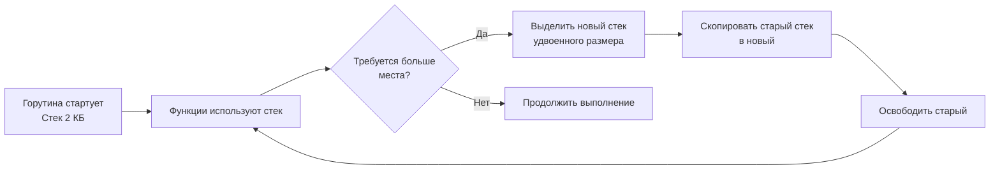

## Почему «стек или куча» — первый вопрос о производительности

В [[1. Memory model Go]] мы рассмотрели архитектурную организацию памяти в Go: статическая область, стеки горутин, куча, управляемая GC. Теперь мы детально разберём фундаментальное различие между двумя главными областями, в которых живут переменные: **стеком** и **кучей**. Это различие — не академическая деталь. Оно прямо определяет, сколько микросекунд займёт выполнение функции, будет ли нагрузка на сборщик мусора и поместятся ли данные в кэш процессора.

В Go, в отличие от C/C++, разработчик не управляет памятью явно: нет `malloc`/`free`. Вместо этого компилятор через **escape analysis** ([[3. Escape analysis]]) решает за вас, куда поместить переменную. Senior-инженер обязан понимать, как интерпретировать эти решения, влиять на них через код и диагностировать проблемы через профилировщик памяти ([[4. Allocation profiling]], [[5. pprof memory profile]]).

## Стек горутины: сверхбыстрая временная память

Каждая горутина в Go стартует со своим стеком размером всего **2 КБ**. Это очень мало по сравнению с традиционными потоками ОС (1–8 МБ), но именно эта компактность позволяет создавать миллионы горутин. Стек используется для хранения:

- Аргументов функций и возвращаемых значений.
- Локальных переменных, которые не «убегают» из функции.
- Адресов возврата и фреймов вызовов.

Стек организован как непрерывная область памяти, которая растёт и сжимается по мере необходимости. Когда горутина требует больше места (глубокая рекурсия, крупные локальные массивы), рантайм выделяет новый стек большего размера (обычно вдвое), копирует туда старый фрейм за фреймом и освобождает старый. Это называется **contiguous stack** и реализовано через `runtime.copystack`. Процесс дорогой, но происходит редко, поэтому средняя стоимость стека близка к нулю.



### Характеристики стека с точки зрения «железа»

- **Экстремально быстрый доступ.** Вершина стека (текущий фрейм) почти всегда находится в L1-кэше данных, потому что процессор постоянно обращается к регистрам `SP`/`FP`. Это делает операции со стеком практически «бесплатными» (1–2 такта).
- **Автоматическая очистка.** При возврате из функции указатель стека просто сдвигается. Никакого GC, никакого подсчёта ссылок. Память переиспользуется немедленно следующим вызовом.
- **Хорошая пространственная локальность.** Данные в стеке упакованы плотно, соседствуют с адресами возврата и аргументами, что идеально для кэш-линий процессора.
- **Отсутствие конкуренции.** У каждой горутины свой стек, поэтому не нужны блокировки.

Ограничения стека: он не подходит для данных, которые должны жить после возврата из функции (динамически созданные объекты, слайсы, переданные в канал), и для очень больших массивов (хотя стек может вырасти до 1 ГБ по умолчанию, это экстремальный случай, которого избегают).

## Куча: динамическая память с полным сервисом

Куча (heap) — это область памяти, из которой выделяются объекты с непредсказуемым временем жизни: всё, что возвращается из функции как указатель, сохраняется в глобальную переменную, захватывается замыканием или отправляется в канал. Куча управляется автоматическим сборщиком мусора ([[1. GC в Go. Обзор]]).

Аллокация в куче проходит через иерархический аллокатор (описанный в [[1. Memory model Go]]): `mcache` → `mcentral` → `mheap`. Мелкие объекты (до 32 КБ) выделяются из кэша процессора (P), что быстро и без глобальных блокировок. Но даже самая быстрая аллокация в куче — это десятки наносекунд, в то время как «аллокация» на стеке — это просто вычитание из указателя стека (1 такт).

### Цена кучи

- **Аллокация.** Требует поиска свободного спана, иногда блокировки, обнуления памяти. Для объектов, не попадающих в быстрый путь, цена возрастает.
- **GC overhead.** Каждый объект в куче становится частью графа достижимости, который GC должен обходить ([[2. Tri color marking]], [[4. Concurrent GC]]). Это потребляет CPU и создаёт микро-паузы ([[6. GC pause и latency]]). Кроме того, при каждой записи указателя в куче срабатывает **write barrier** ([[5. Write barriers]]), добавляющий несколько инструкций.
- **Кэш-промахи.** Объекты в куче разбросаны по адресному пространству, нарушая пространственную локальность. Обход связного списка или графа объектов, выделенных в разное время, приводит к массовым cache miss. Стек, напротив, линеен.
- **TLB-промахи.** Каждая новая страница кучи требует записи в TLB. При большом количестве маленьких объектов TLB может стать узким местом (см. [[1. Memory model Go]]).
- **Фрагментация.** Хотя аллокатор Go использует классы размеров и спаны для уменьшения фрагментации, она всё равно существует и может приводить к неэффективному использованию памяти ([[7. Fragmentation]]).

Таким образом, одна и та же переменная, размещённая на стеке, стоит практически ноль процессорного времени и не нагружает GC, а попав в кучу, начинает потреблять ресурсы на всех этапах жизненного цикла.

## Escape Analysis: кто решает судьбу переменной

Компилятор Go на этапе SSA-оптимизации выполняет **escape analysis** (подробно в [[3. Escape analysis]]), определяя, может ли переменная быть использована вне текущей функции. Если указатель на переменную «убегает» в кучу, переменная тоже вынуждена там размещаться.

Классический пример:

```go
func createOnHeap() *int {
    x := 42
    return &x // &x убегает -> x в куче
}

func keepOnStack() int {
    x := 42
    return x // значение копируется, x на стеке
}
```

Интересно, что в Go возврат указателя на локальную переменную абсолютно безопасен и корректен — компилятор автоматически выделит `x` в куче, и она будет жить до тех пор, пока её удерживают.

Но escape analysis может ошибаться с точки зрения производительности: он консервативен. Иногда переменная, которая могла бы жить на стеке, «убегает» из-за незначительных факторов: вызов метода через интерфейс, передача в `fmt.Println`, сохранение в слайс, который потенциально может быть передан кому-то.

## Сравнение на примере: стек vs куча в цифрах

Ниже типичные показатели для одной и той же операции, но с разным размещением (цифры ориентировочные, измерены на современном процессоре):

| Операция | Стек | Куча |
|----------|------|------|
| Выделение памяти | 0.1–0.2 нс (вычитание SP) | 10–50 нс (быстрый путь mcache) |
| Доступ к данным | 1–2 такта (L1 hit) | 4–12 нс (L2/L3 hit) или 80 нс (RAM) |
| Освобождение | 0 (сдвиг SP) | 0 (GC), но GC накапливает работу |
| Влияние на GC | 0 | Добавляет объект в граф, write barrier |
| Параллельный доступ | Без contention | Возможен contention (но на аллокаторах) |

Хотя куча оптимизирована и быстра, разница на порядки делает стек предпочтительным для временных, локальных данных.

## Как писать код, дружественный стеку

Senior-разработчик стремится к тому, чтобы горячие временные переменные оставались на стеке. Вот конкретные приёмы.

### 1. Избегайте ненужных указателей

Передача по значению небольших структур копирует данные, но сохраняет их на стеке. Указатель может увести структуру в кучу, если компилятор не уверен, что он не утечёт.

```go
// Плохо: указатель, возможно, уйдёт в кучу
func process(b *Buffer) { ... }

// Хорошо: передача по значению (если Buffer небольшой)
func process(b Buffer) { ... }
```

Точное определение «небольшой» — около 64–128 байт по копии (одна-две кэш-линии). Для крупных структур, конечно, уместен указатель, чтобы избежать дорогого копирования.

### 2. Не возвращайте указатели на локальные переменные без нужды

Если функция строит структуру и возвращает её вызывающему, возвращайте по значению — компилятор может разместить её в стеке вызывающей функции (frame pointer parent) и избежать кучи.

### 3. Используйте `make` с предвыделением в горячих циклах

Хотя `make` возвращает слайс, сам слайс — это структура (ptr, len, cap) на стеке, а его backing array всегда в куче. Это неизбежно, но можно минимизировать количество аллокаций, предвыделяя ёмкость ([[4. Предвыделение памяти]]).

### 4. Осторожно с интерфейсами

Передача конкретного типа в функцию, ожидающую `interface{}`, приводит к **боксингу** (boxing): значение копируется в кучу. Для горячих вызовов лучше использовать generics (с Go 1.18+), которые позволяют избежать аллокаций на интерфейсах при мономорфизации.

### 5. Избегайте замыканий, захватывающих переменные

Горутина с замыканием, захватившим локальную переменную, перенесёт её в кучу. Если возможно, передавайте значения через аргументы.

```go
// Плохо: x уйдёт в кучу, т.к. замыкание может пережить функцию
x := 42
go func() { fmt.Println(x) }()

// Лучше: передать как аргумент
go func(val int) { fmt.Println(val) }(x)
```

### 6. Держите объекты в стеке с помощью `sync.Pool`? Нет, наоборот

`sync.Pool` ([[2. sync Pool]]) работает с кучей, но помогает переиспользовать объекты, минуя аллокатор. Это не про стек, а про сокращение аллокаций в куче.

## Инструменты: как узнать, где живёт переменная

Прямой способ — попросить компилятор показать решения escape analysis:

```bash
go build -gcflags="-m" ./...
```

Вывод:

```
./main.go:42:2: moved to heap: x
./main.go:15:3: foo does not escape
```

Флаг `-gcflags="-m -m"` даст ещё больше деталей.

Memory profile ([[5. pprof memory profile]]) с флагом `-alloc_space` покажет, сколько байт и в каких функциях было выделено в куче за всё время работы. Если функция, которая должна быть лёгкой, внезапно показывает много аллокаций — проверьте escape.

Бенчмарк с `-benchmem` напрямую измеряет `allocs/op` и `B/op`. Резкое увеличение этих показателей при рефакторинге — сигнал, что что-то начало «убегать».

CPU-профиль ([[2. CPU profiling в Go]]) косвенно отражает проблему: время, проведённое в `runtime.mallocgc` или `runtime.gcBgMarkWorker`, говорит о высокой аллокационной активности, то есть о том, что данные живут в куче.

## Ловушки и мифы

> [!warning] Ловушка / Gotcha
> **«Переменные, объявленные внутри функции, всегда на стеке».** Это верно только если они не убегают. Возврат указателя, вызов интерфейсного метода, отправка в канал, сохранение в глобальную переменную, передача в `defer` с замыканием — всё это может отправить переменную в кучу.

> [!warning] Ловушка / Gotcha
> **«Стек быстрее, потому что это не куча».** Да, но стек растёт динамически, и его копирование при росте может занять сотни микросекунд. Если функция необоснованно требует огромный стек (например, локальный массив на 10 МБ), это вызовет проблемы. Разумно использовать кучу для больших данных.

> [!warning] Ловушка / Gotcha
> **«Слайс лежит на стеке».** Сам заголовок слайса (24 байта: ptr, len, cap) может быть на стеке, но данные (backing array) всегда в куче, если не срез от массива, объявленного на стеке. Это частая путаница.

## Mechanical Sympathy: стек в кэше, куча в RAM

С точки зрения процессора, стек — это идеальный гражданин: его линейный рост и автоматическая очистка совпадают с шаблонами доступа, предсказываемыми prefetcher'ом. Указатель стека почти всегда в регистре, страницы стека закреплены в TLB.

Куча же — хаос: объекты выделяются и освобождаются в произвольном порядке, адреса разбросаны. Даже компактный аллокатор со спанами не спасает от того, что два соседних в логике программы объекта могут оказаться в разных кэш-линиях. Добавьте к этому сканирование GC, которое вымывает полезные данные из L1/L2, и станет ясно, почему минимизация кучевых аллокаций — важнейшая задача performance-инженера.

## Итог

- **Стек** — сверхбыстрая, автоматически очищаемая память, идеальная для временных локальных переменных. Доступ к ней практически бесплатен, она не нагружает GC и отлично дружит с кэшем.
- **Куча** — динамическая память для объектов с произвольным временем жизни, управляемая сборщиком мусора. Каждая аллокация в куче добавляет накладные расходы и потенциально приводит к кэш-промахам и GC-паузам.
- **Escape analysis** — механизм, который определяет, где жить переменной. Разработчик может влиять на него, избегая ненужных указателей, интерфейсов и замыканий в горячих путях.
- Инструменты (`-gcflags="-m"`, pprof, бенчмарки с `-benchmem`) позволяют точно определить, куда попадают переменные, и диагностировать избыточные аллокации.
- Понимание разницы между стеком и кучей — фундамент для [[1. Уменьшение аллокаций]], [[9. Zero allocation подход]] и тюнинга GC ([[7. GOGC и tuning]]).

В следующей статье мы подробно разберём тот самый механизм, который решает судьбу переменной: [[3. Escape analysis]]. Как он работает, почему иногда «ложится» не в нашу пользу и как его перехитрить, оставаясь в рамках идиоматичного Go.