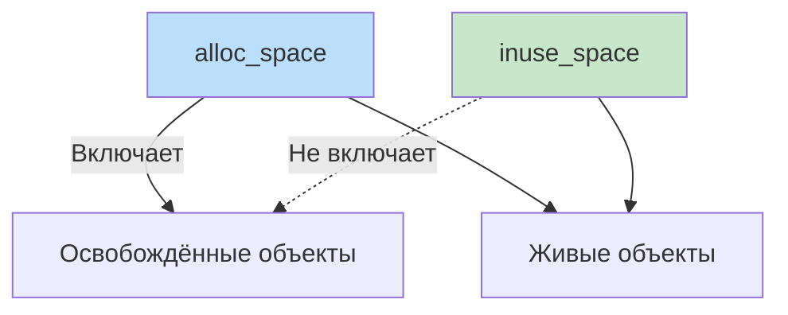

## Профиль памяти как карта распределения объектов

В [[4. Allocation profiling]] мы освоили практику сбора и анализа профиля аллокаций с флагом `-alloc_space`. Но инструмент `pprof` для памяти — это не просто «посмотреть, сколько выделено». Он содержит как минимум два разных среза (inuse и alloc), поддерживает разные режимы сэмплирования, позволяет сравнивать версии и глубоко интегрирован с рантаймом Go. Понимание всех этих возможностей превращает pprof из «чёрного ящика» в прецизионный инструмент диагностики.

Эта статья систематизирует знания о **pprof memory profile**: как он устроен внутри, какие метрики предоставляет, как правильно его снимать и интерпретировать, как связывать с escape analysis ([[3. Escape analysis]]) и тюнингом GC ([[7. GOGC и tuning]]). После неё мы будем готовы к поиску утечек ([[6. Утечки памяти]]) и анализу фрагментации ([[7. Fragmentation]]).

## Два взгляда на память: alloc_space и inuse_space

Профиль памяти в Go хранит два независимых набора данных, переключаемых в `go tool pprof` флагами `-alloc_space` и `-inuse_space` (или через вкладки веб-интерфейса). Важно различать их семантику:

- **alloc_space** (по умолчанию в `go tool pprof` при открытии профиля без флагов?) — на самом деле по умолчанию `pprof` показывает `inuse_space`, если профиль снят без `seconds`. Но при использовании `seconds` профиль содержит оба представления, и `go tool pprof` по умолчанию показывает `inuse_space` (живые объекты). Чтобы увидеть аллокации, надо явно указать `-alloc_space`. Рекомендация: всегда явно задавать флаг при анализе.
- **alloc_space** — суммарный объём байт, которые были выделены в куче за время наблюдения (или с начала процесса, если профиль мгновенный). Включает уже освобождённые объекты.
- **inuse_space** — объём байт, занятых *живыми* объектами в момент снятия профиля. Те, что не освобождены и удерживаются указателями.

Разница принципиальна:
- Если функция создаёт много временных объектов, которые быстро освобождаются, она будет «горячей» в `alloc_space`, но почти невидимой в `inuse_space`.
- Если функция накапливает объекты (утечка), она будет большой в `inuse_space`, но может быть умеренной в `alloc_space`.



> [!tip] Собеседование
> **Вопрос:** При анализе потребления памяти сервис показывает высокий `alloc_space`, но `inuse_space` в норме. Это проблема?
> **Ответ:** Это указывает на высокий уровень аллокационной активности (мусор), который нагружает GC, даже если утечки нет. Может потребоваться оптимизация для сокращения CPU, затрачиваемого на сборку мусора, и снижения хвостовых задержек.

## Внутреннее устройство профиля памяти

> [!info] Под капотом
> Профилировщик памяти в Go работает на основе сэмплирования. При каждой аллокации `runtime.mallocgc` увеличивает счётчик выделенных байт. Если разница между текущим счётчиком и последним записанным сэмплом превышает `MemProfileRate` (по умолчанию 512 КБ), создаётся новый сэмпл: записывается текущий стек вызовов и добавляется накопленный объём. Таким образом, записывается не каждая аллокация, а агрегированные порции. В момент снятия профиля (через `runtime/pprof` или HTTP) рантайм собирает все накопленные сэмплы в хеш-таблицу, сериализует в protobuf и отправляет.
> 
> При использовании `?seconds=N` рантайм предварительно вызывает `runtime.GC()` (чтобы очистить мусор), запоминает начальные значения счётчиков, затем через N секунд снова вызывает GC и вычисляет дельту счётчиков. Таким образом, профиль с `seconds` показывает только аллокации, сделанные за этот интервал.

Из этого следует несколько важных свойств:

- **Статистическая природа.** Мелкие функции с суммарным объёмом аллокаций менее `MemProfileRate` могут отсутствовать в профиле.
- **Влияние GC.** Принудительный GC при `seconds` может исказить картину, особенно в latency-sensitive сервисах (но для профилирования это обычно допустимо).
- **Стек вызовов.** Каждый сэмпл привязан к стеку, что позволяет строить деревья вызовов и flamegraph, аналогично CPU-профилю ([[3. Flamegraph]]).

## Способы получения профиля памяти

### 1. HTTP-эндпоинт `net/http/pprof`

Самый гибкий способ. Базовый URL: `/debug/pprof/heap`. Параметры запроса:

- `?seconds=30` — сбор профиля в течение 30 секунд с вычислением дельты (alloc_space). Без `seconds` — мгновенный inuse-профиль.
- `?debug=1` — текстовое представление в виде плоского списка (удобно для быстрой проверки в консоли).
- `?gc=1` — принудительный GC перед снятием (по умолчанию включен при `seconds`).
- `?h=1` — добавить заголовки.

Примеры:

```bash
# Мгновенный inuse-профиль в protobuf для pprof
curl -o mem.prof "http://localhost:6060/debug/pprof/heap"

# Сбор в течение 30 секунд под нагрузкой (alloc_space)
curl -o alloc.prof "http://localhost:6060/debug/pprof/heap?seconds=30"

# Текстовый дамп для быстрого просмотра
curl "http://localhost:6060/debug/pprof/heap?debug=1"
```

### 2. Прямой вызов `runtime/pprof` (для скриптов и CLI)

```go
var cpuprofile = flag.String("cpuprofile", "", "write cpu profile to file")
var memprofile = flag.String("memprofile", "", "write memory profile to file")

func main() {
    flag.Parse()
    if *memprofile != "" {
        f, _ := os.Create(*memprofile)
        defer f.Close()
        runtime.GC() // получить живые объекты
        pprof.Lookup("heap").WriteTo(f, 0)
    }
}
```

Это даёт мгновенный inuse-профиль. Чтобы симулировать `seconds`, нужно вручную запустить таймер и использовать `runtime.ReadMemStats` до и после, что сложнее.

### 3. Через `go test -bench`

Бенчмарки автоматически поддерживают `-memprofile`:

```bash
go test -bench=. -benchmem -memprofile=mem.prof
```

Профиль будет содержать как `alloc_space`, так и `inuse_space` для последнего стабильного прогона бенчмарка. Это идеально для оценки аллокаций изолированного кода.

## Анализ профиля в `go tool pprof`

### Основные команды

```bash
go tool pprof -alloc_space alloc.prof
# или
go tool pprof -inuse_space mem.prof
```

Внутри интерактивного режима:

- **`top`** — список функций по объёму памяти (flat). `top -cum` — с учётом потомков.
- **`list FuncName`** — построчный разбор с объёмами.
- **`tree`** — иерархическое представление call graph.
- **`web`** — граф вызовов (Graphviz).
- **`weblist FuncName`** — аннотированный исходный код в браузере.
- **`flamegraph`** (через веб-интерфейс `-http=:8080`) — flamegraph для памяти, аналогично CPU ([[3. Flamegraph]]), но по байтам.
- **`disasm FuncName`** — ассемблерный листинг с аннотациями (продвинутый уровень).

### Веб-интерфейс

```bash
go tool pprof -http=:8080 -alloc_space alloc.prof
```

Предоставляет вкладки:
- **Top** — таблица.
- **Graph** — граф вызовов с толщиной рёбер, пропорциональной памяти.
- **Flamegraph** — интерактивное пламя.
- **Source** — аннотированный код.
- **Alloc space vs Inuse space** — переключатель между представлениями, если профиль содержит оба.

### Интерпретация чисел

- **flat** — байты, выделенные непосредственно в теле функции (не включая вызовы).
- **cum** — байты, выделенные функцией и всеми её потомками.
- Проценты — от общего объёма в профиле.

Паттерн анализа такой же, как в [[4. Top functions анализ]]: сначала смотрим `top -cum` для поиска диспетчеров, затем спускаемся к листьям с большим `flat`.

## Сравнение профилей памяти между версиями

`go tool pprof` поддерживает сравнение двух профилей через `-diff_base`:

```bash
go tool pprof -http=:8080 -diff_base=old_mem.prof new_mem.prof
```

На flamegraph и в таблице будут показаны разницы: красный — увеличение аллокаций, зелёный — уменьшение. Это мощный инструмент для проверки, действительно ли оптимизация снизила нагрузку на память, и не появилось ли новых источников мусора.

## Настройка точности: MemProfileRate

Переменная окружения `GODEBUG=memprofilerate=N` или вызов `runtime.MemProfileRate = N` управляют частотой сэмплирования. По умолчанию 512 КБ. Снижение до 1 (каждый байт записывается) даёт максимальную точность, но огромный overhead. Для отладки в тестах можно установить 1–1024. В production-среде менять не рекомендуется без крайней необходимости.

> [!warning] Ловушка / Gotcha
> При низком `MemProfileRate` профиль может не содержать важных мелких аллокаций, и вы сделаете ложный вывод, что функция «не аллоцирует». При подозрении на это временно уменьшайте `MemProfileRate` и повторяйте профилирование в тестовой среде.

## Связь с другими профилями и метриками памяти

- **CPU-профиль** ([[2. CPU profiling в Go]]) показывает, *какие* функции жгут процессор. Если у вас много `runtime.mallocgc` и `runtime.gcBgMarkWorker` в CPU, memory profile покажет, *кто* генерирует эту нагрузку.
- **Блокировочный профиль** ([[5. block profile]]) может показать ожидания на аллокаторе (хотя в Go аллокатор редко становится точкой contention).
- **Метрики GC** (`/debug/pprof/gc`, `GODEBUG=gctrace=1`) — для корреляции пиков аллокаций и пауз GC.
- **Утечки памяти** диагностируются сравнением нескольких `inuse_space` профилей во времени ([[6. Утечки памяти]]).

## Mechanical Sympathy: что профиль памяти говорит о «железе»

Профиль памяти не содержит прямых метрик кэша или TLB, но Senior может экстраполировать:
- Большое количество мелких объектов (много allocs/op) ведёт к фрагментации и разбросу адресов, увеличивая TLB misses ([[1. Memory model Go]]).
- Большие аллокации (десятки МБ) могут не помещаться в кэш и вызывать потоковые копирования RAM↔CPU, что видно по высокому `runtime.memmove` в CPU-профиле.
- Предвыделение (`make` с cap) и `sync.Pool` ([[2. sync Pool]]) улучшают пространственную локальность и снижают долю холодных данных.

Таким образом, pprof memory profile — это не просто учёт байтов, а карта взаимодействия вашей программы с иерархией памяти.

## Типичный workflow при проблемах с памятью

1. Обнаружили аномалию: высокое потребление RAM или частые GC-паузы через метрики ([[6. GC pause и latency]]).
2. Снимаем `inuse_space` профиль для поиска того, что занимает память сейчас.
3. Снимаем `alloc_space` за 30 секунд под нагрузкой для поиска источников мусора.
4. Анализируем `top`, `list`, возможно, `flamegraph`.
5. Для конкретной функции проверяем escape analysis (`go build -gcflags="-m"`).
6. Оптимизируем: предвыделение, пул, замена библиотеки.
7. Сравниваем профили до и после через `-diff_base`.
8. Подтверждаем улучшение бенчмарками с `-benchmem`.

## Итог

- **pprof memory profile** — мощный инструмент с двумя режимами: `inuse_space` (живая память) и `alloc_space` (аллокации).
- Сбор через HTTP, `runtime/pprof` или `go test`; параметр `seconds` позволяет получить дельту.
- Анализ через `go tool pprof` с командами `top`, `list`, `tree`, `flamegraph` и сравнение версий.
- Настройка `MemProfileRate` балансирует точность и overhead.
- Профиль памяти связывает высокоуровневые проблемы (GC-паузы, утечки) с конкретными строками кода.
- В сочетании с CPU-профилем и escape analysis даёт полную картину для оптимизации.

Теперь, освоив инструментарий памяти, мы готовы перейти к диагностике одной из самых неприятных проблем — [[6. Утечки памяти]]: как находить, какие бывают, и как не допускать.